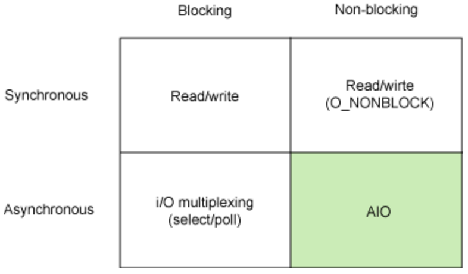
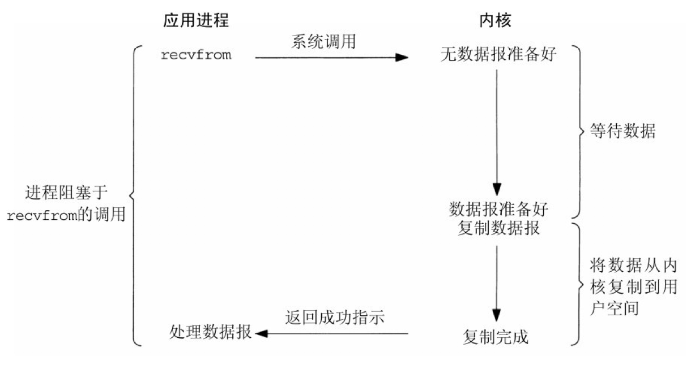
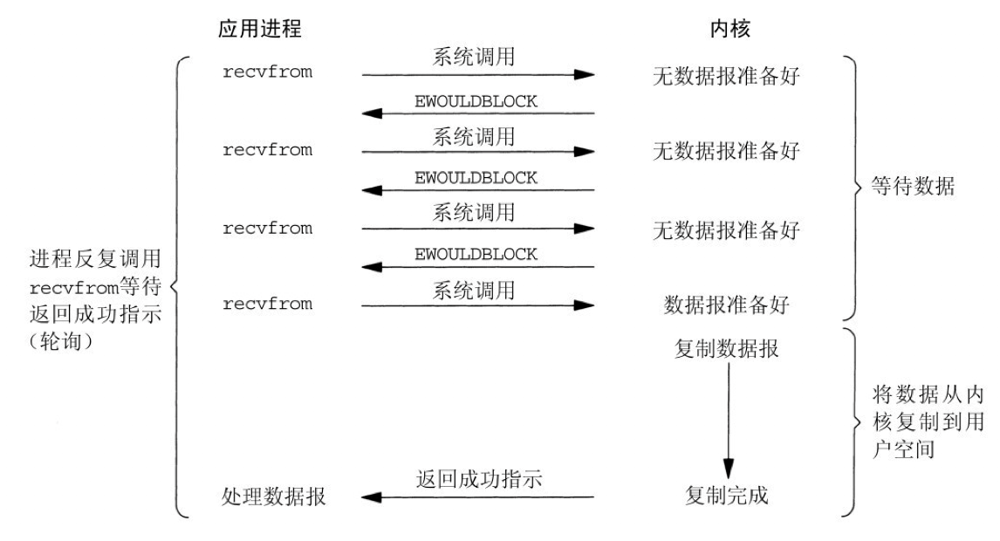
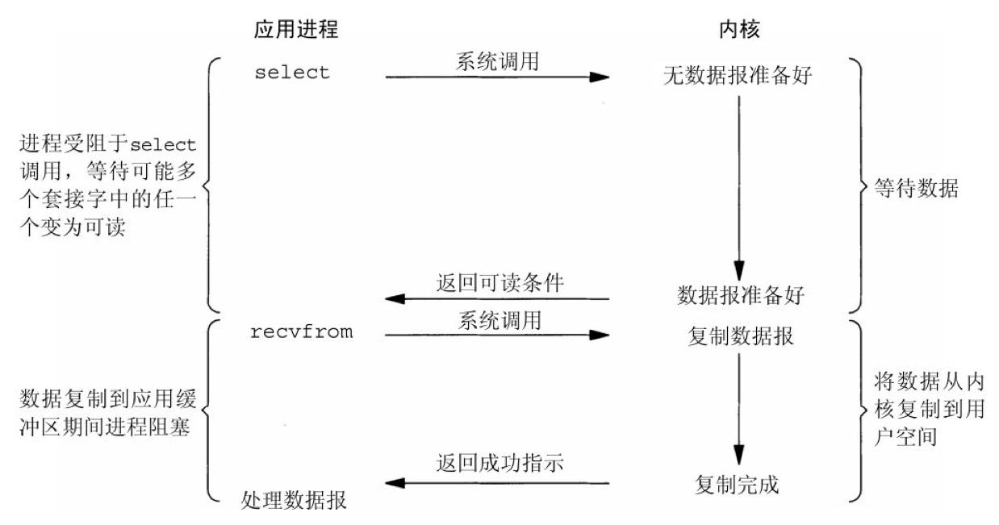
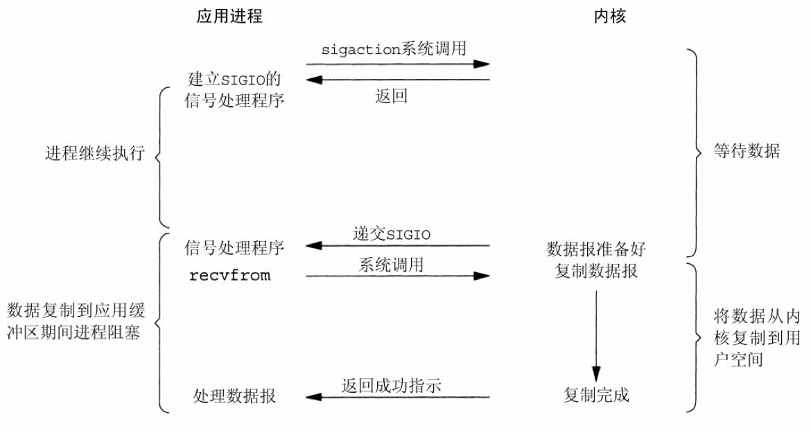
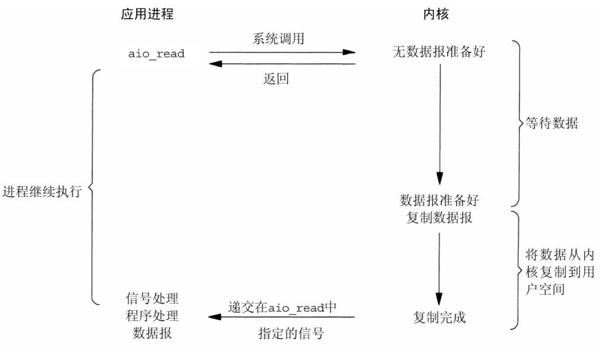
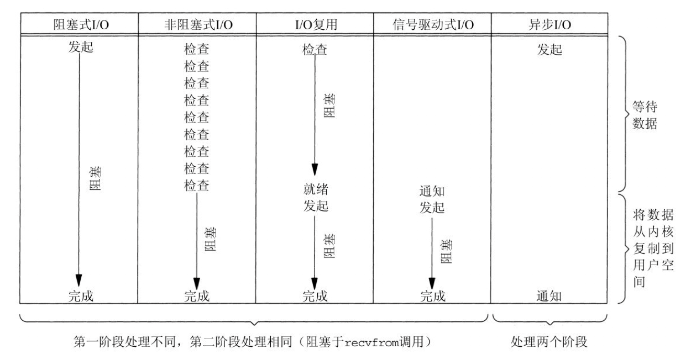

## 1.4 并发编程

>date: 2019-01-28


### 1.4.1 进程

:star: **进程是资源分配的最小单位，线程是`CPU`调度的最小单位。** :star: 

**进程:** **进程是系统进行资源分配和调度的最小单位，是操作系统结构的基础。** 

在早期面向进程设计的计算机结构中，进程是程序的基本执行实体；在当代面向线程设计的计算机结构中，进程是线程的容器。

##### 多进程

**多进程:** 同一个时间里，同一个计算机系统中允许两个或两个以上的进程处于**并行**状态，这是多进程。

> **并行：** 同时执行多个任务；
>
> **并发：** 多个任务同时存在，交替执行。
>

**`Python` 中使用多进程：**

```python
import multiprocessing
import time

# 创建函数并将其作为多个进程

def worker_1(interval):
    print("worker_1")
    time.sleep(interval)
    print("end worker_1")

def worker_2(interval):
    print("worker_2")
    time.sleep(interval)
    print("end worker_2")

def worker_3(interval):
    print("worker_3")
    time.sleep(interval)
    print("end worker_3")

if __name__ == "__main__":
    p1 = multiprocessing.Process(target = worker_1, args = (2,))
    p2 = multiprocessing.Process(target = worker_2, args = (3,))
    p3 = multiprocessing.Process(target = worker_3, args = (4,))

    p1.start()
    p2.start()
    p3.start()
    
    # CPU 核心数
    print(("The number of CPU is:" + str(multiprocessing.cpu_count())))

    for p in multiprocessing.active_children():
        print(("child p.name:" + p.name + "  p.id" + str(p.pid)))

    p1.join()
    p2.join()
    p3.join()
    print("END")
```

**结果:**

```python
The number of CPU is:4  #CPU核心数视具体运行环境而定
child p.name:Process-3  p.id1569
child p.name:Process-2  p.id1568
child p.name:Process-1  p.id1567
worker_1
worker_2
worker_3
end worker_1
end worker_2
end worker_3
END
```

##### **进程间通信（进程同步）方式** :star:

- 1) 管道通信

普通管道`PIPE`：通常有两种限制，一是单工，只能单向传输；二是只能在父子或者兄弟进程间使用；

流管道`s_pipe`: 去除了第一种限制，为半双工，可以双向传输；

命名管道`name_pipe`：去除了第二种限制，可以在许多并不相关的进程之间进行通讯。

- 2) 信号量

常作为一种锁机制，用于多线程之间的同步。

- 3) 信号

通过信号来通知进程系统中发生了某种预先规定好的事件（一组事件中的一个），它也是用户进程之间通信和同步的一种原始机制。

- 4) 消息队列

消息队列是消息的链接表，它克服了上两种通信方式中信号量有限的缺点，具有写权限得进程可以按照一定得规则向消息队列中添加新信息；对消息队列有读权限得进程则可以从消息队列中读取信息。

- 5) 共享内存

共享内存就是映射一段能被其他进程所访问的内存，这段共享内存由一个进程创建，但多个进程都可以访问。最快的`IPC`(进程间通信)方式

- 6) 套接字

客户端和服务器通信。

##### **进程调度方式（Linux）**

1) 分时调度策略

创建任务指定采用分时调度策略，并指定优先级`nice`值（`-20 ~ 19`）；

根据每个任务的`nice`值确定在`CPU`上的执行时间(`counter`)；

如果没有等待资源，将该任务加入到就绪队列中；

调度程序遍历就绪队列中的任务，通过对每个任务动态优先级地计算权值(`counter + 20 - nice`)，选择一个计算结果最大的一个去运行，当时间片用完后(`counter = 0`)或者主动放弃`CPU`时，该任务就被放在就绪队列末尾，或者等待队列中。

2) 实时调度策略，先到先服务

创建进程是指定采用`FIFO`，并设置实时优先级`rt_priority`(`1~99`)；

如果没有等待资源，将该任务加入到就绪队列中；

调度程序遍历就绪队列，根据实时优先级计算调度权值(`1000 + rt_priority`)，选择权值最高的任务使用`CPU`，该`FIFO`任务将一直占有`CPU`直到有优先等级更高的任务就绪或者主动放弃；

调度程序发现有优先级更高的任务到达，则立即在当前任务堆栈中保存当前`CPU`寄存器的所有数据，重新从高优先级任务的堆栈中加载寄存器数据到`CPU`，此时高优先级任务开始运行；

如果当前任务因等待资源而主动放弃`CPU`使用权，则该任务将从就绪队列中删除，加入等待队列。

3) 实时调度策略，时间片轮转

创建任务时指定调度参数为`PR`，并设置任务实时优先级和`nice`值；

如果没有等待资源，将该任务加入到就绪队列中；

调度程序遍历就绪队列，根据实时优先级计算调度权值(`1000 + rt_priority`)，选择权值最高的任务使用`CPU`；

如果就绪队列中的`PR`任务时间片为`0`，则会根据`nice`值设置该任务的时间片，同时将该任务放入就绪队列的末尾；

当前任务由于等待资源而主动退出`CPU`，则将其加入等待队列中。

##### 僵尸进程和孤儿进程（`Linux`）

孤儿进程：一个父进程退出，而它的一个或多个子进程还在运行，那么那些子进程将成为孤儿进程。孤儿进程将被`init`进程(进程号为`1`)所收养，并由`init`进程对它们完成状态收集工作。

僵尸进程：一个进程使用`fork`创建子进程，如果子进程退出，而父进程并没有调用`wait`或`waitpid`获取子进程的状态信息，那么子进程的进程描述符仍然保存在系统中。这种进程称之为僵死进程。

##### `Linux`进程用户内存空间和内核空间

操心系统的核心是内核，独立于普通的应用程序，可以访问受保护的内存空间，也有访问底层硬件设备的所有权限。为了保证用户进程不能直接操作内核，保证内核的安全，操心系统将虚拟空间划分为两部分，一部分为内核空间，一部分为用户空间。

内核态与用户态：

- 1) 当一个任务（进程）执行系统调用而陷入内核代码中执行时，称进程处于内核运行态（内核态）。此时处理器处于特权级最高的（`0`级）内核代码中执行。当进程处于内核态时，执行的内核代码会使用当前进程的内核栈。每个进程都有自己的内核栈。

- 2) 当进程在执行用户自己的代码时，则称其处于用户运行态（用户态）。此时处理器在特权级最低的（`3`级）用户代码中运行。当正在执行用户程序而突然被中断程序中断时，此时用户程序也可以象征性地称为处于进程的内核态。因为中断处理程序将使用当前进程的内核栈。

### 1.4.2 线程

**线程:** **线程是 `CPU` 调度和分配的基本单位。** 

线程是建立在进程的基础上的一次程序运行单位。简单的说，进程是线程的容器，线程运行在进程之下，一个进程里面可以有多个线程。

**线程的生命周期**：新建(`New`)、就绪（`Runnable`）、运行（`Running`）、阻塞(`Blocked`)和死亡(`Dead`)5种状态。

* 线程模型

线程的实现模型主要有`3`种：内核级线程模型、用户级线程模型和两级线程模型，它们之间最大的差异就在于用户线程与内核调度实体（`KSE`，`Kernel Scheduling Entity`，操作系统内核调度器调度的对象实体）之间的对应关系上。`KSE` 就是**内核级线程**，是操作系统内核的最小调度单元，也就是通俗理解上的线程。

1. 内核级线程模型

用户线程和内核线程`KSE`是一对一(`1: 1`)的映射模型，即每个用户线程绑定一个实际的内核线程，线程的调度完全交付给系统内核进行。

即创建出来的每一个线程都与一个独立的`KSE`静态绑定，调度完全由系统内核调度。这样实现的方式实现简单，`CPU`快速切换调度线程，多个线程可以同时允许，因此能做到真正意义上的并行。

但是其借助了系统内核来进行线程的创建、销毁、多个线程之间的上下文切换和调度，所以消耗的系统资源也会很多，对性能有一定的影响。

2. 用户级线程模型

用户线程和内核线程`KSE`是多对一(`N: 1`)的映射模型，多个用户线程的一般从属于单个线程，多线程的调度由用户自己完成，无须系统调用来实现。

即一个进程所创建的线程都只和一个`KSE`在运行时动态绑定，系统只知道用户进程，对其中的线程无感知，线程调度在用户层面完成，无须让`CPU`在用户态和内核态之间切换，这样实现的方式相比于内核级线程会很轻量，对系统资源的消耗会小很多，创建线程数量和上下文切换的花费会小很多。

因为在用户线程的模型下面，一个`CPU`关联全部的用户进程，如果其中某个用户线程发生堵塞，就会导致整个进程挂起，无法进行轮转调度，即无法实现真正意义上的并发。

在这个问题上，很多协程库就会吧一些阻塞操作封装成完全的非阻塞形式，发生阻塞时，用户线程主动让出自己，通过一定的方式唤醒或通知其他等待的用户线程，来保证进程不会阻塞。

3. 两级线程模型

也称混合型线程模型，用户线程和内核线程`KSE`是多对多(`N: N`)的映射模型。一个**进程**可以和多个内核线程`KSE`关联，进程内多个线程可以绑定不同的`KSE`；同时，进程内的所有线程并不与`KSE`一一绑定，而是可以动态绑定同一个`KSE`，当某个`KSE`绑定的线程发生堵塞而被调出`CPU`时，其关联进程中的其余用户线程可以重新与其他的`KSE`绑定运行。

两级线程模型既不是用户级线程模型那种完全靠自己调度的也不是内核级线程模型完全靠操作系统调度的，而是中间态（自身调度与系统调度协同工作）。

其两级的意思是**即用户调度器实现用户线程到KSE的调度，内核调度器实现`KSE`到`CPU`上的调度**。

* 多线程

**多线程:** 一个进程中可以有多条执行路径同时执行，一个线程就是进程中的一条执行路径。一般一个进程会有多个(也可是一个)线程。

**`Python` 中使用多线程:**

```python
# 以下代码引用自廖雪峰博客
import time, threading

# 新线程执行的代码:
def loop():
    print('thread %s is running...' % threading.current_thread().name)
    n = 0
    while n < 5:
        n = n + 1
        print('thread %s >>> %s' % (threading.current_thread().name, n))
        time.sleep(1)
    print('thread %s ended.' % threading.current_thread().name)

print('thread %s is running...' % threading.current_thread().name)
t = threading.Thread(target=loop, name='LoopThread')
t.start()
t.join()
print('thread %s ended.' % threading.current_thread().name)
```

**结果:**

```python
thread MainThread is running...
thread LoopThread is running...
thread LoopThread >>> 1
thread LoopThread >>> 2
thread LoopThread >>> 3
thread LoopThread >>> 4
thread LoopThread >>> 5
thread LoopThread ended.
thread MainThread ended.
```

* **线程（进程内）同步方式**

- 1) 临界区（`Critical Section`）

通过对多线程的串行化来访问公共资源或一段代码，速度快，适合控制数据访问。

- 2) 互斥量/锁（`Mutex`）

为协调共同对一个共享资源的单独访问而设计的。

- 3) 信号量（`Semaphore`）

为控制一个具有有限数量用户资源而设计。它允许多个线程在同一时刻访问同一资源，但是需要限制在同一时刻访问此资源的最大线程数目。互斥量是信号量的一种特殊情况，当信号量的`最大资源数=1`就是互斥量了。

- 4) 事件（`Event`）

用来通知线程有一些事件已发生，从而启动后继任务的开始。

* 锁

多线程同时对同一个对象进行读写操作，很容易出现一些难以预料的问题，所以需要对对象进行加锁操作，在同一时刻只允许一个线程对某个对象进行操作。

**临界资源：** 能够被多个线程共享的数据/资源。

**临界区：** 对临界资源进行操作程序。

**线程互斥：** 在同一时刻只允许一个进程运行其中的程序片，具有排他性和唯一性。

**线程同步：** 在互斥的基础上，实现进程之间的有序访问。

**互斥锁：** 对临界区进行保护，实现线程间的互斥。

**死锁：** 指在一组进程中的各个进程均占有不会释放的资源，但因互相申请被其他进程所占用不会释放的资源而处于的一种永久等待状态。

**产生死锁**的四个必要条件（只要有一个条件不满足，死锁就可以排除）：

- 1) 互斥条件：即某个资源在一段时间内只能由一个进程占有，不能同时被两个或两个以上的进程占有。

- 2) 不可抢占条件：进程所获得的资源在未使用完毕之前，资源申请者不能强行地从资源占有者手中夺取资源，而只能由该资源的占有者进程自行释放。

- 3) 占有且申请条件：进程至少已经占有一个资源，但又申请新的资源；由于该资源已被另外进程占有，此时该进程阻塞；但是，它在等待新资源之时，仍继续占用已占有的资源。

- 4) 循环等待条件：存在一个进程等待序列`{P1，P2，...，Pn}`，其中`P1`等待`P2`所占有的某一资源，`P2`等待`P3`所占有的某一源，...，而`Pn`等待`P1`所占有的的某一资源，形成一个进程循环等待环。

* 进程和线程区别 :star:

- 1) 进程拥有独立的地址空间，线程拥有自己的堆栈和局部变量，但是线程之间没有单独的地址空间。

- 2) 线程是一个进程的不同执行路径，一个程序至少有一个进程，一个进程至少有一个线程。线程不能单独执行。

- 3) 进程间切换，消耗资源大，效率较差。对需要同时进行且要共享变量的并发操作，只能用线程。

- 4) 进程是对运行时程序的封装，是系统进行资源调度和分配的的基本单位，实现了操作系统的并发；线程是进程的子任务，是`CPU`调度和分派的基本单位，用于保证程序的实时性，实现进程内部的并发。

- 5) 一个程序至少有一个进程，一个进程至少有一个线程，线程依赖于进程而存在；进程在执行过程中拥有独立的内存单元，而多个线程共享进程的内存。 

### 1.4.3 协程

**协程:** 又称微线程，纤程，英文名`Coroutine`。协程把应用程序的代码分为多个代码块，正常情况代码自上而下顺序执行。如果代码块`A`运行过程中，能够切换执行代码块`B`，又能够从代码块`B`再切换回去继续执行代码块`A`，这就实现了协程（通常是遇到`IO`操作时切换才有意义）。 

**`Python`对协程的支持是通过`generator`实现的。**

线程的调度是由操作系统负责，协程调度是程序自行负责；与线程相比，协程减少了无谓的操作系统切换。

协程编程离不开的三大要点：

 1) 事件循环；

 2) 回调(驱动生成器)；

 3) `epoll/select`(`I/O`多路复用)。

```python
from collections import deque
 
def sayHello(n):
    while n > 0:
        print("hello~", n)
        yield n
        n -= 1
    print('say hello')
 
def sayHi(n):
    x = 0
    while x < n:
        print('hi~', x)
        yield
        x += 1
    print("say hi")
 
# 使用yield语句，实现简单任务调度器
class TaskScheduler(object):
    def __init__(self):
        self._task_queue = deque()
 
    def new_task(self, task):
        '''
        向调度队列添加新的任务
        '''
        self._task_queue.append(task)
 
    def run(self):
        '''
        不断运行，直到队列中没有任务
        '''
        while self._task_queue:
            task = self._task_queue.popleft()
            try:
                next(task)
                self._task_queue.append(task)
            except StopIteration:
                # 生成器结束
                pass


if __name__ == "__main__":
    sched = TaskScheduler()
    sched.new_task(sayHello(10))
    sched.new_task(sayHi(15))
    sched.run()
```

基于`yield`实现`actor`模型。

先来看下`Python`中的`yield`和`send`方法：

```python
def gener1(num):
    while True:
        print("Before yield num is: %d" % num)
        num = yield
        print("After yield num is: %d" % num)
    print("End")

def gener2(num):
    while True:
        print("Before yield num is: %d" % num)
        num = yield num ** 2
        print("After yield num is: %d" % num)
    print("End")

if __name__ == "__main__":
    g1 = gener1(1)
    g1.send(None)
    print("----- loop gener1 -----")
    for i in range(5):
        print("----- loop -----")
        print("Send Back is:", str(g1.send(i)))

    g2 = gener2(1)
    g2.send(None)
    print("----- loop gener2 -----")
    for i in range(5):
        print("----- loop -----")
        print("Send Back is:", str(g2.send(i)))
```

上述代码的结果如下：

```python
Before yield num is: 1
----- loop gener1 -----
----- loop -----
After yield num is: 0
Before yield num is: 0
Send Back is: None
----- loop -----
After yield num is: 1
Before yield num is: 1
Send Back is: None
----- loop -----
After yield num is: 2
Before yield num is: 2
Send Back is: None
----- loop -----
After yield num is: 3
Before yield num is: 3
Send Back is: None
----- loop -----
After yield num is: 4
Before yield num is: 4
Send Back is: None
Before yield num is: 1
----- loop gener2 -----
----- loop -----
After yield num is: 0
Before yield num is: 0
Send Back is: 0
----- loop -----
After yield num is: 1
Before yield num is: 1
Send Back is: 1
----- loop -----
After yield num is: 2
Before yield num is: 2
Send Back is: 4
----- loop -----
After yield num is: 3
Before yield num is: 3
Send Back is: 9
----- loop -----
After yield num is: 4
Before yield num is: 4
Send Back is: 16
```

* 在`generator`中，第一次使用`send()`，则`generator`执行到`yield`前面，之后每次调用`send()`，都从`yield`行执行。

* 运行到`yield`关键字时候，`generator`从`yield`中接收参数（赋值），如果`yield`后存在表达式，则返回表达式的值，类似`return`。
* `yield`保存了`generator`每次的执行状态。

基于上述的特性，在`Python`里面就可以使用`generator`来实现协程任务，调度方式就是事件循环 + 协程的模式。

```python
from collections import deque
 
class ActorScheduler:
    def __init__(self):
        self._actors = {}
        self._msg_queue = deque()
 
    def new_actor(self, name, actor):
        self._msg_queue.append((actor, None))
        self._actors[name] = actor
 
    def send(self, name, msg):
        actor = self._actors.get(name)
        if actor:
            self._msg_queue.append((actor, msg))
 
    def run(self):
        while self._msg_queue:
            # print("队列：", self._msg_queue)
            actor, msg = self._msg_queue.popleft()
            # print("actor", actor)
            # print("msg", msg)
            try:
                 actor.send(msg)
            except StopIteration:
                 pass
 
 
if __name__ == '__main__':
    def say_hello():
        while True:
            msg = yield
            print("say hello", msg)
 
    def say_hi():
        while True:
            msg = yield
            print("say hi", msg)
 
    def counter(sched):
        while True:
            n = yield
            print("counter:", n)
            if n == 0:
                break
            sched.send('say_hello', n)
            sched.send('say_hi', n)
            sched.send('counter', n-1)
 
    sched = ActorScheduler()
    # 创建初始化 actors
    sched.new_actor('say_hello', say_hello())
    sched.new_actor('say_hi', say_hi())
    sched.new_actor('counter', counter(sched))
 
    sched.send('counter', 10)
    sched.run()
```

上述的方式虽然相对于回调函数简单一些，但是在代码上还是有点混乱，同时使用`generator`来当作协程，都是一些技巧性的东西。为了让语义更加明确，在`Python 3.5`以后，使用了`async`和`await`来正式定义原生协程。

```python
import time
import asyncio
import uvloop
import aiomultiprocess

from functools import partial
from concurrent.futures import ThreadPoolExecutor

async def gener1():
    print("----- Start async -----")
    await asyncio.sleep(2)
    '''
    asyncio.sleep(2) 功能：异步非阻塞等待2s
    await 的作用类似 yield，即这个时候把线程资源控制权交出去，监听该描述符直到该任务完成
    await 后面只能接三种类型：
        1) 协程：Python 协程属于可等待对象，因此可以在其他协程中被等待；
        2) 任务：任务被用来设置日程以便并发执行协程。(当一个协程通过 asyncio.create_task() 等函数被打包为一个任务，该协程将自动排入日程准备立即运行)；
        3) Future 对象：Future 是一种特殊的低层级可等待对象，表示一个异步操作的最终结果。(当一个 Future 对象被等待，这意味着协程将保持等待直到该 Future 对象在其他地方操作完毕)。
    '''
    print("----- End -----")

async def gener2(num):
    print("----- Start async -----")
    print("Receive: ", num)
    await asyncio.sleep(2)
    print("----- End -----")
    return num ** 2

def gener3(num):
    print("----- Start async -----")
    print("Receive: ", num)
    print("----- End -----")

def callback1(feature, num):
    print("----- CallBack -----")
    print("Result: ", feature.result())
    print(num)

def callback2(t):
    print("----- CallBack -----")
    print(t)

def stop(loop):
    print("----- Stop -----")
    loop.stop()

async def big_task():
    nums = [i for i in range(1000)]
    async with aiomultiprocess.Pool() as pool:
        result = await pool.map(gener2, nums)
        print("Result: ", result)

if __name__ == "__main__":
    start = time.time() 
    
    loop  = asyncio.get_event_loop()
    # 创建一个事件循环
    
    ## 1. 单个任务
    loop.run_until_complete(gener1())
    # run_until_complete() 是一个阻塞方法，类似多线程中的 join()

    ## 2. 多个任务 asyncio.wait() 方式 
    tasks = [gener2(i) for i in range(10)]
    loop.run_until_complete(asyncio.wait(tasks))
    # asyncio.wait() 传入非空可迭代对象,一般来说是功能函数列表

    ## 3. 多个任务 asyncio.gather() 方式
    ##### Python 3.7 后支持
    tasks = [gener2(i) for i in range(10)]
    loop.run_until_complete(asyncio.gather(*tasks))
    # asyncio.gather() 是 Python 3.7 以后的方法，功能与 asyncio.wait() 相同
    # asyncio.gather() 更擅长于将函数聚合在一起
    # asyncio.wait()   更擅长筛选运行状况

    ### 3.1 使用 asyncio.gather() 进行任务分组
    group1 = [gener2(i) for i in range(3)]
    group2 = [gener2(i) for i in range(7)]
    loop.run_until_complete(asyncio.gather(*group1, *group2))
    # asyncio.gather() 可以将任务分组，也可以取消任务

    ### 3.2 asyncio.gather() 任务取消
    group1 = [gener2(i) for i in range(3)]
    group2 = [gener2(i) for i in range(7)]
    group1 = asyncio.gather(*group1)
    group2 = asyncio.gather(*group2)
    group2.cancel() # 取消 group2 任务
    loop.run_until_complete(asyncio.gather(group1, group1))
    
    ## 4. 获取结果
    ### 4.1
    task = asyncio.ensure_future(gener2(3))
    loop.run_until_complete(task)
    print("Result: ", task.result())
    
    ### 4.2 
    task = loop.create_task(gener2(4))
    loop.run_until_complete(task)
    print("Result: ", task.result())
    # asyncio.ensure_future() 和 loop.create_task() 功能用法一模一样

    ### 4.3 多个任务的结果
    tasks = [asyncio.ensure_future(gener2(i)) for i in range(10)]
    loop.run_until_complete(asyncio.wait(tasks))
    print("Result: ", [i.result() for i in tasks])

    ## 5. 回调
    task = loop.create_task(gener2(5))
    # 当 gener2() 执行完成后，调用下面的回调函数 callback1()
    task.add_done_callback(partial(callback1, num = 10))
    loop.run_until_complete(task)
    
    ## 6. 取消协程任务
    tasks = [gener1() for i in range(3)]
    try:
        loop.run_until_complete(asyncio.wait(tasks))
    except KeyboardInterrupt:
        all_tasks = asyncio.Task.all_tasks()
        for task in all_tasks:
            print("----- Stop -----")
            task.cancel()
        loop.stop()
        # 停止循环
        loop.run_forever()
        # 事件一直循环
        # 上面的两步必须按顺序做，也必须做
    finally:
        loop.close()
    
    ## 7.定时任务
    ### 7.1 立即执行
    loop.call_soon(callback2, 5)
    loop.call_soon(stop, loop)
    loop.run_forever()
    
    ### 7.2 延迟执行 call_later 
    loop.call_later(1, callback2, 1.0) # 延迟 1 秒后执行
    loop.call_later(5, stop, loop)    # 延迟 5 秒后执行
    loop.run_forever()
    
    ### 7.3 延迟执行 call_at
    # 在 loop 内部时钟时间的基础上，增加延迟时间进行延迟执行
    now = loop.time()
    loop.call_at(now + 1, callback2, loop.time())
    loop.call_at(now + 3, callback2, loop.time())
    loop.call_at(now + 5, stop, loop)
    loop.run_forever()
    
    ### 7.4 线程安全的 call_soon：call_soon_threadsafe
    # 和 call_soon() 用法一致，在涉及多线程时使用它

    ## 8. 使用线程池
    pool = ThreadPoolExecutor(8)
    tasks = [loop.run_in_executor(pool, gener3, i) for i in range(1000)]
    loop.run_until_complete(asyncio.wait(tasks))

    ## 9. 使用多进程 
    # 基于 aiomultiprocess 库，需要 Python 3.6 以上
    task = asyncio.ensure_future(big_task())
    loop.run_until_complete(task)
    
    ### 10. asyncio 加速
    asyncio.set_event_loop_policy(uvloop.EventLoopPolicy()) # 只支持 Linux/Unix
    print("Cost: ", time.time() - start)
```

### 1.4.4 `GIL`锁

`Python` 提供了`multiprocessing`和`threading`模块可用于多进程和多线程开发。

多线程和多进程最大的不同在于，多进程中，同一个变量，各自有一份拷贝存在于每个进程中，互不影响。

而多线程中，所有变量都由所有线程共享，所以，任何一个变量都可以被任何一个线程修改，因此，线程之间共享数据最大的危险在于多个线程同时改一个变量，把内容给改乱了。

在 `Python` 中，运行多线程程序，每个线程都会被上一把锁，以防止每个线程因为共享资源，交替运行而乱改数据。这个锁就是**全局解释锁（`GIL`）**。


```python
lock = threading.Lock()

def run_thread(n):
    for i in range(100000):
        # 先要获取锁:
        lock.acquire()
        try:
            # 进行一些操作:
            change_it(n)
        finally:
            # 操作完了一定要释放锁:
            lock.release()
```

当多个线程同时执行`lock.acquire()`时，只有一个线程能成功地获取锁，然后继续执行代码，其他线程就继续等待直到获得锁为止。

获得锁的线程用完后一定要释放锁，否则那些苦苦等待锁的线程将永远等待下去，成为死线程，这里使用`try...finally`来确保锁一定会被释放。

锁确保某段关键代码只能由一个线程从头到尾完整地执行，实际上是以单线程模式执行，这样程序的效率大大降低了。

由于可以存在多个锁，不同的线程持有不同的锁，并试图获取对方持有的锁时，可能会造成死锁。

**`Python`因为`GIL`的存在，就不管`CPU`中有几个核，单位时间多个核只能跑一个线程，然后时间片轮转。** 

任何`Python`线程执行前，必须先获得`GIL`锁，然后，每执行`100`条字节码，解释器就自动释放`GIL`锁，让别的线程有机会执行。这个`GIL`全局锁实际上把所有线程的执行代码都给上了锁，所以，多线程在`Python`中只能交替执行，即使`100`个线程跑在`100`核`CPU`上，也只能用到`1`个核。

* 绕过`GIL`的思路：

1. 绕过 `CPython`，使用 `JPython`（`Java` 实现的 `Python` 解释器）等别的实现；

2. 把关键性能代码，放到别的语言（一般是 `C++`）中实现。

### 1.4.5 计算密集型和`IO`密集型

**计算密集型：** 需要进行大量的计算，消耗`CPU`资源的任务，比如计算圆周率、对视频进行高清解码等等，全靠`CPU`的运算能力。

这种计算密集型任务虽然也可以用多任务完成，但是任务越多，花在任务切换的时间就越多，`CPU`执行任务的效率就越低，所以，要最高效地利用`CPU`，计算密集型任务同时进行的数量应当等于`CPU`的核心数。

计算密集型任务由于主要消耗`CPU`资源，因此，代码运行效率至关重要。`Python`这样的脚本语言运行效率很低，完全不适合计算密集型任务。对于计算密集型任务，最好用`C`语言编写。

**`IO` 密集型：** 涉及到网络、磁盘`IO`的任务，这类任务的特点是`CPU`消耗很少，任务的大部分时间都在等待`IO`操作完成。

对于`IO`密集型任务，任务越多，`CPU`效率越高，但也有一个限度。常见的大部分任务都是`IO`密集型任务，比如`Web`应用。

`IO`密集型任务执行期间，`99%`的时间都花在`IO`上，花在`CPU`上的时间很少，因此，用运行速度极快的`C`语言替换用`Python`这样运行速度极低的脚本语言，完全无法提升运行效率。对于`IO`密集型任务，最合适的语言就是开发效率最高（代码量最少）的语言，脚本语言是首选，`C`语言最差。

### 1.4.6 `IO`模型

> `IO`模型按照主流区分共有以下几种：
>
> * 阻塞`IO（`bloking IO`）
> * 非阻塞`IO`（`non-blocking IO`）
> * 多路复用`IO`（`multiplexing IO`）
> * 信号驱动式`IO`（`signal-driven IO`）
> * 异步`IO`（`asynchronous IO`）

上述的`IO`模型都包含两个阶段：

1. 等待数据准备好（等待数据从网络中到达，数据到达后，被复制到内核的缓冲区中）；

2. 从内核缓冲区向用户缓冲区复制数据。

**基本 `Linux IO` 模型的简单矩阵:**



* **同步阻塞`IO`**



第一个阶段：当用户进程调用了`recv()/recvfrom()`这个系统调用，`kernel`就开始了`IO`的第一个阶段：准备数据（对于网络`IO`来说，很多时候数据在一开始还没有到达。比如，还没有收到一个完整的`UDP`包。这个时候`kernel`就要等待足够的数据到来）。这个过程需要等待，也就是说数据被拷贝到操作系统内核的缓冲区中是需要一个过程的。而在用户进程这边，整个进程会被阻塞（当然，是进程自己选择的阻塞）。

第二个阶段：当`kernel`一直等到数据准备好了，它就会将数据从`kernel`中拷贝到用户内存，然后`kernel`返回结果，用户进程才解除`block`的状态，重新运行起来。

* **同步非阻塞IO**



同步非阻塞是指每隔一段时间，询问`kernel`数据是否准备完成，系统完成后，则进程获取数据，继续执行的过程(此过程也称盲等待)。

在网络`IO`时候，非阻塞`IO`也会进行`recvform`系统调用，检查数据是否准备好，与阻塞`IO`不一样，"非阻塞将大的整片时间的阻塞分成`N`多的小的阻塞, 所以进程不断地有机会 '被' `CPU`光顾"。

在非阻塞的`recvform`系统调用调用之后，进程并没有被阻塞，内核马上返回给进程，如果数据还没准备好，此时会返回一个`error`。进程在返回之后，可以干点别的事情，然后再发起`recvform`系统调用。重复上面的过程，循环往复的进行`recvform`系统调用，这个过程通常被称之为**轮询**。

直到数据准备好，再拷贝数据到进程，进行数据处理。需要注意，拷贝数据整个过程，进程仍然是属于阻塞的状态。

* **`IO`多路复用**



`IO` 多路复用是指同时进行多个系统调用，内核循环查询多个任务的完成状态，只要任一数据到达就进行处理。

其优势在于系统开销下，与多进程和多线程的方式相比，不必创建和维护进程和线程。

`IO`多路复用常用的系统调用有`select`、`poll`、`epoll`函数。

`IO`多路复用的实质是通过一种机制，一个进程可以监视多个描述符，一旦某个描述符就绪（一般是读就绪或者写就绪），`select`， `poll`，`epoll`函数就可以返回，通知程序进行相应的读写操作。

它们的基本原理就是`select`，`poll`，`epoll`会不断的轮询所负责的所有`socket`，当某个`socket`有数据到达了，就通知用户进程。

1) `select`

让一个进程能等待多个文件描述符(`fd`)，而这些`fd`其中任意一个进入到读就绪状态，就返回。

缺点：

- 1) 每次调用`select`都需要把`fd`从用户态拷贝到内核，开销比较大；

- 2) 每次都需要在内核遍历传入的`fd`；

- 3) `select`支持文件数量比较小，默认是`1024`。当然，也可以通过宏定义修改，但会造成效率降低。

2) `poll`

`poll`的实现和`select`非常相似，只是描述`fd`集合的方式不同，`poll`使用`pollfd`结构（链表结构，没有数量限制）而不是`select`的`fd_set`结构，其他的都差不多。

3) `epoll`

使用一个`fd`管理多个`fd`，将用户关系的`fd`的事件存放到内核的一个事件表中，这样在用户空间和内核空间的`copy`只需一次。

`epoll`提供了三个函数，`epoll_create`、`epoll_ctl`和`epoll_wait`。

- 1) `epoll_create`是创建一个`epoll`句柄；

- 2) `epoll_ctl`是注册要监听的事件类型；

- 3) `epoll_wait`则是等待事件的产生。

每次注册新的事件到`epoll`句柄中时（在`epoll_ctl`中指定`EPOLL_CTL_ADD`），会把所有的`fd`拷贝进内核，而不是在`epoll_wait`的时候重复拷贝。`epoll`保证了每个fd在整个过程中只会拷贝一次。

`select`或`poll`每次调用都将当前进程轮流加入`fd`对应的设备等待队列中，而`epoll`只在`epoll_ctl`时会把当前进程挂到设备等待队列，这个操作只进行一次。同时给每个`fd`指定一个回调函数，当设备就绪，唤醒等待队列上的等待者时，就会调用这个回调函数，而这个回调函数会把就绪的`fd`加入一个就绪链表。

`epoll_wait`不断轮询就绪链表，对就绪的`fd`执行对应的操作。

**`Apache`采用 `select`，`select` 时间复杂度`O(n)`；`Nginx`采用 `epoll`，`epoll`时间复杂度`O(1)`**

* **信号驱动式`IO`**

信号驱动式`I/O`指允许`socket`进行信号驱动`IO`，并安装一个信号处理函数，进程继续运行并不阻塞。当数据准备好时，进程会收到一个`SIGIO`信号，可以在信号处理函数中调用`I/O`操作函数处理数据。



* **异步非阻塞 `IO`**

相对于同步`IO`，异步`IO`不是顺序执行。用户进程进行`aio_read`系统调用之后，无论内核数据是否准备好，都会直接返回给用户进程，然后用户态进程可以去做别的事情。等到`socket`数据准备好了，内核直接复制数据给进程，然后从内核向进程发送通知。`IO`两个阶段，进程都是非阻塞的。



用户进程发起`aio_read`操作之后，立刻就可以开始去做其它的事。而另一方面，从`kernel`的角度，当它受到一个`asynchronous read`之后，首先它会立刻返回，所以不会对用户进程产生任何`block`。

然后，`kernel`会等待数据准备完成，然后将数据拷贝到用户内存，当这一切都完成之后，`kernel`会给用户进程发送一个`signal`或执行一个基于线程的回调函数来完成这次 `IO` 处理过程，告诉它`read`操作完成了。

* **`IO`模型总结**

**`blocking`和`non-blocking`区别**

> 调用`blocking IO`会一直`block`住对应的进程直到操作完成，而`non-blocking IO`在`kernel`还准备数据的情况下会立刻返回。
>

**`synchronous IO`和`asynchronous IO`区别**

> 在说明`synchronous IO`和`asynchronous IO`的区别之前，需要先给出两者的定义。`POSIX`的定义是这样子的：
> 
> `A synchronous I/O operation causes the requesting process to be blocked until that I/O operation completes;An asynchronous I/O operation does not cause the requesting process to be blocked;`
> 
> 两者的区别就在于`synchronous IO`做“`IO operation`”的时候会将`process`阻塞。按照这个定义，之前所述的`blocking IO`，`non-blocking IO`，`IO multiplexing`都属于`synchronous IO`。
> 
> 有人会说，`non-blocking IO`并没有被`block`啊。这里有个非常“狡猾”的地方，定义中所指的“`IO operation`”是指真实的`IO`操作，就是例子中的`recvfrom`这个`system call`。`non-blocking IO`在执行`recvfrom`这个`system call`的时候，如果`kernel`的数据没有准备好，这时候不会`block`进程。但是，当`kernel`中数据准备好的时候，`recvfrom`会将数据从`kernel`拷贝到用户内存中，这个时候进程是被`block`了，在这段时间内，进程是被`block`的。而`asynchronous IO`则不一样，当进程发起`IO` 操作之后，就直接返回再也不理睬了，直到`kernel`发送一个信号，告诉进程说`IO`完成。在这整个过程中，进程完全没有被`block`。


各个`IO Model`的比较如图所示：



### 1.4.7 `CPython`


参考链接：

* [廖雪峰的网站](https://www.liaoxuefeng.com/wiki/0014316089557264a6b348958f449949df42a6d3a2e542c000/0014319272686365ec7ceaeca33428c914edf8f70cca383000)
* [简书博客](https://www.jianshu.com/p/486b0965c296)
