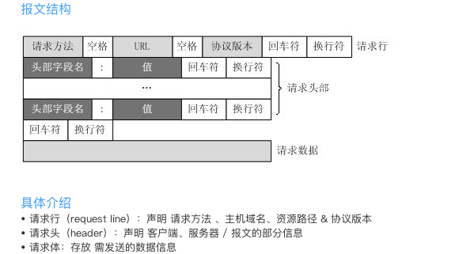

## 1.3 网络编程

>date: 2019-01-24


### 1.3.1 计算机网络体系

计算机网络体现结构分为3种：`OSI`体系结构、`TCP/IP`体系结构、五层体系结构


* `OSI`七层协议

1) 物理层：定义物理设备标准，传输比特流。

2) 数据链路层：格式化数据（将一组电信号组成叫做“帧”的数据包）并进行传输，控制对物理介质的访问，数据的错误检测和纠正。

3) 网络层：位于不同地理位置的网络中，为源主机和目标主机提供连接和路径选择，建立“主机 - 主机”的通信。

4) 传输层：定义传输数据的**协议**和端口号（`WWW`端口`80`等），建立“端口 - 端口”的通信。

5) 会话层：不同机器上的用户之间建立及管理会话。

6) 表示层：设备固有的数据格式与网络标准数据格式之间的转换。

7) 应用层： 各种应用程序协议。

* `TCP/IP`四层协议

1) 网络接口层：对应着`OSI`的物理层和数据链路层，负责通过网络发送和接收`IP`数据报。

2) 网际层：也称互联层、网间网层，主要功能是处理来自传输层的分组，将分组形成数据包（`IP`数据包），并为该数据包进行路径选择，最终将数据包从源主机发送到目的主机。常用的协议是网际协议`IP`协议。

3) 运输层：又称为主机至主机层，与`OSI`传输层类似，负责主机到主机之间的端到端通信，使用传输控制协议`TCP`协议和用户数据包协议`UDP`协议。

4) 应用层：与`OSI`模型中的高三层任务相同，用于提供网络服务。

### 1.3.2 `OSI`和`TCP/IP`的区别

* `TCP/IP`协议族

互联网协议族（英语：`Internet Protocol Suite`，缩写`IPS`）是一个网络通信模型，以及一整个网络传输协议家族，为互联网的基础通信架构，简称`TCP/IP`。由于在网络通讯协议普遍采用分层的结构，当多个层次的协议共同工作时，类似计算机科学中的堆栈，因此又被称为`TCP/IP`协议栈（英语：`TCP/IP Protocol Stack`）。

该协议家族的两个核心协议：`TCP`（传输控制协议）和`IP`（网际协议），为该家族中最早通过的标准。

`TCP/IP`提供点对点的链接机制，将数据应该如何封装、定址、传输、路由以及在目的地如何接收，都加以标准化。它将软件通信过程抽象化为四个抽象层，采取协议堆栈的方式，分别实现出不同通信协议。协议套组下的各种协议，依其功能不同，被分别归属到这四个层次结构之中，常被视为是简化的七层`OSI`模型。


`OSI`七层协议比`TCP/IP`出现的晚，相较之下`TCP/IP`协议更加轻盈，并且在业界已经广泛应用，所以在现在人们更多讨论的是`TCP/IP`协议。同时`TCP/IP`协议并没有完全匹配上`OSI`协议，`TCP/IP`协议是用来解决一系列具体问题，而`OSI`协议只是对互联网通信的一个宽泛的描述。

### 1.3.3 `TCP`协议

传输控制协议（英文：`Transmission Control Protocol`，缩写`TCP`）属于传输层通信协议。基于`TCP`的应用层协议有`HTTP`、`SMTP`、`FTP`、`Telnet`、`POP3`等。

`TCP`提供一种 **面向连接的、可靠、全双工通信** 的字节流服务。在一个 `TCP`连接中，仅有两方进行彼此通信。广播和多播不能用于`TCP`。

`TCP`使用**校验和**来确认和重传机制来保证可靠传输。`TCP`给数据分节进行排序，并使用累积确认保证数据的顺序不变和非重复。

`TCP`使用**滑动窗口机制**来实现流量控制，通过动态改变窗口的大小进行拥塞控制。

`TCP`并不能保证数据一定会被对方接收到，因为这是不可能的。`TCP`能够做到的是，如果有可能，就把数据递送到接收方，否则就（通过放弃重传并且中断连接这一手段）通知用户。因此准确说 `TCP`也不是`100%`可靠的协议，它所能提供的是数据的可靠递送或故障的可靠通知。

`TCP`报文段很复杂，主要关注五个问题：顺序问题、丢包问题、连接维护、流量控制、拥塞控制。

##### `TCP`的三次握手和四次挥手

`报文段 = 首部 + 数据 2 部分`


常见状态位：

1) `SYN`（`Synchronize Sequence Numbers`，同步序列编号）：发起一个连接；

2) `ACK`（`Acknowledgement`，确认字符）：回复；

3) `RST`（`Connection reset`）：重新连接；

4) `FIN`：结束连接。


三次握手，指的是建立一个`TCP`连接时，需要客户端和服务端总共发`3`个包。

* 初始状态：客户端、服务端都处于关闭状态（`CLOSED`）；
* 直到：客户端主动打开连接，服务端处于监听状态（`LISTEN`），等待接收客户端请求；
* 首次握手：客户端向服务端发送`1`个连接请求的报文段（不携带数据）。同步标志位`SYN=1`，随机选择一个起始序号`seq=x`。客户端进入同步已发送（`SYN_SEND`）状态；
* 二次握手：服务端收到请求连接报文段后（不携带数据），若同意建立连接，则向客户端发回连接确认的报文段。同步标志位`SYN=1`，确认标志位`ACK=1`，随机选择一个起始序号`seq=y`，确认号字段设为`ack=x+1`。服务端进入同步已接收（`SYN_RCVD`）状态；
* 三次握手：客户端收到确认报文段后，向服务端再次发出连接确认报文段（可携带数据）。确认标注为`ACK=1`，序号`seq=x+1`，确认号字段设为`ack=y+1`。客户端、服务端都进入已创建（`ESTABLISHED`）状态。


四次挥手，`TCP`连接的拆除需要发送`4`个包，其中客户端和服务端均可主动发起挥手动作。

* 初始状态：`TCP`客户端、服务端都处于已创建状态（`ESTABLISHED`）；
* 直到：客户端主动关闭`TCP`连接；
* 首次挥手：客户端向向服务端发送`1`个连接释放的报文段（可携带数据，停止再发送数据）。终止控制位`FIN=1`，报文段序号设为前面传送数据最后一个字节的序号加`1`，`seq=u`。
* 二次挥手：服务端收到连接释放报文段后，则向客户端发回连接释放确认的报文段。确认标记为`ACK=1`，报文段序号设为前面传送数据最后一个字节的序号加`1`，`seq=v`，确认号字段`ack=u+1`；服务端进入关闭等待状态（`CLOSE-WAIT`），客户端接收到服务器确认后，进入终止等待状态`FIN-WAIT-2`，等待服务端发出释放连接请求；至此，客户端-->服务端的`TCP`连接已断开，`TCP`处于半关闭状态，服务端-->客户端未断开；
* 三次挥手：若服务端已无要向客户端发送数据，则发送释放连接的报文段（可携带数据）。终止控制位`FIN=1`，确认标记位`ACK=1`，报文段序号`seq=w`，重复上次已发送的确认号字段`ack=u+1`；服务器进入最后确认状态（`LAST-WAIT`）；
* 四次挥手：客户端收到连接释放报文段后，则向服务端发回连接释放确认的报文段（可携带数据）。确认标记位`ACK=1`，报文段序号`seq=u+1`，确认号字段`ack=w+1`；客户端进入时间等待状态（`TIME-WAIT`），服务端进入关闭状态（`CLOSED`），此时`TCP`连接还未释放，须经过时间等待计时器设置的时间`2MSL`（`MSL`, `Maximum Segment Lifetime`最长报文段寿命）后，客户端才进入连接关闭状态（`CLOSED`）。


* 阿拉伯数字序号：建立连接顺序；
* 大写中文数字序号：断开连接顺序；
* 加粗实线：客户端 `A` 的状态变迁；
* 加粗虚线：服务端 `B` 的状态变迁。

##### `TCP` 滑动窗口

- * 发送端的滑动窗口

`TCP` 为了保证发送包的顺序性，给每个包设置了一个 `ID`。其在建立连接收，会商定起始的 `ID` 是多少，然后按照 `ID` 一个个发送。为了保证不丢包，对于每个包都需要进行应答，并且应答的是之前的 `ID`，表示收到。这种模式就是**累计确认**或**累计应答**。

为了记录所有发送的包和接收的包，`TCP` 的发送端和接收端都需要缓存来保存这些记录。**发送端**缓存的包是按照 `ID` 一个个排列的，并根据**包的处理情况分成四种情况**：

- 1) 发送了并且已经确认的，即已收到 `ACK` 确认的数据；

- 2) 发送了并且尚未确认的，即发了但还没收到 `ACK` 的；

- 3) 没有发送，但是已经在等待发送的，即接收端可以接收的；

- 4) 没有发送，并且暂时还不会发送的，即接收端缓冲区没有空间接收了的。

通过上面的**累计确认机制**还远远不够，还需要一个具体的结构去进行控制，`TCP` 通过**滑动窗口(`Advertised window`)**机制来**保证接收端正常接收**，而不会因为超载接收引发各种问题。


- 1) `LastByteAcked`：包的处理情况中第一部分和第二部分的分界线；

- 2) `LastByteSent`：包的处理情况中第二部分和第三部分的分界线；

- 3) `LastByteAcked + AdvertisedWindow`：包的处理情况中第三部分和第四部分的分界线。

- * 接收端的滑动窗口

对于接收端而言，它的滑动窗口结构就相对简单一些，并根据**包的处理情况分成三种情况**：

- 1) 接受并且确认过的，即已经发送了 `ACK` 的；

- 2) 还没接收，但是马上就能接收的，即接收端接下来需要处理的；

- 3) 还没接收，也没法接收的，即超出接收端工作量的，无法正常处理的。


- 1) `MaxRcvBuffer`：最大缓存的量；

- 2) `LastByteRead`：分界线后面是已经接收了，但是还没被应用层读取的；

- 3) `NextByteExpected`：包的处理情况中第一部分和第二部分的分界线。

接收端的 `AdvertisedWindow` 大小就是：`MaxRcvBuffer - ((NextByteExpected - 1) - LastByteRead)`。

第二部分和第三部分的分界线在就是：`NextByteExpected + AdvertisedWindow` 就是第二部分和第三部分的分界线，也就是 `LastByteRead + MaxRcvBuffer`。

**注意**：由于受到的包可能不是顺序的，会出现空挡。只有和第一部分连续的包，才可以马上进行回复，而中间空着的部分需要等待，直到与第一部分连上。

##### `TCP` 拥塞控制

`TCP`的拥塞控制由`4`部分组成：慢启动（`slow start`）、拥塞避免（`Congestion voidance`）、快速重传（`Fast Retransmit`）和快速恢复（`Fast Recovery`）。

`TCP`是基于**滑动窗口**进行流量控制的（拥塞控制），在发送方维持着一个拥塞窗口`CWND`（`congestion window`）的状态量。

拥塞窗口的大小取决于网络的拥塞程度，并且动态的变化。发送方让自己的发送窗口等于拥塞窗口，另外考虑到接收方的接收能力，发送窗口可能小于拥塞窗口。

新建立的连接不能够一开始就大量发送数据包，而是根据网络情况逐步增加每次发送的数量。

* 慢启动（`slow start`）：为防止`CWND`增长过大引起网络阻塞，设置慢开始门限`ssthresh`状态变量选择慢开始算法与拥塞避免算法。

* 拥塞避免（`Congestion voidance`）：拥塞窗口缓慢增长，每经过一个往返时间`RTT`就把发送发的拥塞窗口`+1`，而不是加倍。

* 快速重传（`Fast Retransmit`）：接收方在收到一个失序的报文段后立即发出重复确认，发送方只要收到三个重复确认就应当立即重传尚未收到的报文段，不必等待设置的重传计时器时间到期。

* 快速恢复（`Fast Recovery`）：发送方收到三个重复确认时，`ssthresh`门限减半，然后执行拥塞避免算法。

### 1.3.4 `UDP`协议

用户数据报协议（英文：`User Datagram Protocol`，缩写`UDP`）属于传输层通信协议。基于`UDP`的应用层协议有`TFTP`、`SNMP`、`DNS`等。

`UDP`是 **无连接的、不可靠、面向报文、无拥塞控制** 的传输层协议。

`UDP`数据包括目的端口号和源端口号信息，由于通讯不需要连接，所以可以实现**广播发送**。

`UDP`通讯时不需要接收方确认，属于**不可靠**的传输，可能会出丢包现象，实际应用中要求程序员编程验证。

`UDP`与`TCP`位于同一层，但它不管数据包的顺序、错误或重发。


* `TCP`、`UDP`协议的区别


1) `TCP`面向连接，`UDP`不面向连接。
2) `TCP`面向字节，不存在消息边界，可能存在**粘包**问题。`UDP`则面向报文。
3) `TCP`会尽力保证数据的可靠交付，而`UDP`默认不做保证。
4) `TCP`头部`20`字节，`UDP`头部`8`字节。

### 1.3.5 `HTTP`协议

超文本传输协议（英文：`Hyper Text Transfer Protocol`，缩写`HTTP`）是用于传输诸如`HTML`的超媒体文档的应用层协议。

`HTTP`是 **无连接、无状态** 的，它采用 **请求/响应** 的工作方式，具体工作流程如下：


`HTTP`报文分为请求报文和响应报文，分别用于发送请求和响应请求。

##### 请求报文

报文结构：由请求行、请求头、请求体组成

```html
GET /hello.htm HTTP/1.1
User-Agent: Mozilla/4.0 (compatible; MSIE5.01; Windows NT)
Host: example.com
Accept-Language: en-us
Accept-Encoding: gzip, deflate
```




* `GET`和`POST`方法的区别：

1) 传递参数的格式区别：`GET`把参数包含在`URL`中，`POST`通过`request body`传递参数。-

2) 传递参数的数据类型：`GET`传递的参数只允许`ASCII`字符。`POST`参数允许任何类型。

3) 安全性：`GET`方法的数据直接添加到`URL`中，安全性差。`POST`方法的数据封装在请求数据中，浏览器无缓存，安全性好。

4) **最重要的区别：** `GET`产生一个`TCP`数据包；`POST`产生两个`TCP`数据包。对于`GET`方式的请求，浏览器会把`http header`和`data`一并发送出去，服务器响应`200 ok`（返回数据）；而对于`POST`，浏览器先发送`header`，服务器响应`100 continue`，浏览器再发送`data`，服务器响应`200 ok`（返回数据）。*例外：`Firefox` 就只发送一次。*

`GET`方法应用于小量、数据不敏感，具体向指定资源请求数据上，而`POST`方法应用于大量、数据敏感，具体向指定资源提交数据。

* 请求体请求数据的使用方式共`3`种:

1) 数据交换：请求体可以是任意类型，但需要服务端进行解析。

2) 键值对：键值之间用`=`连接，每个键值对间用`&`连接。

3) 分部分提供：请求体被分为多个部分，每一段以`{boundary}`开头 + 描述头 + 空行 + 内容 + `{boundary}`结束。

* 资源标示符

`URI`：`Uniform Resource Identifier`，统一资源标识符。

`URL`：`Uniform Resource Locator`，统一资源定位符。

`URN`：`Uniform Resource Name`，统一资源名称。

`URL`和`URN`都属于`URI`。

`URI`和`URL`的区别是：`URL`更具体。`URI`和`URL`都定义了什么是资源。但`URL`还定义了如何获得资源。

##### 响应报文

报文结构：由状态行、响应头、响应体组成

```html
HTTP/1.1 200 OK
Date: Mon, 27 Jul 2009 12:28:53 GMT
Server: Apache/2.2.14 (Win32)
Last-Modified: Wed, 22 Jul 2009 19:15:56 GMT
Content-Length: 88
Content-Type: text/html
Connection: Closed

<html>
   <body>

   <h1>Hello, World!</h1>

   </body>
</html>
```


##### `HTTP`的多路复用

`HTTP/2`有三大特性：头部压缩、`Server Push`、多路复用。

`Keep-Alive`解决的核心问题：一定时间内，同一域名多次请求数据，只建立一次`HTTP`请求，其他请求可复用每一次建立的连接通道，以达到提高请求效率的问题。

`HTTP/2`引入二进制数据帧和流的概念，其中帧对数据进行顺序标识，浏览器利用帧对数据进行合并，这样数据就能并行传输了。

`HTTP/2`对同一域名下所有请求都是基于流，也就是说同一域名不管访问多少文件，也只建立一路连接。

### 1.3.6 `FTP`和`SMTP`协议

##### `FTP`协议

文件传输协议（英文：`File Transfer Protocol`，缩写`FTP`）是`TCP/IP`协议组中的协议之一。

`FTP`协议包括两个组成部分，其一为`FTP`服务器，其二为`FTP`客户端。

其中`FTP`服务器用来存储文件，用户可以使用`FTP`客户端通过FTP协议访问位于`FTP`服务器上的资源。在开发网站的时候，通常利用`FTP`协议把网页或程序传到`Web`服务器上。

此外，由于`FTP`传输效率非常高，在网络上传输大的文件时，一般也采用该协议。

默认情况下`FTP`协议使用`TCP`端口中的`20`和`21`这两个端口，其中`20`用于传输数据，`21`用于传输控制信息。

但是，是否使用`20`作为传输数据的端口与`FTP`使用的传输模式有关，如果采用主动模式，那么数据传输端口就是`20`；如果采用被动模式，则具体最终使用哪个端口要服务器端和客户端协商决定。

##### `SMTP`协议

简单邮件传输协议（英文：`Simple Mail Transfer Protocol`，缩写`SMTP`）是在`Internet`传输`email`的事实标准。

`SMTP`是一个相对简单的基于文本的协议。在其之上指定了一条消息的一个或多个接收者（在大多数情况下被确认是存在的），然后消息文本会被传输。

可以很简单地通过`telnet`程序来测试一个`SMTP`服务器。`SMTP`使用`TCP`端口`25`。要为一个给定的域名决定一个`SMTP`服务器，需要使用`MX (Mail eXchange)DNS`。

由于这个协议开始是基于纯`ASCII`文本的，它在二进制文件上处理得并不好。诸如`MIME`的标准被开发来编码二进制文件以使其通过`SMTP`来传输。今天，大多数`SMTP`服务器都支持`8`位`MIME`扩展，它使二进制文件的传输变得几乎和纯文本一样简单。

`SMTP`是一个“推”的协议，它不允许根据需要从远程服务器上“拉”来消息。要做到这点，邮件客户端必须使用`POP3`或`IMAP`。另一个`SMTP`服务器可以使用`ETRN`在`SMTP`上触发一个发送。

### 1.3.7 `DNS`协议

域名系统（英文：`Domain Name System`，缩写：`DNS`）是将人类可读的域名 (如，`www.example.com`) 转换为机器可读的`IP`地址的服务。

它作为将域名和 `IP` 地址相互映射的一个分布式数据库，能够使人更方便地访问互联网。`DNS`使用`TCP`和`UDP`端口`53`。当前，对于每一级域名长度的限制是`63`个字符，域名总长度则不能超过`253`个字符。

* `DNS` 服务器

`DNS` 服务器就是将域名和 `IP` 地址相互映射的一个数据库，其架构一定是高可用、高并发和分布式的。


- * **根 `DNS` 服务器**：返回顶级域 `DNS` 服务器的 `IP` 地址；

- * **顶级域 `DNS` 服务器**：返回权威 `DNS` 服务器的 `IP` 地址；

- * **权威 `DNS` 服务器**：返回相应主机的 `IP` 地址。

* `DNS` 解析流程

- 1) 电脑客户端发出 `DNS` 请求到本地域名服务器 (本地 `DNS`)。本地 DNS 通常由网络服务商(`ISP`)提供；

- 2) 本地 `DNS` 收到来自客户端的请求后，在本地数据缓存中查找 `IP`，如果找到，直接返回；如果没有，本地 `DNS` 会向其根域名服务器请求查询；

- 3) 根 `DNS` 收到来自本地 `DNS` 的请求，根据需要查询的域(如`.com, .cn`这些)，将对应域的顶级域服务器地址返回；

- 4) 本地 `DNS` 转向查询顶级域名服务器，顶级域名服务器根据请求，返回权威 `DNS` 服务器的地址；

- 5) 本地 `DNS` 转向问权威 `DNS` 服务器，权威 `DNS` 服务器根据请求，查询后将对应的 `IP` 地址返回本地 `DNS`；

- 6) 本地 `DNS` 再将 `IP` 地址返回客户端，客户端和目标建立连接。

* 负载均衡

- * 内部负载均衡

通过将部署的多个相同应用服务器的 `IP` 映射到同一个域名中，在进行域名解析时候，通过配置相应的负载均衡策略（如：返回负载压力较小的服务器 `IP` 地址），来实现负载均衡。

- * 全局负载均衡

在不同地区部署相同的应用服务器，根据请求用户所在区域来进行域名解析，返回离该用户最近的服务器 `IP`。

### 1.3.8 `Socket`编程

##### 基于`TCP`

* `TCP`服务端

```python
from socket import socket, AF_INET, SOCK_STREAM

def echo_handler(address, client_sock):
    print('Got connection from {}'.format(address))
    while True:
        msg = client_sock.recv(8192) # 接收请求数据
        print('Message:', msg)
        if not msg:
            break
        client_sock.sendall(msg) # 处理并发送请求数据
    client_sock.close() # 通信完毕, 关闭链接

def echo_server(address, backlog=5):
    sock = socket(AF_INET, SOCK_STREAM) # 创建套接字对象 创建socket对象
    sock.bind(address) # 绑定IP和端口
    sock.listen(backlog) # 开始监听链接
    while True:
        client_sock, client_addr = sock.accept() # 阻塞 , 等待客户端成功连接
        echo_handler(client_addr, client_sock)

if __name__ == '__main__':
    echo_server(('', 20000))
```

* `TCP`客户端

```python
from socket import socket, AF_INET, SOCK_STREAM

s = socket(AF_INET, SOCK_STREAM) # 创建套接字对象
s.connect(('localhost', 20000)) # 连接服务端
s.send(b'Hello') # 发送请求数据
content = s.recv(8192) # 接收请求数据
print(content.decode())
s.close() # 通信完毕,关闭套接字
```

##### 基于`UDP`

* `UDP`服务端

```python
from socket import socket, AF_INET, SOCK_DGRAM
import time

def time_server(address):
    sock = socket(AF_INET, SOCK_DGRAM) # 创建套接字对象
    sock.bind(address) # 绑定IP和端口
    while True:
        msg, addr = sock.recvfrom(8192) # 接收请求数据
        print('Got message from', addr)
        resp = time.ctime()
        sock.sendto(resp.encode('ascii'), addr)
    sock.close() # 通信完毕,关闭套接字

if __name__ == '__main__':
    time_server(('', 20000))
```

* `UDP`客户端

```python
from socket import socket, AF_INET, SOCK_DGRAM

s = socket(AF_INET, SOCK_DGRAM) # 创建套接字对象
s.sendto(b'', ('localhost', 20000)) # 连接服务端
content = s.recvfrom(8192) # 发送请求数据
print(content)
s.close() # 通信完毕,关闭套接字
```

### 1.3.9 `WSGI`接口和`HTTP`服务

通过`TCP`协议，构建一个最原始的`HTTP`服务器：

```python
import socket

s = socket.socket(socket.AF_INET, socket.SOCK_STREAM)
s.bind(('127.0.0.1', 9999))
s.listen(5)

while True:
    conn, addr = s.accept()
    request = conn.recv(1024) 
    response = b'''HTTP/1.x 200 OK
Content-Type: text/html

<html>
    <head>
    <title>hi</title>
    </head>
    <p>hi, python</p>
</html>
'''
    method = request.decode('utf-8').split(' ')[0]
    if method == 'GET':
        conn.sendall(response)
    conn.close()
```

`Python Web`服务器网关接口（英文：`Python Web Server Gateway Interface`，缩写：`WSGI`)是`Python`应用程序或框架和`Web`服务器之间的一种接口，已经被广泛接受, 它已基本达成它的可移植性方面的目标。

`WSGI`没有官方的实现, 因为`WSGI`更像一个协议. 只要遵照这些协议,`WSGI`应用(`Application`)都可以在任何服务器(`Server`)上运行, 反之亦然,。即实现了`wsgi`接口的应用可以互通，调用。

类似的这种“通道”或者较叫“接口”的还有`CGI`、`FastCGI`...

`WSGI server`所做的工作仅仅是将从客户端收到的请求传递给`WSGI application`，然后将`WSGI application`的返回值作为响应传给客户端。`WSGI applications`可以是栈式的，这个栈的中间部分叫做中间件，两端是必须要实现的`application`和`server`。

```python
from wsgiref.simple_server import make_server

# application 由wsgi服务器调用、函数对http请求与响应的封装、使得Python专注与HTML
def application(environ, start_response):
    if environ['REQUEST_METHOD'] == 'GET' and environ['PATH_INFO'] == '/':
        start_response('200 OK', [('Content-Type', 'text/html')]) # 响应
    return [b'<h1>hi, py!</h1>']

httpd = make_server('127.0.0.1', 8000, application) # 启动服务器 | 这个服务器负责与 wsgi 接口的 application 函数对接数据

httpd.serve_forever() # 监听请求
```

这些都是基于`wsgi`协议实现的`Python http`服务器

### 1.3.10 `RPC`编程

远程过程调用（英文：`Remote Procedure Call`，缩写：`RPC`）是一种通过网络从远程计算机程序上请求服务，而不需要了解底层网络技术的协议。

`XML-RPC`实现一个远程方法调用：

* 服务端

```python
from xmlrpc.server import SimpleXMLRPCServer

class KeyValueServer:
    _rpc_methods_ = ['get', 'set', 'delete', 'exists', 'keys']
    def __init__(self, address):
        self._data = {}
        self._serv = SimpleXMLRPCServer(address, allow_none=True)
        for name in self._rpc_methods_:
            self._serv.register_function(getattr(self, name))

    def get(self, name):
        return self._data[name]

    def set(self, name, value):
        self._data[name] = value

    def delete(self, name):
        del self._data[name]

    def exists(self, name):
        return name in self._data

    def keys(self):
        return list(self._data)

    def serve_forever(self):
        self._serv.serve_forever()

if __name__ == '__main__':
    kvserv = KeyValueServer(('', 15000))
    kvserv.serve_forever()
```

* 客户端

```python
>>> from xmlrpc.client import ServerProxy
>>> s = ServerProxy('http://localhost:15000', allow_none=True)
>>> s.set('foo', 'bar')
>>> s.set('spam', [1, 2, 3])
>>> s.keys()
['spam', 'foo']
>>> s.get('foo')
'bar'
>>> s.get('spam')
[1, 2, 3]
>>> s.delete('spam')
>>> s.exists('spam')
False
>>>
```
