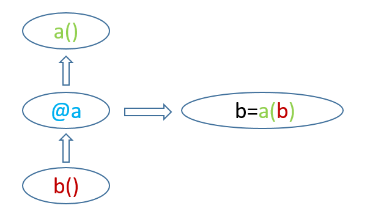

## 1.5 高级特性

>date: 2019-02-01


### 1.5.1 不可变类型

代码`1`：

```python
>>> def immutable(lst = []):
...     lst.append("hello")
...     return lst
...
>>> immutable()
['hello']
>>> immutable()
['hello', 'hello']
>>>
```

代码`2`：

```python
>>> def mutable(lst = None):
...     lst = []
...     lst.append("hello")
...     return lst
...
>>> mutable()
['hello']
>>> mutable()
['hello']
>>>
```

在代码`1`中，由于`lst`是一个可变参数，`immutable()`在初始化时候指向一个`[]`的内存空间，之后每次调用`immutable()`这个内存空间都添加`hello`，而由于`lst`仍然指向这个内存空间，所以会看到`immutable()`函数的这个现象。

在代码2中，由于`lst`初始化为`None`，不能直接对其进行`append`操作，所以`lst`在每次`mutable()`调用中都只会存在一个`hello`。

这个就是可变类型和不可变类型的表现。

* 不可变（`mutable`）类型：`int`、`float`、`string`、`tuple`、`frozenset`

* 可变（`immutable`）类型：`list`、`dict`

Python中所有的变量都是值得引用，变量是通过绑定的方式指向其值的，这里的不可变指的是值的不可变。对于不可变类型的变量，如果更改变量，则会创建一个新值，而旧值如果没有被引用就会等待垃圾回收。

```python
>>> id(1), id(2)
(10919424, 10919456)
>>> a = 1
>>> id(a)
10919424
>>> a = 3 # 当a赋一个新值时,变量a会绑定到新值上
>>> id(a)
10919488
>>>
>>> lst = [0]
>>> id(lst)
139875865564872
>>> lst = [0, 1]
>>> id(lst)
139875865564936
>>>
>>> lst = [0]
>>>
>>> id(lst[0])
10919392
>>> lst = [0, 1]
>>> id(lst[0])
10919392
>>> id(lst[1])
10919424
```

`lst`只代表地址，其指向的`[]`变了，即`lst[i]`变了，所以`lst`变了。

### 1.5.2 列表推导式、迭代器、生成器

* 列表推导式

```python
>>> {i:el for i,el in enumerate(["one","two","three"])}
{0: 'one', 1: 'two', 2: 'three'}
>>>
>>> L = ['Hello', 'World', 'IBM', 'Apple']
>>> [s.lower() for s in L]
['hello', 'world', 'ibm', 'apple']
>>>
```

* 迭代器

迭代器属于一个临时区，安排一些元素在里面，但只用用的时候才会创建一些临时区，一旦遍历结束则临时区清空，再遍历就失效了。所以说迭代器能够减少内存的开销。

```python
>>> import sys
>>> i = iter(range(10000))
>>> id(i.__next__())
10919392
>>> sys.getsizeof(i)
48
>>> sys.getsizeof(i.__next__()) # 28byte内存空间
28
>>> 
>>> e = range(10000)
>>> sys.getsizeof(e)
48
>>> sys.getsizeof(list(e)) # 90112byte内存空间
90112
>>>
```

可以被`next()`函数调用并不断返回下一个值的对象称为迭代器。迭代器都是`Iterator`对象，`list`、`dict`、`str`、`tuple`只用可迭代属性（惰性循环），属于`Iterable`。

**迭代器协议：**即对象实现了`__iter__()`和`__next__()`两个方法。

**可迭代对象：**实现了`__iter__()`方法，无`__next__()`方法。

* 生成器

生成器是一种特殊的迭代器。

```python
>>> g = (x*x for x in range(10))
>>> g
<generator object <genexpr> at 0x7f4739ffebf8>
>>> next(g)
0
>>> next(g)
1
>>> def gen():
...     for x in range(10):
...         yield x
...
>>> a = gen()
>>> a
<generator object gen at 0x7f47398b22b0>
>>> next(a)
0
>>> next(a)
1
>>>
```

判断一个函数是否是生成器的方式是调用`dir()`，`__next__`是生成器特有的属性。

* 迭代器与生成器的区别什么

迭代器是用来帮助我们记录每次迭代访问到的位置，当我们对迭代器使用`next()`函数的时候，迭代器会向我们返回它所记录位置的下一个位置的数据。

生成器：一个包含有`yield`的函数，同时也是一个迭代器，是特殊的一种迭代器。

迭代器（多迭代）：可以多次迭代；生成器（单迭代）：只能迭代一次。

### 1.5.3 返回函数

函数或类一般都有返回值，函数除了可以接受一个函数作为输入外，还可以将函数作为结果返回。

```python
>>> def lazy_sum(*args):
...     def sum():
...             ax = 0
...             for n in args:
...                     ax += n
...             return ax
...     return sum
...
>>> f = lazy_sum(1, 3, 5, 7, 9)
>>> f
<function lazy_sum.<locals>.sum at 0x7f473992aae8>
>>> f()
25
>>> dir(f)
['__annotations__', '__call__', '__class__', '__closure__', '__code__', '__defaults__', '__delattr__', '__dict__', '__dir__', '__doc__', '__eq__', '__format__', '__ge__', '__get__', '__getattribute__', '__globals__', '__gt__', '__hash__', '__init__', '__kwdefaults__', '__le__', '__lt__', '__module__', '__name__', '__ne__', '__new__', '__qualname__', '__reduce__', '__reduce_ex__', '__repr__', '__setattr__', '__sizeof__', '__str__', '__subclasshook__']
>>>
```

这其实是`__call__`在起作用，只要类型中存在`__call__`方法，就可以将对象当作函数类使用。

### 1.5.4 闭包和装饰器

>
>在计算机科学中，闭包（Closure）是词法闭包（Lexical Closure）的简称，是引用了自由变量的函数。这个被引用的自由变量将和这个函数一同存在，即使已经离开了创造它的环境也不例外。所以，有另一种说法认为闭包是由函数和与其相关的引用环境组合而成的实体。
>

闭包，顾名思义，就是一个封闭的包裹，里面包裹着自由变量，哪里可以访问到这个包裹，哪里就可以访问到这个自由变量。闭包使得局部变量在函数外被访问成为可能。

```python
>>> def func(name):
...     def inner_func(age):
...             print('name:', name, 'age:', age)
...     return inner_func
...
>>> me = func('jason')
>>> me('24')
name: jason age: 24
>>>
```

这里的`name`就是自由变量。

这里介绍`nonlocal`关键字，它用来在函数或其它作用域使用外层但**非全局**变量。

```python
>>> def make_counter():
...     count = 0
...     def counter():
...             nonlocal count
...             count += 1
...             return count
...     return counter
...
>>> mc = make_counter()
>>> mc()
1
>>> mc()
2
>>> mc()
3
>>>
```

产生闭包必须具备的三个条件：

* 需要定义嵌套函数；

* 嵌套函数需要引用`enclosing function`中的变量；

* `enclosing function`需要返回嵌套函数。

`Python`闭包的实现得益于`__call__`方法，而**装饰器就是闭包**，也就是说如果要理解装饰器，一定要重视`__call__`这个内建方法。

**注：** `__call__`这个内置方法可以将类的实例的行为表现的像函数一样，当使用类装饰器的时候，如果该类定义了`__call__`，即最终是调用`__call__`的方法，所以定义类装饰器的处理逻辑在`__call__`实现。

* 装饰器



定义一个`timeit()`函数来对`foo()`函数计时：

```python
import time
def foo():
    print('in foo()')

def timeit(func):
    start = time.time()
    func()
    print('used:', time.time() - start)

timeit(foo)
```

这样看似可以对`foo()`进行计时，但是当`foo()`函数进行更改时候，我们同样需要对`timeit`进行更改，如何尽量值对`foo()`更改呢？装饰器就出现了。

```python
import time
 
def timeit(func):
    def wrapper():
        start = time.time()
        func()
        print('used:', time.time() - start)
    return wrapper
 
@timeit
def foo():
    print('in foo()')
 
foo()
```

这里的`@timeit`与`timeit(foo)`完全等价。下面就是将上述的`timeit()`改的更加通用化一些。

```python
import time
 
def timeit(func):
    def wrapper(*args, **kwargs):
        start = time.time()
        func(*args, **kwargs)
        print('used:', time.time() - start)
    return wrapper
 
@timeit
def foo(mystr):
    print(mystr)
 
foo('in foo()')
```

定义`*args, **kwargs`我们就可以在`foo()`中传入其它参数，这样的操作更加灵活。但当我们调用`foo.__name__`时候，它的结果却是`wrapper`，当我们需要执行依赖函数签名的代码时，就会报错。我们需要把原始函数的`__name__`等属性复制到`wrapper()`函数中。

下面看看`functools`如何进行诸如`wrapper.__name__ = func.__name__`等**保留元信息**这些处理的。

```python
import time
from functools import wraps

def timeit(func):
    @wraps(func)
    def wrapper(*args, **kwargs):
        start = time.time()
        func(*args, **kwargs)
        print(func.__name__, time.time() - start)
    return wrapper

@timeit
def foo(mystr):
    print(mystr)

foo('in foo()')
```

当装饰器是通过`wraps`实现的，那么可以通过`__wrapped__`属性来访问原始函数。

* **注意：** 如果有多个包装器，那么访问`__wrapped__`属性的行为是不可预知的，应该避免这样做。*

假设你想写一个装饰器，给函数添加日志功能，同时允许用户指定日志的级别和其他的选项。 下面是这个装饰器的定义和使用示例：

```python
from functools import wraps
import logging

def logged(level, name=None, message=None):
    def decorate(func):
        logname = name if name else func.__module__
        log = logging.getLogger(logname)
        logmsg = message if message else func.__name__

        @wraps(func)
        def wrapper(*args, **kwargs):
            log.log(level, logmsg)
            return func(*args, **kwargs)
        return wrapper
    return decorate

@logged(logging.DEBUG)
def add(x, y):
    return x + y

@logged(logging.CRITICAL, 'example')
def spam():
    print('Spam!')
```

装饰器其实是很典型`AOP`的实现，即面向切面编程，它主要的作用就是将业务逻辑处理过程以切面为维度进行提取，所面对的是处理过程中的某个步骤或阶段，以获得逻辑过程中各部分之间低耦合性的隔离效果。

也就是说，在不修改函数`A`的前提下，在函数`A`前后插入业务逻辑`B, C, D...`来减少代码的耦合度。

### 1.5.5 函数式编程

函数式编程的核心就是将函数当成对象类进行编程。它的一个特点就是允许将函数本身当成参数传入另一个函数，还允许返回一个函数。

* 变量可以指向函数

```python
>>> f = abs
>>> f
<built-in function abs>
>>> f(-10)
10
>>>
```

* `map`、`reduce`、`filter`、匿名函数

`map`接收两个参数，第一个参数是函数(处理办法)，第二个参数是一个可迭代对象，而`map`可以把第二个参数的变量映射到函数中一一进行处理，结果以`list`形式返回。

`reduce`接收两个参数，第一个参数是函数(处理办法),第二个参数是一个可迭代对象，而`reduce`可以把第二个参数每一次`next`方法执行的结果映射到函数中进行处理，然后返回一个计算后的值。其实质就是不断的嵌套把此层函数作为下一层函数的参数直到最后。

`filter`也接收一个函数和一个序列。和`map`不同的是，`filter`把传入的函数依次作用于每个元素，然后根据返回值是`True`还是`False`决定保留还是丢弃该元素。

`lambda`在不需要显式地定义函数，需要传入匿名函数更方便。

```python
>>> def f(x):
...     return x * x
...
>>> r = map(f, [1, 2, 3, 4, 5])
>>> r
<map object at 0x7f4739919b38>
>>> list(r)
[1, 4, 9, 16, 25]
>>>
>>> from functools import reduce
>>> def f(x, y):
...     return x * 10 + y
...
>>> reduce(f, [1, 3, 5, 7, 9])
13579
>>>
>>> def not_empty(s):
...     return s and s.strip()
...
>>> list(filter(not_empty, ['A', '', 'B', None, 'C', '  ']))
['A', 'B', 'C']
>>> f = lambda x: x * x
>>> f
<function <lambda> at 0x7f47398b6d08>
>>> f(5)
25
>>> list(map(lambda x: x * x, [1, 2, 3, 4, 5, 6, 7, 8, 9]))
[1, 4, 9, 16, 25, 36, 49, 64, 81]
>>>
```

使用埃氏筛法计算素数。

```python
# 埃氏筛法
def _odd_iter():
    n = 1
    while True:
        n = n + 2
        yield n

def _not_divisible(n):
    return lambda x: x % n > 0

def primes():
    yield 2
    it = _odd_iter() # 初始序列
    while True:
        n = next(it) # 返回序列的第一个数
        yield n
        it = filter(_not_divisible(n), it) # 构造新序列
```