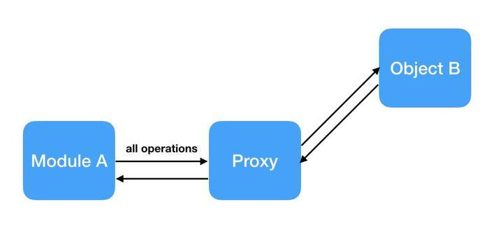
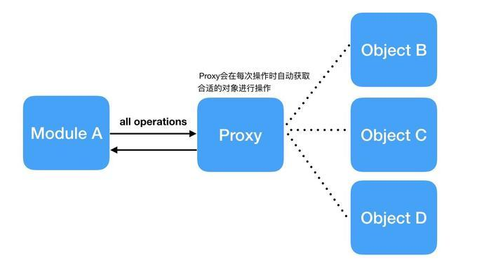

## 4.1 Flask

>date: 2019-02-13


### 4.1.1 简明教程

* 一个最小的`Flask`应用

```python
from flask import Flask
app = Flask(__name__)

@app.route('/')
def hello_world():
    return 'Hello World!'

if __name__ == '__main__':
    app.run()
```

将上述代码保存在到`app.py`中，在命令行运行`python3 app.py`。

```bash
$ python app.py
 * Running on http://127.0.0.1:5000/
```

现在再浏览器中访问`http://127.0.0.1:5000`，就能看到浏览器显示`Hello World`问候。

这段代码做了以下的动作：

1) 首先`Flask`类，这个类的实例就是一个`WSGI`应用程序；

2) 创建一个名为`app`的`Flask`实例，第一个参数为应用模块或者包的名称。如果是单一的模块，应该使用`__name__`，因为模块名称将会因其作为单独应用启动还是作为模块导入而不同，即`__main__`或实际的导入名；`Flask`回根据这个参数无照模块，静态文件等；

3) 之后使用`route()`装饰器告诉`Flask`什么样的`URL`能触发对应的函数；这个函数的名字也在生成`URL`时被特定的函数采用，这个函数返回对应的信息；

4) 使用`run()`函数让应用运行在本地服务器上，其中`if __name__ == '__main__'`确保服务器只会在该脚本被`Python`解释器直接执行的时候才会运行。

* `IP`地址与外部可访问

**`IP`地址一共分为`5`类，即`A~E`，其分类依据是按照网络号的字节长度以及其网络号前几位进行的。**

1) `A`类：网络号占`1`个字节，第一位必须是`0`，最大的网络数`2^7 - 2 (126)`个，最大的主机数`2^(24) - 2`个；地址范围：`1.0.0.1-126.255.255.254`；

2) `B`类：网络号占`2`个字节，前两位固定为`10`，最大的网络数`2^14 - 1`个，最大主机数`2^(16) - 2`个；地址范围：`128.1.0.1-191.255.255.254 `；

3) `C`类：网络号占`3`个字节，前两位固定为`110`，最大的网络数`2^21 - 1`个，最大主机数`2^(8) - 2`个，地址范围：192.0.1.1-223.255.255.254；

4) `D`类：前几位固定为`1110`，是多播地址，所有的网络号取值于`224 ~ 239`之间，一般用于多路广播用户；

5) `E`类：前几位固定为`1111`，是保留地址，所有的网络号取值于`240 ~ 255`之间。

**回环地址：**`127.0.0.1`，该地址指电脑本身，等效于`localhost`或本机`IP`，主要预留测试本机的`TCP/IP`协议是否正常。只要使用这个地址发送数据，则数据包不会出现在网络传输过程中。

**特殊地址：**

1) `10.x.x.x`、`172.16.x.x～172.31.x.x`、`192.168.x.x`：这些地址被用做内网中。用做私网地址，这些地址不与外网相连；

2) `255.255.255.255`：当前子网的广播地址；

3) `0.0.0.0`：这个`IP`地址在`IP`数据报中只能用作源`IP`地址，这发生在当设备启动时但又不知道自己的`IP`地址情况下。

在上述代码中修改`run()`的参数为`app.run(host='0.0.0.0')`，这会儿让操作系统监听所有公网`IP`。

* 调试模式

```python
app.debug = True
app.run()
# or
app.run(debug=True)
```

* 路由

1) `route()`装饰器把一个函数绑定到对应的`URL`上。

```python
@app.route('/')
def index():
    return 'Index Page'

@app.route('/hello')
def hello():
    return 'Hello World'
```

2) 构造含有动态的`URL`，或在一个函数上附着多个规则。

要给`URL`添加变量部分，你可以把这些特殊的字段标记为 `<variable_name>` ， 这个部分将会作为命名参数传递到你的函数。规则可以用 `<converter:variable_name>` 指定一个可选的转换器。

转换器：

`int`：接收整数；`float`：接收浮点数；`path`：接收存在`/`的路径。

```python
@app.route('/user/<username>')
def show_user_profile(username):
    return 'User %s' % username

@app.route('/post/<int:post_id>')
def show_post(post_id):
    return 'Post %d' % post_id
```

3) 唯一`URL`/重定向行为。

```python
@app.route('/projects/')
def projects():
    return 'The project page'

@app.route('/about')
def about():
    return 'The about page'
```

第一种情况中，指向 `projects` 的规范 `URL` 尾端有一个斜线。这种感觉很像在文件系统中的文件夹。访问一个结尾不带斜线的 `URL` 会被 `Flask` 重定向到带斜线的规范 `URL` 去。

第二种情况的 `URL` 结尾不带斜线，类似 `UNIX-like` 系统下的文件的路径名。访问结尾带斜线的 `URL` 会产生一个 `404 “Not Found”` 错误。

这个行为使得在遗忘尾斜线时，允许关联的 `URL` 接任工作，与 `Apache` 和其它的服务器的行为并无二异。此外，也保证了 `URL` 的唯一，有助于避免搜索引擎索引同一个页面两次。

4) 构造`URL`

可以用 `url_for()` 来给指定的函数构造 `URL`。它接受函数名作为第一个参数，也接受对应 `URL` 规则的变量部分的命名参数。未知变量部分会添加到 `URL` 末尾作为查询参数。

```python
>>> from flask import Flask, url_for
>>> app = Flask(__name__)
>>> @app.route('/')
... def index(): pass
...
>>> @app.route('/login')
... def login(): pass
...
>>> @app.route('/user/<username>')
... def profile(username): pass
...
>>> with app.test_request_context():
...     print url_for('index')
...     print url_for('login')
...     print url_for('login', next='/')
...     print url_for('profile', username='John Doe')
...
/
/login
/login?next=/
/user/John%20Doe
```

* `HTTP`

默认情况下，路由只回应`GET`请求，但通过在`route()`装饰器传递`methods`参数可以改变这个行为。

```python
@app.route('/login', methods=['GET', 'POST'])
def login():
    if request.method == 'POST':
        do_the_login()
    else:
        show_the_login_form()
```

如果存在`GET`，`Flask`会自动添加上`HEAD`和`OPTIONS`。

1) `GET`：浏览器告知服务器：只获取页面上的信息并发给我。这是最常用的方法。

2) `HEAD`：浏览器告诉服务器：欲获取信息，但是只关心消息头。应用应像处理 `GET` 请求一样来处理它，但是不分发实际内容。在`Flask`中你完全无需人工干预，底层的`Werkzeug`库已经替你打点好了。

3) `POST`：浏览器告诉服务器：想在`URL`上 发布新信息。并且，服务器必须确保数据已存储且仅存储一次。这是`HTML`表单通常发送数据到服务器的方法。

4) `PUT`：类似`POST`但是服务器可能触发了存储过程多次，多次覆盖掉旧值。你可 能会问这有什么用，当然这是有原因的。考虑到传输中连接可能会丢失，在 这种 情况下浏览器和服务器之间的系统可能安全地第二次接收请求，而 不破坏其它东西。因为`POST`它只触发一次，所以用`POST`是不可能的。

5) `DELETE`：删除给定位置的信息。

6) `OPTIONS`：给客户端提供一个敏捷的途径来弄清这个`URL`支持哪些`HTTP`方法。从`Flask 0.6`开始，实现了自动处理。

* 静态文件

只要在你的包中或者模块所在目录中创建一个名为`static`文件夹，在应用中使用`/static`即可访问。

给静态文件生成`URL`使用特殊的`'static'`端点名:`url_for('static', filename='style.css')`，这个文件应该存储在文件系统上的`static/style.css`。

* 模版渲染

`Flask`使用[`Jinja2`](http://docs.jinkan.org/docs/jinja2/)模版引擎进行模版渲染。使用`render_template()`方法即可进行模版渲染。

```python
from flask import render_template

@app.route('/hello/')
@app.route('/hello/<name>')
def hello(name=None):
    return render_template('hello.html', name=name)
```

`Flask`在`templates`文件夹中寻找模版，如果应用是一个模块，那么模版文件夹在模块旁边：

```bash
/application.py
/templates
    /hello.html
```

如果是一个包，那么就应该在包里面：

```python
/application
    /__init__.py
    /templates
        /hello.html
```

模版示例：

```html
<!doctype html>
<title>Hello from Flask</title>

  <h1>Hello {{ name }}!</h1>

  <h1>Hello, World!</h1>

```

在模板内部可以和访问`get_flashed_messages()`函数一样访问`request`、`session`和`g`对象。

* 请求数据

```python
from flask import request

@app.route('/login', methods=['POST', 'GET'])
def login():
    error = None
    if request.method == 'POST':
        if valid_login(request.form['username'],
                       request.form['password']):
            return log_the_user_in(request.form['username'])
        else:
            error = 'Invalid username/password'
    return render_template('login.html', error=error)
```

使用`args`属性可以操作`URL`查询参数提交的参数：`searchword = request.args.get('key', '')`。

使用`Flask`处理文件上传很容易，只要确保在`HTML`表单中设置`enctype="multipart/form-data`属性就可以。可以通过请求对象`files`属性来访问上传的文件。每个上传的文件都储存在这个`dict()`属性中。这个属性基本和标准`Python file`对象一样，另外多出一个用于把上传文件保存到服务器的文件系统中的`save()`方法。

同时如果想要知道文件上传之前其在客户端系统中的名称，可以使用`filename`属性。但是请牢记这个值是可以伪造的，永远不要信任这个值。如果想要把客户端的文件名作为服务器上的文件名，可以通过`Werkzeug`提供的`secure_filename()`函数：

```python
from flask import request
from werkzeug.utils import secure_filename

@app.route('/upload', methods=['GET', 'POST'])
def upload_file():
    if request.method == 'POST':
        f = request.files['the_file']
        f.save('/var/www/uploads/' + secure_filename(f.filename))
    ...
```

要访问`cookies`，可以使用`cookies`属性。可以使用响应对象的`set_cookie`方法来设置`cookies`。请求对象的`cookies`属性是一个包含了客户端传输的所有`cookies`的字典。在`Flask`中，如果使用`session`，那么就不要直接使用`cookies`，因为`session`比较安全一些。

读取`cookies`:

```python
from flask import request

@app.route('/')
def index():
    username = request.cookies.get('username')
```

设置`cookies`:

```python
from flask import make_response

@app.route('/')
def index():
    resp = make_response(render_template(...))
    resp.set_cookie('username', 'the username')
    return resp
```

* 重定向和错误

```python
from flask import abort, redirect, url_for

@app.route('/')
def index():
    return redirect(url_for('login')) # 充电线

@app.route('/login')
def login():
    abort(401)
    this_is_never_executed() # 此处已经跳出工作了

@app.errorhandler(404)
def page_not_found(error):
    return render_template('page_not_found.html'), 404 # 跳转到定制出错页面
```

* 响应

视图函数的返回值会自动转换为一个响应对象。如果返回值是一个字符串，那么会被转换为一个包含作为响应体的字符串，一个`200 OK`代码和一个`text/html`类型的响应对象。

1) 试图返回是一个响应对象，就直接返回它；

2) 返回一个字符串，就根据字符串和缺省参数生成一个用于返回的响应对象；

3) 返回一个元祖，元祖中的项目可以提供额外的信息。元祖中必须返回至少包含一个项目，并且项目应当由`responses`、`status`、`headers`或者`response`、`headers`组成。`status`的值会重载状态代码，`headers`是一个由额外头部致组成的列表或字典；

4) 如果以上都不是，那么`Flask`会假定返回值是一个有效的`WSGI`应用并把它转换为一个响应对象。

如果想要在视图内部掌控响应对象的结果，那么可以使用`make_response()`函数。

```python
@app.errorhandler(404)
def not_found(error):
    resp = make_response(render_template('error.html'), 404)
    resp.headers['X-Something'] = 'A value'
    return resp
```

* `session`

使用`session`之前必须设置一个密钥。

```python
from flask import Flask, session, redirect, url_for, escape, request

app = Flask(__name__)

app.secret_key = b'_5#y2L"F4Q8z\n\xec]/'

@app.route('/')
def index():
    if 'username' in session:
        return 'Logged in as %s' % escape(session['username'])
    return 'You are not logged in'

@app.route('/login', methods=['GET', 'POST'])
def login():
    if request.method == 'POST':
        session['username'] = request.form['username']
        return redirect(url_for('index'))
    return '''
        <form method="post">
            <p><input type=text name=username>
            <p><input type=submit value=Login>
        </form>
    '''

@app.route('/logout')
def logout():
    session.pop('username', None)
    return redirect(url_for('index'))
```

`escape()` 是用来转义的。如果不使用模板引擎就可以像上例一样使用这个函数来转义。

* 消息闪现

`flash()`用于闪现一个消息。在模板中，使用`get_flashed_messages()`来操作消息。

* 日志

```python
app.logger.debug('A value for debugging')
app.logger.warning('A warning occurred (%d apples)', 42)
app.logger.error('An error occurred')
```

### 4.1.2 上下文和线程安全

在计算机中，相对进程而言，上下文是进程执行时的环境。

`Flask`的上下文即运行过程中保存信息的容器。有两种，请求上下文和应用上下文。

而请求上下文和应用上下文是通过`Werkzeug`的`Local`、`LocalStack`和`LocalProxy`实现的。

#### `Werkzeug`的`Local`、`LocalStack`和`LocalProxy`

* `Local`

`Python`的标准库中提供了`thread local`对象用于存储`thread-safe`和`thread-specific`的数据，通过这种方式存储的数据只在本线程中有效，而对于其它线程则不可见。正是基于这样的特性，我们可以把针对线程全局的数据存储进`thread local`对象。

`Werkzeug`的`Local`类：

```python
class Local(object):
    __slots__ = ('__storage__', '__ident_func__')

    def __init__(self):
        object.__setattr__(self, '__storage__', {})
        object.__setattr__(self, '__ident_func__', get_ident)

    def __iter__(self):
        return iter(self.__storage__.items())

    # 当调用Local对象时，返回对应的LocalProxy
    def __call__(self, proxy):
        """Create a proxy for a name."""
        return LocalProxy(self, proxy)

    # Local类中特有的method，用于清空greenlet id或线程id对应的dict数据
    def __release_local__(self):
        self.__storage__.pop(self.__ident_func__(), None)

    def __getattr__(self, name):
        try:
            return self.__storage__[self.__ident_func__()][name]
        except KeyError:
            raise AttributeError(name)

    def __setattr__(self, name, value):
        ident = self.__ident_func__()
        storage = self.__storage__
        try:
            storage[ident][name] = value
        except KeyError:
            storage[ident] = {name: value}

    def __delattr__(self, name):
        try:
            del self.__storage__[self.__ident_func__()][name]
        except KeyError:
            raise AttributeError(name)
```

这段代码实际是对`__storage__ dict`的封装，而这个`dict`中的`key`使用的就是`get_indent`函数获取的`id`（当有`greenlet`时使用`greenlet id`，没有则使用`thread id`）。

`__storage__ dict`中的`value`也是一个`dict`，这个`dict`就是该`Greenlet`协程或线程对应的`local`存储空间。

通过重新实现`__getattr__`、`__setattr__`等魔术方法，我们在`greenlet`或者线程中使用`local`对象时，实际会自动获取`greenlet id`(或者线程id)，从而获取到对应的`dict`存储空间，再通过`name key`就可以获取到真正的存储的对象。

当我们需要释放`local`数据的内存时，可以通过调用`release_local()`函数来释放当前`context`的`local`数据。不同线程中操作该对象，是互不影响的。

```python
from werkzeug.local import Local
import threading, time

my_obj = Local()
my_obj.b = 1

def worker():
    my_obj.b = 2
    print('in sub thread b is:' + str(my_obj.b))

subthread1 = threading.Thread(target=worker, name='subthread1')
subthread1.start()
 
time.sleep(1)
 
print('my_obj.b is : {}'.format(my_obj.b))
```

* `LocalStack`

```python
class LocalStack(object):

    """This class works similar to a :class:`Local` but keeps a stack
    of objects instead.  This is best explained with an example::

        >>> ls = LocalStack()
        >>> ls.push(42)
        >>> ls.top
        42
        >>> ls.push(23)
        >>> ls.top
        23
        >>> ls.pop()
        23
        >>> ls.top
        42

    They can be force released by using a :class:`LocalManager` or with
    the :func:`release_local` function but the correct way is to pop the
    item from the stack after using.  When the stack is empty it will
    no longer be bound to the current context (and as such released).

    By calling the stack without arguments it returns a proxy that resolves to
    the topmost item on the stack.

    .. versionadded:: 0.6.1
    """

    def __init__(self):
        self._local = Local()

    def __release_local__(self):
        self._local.__release_local__()

    def _get__ident_func__(self):
        return self._local.__ident_func__

    def _set__ident_func__(self, value):
        object.__setattr__(self._local, '__ident_func__', value)
    __ident_func__ = property(_get__ident_func__, _set__ident_func__)
    del _get__ident_func__, _set__ident_func__

    def __call__(self):
        def _lookup():
            rv = self.top
            if rv is None:
                raise RuntimeError('object unbound')
            return rv
        return LocalProxy(_lookup)

    def push(self, obj):
        """Pushes a new item to the stack"""
        rv = getattr(self._local, 'stack', None)
        if rv is None:
            self._local.stack = rv = []
        rv.append(obj)
        return rv

    def pop(self):
        """Removes the topmost item from the stack, will return the
        old value or `None` if the stack was already empty.
        """
        stack = getattr(self._local, 'stack', None)
        if stack is None:
            return None
        elif len(stack) == 1:
            release_local(self._local)
            return stack[-1]
        else:
            return stack.pop()

    @property
    def top(self):
        """The topmost item on the stack.  If the stack is empty,
        `None` is returned.
        """
        try:
            return self._local.stack[-1]
        except (AttributeError, IndexError):
            return None
```

`LocalStack`与`Local`对象类似，都是可以基于`Greenlet`协程或者线程进行全局存储的存储空间(实际`LocalStack`是对Local进行了二次封装），区别在于其数据结构是栈的形式。

```python
from werkzeug.local import Local, LocalStack
import threading, time
 
my_stack = LocalStack()
my_stack.push(1)
print('in main thread after push, value is:' + str(my_stack.top))
 
 
def worker():
    print('in new thread before push , value is:'+str(my_stack.top))   # 因为线程隔离，所以为None
    my_stack.push(2)
    print('in new thread after push , value is:'+str(my_stack.top))
 
 
new_t = threading.Thread(target=worker, name='localstack_thread')
new_t.start()
 
time.sleep(1)
 
print('finally, in main thread , value is : {}'.format(my_stack.top))
```

`Local`：使用字典的方式实现的线程隔离；`LocalStack`：封装Local实现线程隔离的栈结构。

* `LocalProxy`

`LocalProxy`用于代理`Local`对象和`LocalStack`对象，而所谓代理就是作为中间的代理人来处理所有针对被代理对象的操作，如下图所示：



```python
@implements_bool
class LocalProxy(object):
    __slots__ = ('__local', '__dict__', '__name__', '__wrapped__')

    def __init__(self, local, name=None):
        object.__setattr__(self, '_LocalProxy__local', local)
        object.__setattr__(self, '__name__', name)
        if callable(local) and not hasattr(local, '__release_local__'):
            # "local" is a callable that is not an instance of Local or
            # LocalManager: mark it as a wrapped function.
            object.__setattr__(self, '__wrapped__', local)

    def _get_current_object(self):
        """Return the current object.  This is useful if you want the real
        object behind the proxy at a time for performance reasons or because
        you want to pass the object into a different context.
        """
        # 由于所有Local或LocalStack对象都有__release_local__ method, 所以如果没有该属性就表明self.__local为callable对象
        if not hasattr(self.__local, '__release_local__'):
            return self.__local()
        try:
            # 此处self.__local为Local或LocalStack对象
            return getattr(self.__local, self.__name__)
        except AttributeError:
            raise RuntimeError('no object bound to %s' % self.__name__)

    @property
    def __dict__(self):
        try:
            return self._get_current_object().__dict__
        except RuntimeError:
            raise AttributeError('__dict__')

    def __getattr__(self, name):
        if name == '__members__':
            return dir(self._get_current_object())
        return getattr(self._get_current_object(), name)

    def __setitem__(self, key, value):
        self._get_current_object()[key] = value

    def __delitem__(self, key):
        del self._get_current_object()[key]

    if PY2:
        __getslice__ = lambda x, i, j: x._get_current_object()[i:j]

        def __setslice__(self, i, j, seq):
            self._get_current_object()[i:j] = seq

        def __delslice__(self, i, j):
            del self._get_current_object()[i:j]

    # 截取部分操作符代码，下面省略了好多代码，详情请见源码 https://github.com/pallets/werkzeug/blob/master/werkzeug/local.py
    __setattr__ = lambda x, n, v: setattr(x._get_current_object(), n, v)
    __delattr__ = lambda x, n: delattr(x._get_current_object(), n)
    __str__ = lambda x: str(x._get_current_object())
    __lt__ = lambda x, o: x._get_current_object() < o
    __le__ = lambda x, o: x._get_current_object() <= o
    __eq__ = lambda x, o: x._get_current_object() == o
```

为什么需要`LocalProxy`?

看下面两段代码：

未使用`LocalProxy`，仅使用`LocalStack`进行定义。

```python
# use Local object directly
from werkzeug.local import LocalStack
user_stack = LocalStack()
user_stack.push({'name': 'Bob'})
user_stack.push({'name': 'John'})

def get_user():
    # do something to get User object and return it
    return user_stack.pop()


# 直接调用函数获取user对象
user = get_user()
print(user['name']) # 结果为 John
print(user['name']) # 结果为 John
```

使用`LocalProxy`进行定义。

```python
# use LocalProxy
from werkzeug.local import LocalStack, LocalProxy
user_stack = LocalStack()
user_stack.push({'name': 'Bob'})
user_stack.push({'name': 'John'})

def get_user():
    # do something to get User object and return it
    return user_stack.pop()

# 通过LocalProxy使用user对象
user = LocalProxy(get_user)
print(user['name']) # 结果为 John
print(user['name']) # 结果为 Bob
```

直接使用`LocalStack`对象，`user`一旦赋值就无法再动态更新了，而使用`Proxy`，每次调用操作符(这里`[]`操作符用于获取属性)，都会重新获取`user`，从而实现了动态更新`user`的效果。



#### 请求上下文(`Request context`)

`request`和`session`都属于请求上下文对象。

* `request`对象封装了`HTTP`请求的内容，针对的是`HTTP`请求。

* `session`对象用来记录请求会话中的信息，针对的是用户信息。

`Flask`的`request`对象只有在其上下文的声明周期内才有效，离开请求的生命周期，其上下文环境就不存在了，同时也无法获取`request`对象。

`Flask`中有四种请求`hook`，分别是`@before_first_request`、`@before_request`、`@after_request`、`@teardown_request`。这四种请求`hook`函数，会挂载请求在生命周期的不同阶段，因此在其内部都可以访问`request`对象。

使用`request_context()`来构造一个请求上下文：

```python
from werkzeug.test import EnvironBuilder

ctx = app.request_context(EnvironBuilder('/','http://localhost/').get_environ())
ctx.push()
try:
    print(request.url)
finally:
    ctx.pop()
```

对于`Flask`而言，每一个请求就是一个独立的线程，其通过`Thread Local`来保证请求之间的数据需要完全隔离，避免冲突。

* `Thread Local`

对象是保存状态的地方，在`Python`中一个对象的状态都被保存在对象携带的一个字典上。`Thread Local`是一种特殊的对象，它的状态对线程隔离，即每一个线程对一个`Thread Local`对象的修改都不会影响其他线程。

`Flask`是一个基于`WerkZeug`实现的框架，因此`Flask`的`App Context`和`Request Context`是基于`WerkZeug`的`Local Stack`的实现。

这两种上下文对象类定义在`flask.ctx`中，`ctx.push`会将当前的上下文对象压栈压入`flask._request_ctx_stack`中，这个`_request_ctx_stack`同样也是个`Thread Local`对象，也就是在每个线程中都不一样，上下文压入栈后，再次请求的时候都是通过`_request_ctx_stack.top`在栈的顶端取，所取到的永远是属于自己线程的对象，这样不同线程之间的上下文就做到了隔离。

请求结束后，线程退出，`ThreadLocal`本地变量也随即销毁，然后调用`ctx.pop()`弹出上下文对象并回收内存。

#### 应用上下文(`Application context`)

`current_app`和`g`都属于应用上下文对象。

* `current_app`对象表示当前运行程序文件的程序实例，可以通过`current_app.name`打印出当前应用程序实例的名字。

* `g`对象处理请求时，用于临时存储的对象，每次请求都会重置这个变量。比如：我们可以获取一些临时请求的用户信息。

1) 当调用`app = Flask(__name__)`时候，创建了程序应用对象`app`；

2) `request`在每次`http`请求发生时，`WSGI server`调用`Flask.call()`，然后在`Flask`的内部创建request对象； 

3) `app`的生命周期大于`request`和`g`，一个`app`存活期间，可能发生多次`HTTP`请求，所以会有多个`request`和`g`；

4) 最后传入视图函数，通过`return`、`redirect`、`render_template`生成`response`对象。

`current_app`是一个本地代理，它的类型是`werkzeug.local.LocalProxy`，它所代理的即是我们的`app`对象，也就是说`current_app == LocalProxy(app)`。

使用`current_app`是因为它也是一个`ThreadLocal`变量，对它的改动不会影响到其他线程。可以通过`current_app._get_current_object()`方法来获取`app`对象。`current_app`只能在请求线程里存在，因此它的生命周期也是在应用上下文里，离开了应用上下文也就无法使用。

```python
from flask import Flask
from flask import current_app

app = Flask(__name__)
with app.app_context():
    print(current_app.name)
```

这里的`with`语句和`with open() as f`一样，是Python提供的语法糖，可以为提供上下文环境省略简化一部分工作。这里就简化了其压栈和出栈操作，请求线程创建时，`Flask`会创建应用上下文对象，并将其压入`flask._app_ctx_stack`的栈中，然后在线程退出前将其从栈里弹出。 

应用上下文也提供了装饰器来修饰`hook`函数，`@teardown_request`，它会在上下文生命周期结束前，也就是`_app_ctc_stack`出栈前被调用。

* 注意

当`app = Flask(name)`构造出一个`app`时，`App Context`并不会被自动推入`Stack`中。所以此时`Local Stack`的栈顶是空的，`current_app`也是`unbound`状态。

```python
>>> from flask import Flask
>>> from flask.globals import _app_ctx_stack, _request_ctx_stack
>>>
>>> app = Flask(__name__)
>>> _app_ctx_stack.top
>>> _request_ctx_stack.top
>>> 
>>> _app_ctx_stack()
<LocalProxy unbound>
>>> 
>>> from flask import current_app
>>> 
>>> current_app
<LocalProxy unbound>
>>>
```

在编写离线脚本的时候，如果直接在一个`Flask-SQLAlchemy`写成的`Model`上调用`User.query.get(user_id)`，就会遇到`RuntimeError`。因为此时`App Context`还没被推入栈中，而`Flask-SQLAlchemy`需要数据库连接信息时就会去取`current_app.config`，`current_app`指向的却是`_app_ctx_stack`为空的栈顶。 

解决的办法是运行脚本正文之前，先将`app`的`App Context`推入栈中，栈顶不为空后`current_app`这个`Local Proxy`对象就自然能将“取`config`属性” 的动作转发到当前`app`上。 

```python
>>> ctx = app.app_context()
>>> ctx.push()
>>> _app_ctx_stack.top
<flask.ctx.AppContext object at 0x7fbae8db8fd0>
>>> _app_ctx_stack.top is ctx
True
>>> current_app
<Flask '__main__'>
>>> ctx.pop()
>>> _app_ctx_stack.top
>>> current_app
<LocalProxy unbound>
>>>
```

`app`在作为`WSGI Application`运行时，会在每个请求进入的时候将请求上下文推入`_request_ctx_stack`中，而请求上下文一定是`app`上下文之中，所以推入部分的逻辑有这样一条：如果发现`_app_ctx_stack`为空，则隐式地推入一个`app`上下文。

* 请求上下文和应用上下文的区别:

1) 请求上下文：保存了客户端和服务器交互的数据；

2) 应用上下文：在`Flask`程序运行的过程中，保存的一些配置信息，比如程序文件名，数据库的连接，用户信息等。


#### 线程建立

`Flask`每一个请求就是一个独立的线程，那么其是如何建立的呢？

```python
def run(self, host=None, port=None, debug=None, **options):
    from werkzeug.serving import run_simple
    if host is None:
        host = '127.0.0.1'
    if port is None:
        server_name = self.config['SERVER_NAME']
        if server_name and ':' in server_name:
            port = int(server_name.rsplit(':', 1)[1])
        else:
            port = 5000
    if debug is not None:
        self.debug = bool(debug)
    options.setdefault('use_reloader', self.debug)
    options.setdefault('use_debugger', self.debug)
    try:
        run_simple(host, port, self, **options)
    finally:
        # reset the first request information if the development server
        # reset normally.  This makes it possible to restart the server
        # without reloader and that stuff from an interactive shell.
        self._got_first_request = False
```

这段代码是对`run_simple()`方法的简单封装，`run_simple()`方法的代码如下：

```python
def run_simple(hostname, port, application, use_reloader=False,
               use_debugger=False, use_evalex=True,
               extra_files=None, reloader_interval=1,
               reloader_type='auto', threaded=False,
               processes=1, request_handler=None, static_files=None,
               passthrough_errors=False, ssl_context=None):
    """Start a WSGI application. Optional features include a reloader,
    multithreading and fork support.

    This function has a command-line interface too::

        python -m werkzeug.serving --help

    .. versionadded:: 0.5
       `static_files` was added to simplify serving of static files as well
       as `passthrough_errors`.

    .. versionadded:: 0.6
       support for SSL was added.

    .. versionadded:: 0.8
       Added support for automatically loading a SSL context from certificate
       file and private key.

    .. versionadded:: 0.9
       Added command-line interface.

    .. versionadded:: 0.10
       Improved the reloader and added support for changing the backend
       through the `reloader_type` parameter.  See :ref:`reloader`
       for more information.

    :param hostname: The host for the application.  eg: ``'localhost'``
    :param port: The port for the server.  eg: ``8080``
    :param application: the WSGI application to execute
    :param use_reloader: should the server automatically restart the python
                         process if modules were changed?
    :param use_debugger: should the werkzeug debugging system be used?
    :param use_evalex: should the exception evaluation feature be enabled?
    :param extra_files: a list of files the reloader should watch
                        additionally to the modules.  For example configuration
                        files.
    :param reloader_interval: the interval for the reloader in seconds.
    :param reloader_type: the type of reloader to use.  The default is
                          auto detection.  Valid values are ``'stat'`` and
                          ``'watchdog'``. See :ref:`reloader` for more
                          information.
    :param threaded: should the process handle each request in a separate
                     thread?
    :param processes: if greater than 1 then handle each request in a new process
                      up to this maximum number of concurrent processes.
    :param request_handler: optional parameter that can be used to replace
                            the default one.  You can use this to replace it
                            with a different
                            :class:`~BaseHTTPServer.BaseHTTPRequestHandler`
                            subclass.
    :param static_files: a dict of paths for static files.  This works exactly
                         like :class:`SharedDataMiddleware`, it's actually
                         just wrapping the application in that middleware before
                         serving.
    :param passthrough_errors: set this to `True` to disable the error catching.
                               This means that the server will die on errors but
                               it can be useful to hook debuggers in (pdb etc.)
    :param ssl_context: an SSL context for the connection. Either an
                        :class:`ssl.SSLContext`, a tuple in the form
                        ``(cert_file, pkey_file)``, the string ``'adhoc'`` if
                        the server should automatically create one, or ``None``
                        to disable SSL (which is the default).
    """
    if use_debugger:
        from werkzeug.debug import DebuggedApplication
        application = DebuggedApplication(application, use_evalex)
    if static_files:
        from werkzeug.wsgi import SharedDataMiddleware
        application = SharedDataMiddleware(application, static_files)

    def log_startup(sock):
        display_hostname = hostname not in ('', '*') and hostname or 'localhost'
        if ':' in display_hostname:
            display_hostname = '[%s]' % display_hostname
        quit_msg = '(Press CTRL+C to quit)'
        port = sock.getsockname()[1]
        _log('info', ' * Running on %s://%s:%d/ %s',
             ssl_context is None and 'http' or 'https',
             display_hostname, port, quit_msg)

    def inner():
        try:
            fd = int(os.environ['WERKZEUG_SERVER_FD'])
        except (LookupError, ValueError):
            fd = None
        srv = make_server(hostname, port, application, threaded,
                          processes, request_handler,
                          passthrough_errors, ssl_context,
                          fd=fd)
        if fd is None:
            log_startup(srv.socket)
        srv.serve_forever()

    if use_reloader:
        # If we're not running already in the subprocess that is the
        # reloader we want to open up a socket early to make sure the
        # port is actually available.
        if os.environ.get('WERKZEUG_RUN_MAIN') != 'true':
            if port == 0 and not can_open_by_fd:
                raise ValueError('Cannot bind to a random port with enabled '
                                 'reloader if the Python interpreter does '
                                 'not support socket opening by fd.')

            # Create and destroy a socket so that any exceptions are
            # raised before we spawn a separate Python interpreter and
            # lose this ability.
            address_family = select_ip_version(hostname, port)
            s = socket.socket(address_family, socket.SOCK_STREAM)
            s.setsockopt(socket.SOL_SOCKET, socket.SO_REUSEADDR, 1)
            s.bind((hostname, port))
            if hasattr(s, 'set_inheritable'):
                s.set_inheritable(True)

            # If we can open the socket by file descriptor, then we can just
            # reuse this one and our socket will survive the restarts.
            if can_open_by_fd:
                os.environ['WERKZEUG_SERVER_FD'] = str(s.fileno())
                s.listen(LISTEN_QUEUE)
                log_startup(s)
            else:
                s.close()

        from ._reloader import run_with_reloader
        run_with_reloader(inner, extra_files, reloader_interval,
                          reloader_type)
    else:
        inner()
```

默认情况下回执行`inner()`方法，`inner()`方法创建一个`server`并启动，其是`make_server()`方法的封装。继续看`make_server()`方法的定义：

```python
def make_server(host=None, port=None, app=None, threaded=False, processes=1,
                request_handler=None, passthrough_errors=False,
                ssl_context=None, fd=None):
    """Create a new server instance that is either threaded, or forks
    or just processes one request after another.
    """
    if threaded and processes > 1:
        raise ValueError("cannot have a multithreaded and "
                         "multi process server.")
    elif threaded:
        return ThreadedWSGIServer(host, port, app, request_handler,
                                  passthrough_errors, ssl_context, fd=fd)
    elif processes > 1:
        return ForkingWSGIServer(host, port, app, processes, request_handler,
                                 passthrough_errors, ssl_context, fd=fd)
    else:
        return BaseWSGIServer(host, port, app, request_handler,
                              passthrough_errors, ssl_context, fd=fd)
```

可以看出一个`Flask`应用的`server`并非只有一种类型，它是可以设定的，默认情况下创建的是一个`BaseWSGIServer`，如果指定了`threaded`参数就启动一个`ThreadedWSGIServer`，如果设定的`processes > 1`则启动一个`ForkingWSGIServer`。

```python
class ThreadedWSGIServer(ThreadingMixIn, BaseWSGIServer):

    """A WSGI server that does threading."""
    multithread = True

class ThreadingMixIn:
    """Mix-in class to handle each request in a new thread."""

    # Decides how threads will act upon termination of the
    # main process
    daemon_threads = False

    def process_request_thread(self, request, client_address):
        """Same as in BaseServer but as a thread.

        In addition, exception handling is done here.

        """
        try:
            self.finish_request(request, client_address)
            self.shutdown_request(request)
        except:
            self.handle_error(request, client_address)
            self.shutdown_request(request)

    def process_request(self, request, client_address):
        """Start a new thread to process the request."""
        t = threading.Thread(target = self.process_request_thread,
                             args = (request, client_address))
        t.daemon = self.daemon_threads
        t.start()
```

`ThreadingMixIn`的实例以多线程的方式去处理每一个请求，这样对开发者来说，只有在启动`app`时将`threaded`参数设定为`True`，`Flask`才会真正以多线程的方式去处理每一个请求。

#### 线程安全

`Flask`会为每一个请求启动一个线程，每个请求都在单独线程中处理，因此保证了线程安全。

`Flask`把每次请求到来时附带的`environ`（`wsgi_app`方法参数中的`environ`）打印看看的话就会发现，每个`environ`都携带了请求相关的全部上下文信息，在请求到来的时候通过附带的`environ`重建`context`，并`push`到栈中，然后立刻处理该请求，处理完毕后将其`pop`出去。

### 4.1.3 路由规则

一个`Web`应用不同的路径就会有不同的处理函数，路由就是根据请求的`URL`找到对应函数的过程。

`Flask`的`app`中有个属性`url_map`，它是一个`Map`对象，其内部会有很多个`Rule`对象，`Rule`对象内部结构是`<Rule 'URL' methods view_func>`，这个`Map`对象是`Werkzeug`库的内部对象。

#### `Werkzeug`路由逻辑

```python
>>> from werkzeug.routing import Map, Rule
>>> m = Map([
...         Rule('/', endpoint='index'),
...         Rule('/downloads/', endpoint='downloads/index'),
...         Rule('/downloads/<int:id>', endpoint='downloads/show')
...     ])
>>> urls = m.bind("example.com", "/")
>>> urls.match("/", "GET")
('index', {})
>>> urls.match("/downloads/42")
('downloads/show', {'id': 42})
>>> urls.match("/downloads")
Traceback (most recent call last):
  File "/usr/local/lib/python3.6/dist-packages/werkzeug/routing.py", line 1538, in match
    rv = rule.match(path, method)
  File "/usr/local/lib/python3.6/dist-packages/werkzeug/routing.py", line 776, in match
    raise RequestSlash()
werkzeug.routing.RequestSlash

During handling of the above exception, another exception occurred:

Traceback (most recent call last):
  File "<stdin>", line 1, in <module>
  File "/usr/local/lib/python3.6/dist-packages/werkzeug/routing.py", line 1542, in match
    safe='/:|+') + '/', query_args))
werkzeug.routing.RequestRedirect: 301 Moved Permanently: None
>>> urls.match("/missing")
Traceback (most recent call last):
  File "<stdin>", line 1, in <module>
  File "/usr/local/lib/python3.6/dist-packages/werkzeug/routing.py", line 1581, in match
    raise NotFound()
werkzeug.exceptions.NotFound: 404 Not Found: The requested URL was not found on the server.  If you entered the URL manually please check your spelling and try again.
>>>
```

`Werkzeug`的路由功能包含着几个过程：

1) 添加路由规则，即定义了一个`Map`对象`m`，也可以使用`m.add()`进行路由规则添加；

2) 把路由表绑定到特定的环境`m.bind()`；

3) 匹配`URL`，`urls.match()`。

正常情况下返回对应的`endpoint`名字和参数字典，也可能报重定向或`404`错误。

`Werkzeug`的路由过程，其实是`URL`到`endpoint`的转换，但是`endpoint`和`view function`之间的匹配关系，`Werkzeug`是不管的。

* `match()`方法

```python
def match(self, path):
    """Check if the rule matches a given path. Path is a string in the
    form ``"subdomain|/path(method)"`` and is assembled by the map.  If
    the map is doing host matching the subdomain part will be the host
    instead.
    If the rule matches a dict with the converted values is returned,
    otherwise the return value is `None`.
    """
    if not self.build_only:
        m = self._regex.search(path)
        if m is not None:
            groups = m.groupdict()

            result = {}
            for name, value in iteritems(groups):
                try:
                    value = self._converters[name].to_python(value)
                except ValidationError:
                    return
                result[str(name)] = value
            if self.defaults:
                result.update(self.defaults)

            return result
```

`Werkzeug`用实现`compile`的正则表达式去匹配给出的真实路径信息，把所有的匹配组件转换成对应的值，保存在字典中（这就是传递给视图函数的参数列表）并返回。

* 动态路由匹配

```python
_rule_re = re.compile(r'''
    (?P<static>[^<]*)                           # static rule data
    <
    (?:
        (?P<converter>[a-zA-Z_][a-zA-Z0-9_]*)   # converter name
        (?:\((?P<args>.*?)\))?                  # converter arguments
        \:                                      # variable delimiter
    )?
    (?P<variable>[a-zA-Z_][a-zA-Z0-9_]*)        # variable name
    >
''', re.VERBOSE)
_simple_rule_re = re.compile(r'<([^>]+)>')
_converter_args_re = re.compile(r'''
    ((?P<name>\w+)\s*=\s*)?
    (?P<value>
        True|False|
        \d+.\d+|
        \d+.|
        \d+|
        \w+|
        [urUR]?(?P<stringval>"[^"]*?"|'[^']*')
    )\s*,
''', re.VERBOSE | re.UNICODE)

def parse_converter_args(argstr):
    argstr += ','
    args = []
    kwargs = {}

    for item in _converter_args_re.finditer(argstr):
        value = item.group('stringval')
        if value is None:
            value = item.group('value')
        value = _pythonize(value)
        if not item.group('name'):
            args.append(value)
        else:
            name = item.group('name')
            kwargs[name] = value

    return tuple(args), kwargs


def parse_rule(rule):
    """Parse a rule and return it as generator. Each iteration yields tuples
    in the form ``(converter, arguments, variable)``. If the converter is
    `None` it's a static url part, otherwise it's a dynamic one.

    :internal:
    """
    pos = 0
    end = len(rule)
    do_match = _rule_re.match
    used_names = set()
    while pos < end:
        m = do_match(rule, pos)
        if m is None:
            break
        data = m.groupdict()
        if data['static']:
            yield None, None, data['static']
        variable = data['variable']
        converter = data['converter'] or 'default'
        if variable in used_names:
            raise ValueError('variable name %r used twice.' % variable)
        used_names.add(variable)
        yield converter, data['args'] or None, variable
        pos = m.end()
    if pos < end:
        remaining = rule[pos:]
        if '>' in remaining or '<' in remaining:
            raise ValueError('malformed url rule: %r' % rule)
        yield None, None, remaining

tuple(parse_rule('/user/<name>'))
# 输出：((None, None, '/user/'), ('default', None, 'name'))
```

`Werkzeug`用实现`compile`的正则表达式来分析出动态路由中的转化器、转换器参数，路由变量。

#### `Flask`路由规则

`Flask`构建路由主要有两种方式：

1) 通过`@app.route()`装饰器实现；

2) 通过`app.add_url_rule(self, rule, endpoint=None, view_func=None, **options)`实现。

其中`@app.route()`装饰器的定义如下：

```python
def route(self, rule, **options):
    """A decorator that is used to register a view function for a
    given URL rule.  This does the same thing as :meth:`add_url_rule`
    but is intended for decorator usage.
    """

    def decorator(f):
        endpoint = options.pop('endpoint', None)
        self.add_url_rule(rule, endpoint, f, **options)
        return f

    return decorator
```

可以看出装饰器方式其内部也是调用`add_url_rule()`函数。所以`Flask`内部的路由规则的实现是通过`add_url_rule()`函数定义的。

```python
def add_url_rule(self, rule, endpoint=None, view_func=None, **options):
    """Connects a URL rule.  Works exactly like the :meth:`route`
    decorator.  If a view_func is provided it will be registered with the
    endpoint.
    Basically this example::
        @app.route('/')
        def index():
            pass
    Is equivalent to the following::
        def index():
            pass
        app.add_url_rule('/', 'index', index)
    If the view_func is not provided you will need to connect the endpoint
    to a view function like so::
        app.view_functions['index'] = index
    Internally :meth:`route` invokes :meth:`add_url_rule` so if you want
    to customize the behavior via subclassing you only need to change
    this method.
    """
    if endpoint is None:
        endpoint = _endpoint_from_view_func(view_func)
    options['endpoint'] = endpoint
    methods = options.pop('methods', None)
    # if the methods are not given and the view_func object knows its
    # methods we can use that instead.  If neither exists, we go with
    # a tuple of only ``GET`` as default.
    if methods is None:
        methods = getattr(view_func, 'methods', None) or ('GET',)
    if isinstance(methods, string_types):
        raise TypeError('Allowed methods have to be iterables of strings, '
                        'for example: @app.route(..., methods=["POST"])')
    methods = set(item.upper() for item in methods)
    # Methods that should always be added
    required_methods = set(getattr(view_func, 'required_methods', ()))
    # starting with Flask 0.8 the view_func object can disable and
    # force-enable the automatic options handling.
    provide_automatic_options = getattr(view_func,
        'provide_automatic_options', None)
    if provide_automatic_options is None:
        if 'OPTIONS' not in methods:
            provide_automatic_options = True
            required_methods.add('OPTIONS')
        else:
            provide_automatic_options = False
    # Add the required methods now.
    methods |= required_methods
    rule = self.url_rule_class(rule, methods=methods, **options)
    rule.provide_automatic_options = provide_automatic_options
    self.url_map.add(rule)
    if view_func is not None:
        old_func = self.view_functions.get(endpoint)
        if old_func is not None and old_func != view_func:
            raise AssertionError('View function mapping is overwriting an '
                                 'existing endpoint function: %s' % endpoint)
        self.view_functions[endpoint] = view_func
```

`add_url_rule()`函数主要做的事情是更新`self.url_map`和`self.view_functions`两个变量。其中，`url_map`是`werkzeug.routeing:Map`类的对象，`rule`是`werkzeug.routing:Rule`类，`view_functions`是一个字典。

需要注意的是，每个视图函数的`endpoint`必须是不同的，否则会报 `AssertionError`。

#### `Flask`路由实现

```python
def dispatch_request(self):
    """Does the request dispatching.  Matches the URL and returns the
    return value of the view or error handler.  This does not have to
    be a response object.  In order to convert the return value to a
    proper response object, call :func:`make_response`.
    """
 
    req = _request_ctx_stack.top.request
    if req.routing_exception is not None:
        self.raise_routing_exception(req)
    rule = req.url_rule
 
    # dispatch to the handler for that endpoint
    return self.view_functions[rule.endpoint](**req.view_args)
```

这是接收相关请求，根据请求`URL`寻找`endpoint`，然后从`view functions`中找到对应的处理函数，并传入请求参数，进行处理并返回结果的处理方法。

前面已经提到`Flask`如何接收请求了，其就是保存在`_request_ctx_stack.top.request`中的。在每次请求过来的时候，`Flask`会把当前请求的信息保存进去，这样就能在整个请求处理过程中使用它。

`_request_ctx_stack`中保存的是`Request context`对象，它和路由相关的逻辑如下：

```python
class RequestContext(object):
	def __init__(self, app, environ, request=None):
        self.app = app
        self.request = request
        self.url_adapter = app.create_url_adapter(self.request)
        self.match_request()
 
    def match_request(self):
        """Can be overridden by a subclass to hook into the matching
        of the request.
        """
        try:
            url_rule, self.request.view_args = \
                self.url_adapter.match(return_rule=True)
            self.request.url_rule = url_rule
        except HTTPException as e:
            self.request.routing_exception = e

class Flask(_PackageBoundObject):
    def create_url_adapter(self, request):
        """Creates a URL adapter for the given request.  The URL adapter
        is created at a point where the request context is not yet set up
        so the request is passed explicitly.
        """
        if request is not None:
            return self.url_map.bind_to_environ(request.environ,
                server_name=self.config['SERVER_NAME'])
```

在初始化的时候，会调用`app.create_url_adapter()`方法，把`app`的 `url_map`绑定到`WSGI environ`变量上（`bind_to_environ`和之前的`bind`方法作用相同）。最后会调用`match_request()`方法，这个方式调用了 `url_adapter.match()` 方法，进行实际的匹配工作，返回匹配的`Rule`。而我们之前使用的`url_rule.endpoint`就是匹配的`endpoint`值。

* `Blueprint`解决重名函数问题

```python
blueprint = Blueprint('public', __name__, static_folder='../static')

@blueprint.route('/', methods=['GET', 'POST'])
def index():
    pass

app.register_blueprint(blueprint)
```

这里注册的`endpoint`会变成`public.index`，这样就解决了重名问题。