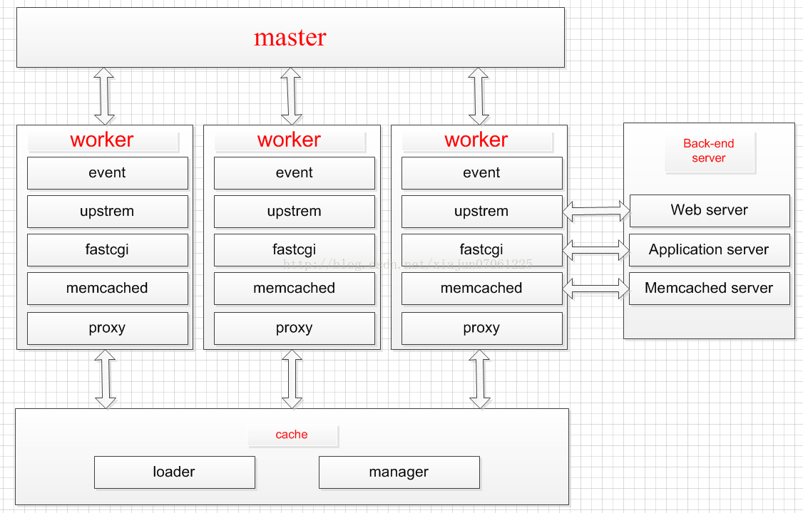

## 6.5 中间件-`Nginx`

>date: 2019-05-15


### 6.5.1 概述

`Nginx`是一个异步框架的`Web`服务器，也可以用作反向代理，负载平衡器和请求分发。

`Nginx`通过异步非阻塞的事件处理机制实现高并发。`Apache`每个请求独占一个线程，非常消耗系统资源。

事件驱动适合于`IO`密集型服务(`Nginx`)，多进程或线程适合于`CPU`密集型服务(`Apache`)，所以`Nginx`适合做反向代理，而非`Web`服务器使用。

* `I/O`模型

`Nginx`采用的`I/O`模型是`epoll`。每当`FD`就绪，就采用系统的回调函数将`FD`放入，效率更高，最大连接无限制。

* 进程模型

`Nginx`服务的运行一般存在`master process`（监控进程，也叫做主进程）和`woker process`（工作进程），还可能有`cache`相关进程。 



1. `master`进程

监控进程充当整个进程组与用户的交互接口，同时对进程进行监护。

它不需要处理网络事件，不负责业务的执行，只会通过管理`worker`进程来实现重启服务、平滑升级、更换日志文件、配置文件实时生效等功能。

`master`进程中`for(::)`无限循环内有一个关键的`sigsuspend()`函数调用，该函数调用使得`master`进程的大部分时间都处于挂起状态，直到`master`进程收到信号为止。

2. `worker`进程

基本的网络事件，是放在`worker`进程中来处理的，`worker`之间的进程是对等的，只可能在相同的`worker`中处理，一个`worker`进程不可能处理其他进程的请求。 

`worker`的个数，一般设置成与`CPU`的个数相同。

太多的`worker`数，只会导致进程相互竞争`CPU`资源，从而带来不必要的上下文切换

`master`进程会先建立好需要`listen`的`socket`，即`fork`生成子进程`workers`，子进程们继承了父进程`master`的所有属性，当然也包括已经建立好的`socket`，但`socket`并不是同一个，只是每个进程的`socket`会监控在同一个`ip`地址与端口。

* 惊群现象

多进程（多线程）在同时阻塞等待同一个事件的时候（休眠状态），如果等待的这个事件发生，那么他就会唤醒等待的所有进程（或者线程），但是最终却只可能有一个进程（线程）获得这个时间的控制权，对该事件进行处理，而其他进程（线程）获取控制权失败，只能重新进入休眠状态，从而造成性能的浪费。

一般来说，当一个连接进来后，所有在这个`socket`上面`accept`的进程，都会收到通知，而只有一个进程可以成果`accept`这个连接，其它的则`accept`失败。

`Nginx`采用`accept-mutex`来解决惊群问题：当一个请求到达的时候，只有竞争到锁的`worker`进程才会惊醒处理请求，其他进程会继续等待，结合`timer_solution`配置的最大的超时时间继续尝试获取`accept-mutex`。

### 6.5.2 静态资源`Web`服务

`Nginx`将网络路径(域名)和本地路径进行了映射，即当通过`url`路径访问静态资源时，`Nginx`根据映射地址找到资源文件位置，然后到这个特定的位置拿到静态资源，然后返回，响应给客户端。

基于上述，其对静态文件、索引文件的自动索引效率特别高，同时`Nginx`的`I/O`模型使其进行静态处理时候性能特别高。

```
server {
            listen       80;                                                         
            server_name  www.xxx.com; # 静态网站访问的域名地址                                            
            client_max_body_size 1024M;
            location / { # 直接静态项目的绝对路径的根目录
                root   /var/www/xxx_static;
                index  index.html;
            }
        }
```

### 6.5.3 代理服务

* 反向代理和正向代理

正向代理是代理客户端，为客户端收发请求，使真实客户端对服务器不可见；而反向代理是代理服务器端，为服务器收发请求，使真实服务器对客户端不可见。

### 6.5.4 缓存服务

### 6.5.5 负载均衡