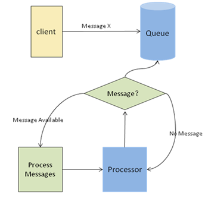
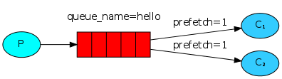

## 6.2 中间件-消息队列

>date: 2019-03-22


### 6.2.1 概述

* 消费者和生产者

生产者是创建消息的一方，这个消息包含了有效载荷(`payload`)和标签(`label`)两部分内容，其中有效载荷就是需要传输的数据，而标签是对有效载荷的描述。

消费者是订阅消息的一方，它只能得到消息的有效载荷，却并不能得到消息的标签，如果发送方的消息不存在于标签中，就要看生产者有无将发送方消息放入有效载荷中了。

* 消息队列

生产者和消费者之间进行通信需要建立一条信道(`channel`)，这个信道不同于`TCP`连接，它是一条认证的`TCP`连接，每次通讯就在这条`TCP`连接上创建信道，这就形成了消息队列。

如果生产者或消费者之间只进行`TCP`连接，对操作系统的`TCP`栈会产生大量的浪费，同时也会很容易达到性能瓶颈。

* 消息队列可解决的问题

传统的进程通信模式会出现因网络等情况发生客户端等待服务端响应，调用超时，耦合度过高而出现的各种问题。

基于消息队列进行进程间的通信，在消息传输过程中代理的消息的存储和转发，能保证消息的传递，对两个进程进行解耦，提供异步通信，生产者和消费者无需连接也能路由等。



* 消息队列特点

先进先出、发布和订阅、持久化、分布式

### 6.2.2 使用场景

1) 异步处理

非核心流程异步化，提高系统响应性能

2) 应用解耦

系统不是强耦合，消费者可以随意增加，而不需要修改生产者的代码。生产者的成功不依赖消费者；

不强依赖于非本系统的核心流程，对于非核心流程，可以放到消息队列中让消费者去按需消费，而不影响核心主流程。

3) 最终一致性

最终一致性不是消息队列的必备特性，但确实可以依靠消息队列来做最终一致性的事情；

先写消息再操作，确保操作完成后再修改消息状态。定时任务补偿机制实现消息可靠发送接收、业务操作的可靠执行，要注意消息重复与幂等设计；

所有不保证`100%`不丢消息的消息队列，理论上无法实现最终一致性。

4) 广播

生产者只需要关心消息是否送达了队列，至于谁进行订阅，是消费者的事情

5) 流量削峰与流控

当生产者能力大于消费者能力的时候，利用消息队列做一个通用的"漏斗"，在消费者有能力处理的时候，再进行分发。

6) 日志处理

将消息队列用在日志处理中，比如`Kafka`的应用，解决大量日志传输的问题。

7) 消息通讯

消息队列一般都内置了高效的通信机制，因此也可以用于单纯的消息通讯，比如即时通信。

### 6.2.3 消息模型

1) 点对点模型

点对点模型用于生产者和消费者之间点到点的通信。生产者将消息发送到某个名字标识的特定消费者。

特点：每个消息只有一个消费者、生产者和消费者没有时间依赖、由消费者来确认消息接收和处理成功

2) 发布订阅模型

发布订阅模型支持向一个特定的消费主题生产消息，多个消费者订阅这个消费主题。多个消费者可以获得消息，在发布者和订阅者之间存在时间依赖性。

发布者需要建立一个订阅，一共消费者订阅。订阅者必须保持持续的活动状态并接收消息。

特点：每个消息有多个订阅者、客户端只有订阅后才能接收消息、持久订阅和非持久订阅。

持久订阅：订阅关系建立后，消息就不会消失，不管订阅者是否都在线；

非持久订阅：订阅者为了接受消息，必须一直在线。 当只有一个订阅者时大致等于点对点模式。

### 6.2.4 `AMQP` 和 `RabbitMQ`

#### `AMQP`

`AMQP`(高级消息队列协议)能够像邮箱一样为存储消息，也能进行一对一的通信。但是不同于`IM`(即时通讯)和邮箱，`AMQP`能存储没有固定结构的消息，甚至能直接存储二进制数据，同时能对消息进行一对多的广播。

消息被发布者(`publisher`)发送到交换机，交换机(`exchange`)将收到的消息根据路由规则分发给绑定的队列，最后`AMQP`代理将消息投递给订阅这个队列的消费者，或由消费者按需获取。

发布到消息队列的消息包含两部分：消息体(`payload`)和标签(`label`)，消息体是实际负载，而标签是消息队列处理该消息的依据，如一个交换器的名称和一个路由键。


* 消息代理(`broker`)

`broker`是消息中间件的服务节点，可以看成是一个消息服务器。

发布者(`publisher`)发布消息时可以给消息指定各种消息属性(`message meta-data`)。有些属性有可能会被消息代理(`broker`)使用，然而其他的属性则是完全不透明的，它们只能被接收消息的应用所使用。

`AMQP`设计了一个消息确认(`message acknowledgements`)模块，当消息从队列里面投递给消费者后，消费者会通知一下消费代理(`broker`)是否收到消息。

消息在消费代理未收到消费者的确认回执(`acknowledgement`)时候，都不会完全从消息队列中删除。

如果一个消息没有被成功路由，消息会被返回发布者或者丢弃。

* 死信队列(`DLX, dead-letter-exchange`)

如果消息代理执行了延期操作，消息会被放入一个死信队列中，以供发布者去处理。

当消息在一个队列中变成死信后，能被重新发送到另一个交换器中，这个交换器就是`DLX`，绑定`DLX`的队列就是死信队列，声明队列时通过`x-dead-letter-exchange`参数为该队列添加`DLX`。

```python
# 声明死信交换机
channel.exchange_declare(exchange = 'dlx', type = 'direct')
# 声明死信队列
channel.queue_declare(queue = 'dlx',
                      arguments = {
                              'x-message-ttl': 5000, # 控制被 publish 到 queue 中的 message 被丢弃前能够存活的时间
                              'x-dead-letter-exchange': 'amq.direct', # 发送到指定的 exchange 上
                              'x-dead-letter-routing-key': 'task_queue'
                      })
```

也可以通过`Policy`设置。

```bash
rabbitmqctl set_policy DLX ".*" '{"dead-letter-exchange":"dlx"}' --apply-to queues
```

消息变成死信的情况：消息被拒，且设置`requeue`参数为`false`、消息过期、队列达到最大长度。

* 延迟队列

`DLX`可以用来分析异常，或者配合`TTL`实现延迟队列的功能。

```python
# 声明死信收容交换机
channel.exchange_declare(exchange = 'test.exchange', exchange_type = 'direct', durable = True)
# 声明死信收容队列
channel.queue_declare(queue = 'test.queue', durable = True)
# 收容死信队列和死信收容交换机绑定
channel.queue_bind(exchange = 'test.exchange', queue = 'test.queue')

# 声明队列
channel.exchange_declare(exchange = 'delay.test.exchange', exchange_type = 'direct', durable = True)
# 声明交换机
channel.queue_declare(queue = 'delay_test_queue', durable = True, arguments = {
        'x-message-ttl': 1000 * 10,  # 延迟时间 （毫秒）
        'x-dead-letter-exchange': exchange,  # 延迟结束后指向交换机（死信收容交换机）
        'x-dead-letter-routing-key': queue,  # 延迟结束后指向队列（死信收容队列）
    })
# 队列和交换机绑定
channel.queue_bind(exchange = 'delay.test.exchange', queue = 'delay_test_queue')
```

* 优化级队列

优化级高的消息具备优先被消费的特权。通过设置队列的`x-max-priority`参数实现，配置一个队列的最大优先级，然后在发送消息时，为每条消息指定当前的优先级`priority`。

* 绑定(`binding`)

交换机将消息路由给队列所需遵循的规则。

通过绑定(`binding`)将交换器与队列关联起来，在绑定时一般会指定绑定键(`routing key`)。队列，交换机和绑定统称为`AMQP`实体（`AMQP entities`）。

* 交换机(`exchange`)

交换机在声明的时候附带许多属性，较为常见的是：`Name`、`Durability` (消息代理重启后，交换机是否还存在)、`Auto-delete`(当所有与之绑定的消息队列都完成了对此交换机的使用后即删除)、`Arguments`

交换机可以有两个状态：**持久**(`durable`)、**暂存**(`transient`)。

持久化的交换机会在消息代理重启后依旧存在，而暂存的交换机则不会。

```bash
$ rabbitmqctl list_exchanges
Listing exchanges ...
logs      fanout
amq.direct      direct
amq.topic       topic
amq.fanout      fanout
amq.headers     headers
...done.
```

1) 直连交换机(`direct exchange`)

将一个队列绑定到某个交换机上，同时赋予该绑定一个路由键(`routing key`)；

当消息携带同样的路由键发送给交换机时，会将它路由给该队列。


直连交换机经常循环分发任务给消费者，所以消息的负载均衡发生在消费者上，而不是队列之间。

2) 扇型交换机(`funout exchange`)

将消息路由绑定到它身上的所有队列，不理会绑定的路由键。

将新进来的消息进行拷贝，并进行广播路由到所有绑定到它的队列。


3) 主题交换机(`topic exchanges`)

通过对消息的路由键和队列到交换机的绑定模式之间的匹配，将消息路由给一个或多个队列。即有针对性的分发到消费者。

4) 头交换机(`headers exchange`)

使用多个消息属性来代替路由键建立路由规则。通过判断消息头的值能否与指定的绑定相匹配来确立路由规则。

类似直连交换机，但是头交换机的路由规则建立在头属性上。

* 队列(`queue`)

队列常见的属性：`Name`、`Durable`(消息代理重启后，队列是否依旧存在)、`Exclusive`(只被一个连接`connection`使用，而且当连接关闭后队列即被删除)、`Auto-delete`(当最后一个消费者退订后即被删除)、`Arguments`

* 消息确认

自动确认模式(`automatic acknowledgement model`)：当消息代理(`broker`)将消息发送给应用后立即删除。

显式确认模式(`explicit acknowledgement model`)：发送一个确认回执(`acknowledgement`)后再删除消息。

* 持久化

消息队列的持久化包括：交换器持久化、队列持久化、消息持久化。

如果`exchange`和`queue`都是持久化的，那么它们之间的`binding`也是持久化的。如果`exchange`和`queue`两者之间有一个持久化，一个非持久化，就不允许建立绑定。

设置了队列和消息持久化，重启后，消息依旧存在；单单只设置队列持久化，重启后，消息会丢失；单单只设置消息持久化，重启后，队列消失，继而消息也丢失；所以，单单设置消息持久化而不设置队列持久化毫无意义。

```python
# 服务端（生产者
channel.exchange_declare(exchange = 'delay.test.exchange', exchange_type = 'direct', durable = True) # durable = True 交换机持久化

channel.queue_declare(queue = 'shuaigaogao', durable = True) # durable = True 队列持久化
channel.basic_publish(exchange='',
                      routing_key='test',
                      body=message,
                      properties=pika.BasicProperties(
                         delivery_mode = 2, # delivery_mode = 2 保证了消息是持久化的
                      ))
# 客户端（消费者）
# 服务端队列消息持久化了之后，需要在客户端声明队列的持久化
channel.exchange_declare(exchange = 'delay.test.exchange', exchange_type = 'direct', durable = True) # durable = True 交换机持久化

channel.queue_declare(queue='shuaigaogao', durable=True)
```

#### `RabbitMQ`

`RabbitMQ`是实现了高级消息队列协议(`AMQP`)的开源消息代理软件。

* 常用命令

```bash
$ rabbitmq-plugins enable rabbitmq_management # 启动监控管理器
$ rabbitmq-plugins disable rabbitmq_management # 关闭监控管理器
$ rabbitmq-service start # 启动RabbitMQ
$ rabbitmq-service stop # 关闭RabbitMQ
$ rabbitmqctl list_queues # 查看所有的队列
$ rabbitmqctl reset # 清除所有的队列
$ rabbitmqctl stop_app # 关闭应用
$ rabbitmqctl start_app # 启动应用

$ rabbitmqctl add_user username password # 添加用户
$ rabbitmqctl set_user_tags username administrator # 分配角色
$ rabbitmqctl add_vhost  vhost_name # 新增虚拟主机
$ rabbitmqctl set_permissions -p vhost_name username ".*" ".*" ".*" # 将新虚拟主机授权给新用户，后面三个”*”代表用户拥有配置、写、读全部权限
```

* 简单的消息发送

`Server`端(消费者)代码：

```python
>>> import pika
>>>
>>> credentials = pika.PlainCredentials('user', 'password') # 验证信息
>>>
>>> connection = pika.BlockingConnection(pika.ConnectionParameters(
...                                         host = 'localhost',
...                                         port = '5672',
...                                         virtual_host = '/',
...                                         credentials = credentials
...                                     )) # 建立连接
>>>
... channel = connection.channel() # 创建信道
>>>
>>> channel.queue_declare(queue='test') # 声明队列并创建
<METHOD(['channel_number=1', 'frame_type=1', "method=<Queue.DeclareOk(['consumer_count=0', 'message_count=1', 'queue=test'])>"])>
>>>
>>> def callback(ch, method, properties, body): # 定义回调函数，即获取消息，进行对应的消费操作
...     print(" [x] Received %r" % body)
...
>>> channel.basic_consume(callback,
...                       queue='test',
...                       no_ack=True) # 进行对应的消费操作
'ctag1.34e2a3916198456b9220b6ea5ba0367a'
>>>
>>> print(' [*] Waiting for messages. To exit press CTRL+C')
 [*] Waiting for messages. To exit press CTRL+C
>>> channel.start_consuming() # 信道开始阻塞
 [x] Received b'My test.'

```

`Client`端(生产者)代码：

```python
>>> import pika
>>>
>>> credentials = pika.PlainCredentials('user', 'password')
>>>
>>> connection = pika.BlockingConnection(pika.ConnectionParameters(
...                                         host = 'localhost',
...                                         port = '5672',
...                                         virtual_host = '/',
...                                         credentials = credentials
...                                     ))
>>>
... channel = connection.channel()
>>>
>>> channel.queue_declare(queue='test')
<METHOD(['channel_number=1', 'frame_type=1', "method=<Queue.DeclareOk(['consumer_count=0', 'message_count=0', 'queue=test'])>"])>
>>>
>>> channel.basic_publish(exchange='',
...                       routing_key='test',
...                       body='My test.') # 发布消息
True
>>>
>>> print(" [x] Sent 'My test.'")
 [x] Sent 'My test.'
>>> connection.close() # 关闭连接
```

* 工作队列


`Server`端(消费者)代码：

这里可以运行多个消费者代码以达到队列里的任务共享。

默认情况下，多个消费者可以订阅同一个队列，这时消息会平均分摊，**轮询**(`round-robin`)给多个消费者，这样一个消费者不会得到全部消息。RabbitMQ不支持队列层面的广播消费。

```python
import pika
import time

credentials = pika.PlainCredentials('user', '123456')

connection = pika.BlockingConnection(pika.ConnectionParameters(
                                        host = 'localhost',
                                        port = '5672',
                                        virtual_host = '/',
                                        credentials = credentials
                                    ))
channel = connection.channel()

# RabbitMQ不允许你使用不同的参数重新定义一个队列
# durable=True将队列声明为持久化，保证队列在退出或崩溃时候不会消失
channel.queue_declare(queue='test', durable=True) 
print(' [*] Waiting for messages. To exit press CTRL+C')

def callback(ch, method, properties, body):
    print(" [x] Received %r" % (body,))
    time.sleep(1)
    print(" [x] Done")
    ch.basic_ack(delivery_tag = method.delivery_tag)

channel.basic_qos(prefetch_count=1) # prefetch_count=1 保证了在同一时刻，不发送超过1条消息给消费者，知道它已经处理了上一条消息并作出了响应
channel.basic_consume(callback,
                      queue='test',
                      no_ack=False) # 这里将自动确认关闭了，需要做显示的消息确认

channel.start_consuming()
```

`Client`端(生产者)代码：

```python
import pika
import sys

credentials = pika.PlainCredentials('user', '123456')

connection = pika.BlockingConnection(pika.ConnectionParameters(
                                        host = 'localhost',
                                        port = '5672',
                                        virtual_host = '/',
                                        credentials = credentials
                                    ))
channel = connection.channel()

channel.queue_declare(queue='test', durable=True)

message = ' '.join(sys.argv[1:]) or "Hello World!"
channel.basic_publish(exchange='',
                      routing_key='test',
                      body=message,
                      properties=pika.BasicProperties(
                         delivery_mode = 2,
                      )) # delivery_mode=2保证了消息也是持久化的

print(" [x] Sent %r" % (message,))
connection.close()
```

* 发布与订阅


`Server`端(消费者)代码：

```python
import pika
import time

credentials = pika.PlainCredentials('user', '123456')

connection = pika.BlockingConnection(pika.ConnectionParameters(
                                        host = 'localhost',
                                        port = '5672',
                                        virtual_host = '/',
                                        credentials = credentials
                                    ))
channel = connection.channel()

channel.exchange_declare(exchange='logs', # exchange=''时，指匿名交换机
                         exchange_type='fanout') # exchange_type='fanout'指定使用扇形交换机

result = channel.queue_declare(exclusive=True) # 不给名字参数和使用exclusive=True能是队列与消费者断开连接时候立即删除队列
queue_name = result.method.queue

channel.queue_bind(exchange='logs',
                   queue=queue_name) # 声明绑定，绑定连接交换机和队列

print(' [*] Waiting for logs. To exit press CTRL+C')

def callback(ch, method, properties, body):
    print(" [x] %r" % (body,))

channel.basic_consume(callback,
                      queue=queue_name,
                      no_ack=True)

channel.start_consuming()
```

`Client`端(生产者)代码：

生产者生成的消息，全部订阅了同一交换机的消费者都能收到消息

```python
import pika
import sys

credentials = pika.PlainCredentials('user', '123456')

connection = pika.BlockingConnection(pika.ConnectionParameters(
                                        host = 'localhost',
                                        port = '5672',
                                        virtual_host = '/',
                                        credentials = credentials
                                    ))
channel = connection.channel()

channel.exchange_declare(exchange='logs',
                         exchange_type='fanout') # 通过交换机名称进行订阅

message = ' '.join(sys.argv[1:]) or "info: Hello World!"
channel.basic_publish(exchange='logs',
                      routing_key='',
                      body=message)
print(" [x] Sent %r" % (message,))
connection.close()
```

* 路由


`Server`端(消费者)代码：

```python
import pika
import sys

credentials = pika.PlainCredentials('user', '123456')

connection = pika.BlockingConnection(pika.ConnectionParameters(
                                        host = 'localhost',
                                        port = '5672',
                                        virtual_host = '/',
                                        credentials = credentials
                                    ))
channel = connection.channel()

channel.exchange_declare(exchange='direct_logs',
                         exchange_type='direct')

result = channel.queue_declare(exclusive=True)
queue_name = result.method.queue

severities = sys.argv[1:]
if not severities: # 选择需要接收的类型
    print("Usage: %s [info] [warning] [error]" % (sys.argv[0],), file=sys.stderr)
    sys.exit(1)

for severity in severities:
    channel.queue_bind(exchange='direct_logs',
                       queue=queue_name,
                       routing_key=severity) # routing_key=severity 指定绑定键，即路由键

print(' [*] Waiting for logs. To exit press CTRL+C')

def callback(ch, method, properties, body):
    print(" [x] %r:%r" % (method.routing_key, body,))

channel.basic_consume(callback,
                      queue=queue_name,
                      no_ack=True)

channel.start_consuming()
```

`Client`端(生产者)代码：

```python
import pika
import sys

credentials = pika.PlainCredentials('user', '123456')

connection = pika.BlockingConnection(pika.ConnectionParameters(
                                        host = 'localhost',
                                        port = '5672',
                                        virtual_host = '/',
                                        credentials = credentials
                                    ))
channel = connection.channel()

channel.exchange_declare(exchange='direct_logs',
                         exchange_type='direct')

severity = sys.argv[1] if len(sys.argv) > 1 else 'info'
message = ' '.join(sys.argv[2:]) or 'Hello World!'
channel.basic_publish(exchange='direct_logs',
                      routing_key=severity,
                      body=message)
print(" [x] Sent %r:%r" % (severity, message))
connection.close()
```

* 主题交换机

当一个队列的绑定键为`#`的时候，这个队列将会无视消息的路由键，接收所有的消息。

当一个队列的绑定键为`<word>.*`的时候，这个队列将会接收路由键为`<word>.<word>`的消息。


`Server`端(消费者)代码：

```python
import pika
import sys

credentials = pika.PlainCredentials('user', '123456')

connection = pika.BlockingConnection(pika.ConnectionParameters(
                                        host = 'localhost',
                                        port = '5672',
                                        virtual_host = '/',
                                        credentials = credentials
                                    ))
channel = connection.channel()

channel.exchange_declare(exchange='topic_logs',
                         exchange_type='topic')

result = channel.queue_declare(exclusive=True)
queue_name = result.method.queue

binding_keys = sys.argv[1:]
if not binding_keys:
    print("Usage: %s [binding_key]..." % (sys.argv[0],), file=sys.stderr)
    sys.exit(1)

for binding_key in binding_keys:
    channel.queue_bind(exchange='topic_logs',
                       queue=queue_name,
                       routing_key=binding_key)

print(' [*] Waiting for logs. To exit press CTRL+C')

def callback(ch, method, properties, body):
    print(" [x] %r:%r" % (method.routing_key, body,))

channel.basic_consume(callback,
                      queue=queue_name,
                      no_ack=True)

channel.start_consuming()
```

`Client`端(生产者)代码：

```python
import pika
import sys

credentials = pika.PlainCredentials('user', '123456')

connection = pika.BlockingConnection(pika.ConnectionParameters(
                                        host = 'localhost',
                                        port = '5672',
                                        virtual_host = '/',
                                        credentials = credentials
                                    ))
channel = connection.channel()

channel.exchange_declare(exchange='topic_logs',
                         exchange_type='topic')

routing_key = sys.argv[1] if len(sys.argv) > 1 else 'anonymous.info'
message = ' '.join(sys.argv[2:]) or 'Hello World!'
channel.basic_publish(exchange='topic_logs',
                      routing_key=routing_key,
                      body=message)
print(" [x] Sent %r:%r" % (routing_key, message))
connection.close()
```

* 远程方法调用

实现远程方法调用需要将服务端回复的消息加入到一个回调队列中，即客户端在发送请求消息时，同时发送一个回调队列的地址。

`correlation_id`是保证辨识响应属于哪个客户端的一个独一无二的值，通过这个来关联客户端。


`Server`端(消费者)代码：

```python
import pika

credentials = pika.PlainCredentials('user', '123456')

connection = pika.BlockingConnection(pika.ConnectionParameters(
                                        host = 'localhost',
                                        port = '5672',
                                        virtual_host = '/',
                                        credentials = credentials
                                    ))
channel = connection.channel()

channel.queue_declare(queue='rpc_queue')

def fib(n):
    if n == 0:
        return 0
    elif n == 1:
        return 1
    else:
        return fib(n-1) + fib(n-2)

def on_request(ch, method, props, body):
    n = int(body)

    print(" [.] fib(%s)"  % (n,))
    response = fib(n)

    ch.basic_publish(exchange='',
                     routing_key=props.reply_to,
                     properties=pika.BasicProperties(
                             correlation_id = props.correlation_id),
                     body=str(response))
    ch.basic_ack(delivery_tag = method.delivery_tag)

channel.basic_qos(prefetch_count=1)
channel.basic_consume(on_request, queue='rpc_queue')

print(" [x] Awaiting RPC requests")
channel.start_consuming()
```

`Client`端(生产者)代码：

```python
import pika
import uuid

class FibonacciRpcClient(object):
    def __init__(self, user, pwd, host, port, vhost):
        self.credentials = pika.PlainCredentials(user, pwd)

        self.connection = pika.BlockingConnection(pika.ConnectionParameters(
                                        host = host,
                                        port = port,
                                        virtual_host = vhost,
                                        credentials = self.credentials
                                    ))

        self.channel = self.connection.channel()

        result = self.channel.queue_declare(exclusive=True)
        self.callback_queue = result.method.queue # 声明一个回调队列

        self.channel.basic_consume(self.on_response, no_ack=True,
                                   queue=self.callback_queue)

    def on_response(self, ch, method, props, body):
        if self.corr_id == props.correlation_id:
            self.response = body

    def call(self, n):
        self.response = None
        self.corr_id = str(uuid.uuid4())
        self.channel.basic_publish(exchange='',
                                   routing_key='rpc_queue',
                                   properties=pika.BasicProperties(
                                         reply_to = self.callback_queue, # 回复的目标队列，即回调队列
                                         correlation_id = self.corr_id, # 关联标识
                                         ),
                                   body=str(n))
        while self.response is None:
            self.connection.process_data_events()
        return int(self.response)

user = 'user'
pwd = 'password'
host = 'localhost'
port = '5672'
vhost = '/'
fibonacci_rpc = FibonacciRpcClient(user, pwd, host, port, vhost)

print(" [x] Requesting fib(30)")
response = fibonacci_rpc.call(30)
print(" [.] Got %r" % (response,))
```

* 消息公平分发

不考虑消费者负载的话，如果`RabbitMQ`会按顺序把消息发到各个消费者身上，这样很可能出现消费者消息堆积了的情况。所以可以在各个消费者端，配置`perfetch=1`，即消费者在当前消息还没处理完的时候就不能接收新消息。



```python
channel.basic_qos(prefetch_count=1)
```

#### `RabbitMQ`高阶

* 存储机制

持久化的消息到达时候就会写入磁盘。如果可以，内存中也会保存一份，以提升一定的性能。

非持久化的消息到达时保存在内存中，当内存吃紧时，会换入磁盘。

如果消息投递的目的队列为空，且有消费者订阅这个队列，消息会直接发送给消费者，不经过队列。

队列具有`default`和`lazy`两种模式，通过`x-queue-mode`或者`policy`可以设置队列模式，`policy`具有更高的优先级。

`lazy`模式的队列（惰性队列）会将收到的消息直接存入文件系统，不管是持久化还是非持久化，可以减少内存的消耗，但是增加`I/O`。

`default`模式的队列（普通队列）发送一千万条数据，耗时比`lazy`模式的队列多了将近一倍，原因在于普通队列会因为内存不足而发生换页的动作。

单台`RabbitMQ`服务器可以满足每秒`1000`条的消息吞吐量。即使将消息、队列、交换器等都设置为可持久化，生产端和消费端都正确地使用了确认方式，`RabbitMQ`集群也不能保证消息的万无一失。

集群中所有节点都会备份所有的元数据信息，包括：队列、交换器、绑定关系、vhost元数据，但不会备份消息。

* 内存、磁盘告警

当内存使用超过阈值或者磁盘空间低于阈值时候，消息队列会暂时阻塞客户端连接，并停止接收新的消息，同时客户端与服务端的心跳检测也会失效。

集群中，如果一个`Broker`节点内存或磁盘受限，会引起整个集群中的所有连接被阻塞。

* 流量控制

`RabbitMQ`主要有以下三种流量控制方法：

1. `Per-Connection Flow Control`

面向每一个连接做的流量控制。即`RabbitMQ`会主动阻塞那些发布消息太快的连接，无需做任何配置。如果连接被阻塞了，那么它在 `rabbitmqctl` 控制台上会显示一个 `blocked` 的状态。`RabbitMQ` 的流量控制机制是基于信用证(`Credit`)的拥塞控制机制。

2. `Memory-Based Flow Control`

`RabbitMQ` 会在启动时检测机器的物理内存数值。默认当消息队列占用 `40%` 以上内存时，消息队列会主动抛出一个内存警告并阻塞所有连接。可以通过修改 `rabbitmq.config` 文件来调整内存阈值，默认值是 `0.4`。

3. `Disk-Based Flow Control`

默认情况，如果剩余磁盘空间在 `1GB` 以下，`RabbitMQ` 主动阻塞所有的生产者。该阈值可调节。

### 6.2.5 `Kafka`
