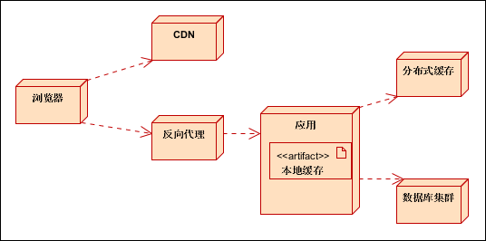
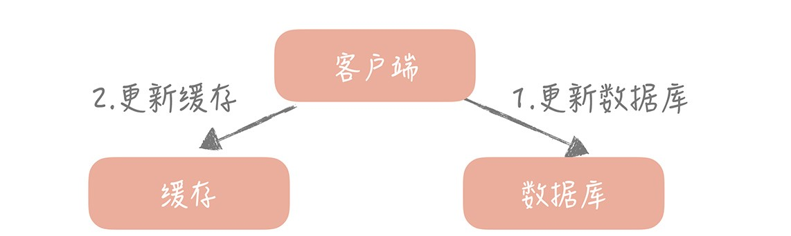
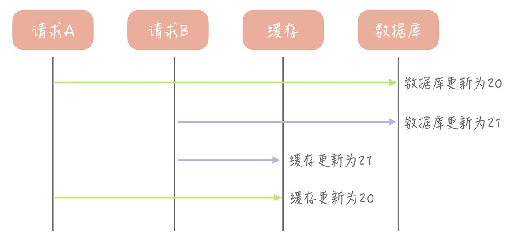
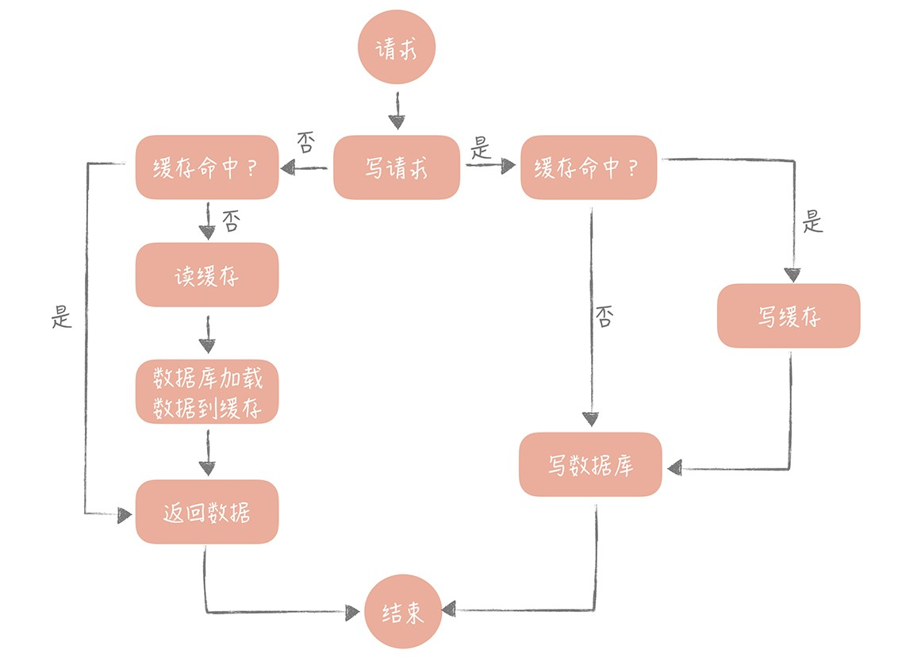
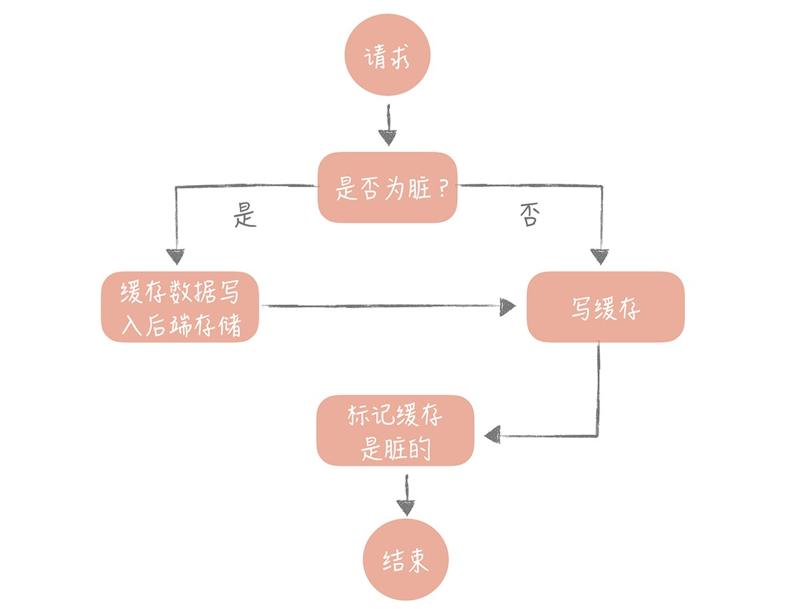
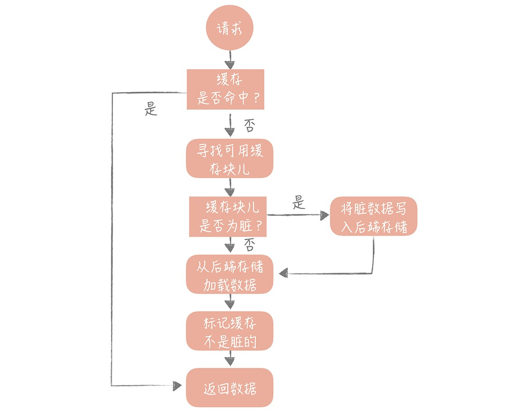
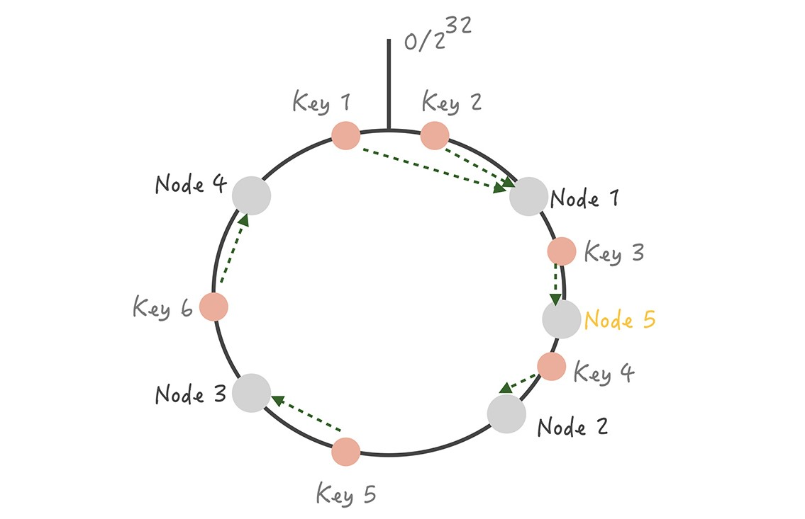
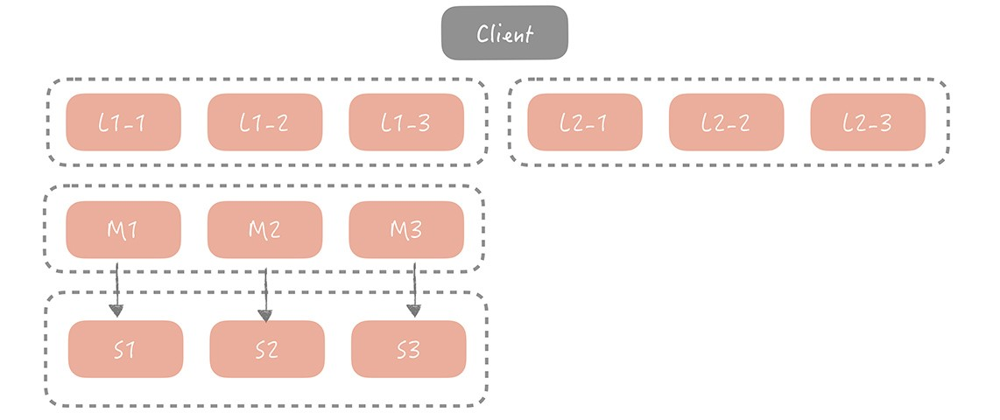
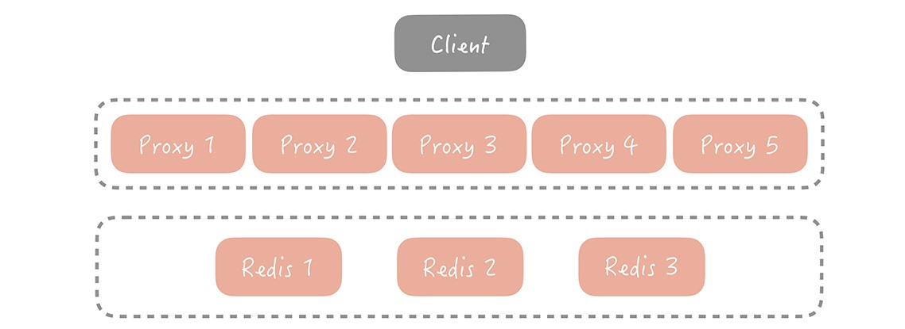
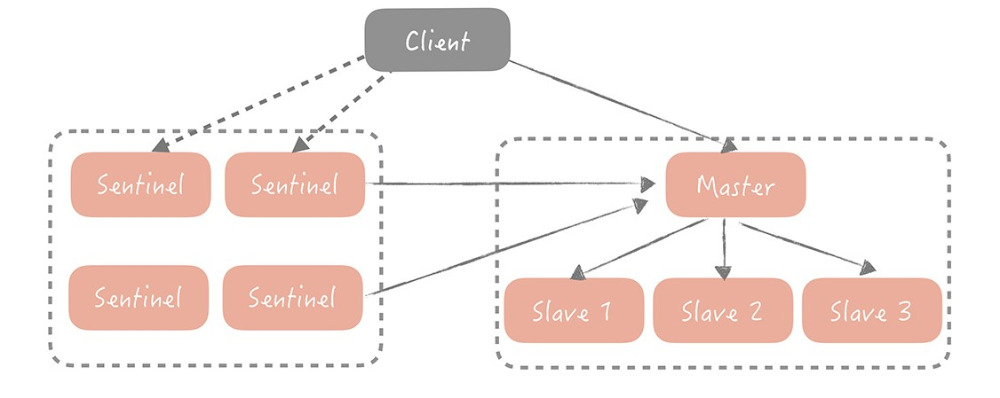

6.3 中间件-缓存

>date: 2019-05-12

### 6.3.1 概述

在高并发的分布式的系统中，缓存是必不可少的一部分。没有缓存对系统的加速和阻挡大量的请求直接落到系统的底层，系统是很难撑住高并发的冲击，所以分布式系统中缓存的设计是很重要的一环。

#### 原理

分布式缓存的出现主要是为了帮助高并发访问时，加快系统数据的读写，相较于传统的数据存储层（例如`MySQL`），缓存一般是缓存在内存中的，其性能比传统的数据库存储更好，响应速度更快，能更好地提升用户体验。

同时缓存也能缓存一些复杂耗时的计算结果，降低后端系统对`CPU`、`I/O`、线程等资源的需求，让系统运行在一个相对资源健康的环境。

但是适用分布式缓存随之而来会出现一些问题，诸如数据一致性问题、代码维护、运维成本等等。

#### 设计

设计缓存的时候，需要思考这些问题：

1. 缓存什么内容：缓存热点数据、静态资源等等

2. 缓存放在什么位置：`CDN`、反向代理、分布式缓存服务、本机

3. 如何缓存：如何设计缓存过期策略、设计缓存同步机制等等

### 6.3.2 缓存的应用

#### `CDN`缓存(`Content Delivery Network` 内容分发网络)

主要缓存静态资源，例如图片，视频。

广泛采用各种缓存服务器，将这些缓存服务器分布到用户访问相对集中的地区或网络中。

#### 反向代理缓存

反向代理是指在网站服务器机房部署代理服务器，实现负载均衡，数据缓存，安全控制等功能。

反向代理位于应用服务器机房，处理所有对`Web`服务器的请求。反向代理一般缓存静态资源，动态资源转发到应用服务器处理。

如果用户请求的页面在代理服务器上有缓冲的话，代理服务器直接将缓冲内容发送给用户。

如果没有缓冲则先向`Web`服务器发出请求，取回数据，本地缓存后再发送给用户。通过降低向`Web`服务器的请求数，从而降低了`Web`服务器的负载。

常用的缓存应用服务器有`Varnish`，`Ngnix`，`Squid`。

#### 分布式缓存

主要指缓存用户经常访问数据的缓存，数据源为数据库。一般起到热点数据访问和减轻数据库压力的作用。

常用的中间件有`Memcache`，`Redis`。

* `Memcache`

高性能、分布式内存类型的对象缓存系统。在内存中维护一个统一的巨大的`Hash`表，能够存储图像、视频、文件、数据库检索结果等数据。

特性：

1. 使用物理内存作为缓存区，可独立运行在服务器上。每个进程最大2G，如果想缓存更多的数据，可以开辟更多的`Memcache`进程（不同端口）或者使用分布式`Memcache`进行缓存，将数据缓存到不同的物理机或者虚拟机上。

2. 使用`key-value`的方式来存储数据，这是一种单索引的结构化数据组织形式，可使数据项查询时间复杂度为`O(1)`。

3. 协议简单：基于文本行的协议，直接通过`telnet`在`Memcache`服务器上可进行存取数据操作，简单，方便多种缓存参考此协议。

4. 基于`libevent`高性能通信：`Libevent`是一套利用C开发的程序库，它将`BSD`系统的`kqueue`，`Linux`系统的`epoll`等事件处理功能封装成一个接口，与传统的`select`相比，提高了性能。

5. 内置的内存管理方式：所有数据都保存在内存中，存取数据比硬盘快，当内存满后，通过LRU算法自动删除不使用的缓存，但没有考虑数据的容灾问题，重启服务，所有数据会丢失。

6. 分布式：各个`Memcache`服务器之间互不通信，各自独立存取数据，不共享任何信息。服务器并不具有分布式功能，分布式部署取决于`Memcache`客户端。当向`Memcache`集群存入（取出）`key-value`时，`Memcache`客户端程序根据一定的算法选择存入哪台服务器，然后再把`key-value`值存到此服务器中。

- 1) 余数算法

先求得键的整数散列值，再除以服务器台数，根据余数确定存取服务器。

优点：计算简单，高效；

缺点：在`Memcache`服务器增加或减少时，几乎所有的缓存都会失效。

- 2) 散列算法（一致性`Hash`）：

先算出`Memcache`服务器的散列值，并将其分布到`0~2^(32)`的圆上；

然后用同样的方法算出存储数据的键的散列值并映射至圆上；

最后从数据映射到的位置开始顺时针查找，将数据保存到查找到的第一个服务器上。

如果超过`0~2^(32)`，依然找不到服务器，就将数据保存到第一台`Memcache`服务器上。

如果添加了一台`Memcache`服务器，只在圆上增加服务器的逆时针方向的第一台服务器上的键会受到影响。

一致性`Hash`算法：解决了余数算法增加节点命中大幅额度降低的问题，理论上，插入一个实体节点，平均会影响到：`虚拟节点数/2` 的节点数据的命中。

7. 缓存策略：`Memcache`的缓存策略是`LRU`（最近最少使用）到期失效策略。在`Memcache`内存储数据项时，可以指定它在缓存的失效时间，默认为永久。当`Memcache`服务器用完分配的内存时，失效的数据被首先替换，然后是最近未使用的数据。

在`LRU`中，`Memcache`使用的是一种`Lazy Expiration`策略，自己不会监控存入的`key/vlue`对是否过期，而是在获取`key`值时查看记录的时间戳，检查`key/value`对空间是否过期，这样可减轻服务器的负载。

* `Redis`

常用数据类型

1. `String`

应用场景：与`Memcache`的`key-value`存储方式类似。

2. `Hash`

应用场景：以存储一个用户信息对象数据为例，用户`ID`为`key`，用户的相关属性为`field`，属性对应的值为`value`。

`Hash`有`2`种不同实现：

- 1) `Hash`的成员比较少时，`Redis`为了节省内存会采用类似一维数组的方式来紧凑存储，而不会采用真正的`HashMap`结构，对应的基础结构为`Zipmap`；

- 2) 当成员数量增大时会自动转成真正的`HashMap`，对应的基础结构为`Hash`。

3. `List`

应用场景：列表数据等都可以用`List`结构来实现。

其实现为一个双向链表，可以支持反向查找和遍历，方便操作。不过带来了部分额外的内存开销，`Redis`内部的很多实现，包括发送缓冲队列等也都是用的这个数据结构。

4. `Set`

应用场景：类似列表，但其内部能自动进行去重的操作，只保留唯一值。

`Set`的内部实现是一个`value`永远为`null`的`HashMap`，实际就是通过计算`Hash`的方式来快速排重的，这也是`Set`能提供判断一个成员是否在集合内的原因。

5. `Sorted Set`

应用场景：与`Set`类似，而`Sorted Set`可以通过用户额外提供一个优先级(`score`)的参数来为成员排序，并且是插入有序的，即自动排序。

其内部使用`HashMap`和跳跃表(`SkipList`)来保证数据的存储和有序，`HashMap`里放的是成员到`score`的映射，而跳跃表里存放的 是所有的成员，排序依据是`HashMap`里存的`score`，使用跳跃表的结构可以获得比较高的查找效率，并且在实现上比较简单。

* `Memcache`与`Redis`的比较

1. 数据结构：`Memcache`只支持`key-value`存储方式，`Redis`支持更多的数据类型，比如`key-value`，`Hash`，`List`，`Set`，`Zset`；

2. 多线程：`Memcache`支持多线程，`Redis`支持单线程；`CPU`利用方面`Memcache`优于`Redis`；

3. 持久化：`Memcache`不支持持久化，`Redis`支持持久化；

4. 内存利用率：`Memcache`高，`redis`低（采用压缩的情况下比`Memcache`高）；

5. 过期策略：`Memcache`过期后，不删除缓存，会导致下次取数据数据的问题，`Redis`有专门线程，清除缓存数据；

#### 本地缓存

本地缓存是指应用内部的缓存，标准的分布式系统，一般有多级缓存构成。本地缓存是离应用最近的缓存，一般可以将数据缓存到硬盘或内存。

### 6.3.3 缓存架构

职责划分：

1. `CDN`：存放`HTML`，`CSS`，`JS`等静态资源；

2. 反向代理：动静分离，只缓存用户请求的静态资源；

3. 分布式缓存：缓存数据库中的热点数据；

4. 本地缓存：缓存应用字典等常用数据。

### 6.3.4 缓存的读写策略

1. `Cache Aside`（旁路缓存）策略

   **更新思路**：先更新数据库记录，后更新缓存数据。

   

   **出现问题**：并发情况下造成缓存与数据库中数据不一致。

   例如：请求`A`将数据库中`ID`为`1`的用户年龄从`19`变更为`20`，与此同时，请求`B`更新`ID`为`1`的用户数据，将数据库记录的年龄变更为`21`，然后变更缓存中的年龄为`21`。在这之后，请求`A`开始更新缓存中的用户`1`的年龄为`20`，此时造成了数据库和缓存中的数据不一致。

   

   **产生原因**：缓存更新和数据库更新是两个独立的操作，并没有很好的并发控制的情况下，两个线程并发进行更新时，会因为写入顺序的不同而造成数据不一致。同时直接更新缓存还会存在缓存失败的情况，也会出现同一的数据不一致问题。

   **解决思路**：在写入数据时候不更新缓存，而是删除缓存中的数据；读取数据时，若缓存中不存在数据，则从数据库中读取并更新到缓存中。这种策略就是`Cache Aside`策略。

   在写入数据时候，如果先删除缓存，再更新数据库，同样会可能出现数据不一致问题。

   **策略缺点**：在写入较频繁的时候，缓存中的数据会被频繁清理掉，可能会对缓存命中率有一定的影响。

2. `Read/Write Through`（读穿/写穿）策略

   **解决思路**：只与缓存交互，由缓存与数据库通信，读写数据。
   
   * 写入策略：先查询需要写入的数据在缓存中是否已经存在，如果已经存在，则更新缓存汇总的数据，并由缓存组件同步更新到数据库中；缓存中的数据不存在的情况称为`Write Miss`，一般使用两种方式进行处理：
   a. `Write Allocate`：写入缓存中的相应位置中，由缓存组件同步更新到数据库中；
   b. `No-write Allocate`：不写入缓存中，直接更新数据库。一般采用该方式，因为相较于上者，减少了一次缓存的写入，提高写入性能。
   
   * 读取策略：先查询缓存中数据是否存在，如果存在则直接返回，如果不存在，则由缓存组件负载从数据库中同步加载数据。

   
   
   **策略缺点**：分布式的缓存组件，例如`Memcached`、`Redis`不提供写入数据库或自动加载数据库中数据的功能。同时写入数据库的方式是同步的，对性能有较大的影响。

3. `Write Back`（写回）策略

   **解决思路**：
   
   * 写入策略：写入数据时只写入缓存，并标记为“脏”，当标记的缓存被再次使用时，才将数据写入后端存储中。

   

   * 读取策略：如果发现缓存命中，则直接返回缓存数据；如果缓存不命中则寻找一块可用的缓存块，如果缓存块为“脏”，则将脏块中之前的数据写入后端存储中，并从后端存储加载数据到缓存块中；如果不为“脏”，则由缓存组件将后端存储中的数据加载到缓存中，最后将缓存设置为非“脏”，返回数据。

   

   **策略缺点**：缓存长使用内存，非持久化保存，机器断电会导致数据丢失。这时候可以在内存中先暂存一段时间，然后定时刷新到低速设备上。

### 6.3.5 缓存高可用

在存在缓存层的系统中，需要关注缓存命中率这个指标（`缓存命中率 = 命中的请求数 / 总请求数`），一般的系统核心的缓存命中率需要维持在`99%`甚至是`99.99%`，如果命中率下降一点，都会对系统带来致命的打击。

假设系统的`QPS = 10000/s`，每一次的调用会访问`10`次缓存或者数据库中的数据。当缓存命中率仅仅减少`1%`时候，数据库每秒就会增加`10000 * 10 * 1% = 1000`次请求，而当个的`MySQL`节点的读请求量峰值为`1500/s`，这`1000`次请求对数据库就造成了极大的冲击。

**常见的分布式缓存高可用方案**：

- **客户端方案**：

  即客户端配置多个缓存的节点，通过缓存写入和读取算法策略来实现分布式，从而提高缓存的可用性。

  写入数据时：将被写入缓存的数据分散到多个节点中，进行数据分片；

  读取数据时：利用多组的缓存进行容错，提高系统的可用性。一般采用主从或者多副本策略进行。

  1) 数据分片

  ​	单个的缓存节点受到本身的性能所限，不能承担较高的并发，所以考虑将数据进行分片，使用分片算法将数据打散到不同的节点上。同时当某个节点故障的情况下，其它节点还能继续提供服务，保证一定的可用性。

  ​	常见的分片算法是**Hash分片算法**和**一致性Hash分片算法**。

  ​	**Hash分片算法**：即对缓存的`key`进行`Hash`计算，然后对总的缓存节点个数取余，得到的结果即需存取的节点位置。

  ​	这个算法简单易懂，但其缺点也十分明显，即缓存的总节点数量的变化，会导致缓存失效不可用，造成缓存命中率下降。针对这个问题常见的解决措施是增加多一层缓存。

  ​	**一致性Hash分片算法**：即将整个`Hash`空间组织成一个虚拟的圆环，将缓存节点的编号进行`Hash`取值后，放置在这个圆环上，当需要确定某一个`key`存取的节点时候，先对这个`key`进行同样的`Hash`取值，**确定在环上的位置**，然后按照顺时针方向在环上遍历，遇到的第一个节点即需要缓存的节点。

  ​	

  	>如上图所示：
  	>
  	>1) 每个节点在环上的位置确定了，使用`hash`算法对需缓存的`key`进行计算，确定了在环上的位置，然后顺时针遍历到的第一个节点即需缓存的节点。即图上`key1, key2`缓存在`Node1`节点上，其它以此类推。
  	>
  	>2) 当缓存节点增加时，只对当前需缓存的`key`有影响。即图上在`Node1`和`Node2`之间增加新的节点`Node5`，之前需要命中到节点`Node2`的`key3`现在命中到`Node5`，对其它的`key`无影响。
  	>
  	>3) 同理，当缓存节点减少时，影响的也只有`key5`。
  	>
  	>在缓存节点增加或者删除时，只会有少量的`key`命中到其它的节点上， 对大部分的`key`的命中无较大影响，从而保证命中率不会大幅下降。

  ​	这个算法在面对因节点总数量变化时候，命中率下降的问题，提供了很好的解决思路。

  ​	但是缓存节点在环上的分布不均匀，会造成部分缓存节点的压力较大，当某个缓存节点故障时，会给后续的节点造成压力。假设存在`A -> B -> C`三个节点，如果`A, B`节点都故障了，会造成整体缓存系统的雪崩。

  ​	这时候，就需要使用**虚拟节点**的方式了，即当一个节点故障或退出时候，将数据接收到虚拟节点上，虚拟节点通过一定的方式将数据**平均**到其它正常的节点上，防止雪崩的发生。

  ​	还有一个问题就是，会有**脏数据**的问题产生。

   

  >  如上图所示：
  >
  > 1) 节点`A`因网络等原因故障，接收到`A`上的数据`key = 3`发生更新`key = 4`并缓存到正常节点`B`上。
  >
  > 2) 节点`A`经过一段时间恢复正常，此时从节点`A`上读取的值还是`key = 3`，产生了数据的脏读。
  >
  > 为了解决这个问题，常见的方式是对缓存数据进行过期时间的设置，能减少脏数据的概率。

  2) 主从机制

  ​	为每一组 `Master` 配置一组 `Slave`，更新数据时主从同步更新。读取时，优先从 `Slave` 中读数据，如果读取不到数据就穿透到 `Master` 读取，并且将数据回写到 `Slave` 中以保持 `Slave` 数据的热度。

  主从机制最大的优点就是当某一个 `Slave` 宕机时，还会有 `Master` 作为兜底，不会有大量请求穿透到数据库的情况发生，提升了缓存系统的高可用性。
  
  3) 多副本

  ​	主从方式已经能够解决大部分场景的问题，但是对于极端流量的场景下，一组 `Slave` 通常来说并不能完全承担所有流量，`Slave` 网卡带宽可能成为瓶颈。
  
  ​	为了解决这个问题，在 `Master/Slave` 之前增加一层副本层，即：
  
  

​		当客户端发起查询请求时，请求首先会先从多个副本组中选取一个副本组发起查询，如果查询失败，就继续查询 `Master/Slave`，并且将查询的结果回写到所有副本组中，避免副本组中脏数据的存在。

- **中间代理层方案**：

  是在应用代码和缓存节点之间增加代理层，客户端所有的写入和读取的请求都通过代理层，而代理层中会内置高可用策略，帮助提升缓存系统的高可用。

  

- **服务端方案**：

  就是 `Redis 2.4` 版本后提出的 `Redis Sentinel` 方案。即主节点故障以后自动将从节点提升为主节点，保证整体集群的可用性。
  
  
  
  `Sentinel` 节点在架构上和主从是平级的，是作为管理者存在的 。每一个 `Sentinel `节点都是无状态的，为了避免 `Sentinel` 节点挂掉造成无法自动故障恢复的问题，`Redis Sentinel` 是集群部署的。

### 6.3.6 缓存雪崩

缓存失效导致系统性能急剧下降的情况；如高并发业务下并发访问存储系统，更新缓存造成的系统崩溃。

解决方案：对缓存更新操作进行加锁保护，保证只有一个线程在进行缓存更新；后台线程（非业务线程）进行缓存更新，后台线程定时进行，或者业务线程缓存失败后通知后台线程进行缓存更新。

### 6.3.7 缓存穿透

缓存一般是 `Key-Value` 方式存在，当某一个 `Key` 不存在时会查询数据库，假如这个 `Key`一直不存在，则会频繁的请求数据库，对数据库造成访问压力。

主要解决方案：对结果为空的数据也进行缓存，当此 `Key` 有数据后，清理缓存；一定不存在的 `Key`，采用布隆过滤器，建立一个大的 `Bitmap` 中，查询时通过该 `Bitmap` 过滤。
