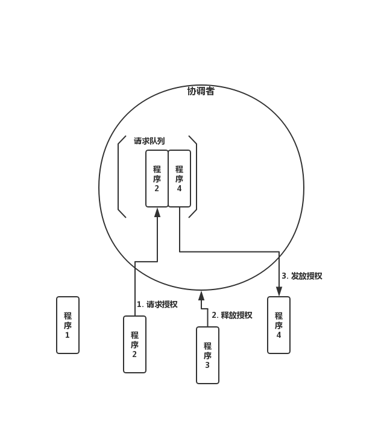

## 6.2 分布式协同与同步

>date: 2019-12-10

### 6.2.1 分布式互斥

在分布式系统中，对于同一共享资源，在同一时刻只能有一个程序能够访问该资源，其它程序不能访问的资源访问方式叫作**分布式互斥(`Distributed Mutual Exclusion`)**，而这种被互斥访问的共享资源叫作**临界资源(`Critical Resource`)**。

* **集中式算法**

**集中式算法**引入了一个协调者程序，然后每个程序需要访问临界资源时，先给协调者发送了一个请求；如果当前程序没有使用这个资源，协调者直接授权请求程序访问；否则，按照先来后到的顺序排队请求程序，当临界资源空闲时，给排在最前面的请求程序发送授权消息；请求程序得到授权后，即可访问临界资源。

一个程序完成一次临界资源访问，需要如下的流程：

1. 向协调者发送请求授权信息，`1` 次消息交互；

2. 协调者向程序发放授权信息，`1` 次消息交互；

3. 程序使用完临界资源后，向协调者发送释放授权，`1` 次消息交互。

每个程序完成一次临界资源访问，需要进行 `3` 次消息交互。

**优点**：直观、简单、信息交互量少、易于实现，并且所有程序只需和协调者通信，程序之间无需通信。

**缺点**：协调者会成为系统的性能瓶颈。协调者处理的消息数量会随着需要访问临界资源的程序数量**线性增加**；同时容易引发**单点故障**问题，会导致所有的程序均无法访问临界资源，导致整个系统不可用。

* **分布式算法**

**分布式算法**是指当一个程序要访问临界资源时，先向系统中的其他程序发送一条请求消息，在接收到**所有程序返回的同意消息**后，才可以访问临界资源。其中，请求消息需要包含所请求的资源、请求者的 `ID`，以及发起请求的时间。

每个程序完成一次临界资源的访问，需要进行如下的信息交互：

1. 向其他 `n-1` 个程序发送访问临界资源的请求，总共需要 `n-1` 次消息交互；

2. 需要接收到其他 `n-1` 个程序回复的同意消息，方可访问资源，总共需要 `n-1 `次消息交互。

每个程序要成功访问临界资源，至少需要 `2*(n-1)` 次消息交互。

**缺点**：当系统内需要访问临界资源的程序增多时，容易产生**信令风暴**，也就是程序收到的请求完全超过了自己的处理能力，而导致自己正常的业务无法开展；一旦某一程序发生故障，无法发送同意消息，那么其他程序均处在等待回复的状态中，使得整个系统处于停滞状态，导致整个系统不可用。所以，相对于集中式算法的协调者故障，分布式算法的**可用性更低**。

分布式算法适合**节点数目少且变动不频繁**的系统，且由于每个程序均需通信交互，因此适合 `P2P` 结构的系统。

* **令牌环算法**

**令牌环算法**将所有程序构成一个环结构，令牌按照顺时针（或逆时针）方向在程序之间传递，收到令牌的程序有权访问临界资源，访问完成后将令牌传送到下一个程序；若该程序不需要访问临界资源，则直接把令牌传送给下一个程序。

因为在使用临界资源前，不需要像分布式算法那样挨个征求其他程序的意见了，所以相对而言，在令牌环算法里单个程序具有更高的通信效率。同时，在一个周期内，每个程序都能访问到临界资源，因此令牌环算法的公平性很好。

但是，不管环中的程序是否想要访问资源，都需要接收并传递令牌，所以也会带来一些无效通信。

假设系统中有 `100` 个程序，那么程序 `1` 访问完资源后，即使其它 `99` 个程序不需要访问，也必须要等令牌在其他 `99` 个程序传递完后，才能重新访问资源，这就**降低了系统的实时性**。

对于集中式和分布式算法都存在的单点故障问题，在令牌环中，若某一个程序出现故障，则直接将令牌传递给故障程序的下一个程序，从而很好地解决单点故障问题，提高系统的**健壮性**，带来更好的**可用性**。

但这就要求每个程序都要记住环中的参与者信息，这样才能知道在跳过一个参与者后令牌应该传递给谁。

### 6.2.2 分布式选举

对于一个集群而言，需要存在一个主节点，来有效地管理各个节点，协同各个节点等，而如何进行保证集群的稳固运行，主节点的存在就十分重要了。这时候就需要进行分布式选举，即从集群中选择一个主节点来协调和管理其他节点，以保证集群有序运行和节点间的数据一致性。

* **`Bully` 算法**

**`Bully` 算法**选举规则就是在所有活着的节点中，选取 `ID` 最大的节点作为主节点。

在 `Bully` 算法中，节点的角色有两种：**普通节点**和**主节点**。

初始化时，所有节点都是平等的，都是普通节点，并且都有成为主的权利。但是，当选主成功后，有且仅有一个节点成为主节点，其他所有节点都是普通节点。当且仅当主节点故障或与其他节点失去联系后，才会重新选主。

`Bully` 算法在选举过程中，需要用到以下 `3` 种消息：

- * `Election` 消息，用于发起选举；

- * `Alive` 消息，对 `Election` 消息的应答；

- * `Victory` 消息，竞选成功的主节点向其他节点发送的宣誓主权的消息。

`Bully` 算法的选举规决定了集群中每个节点均知道其他节点的 `ID`。

在此前提下，其具体的选举过程是：

1. 集群中每个节点判断自己的 `ID` 是否为当前活着的节点中 `ID` 最大的，如果是，则直接向其他节点发送 `Victory` 消息，宣称自己为主节点；

2. 如果自己不是当前活着的节点中 `ID` 最大的，则向比自己 `ID` 大的所有节点发送 `Election` 消息，并等待其他节点的回复；

3. 若在给定的时间范围内，本节点没有收到其他节点回复的 `Alive` 消息，则认为自己成为主节点，并向其他节点发送 `Victory` 消息，宣称自己为主节点；若接收到来自比自己 `ID` 大的节点的 `Alive` 消息，则等待其他节点发送 `Victory` 消息；

4. 若本节点收到比自己 `ID` 小的节点发送的 `Election` 消息，则回复一个 `Alive` 消息，告知其他节点，本节点比较大，需要重新选举。

**优点**：选举速度快、算法复杂度低、简单易实现。

**缺点**：需要每个节点有全局的节点信息，因此额外信息存储较多；其次，任意一个比当前主节点 `ID` 大的新节点或节点故障后恢复加入集群的时候，都可能会触发重新选举，成为新的主节点，如果该节点频繁退出、加入集群，就会导致频繁切主。

**注**：`MongoDB` 的副本集故障转移功能就是使用`Bully` 算法进行选主的，采用节点的最后操作时间戳来表示 `ID`。时间戳最新的节点其 `ID` 最大，也就是说时间戳最新的、活着的节点是主节点。

* **`Raft` 算法**

**`Raft` 算法**是典型的多数派投票选举算法，核心思想是**少数服从多数**，以节点中获得投票最多的节点成为主。

采用 `Raft` 算法选举，集群节点的角色有 `3` 种：

- * `Leader`，即**主节点**，同一时刻只能有一个 `Leader`，负责协调和管理其他节点；

- * `Candidate`，即**候选者**，每一个节点都可以成为 `Candidate`，节点在该角色下才可以被选为新的 `Leader`；

- * `Follower`，`Leader` 的跟随者，不可以发起选举。

`Raft` 选举流程分为以下几步：

1. 初始化时，所有节点均为 `Follower` 状态；

2. 开始选主时，所有节点的状态由 `Follower` 转化为 `Candidate`，并向其他节点发送选举请求；

3. 其他节点根据接收到的选举请求的先后顺序，回复是否同意成为主。**注意：在每一轮选举中，一个节点只能投出一张票**；

4. 若发起选举请求的节点获得超过一半的投票，则成为主节点，其状态转化为 `Leader`，其他节点的状态则由 `Candidate` 降为 `Follower`。`Leader` 节点与 `Follower` 节点之间会定期发送心跳包，以检测主节点是否活着；

5. 当 `Leader` 节点的任期到了，即发现其他服务器开始下一轮选主周期时，`Leader` 节点的状态由 `Leader` 降级为 `Follower`，进入新一轮选主；当然，如果主节点故障，会立马发起选举，重新选出一个主节点。

`etcd` 的集群管理器 `etcds` 就是采用了 `Raft` 算法来实现选主和一致性的。

**优点**：选举稳定性比 `Bully` 算法好，选举速度快、算法复杂度低、易于实现。

**缺点**：要求系统内每个节点都可以相互通信，且需要获得过半的投票数才能选主成功，因此通信量大。

* **`ZAB` 算法**

**`ZAB`(`ZooKeeper Atomic Broadcast`)选举**算法是为 `ZooKeeper` 实现分布式协调功能而设计的。

相较于 `Raft` 算法的投票机制，`ZAB` 算法增加了通过节点 `ID` 和数据 `ID` 作为参考进行选主，节点 `ID` 和数据 `ID` 越大，表示数据越新，优先成为主。`ZAB` 算法尽可能保证数据的最新性，所以，`ZAB` 算法可以说是对 `Raft` 算法的改进。

使用 `ZAB` 算法选举时，集群中每个节点拥有 `3` 种角色：

- * `Leader`，主节点；

- * `Follower`，跟随者节点；

- * `Observer`，观察者，无投票权。

选举过程中，集群中的节点拥有 `4` 个状态：

- * `Looking` 状态，即选举状态。当节点处于该状态时，它会认为当前集群中没有 `Leader`，因此自己进入选举状态；

- * `Leading` 状态，即领导者状态，表示已经选出主，且当前节点为 `Leader`；

- * `Following` 状态，即跟随者状态，集群中已经选出主后，其他非主节点状态更新为 `Following`，表示对 `Leader` 的追随；

- * `Observing` 状态，即观察者状态，表示当前节点为 `Observer`，持观望态度，没有投票权和选举权。

投票过程中，每个节点都有一个唯一的三元组 `(server_id, server_zxID, epoch)`。

其中 `server_id` 表示本节点的唯一 `ID`；`server_zxID` 表示本节点存放的数据 `ID`，数据 `ID` 越大表示数据越新，选举权重越大；`epoch` 表示当前选取轮数，一般用逻辑时钟表示。

`ZAB` 选举算法的核心是**少数服从多数，`ID` 大的节点优先成为主**，因此选举过程中通过 `(vote_id, vote_zxID)` 来表明投票给哪个节点，其中 `vote_id` 表示**被投票节点的 `ID`**，`vote_zxID` 表示**被投票节点的服务器 `zxID`**。

`ZAB` 算法选主的原则是：`server_zxID` 最大者成为 `Leader`；若 `server_zxID` 相同，则 `server_id` 最大者成为 `Leader`。

`ZAB` 选举流程分为以下几步：

1. 初始状态下，每个节点将自己的**选票信息** `(epoch, vote_id, vote_zxID)` 广播出去，`epoch` 代表投票的轮数；

2. 如果每个节点的 `epoch` 和 `zxID` 都相同，则比较`server_id`，较大者为**推选对象**，并且其它节点将其 `vote_id` 改为该 `server_id`；

3. 此时即选出 `Leader` 节点，处于 `Leading` 状态，向其他服务器发送心跳包并维护连接，其它几点处于 `Following` 状态。

**优点**：选举稳定性比较好，算法性能高，对系统无特殊要求。

**缺点**：采用广播方式发送信息，若节点中有 `n` 个节点，每个节点同时广播，则集群中信息量为 `n*(n-1`) 个消息，容易出现广播风暴；且除了投票，还增加了对比节点 `ID` 和数据 `ID`，这就意味着还需要知道所有节点的 `ID` 和数据 `ID`，所以选举时间相对较长。

### 6.2.3 分布式共识

**分布式共识**就是在多个节点均可独自操作或记录的情况下，使得所有节点针对某个状态达成一致的过程。通过共识机制，可以使得分布式系统中的多个节点的数据达成一致。

### 6.2.4 分布式事务

事务，其实是包含一系列操作的、一个有边界的工作序列，有明确的开始和结束标志，且要么被完全执行，要么完全失败。

**分布式事务**就是在分布式系统中运行的事务，由多个**本地事务**组合而成。在分布式场景下，对事务的处理操作可能来自不同的机器，甚至是来自不同的操作系统。

分布式事务是多个事务的组合，那么事务的特征 `ACID`，也是分布式事务的基本特征。

- * `ACID`

1) 原子性(`Atomicity`)，事务被视为不可分割的最小单元，要么全部提交成功，要么失败回滚；

2) 一致性(`Consistency`)，事务执行前后都保持一致性状态。在一致性状态下，所有事务对一个数据的读取结果都是相同的；

3) 隔离性(`Isolation`)，一个事务所做的修改在最终提交以前，对其它事务是不可见的；

4) 持久性(`Durability`)，一旦事务提交，则其所做的修改将会永远保存在数据库中。即使系统发生崩溃，事务执行的结果页不能丢失。可以通过数据库备份和恢复来保证持久性。

**事务**指的是满足`ACID`特性的一系列操作。

如果系统为了严格满足 `ACID` 的分布式事务，其可能出现的情况就是系统的可用性和严格一致性出现冲突，因为在可用性和一致性之间无法存在一个两全其美的方案，所以后续又出现了 `CAP` 和 `BASE` 理论。

- * `CAP`

一个分布式系统不可能同时满足一致性（`C:Consistency`）、可用性（`A:Availability`）和分区容错性（`P:Partition tolerance`）这三个基本要求，最多只能满足其中的两项。

**放弃`P`**：

如果希望能够避免系统出现分区容错性问题，一种较为简单的做法是将所有的数据（或者仅仅是哪些与事务相关的数据）都放在一个分布式节点上。这样做虽然无法100%保证系统不会出错，但至少不会碰到由于网络分区带来的负面影响。但同时需要注意的是，放弃P的同时也就意味着放弃了系统的可扩展性

**放弃`A`**：

一旦系统遇到网络分区或其他故障或为了保证一致性时，放弃可用性，那么受到影响的服务需要等待一定的时间，因此在等待期间系统无法对外提供正常的服务，即不可用

**放弃`C`**：

这里所说的放弃一致性，实际上指的是放弃数据的强一致性，而保留数据的最终一致性。这样的系统无法保证数据保持实时的一致性，但是能够承诺的是，数据最终会达到一个一致的状态。

对分布式系统而言，分区容错是**基本需求**，否则不能称为分布式系统。

- * `BASE`

`BASE` 是对 `CAP` 中一致性和可用性权衡的结果，其代表着 `Basically Available`(基本可用）、`Soft state`(软状态）和`Eventually consistent`(最终一致性）。

其核心思想是即使无法做到强一致性，但每个应用都可以根据自身的业务特点，采用适当的方法来使系统达到最终一致性。

`BA`：基本可用是指分布式系统在出现不可预知故障的时候，允许损失部分可用性。

`S`：允许系统中的数据存在中间状态，并认为该中间状态的存在不会影响系统的整体可用性，即允许系统在不同的数据副本之间进行数据同步的过程存在延时。

`E`：最终一致性强调的是系统中所有的数据副本，在经过一段时间的同步后，最终能够达到一个一致的状态。

分布式事务主要是解决分布式环境下，组合事务的一致性问题。实现分布式事务主要有以下 `3` 种基本方法：

* **基于 `XA` 协议的二阶段提交协议方法**

`XA` 是一个分布式事务协议，规定了**事务管理器**和**资源管理器**接口。因此，`XA` 协议可以分为两部分，即事务管理器和本地资源管理器。

**事务管理器**作为**协调者**，负责各个本地资源的提交和回滚；而资源管理器就是分布式事务的参与者，通常由数据库实现。

基于 `XA` 协议的二阶段提交方法中，**二阶段提交协议(`The two-phase commit protocol`，`2PC`)**，用于保证分布式系统中事务提交时的数据一致性，是 `XA` 在全局事务中用于协调多个资源的机制。

二阶段提交的具体过程：

1. **投票(`voting`)阶段**

协调者(`Coordinator`，即事务管理器)会向事务的参与者(`Cohort`，即本地资源管理器)发起执行操作的 `CanCommit` 请求，并等待参与者的响应。

参与者接收到请求后，会执行请求中的事务操作，记录日志信息但不提交，待参与者执行成功，则向协调者发送 `Yes` 消息，表示同意操作；若不成功，则发送 `No` 消息，表示终止操作。

2. **提交(`commit`)阶段**

当所有的参与者都返回了操作结果(`Yes` 或 `No` 消息)后，系统进入了提交阶段。

在提交阶段，协调者会根据所有参与者返回的信息向参与者发送 `DoCommit` 或 `DoAbort` 指令：

- 1) 若协调者收到的都是 `Yes` 消息，则向参与者发送 `DoCommit` 消息，参与者会完成剩余的操作并释放资源，然后向协调者返回 `HaveCommitted` 消息；

- 2) 如果协调者收到的消息中包含 `No` 消息，则向所有参与者发送 `DoAbort` 消息，此时发送 `Yes` 的参与者则会根据之前执行操作时的回滚日志对操作进行回滚，然后所有参与者会向协调者发送 `HaveCommitted` 消息；

- 3) 协调者接收到 `HaveCommitted` 消息，就意味着整个事务结束了。

基于 `XA` 的二阶段提交算法基本满足了事务的 `ACID` 特性，但是仍然有不足。

协调者下发请求事务操作，参与者将操作结果通知协调者，协调者根据所有参与者的反馈结果决定各参与者是要提交操作还是撤销操作。

虽然基于 XA 的二阶段提交算法基本满足了事务的 ACID 特性，但依然有些不足。

- 1) **同步阻塞问题**：二阶段提交算法在执行过程中，所有参与节点都是**事务阻塞型**的。也就是说，当本地资源管理器占有临界资源时，其他资源管理器如果要访问同一临界资源，会处于阻塞状态。

- 2) **单点故障问题**：基于 `XA` 的二阶段提交算法类似于集中式算法，一旦事务管理器发生故障，整个系统都处于停滞状态。尤其是在提交阶段，一旦事务管理器发生故障，资源管理器会由于等待管理器的消息，而一直锁定事务资源，导致整个系统被阻塞。

- 3) **数据不一致问题**：在提交阶段，当协调者向参与者发送 `DoCommit` 请求之后，如果发生了局部网络异常，或者在发送提交请求的过程中协调者发生了故障，就会导致只有一部分参与者接收到了提交请求并执行提交操作，但其他未接到提交请求的那部分参与者则无法执行事务提交。于是整个分布式系统便出现了数据不一致的问题。

* **三阶段提交协议方法**

三阶段提交协议(`Three-phase commit protocol`，`3PC`)，是对二阶段提交(`2PC`) 的改进。

为了解决二阶段提交的**同步阻塞**和**数据不一致**问题，三阶段提交引入了**超时机制**和**准备阶段**：

- * **超时机制**：在协调者和参与者中引入超时机制。如果协调者或参与者在规定的时间内没有接收到来自其他节点的响应，就会根据当前的状态选择提交或者终止整个事务。

- * **准备阶段**：在第一阶段和第二阶段中间引入了一个准备阶段，也就是在提交阶段之前，加入了一个**预提交阶段**。在预提交阶段排除一些不一致的情况，保证在最后提交之前各参与节点的状态是一致的。

这样三阶段提交协议就有 **`CanCommit`**、**`PreCommit`**、**`DoCommit`** 三个阶段：

1. **`CanCommit` 阶段**

`CanCommit` 阶段与 `2PC` 的投票阶段类似：协调者向参与者发送请求操作(`CanCommit` 请求)，询问参与者是否可以执行事务提交操作，然后等待参与者的响应。

参与者收到 `CanCommit` 请求之后，回复 `Yes`，表示可以顺利执行事务；否则回复 `No`。

2. **`PreCommit` 阶段**

协调者根据参与者的回复情况，来决定是否可以进行 `PreCommit` 操作。

如果所有参与者回复的都是 `Yes`，那么协调者就会进行事务的预执行：

- 1) **发送预提交请求**：协调者向参与者发送 `PreCommit` 请求，进入预提交阶段。

- 2) **事务预提交**：参与者接收到 `PreCommit` 请求后执行事务操作，并将 `Undo` 和 `Redo` 信息记录到事务日志中。

- 3) **响应反馈**：如果参与者成功执行了事务操作，则返回 `ACK` 响应，同时开始等待最终指令。

如果任何一个参与者向协调者发送了 `No` 消息，或者等待超时之后，协调者都没有收到参与者的响应，就执行中断事务的操作：

- 1) **发送中断请求**：协调者向所有参与者发送 `Abort` 消息。

- 2) **中断事务**：参与者收到 `Abort` 消息之后，或超时后仍未收到协调者的消息，执行事务的中断操作。

3. **`DoCommit` 阶段**

`DoCmmit` 阶段进行真正的事务提交，根据 `PreCommit` 阶段协调者发送的消息，进入执行提交阶段或事务中断阶段。

执行提交阶段：

- 1) **发送提交请求**：协调者接收到所有参与者发送的 `ACK` 响应，从预提交状态进入到提交状态，并向所有参与者发送 `DoCommit` 消息。

- 2) **事务提交**：参与者接收到 `DoCommit` 消息之后，正式提交事务。完成事务提交之后，释放所有锁住的资源。

- 3) **响应反馈**：参与者提交完事务之后，向协调者发送 `ACK` 响应。

- 4) **完成事务**：协调者接收到所有参与者的 `ACK` 响应之后，完成事务。

事务中断阶段：

- 1) **发送中断请求**：协调者向所有参与者发送 `Abort` 请求。

- 2) **事务回滚**：参与者接收到 `Abort` 消息之后，利用其在 `PreCommit` 阶段记录的 `Undo` 信息执行事务的回滚操作，并释放所有锁住的资源。

- 3) **反馈结果**：参与者完成事务回滚之后，向协调者发送 `ACK` 消息。

- 4) **终断事务**：协调者接收到参与者反馈的 `ACK` 消息之后，执行事务的终断，并结束事务。

在 `DoCommit` 阶段，当参与者向协调者发送 `ACK` 消息后，如果长时间没有得到协调者的响应，在默认情况下，参与者会自动将超时的事务进行提交，不会像两阶段提交那样被阻塞住。

三阶段提交协议方法，采用了强一致性，遵从 `ACID`。

* **基于消息的最终一致性方法**

`2PC` 和 `3PC` 这两种方法，有两个共同的缺点，一是都需要**锁定资源，降低系统性能**；二是，没有解决**数据不一致**的问题。

因此，便有了通过分布式消息来确保事务最终一致性的方案。

基于分布式消息的最终一致性方案的事务处理，引入了一个消息中间件(`Message Queue`，`MQ`)，用于在多个应用之间进行消息传递。其将需要分布式处理的事务通过消息或者日志的方式异步执行，消息或日志可以存到本地文件、数据库或消息队列中，再通过业务规则进行失败重试。

其基本思想就是利用消息中间件来实现二阶段提交，流程大致如下：

- 1) 主事务向消息中间件发送待确认消息；

- 2) 消息中间件持久化保存待确认消息并返回 `ACK`；

- 2) 主事务收到 `ACK`后，本地执行主事务；

- 3) 主事务根据执行的结果向消息中间件发送**提交**或**回滚**的状态消息。

如果存在下游事务，则还会继续下面的流程：

- 4) 下游事务监听消息中间件并获取状态消息；

- 5) 当状态消息是提交状态时，处理本地事务，否则不处理；

- 6) 下游事务处理完后，向消息中间件发送 `ACK` 确保消息被消费。

### 6.2.5 分布式锁

**锁是实现多线程同时访问同一共享资源，保证同一时刻只有一个线程可访问共享资源所做的一种标记。**

**分布式锁**就是指在分布式环境下，系统部署在多个，实现多进程分布式互斥的一种锁。锁被存在公共存储中，以实现多个进程并发访问同一个临界资源时，同一时刻只有一个进程可以访问共享数据，确保数据的一致性。

主流实现分布式锁的 `3` 种方式：

* **基于数据库实现分布式锁**

即数据库中创建一张锁表，当需要锁住某个资源时，就往该表增加一条记录；需要释放资源的时候就删除该条记录。

数据库对共享资源做了唯一性约束，保证了多个请求同时提交到数据库时，只有一个能操作成功。

但是，因为数据库落在磁盘上，频繁读取数据库会导致 `IO` 开销增大，因此这种分布式锁**适合并发量低，对性能要求低的场景**。而如果数据库不可用，会导致整个系统崩溃。

同时，数据库锁没有失效时间，未获得锁的进程只能一直等待已获得锁的进程主动释放锁。一旦已获得锁的进程挂掉或者解锁操作失败，会导致锁记录一直存在数据库中，其它进程无法获得锁，出现**死锁**。

* **基于缓存实现分布式锁**

针对数据库锁将数据保存在磁盘上，导致频繁 `IO` 的问题，就出现了**基于缓存的分布式锁机制**。其将数据保存在内存中，减少可 `IO` 读写。

基于缓存的分布式锁常用 `Redis` 的 `setnx(key, value)` 来实现，其中 `key` 代表锁 `id`，而 `value = currentTime + timeOut`，表示锁的过期时间。

`setnx` 函数返回值有 `0` 和 `1`。

- * 返回 `1` ，说明该服务器获得锁，`setnx` 将 `key` 对应的 `value` 设置为当前时间 + 锁的有效时间。

- * 返回 `0`，说明其他程序已经获得了锁，进程不能进入临界区。该程序以不断尝试 `setnx` 操作，以获得锁。

基于缓存实现的分布式锁具有以下的**优势**：

- * **性能更好**，数据保存在内存中，避免了频繁的 `IO` 操作；

- * 很多缓存可以**集群化部署**，避免了单点故障问题；

- * 很多缓存服务天然提供可以实现分布式锁的方法；

- * 存在**超时机制**来控制锁的释放。

但是当一个进程执行时间过长时候，分布式锁超时时间的设置十分敏感，容易导致不正确的释放锁。

* **基于 `ZooKeeper` 实现分布式锁**

`ZooKeeper` 基于树形数据存储结构实现分布式锁，来解决多个进程同时访问同一临界资源时，数据的一致性问题。`ZooKeeper `的树形数据存储结构主要由 4 种节点构成：

- * **持久节点**：默认的节点类型，一直存在于 `ZooKeeper` 中。

- * **持久顺序节点**：在创建节点时，`ZooKeeper` 根据节点创建的时间顺序对节点进行编号。

- * **临时节点**：与持久节点不同，当客户端与 `ZooKeeper` 断开连接后，该进程创建的临时节点就会被删除。

- * **临时顺序节点**：按时间顺序编号的临时节点。

`ZooKeeper` 实现分布式锁流程如下：

- 1) 在共享资源的持久节点 `shared_lock` 的目录下，为每个需要访问该共享资源的进程创建一个临时顺序节点；

- 2) 每个进程获取 `shared_lock` 目录下的所有临时节点列表，注册子节点变更的 `Watcher`，并监听节点；

- 3) 每个节点确定自己的编号是否是 `shared_lock` 下所有子节点中最小的。**若最小**，则获得锁，可以访问临界资源；

- 4) 若本进程对应的临时节点编号不是最小的，则分为两种情况：

- 4.1) 本进程为**读请求**，如果比自己序号小的节点中有写请求，则等待；

- 4.2) 本进程为**写请求**，如果比自己序号小的节点中有读请求，则等待。

`ZooKeeper` 实现分布式锁能够解决单点故障、不可重入、死锁等问题，且易于实现。但是因为需要频繁地添加和删除节点，所以性能不如基于缓存实现的分布式锁。

**分布式锁的设计**

为了确保分布式锁的可用性，在设计时应考虑到以下几点：

- 1) **互斥性**：即在分布式系统环境下，分布式锁应该能保证一个资源或一个方法在同一时间只能被一个机器的一个线程或进程操作；

- 2) **具备锁失效机制，防止死锁**：即使有一个进程在持有锁的期间因为崩溃而没有主动解锁，也能保证后续其他进程可以获得锁；

- 3) **可重入性**：即进程未释放锁时，可以多次访问临界资源；

- 4) **高可用的获取锁和释放锁的功能，且性能要好**。

