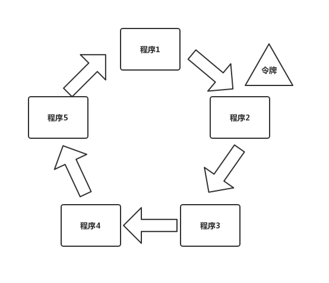

## 6.2 分布式协同与同步

>date: 2019-12-10

### 6.2.1 分布式互斥

在分布式系统中，对于同一共享资源，在同一时刻只能有一个程序能够访问该资源，其它程序不能访问的资源访问方式叫作**分布式互斥(`Distributed Mutual Exclusion`)**，而这种被互斥访问的共享资源叫作**临界资源(`Critical Resource`)**。

* **集中式算法**

**集中式算法**引入了一个协调者程序，然后每个程序需要访问临界资源时，先给协调者发送了一个请求；如果当前程序没有使用这个资源，协调者直接授权请求程序访问；否则，按照先来后到的顺序排队请求程序，当临界资源空闲时，给排在最前面的请求程序发送授权消息；请求程序得到授权后，即可访问临界资源。

一个程序完成一次临界资源访问，需要如下的流程：

1. 向协调者发送请求授权信息，`1` 次消息交互；

2. 协调者向程序发放授权信息，`1` 次消息交互；

3. 程序使用完临界资源后，向协调者发送释放授权，`1` 次消息交互。

每个程序完成一次临界资源访问，需要进行 `3` 次消息交互。

**优点**：直观、简单、信息交互量少、易于实现，并且所有程序只需和协调者通信，程序之间无需通信。

**缺点**：协调者会成为系统的性能瓶颈。协调者处理的消息数量会随着需要访问临界资源的程序数量**线性增加**；同时容易引发**单点故障**问题，会导致所有的程序均无法访问临界资源，导致整个系统不可用。

* **分布式算法**

**分布式算法**是指当一个程序要访问临界资源时，先向系统中的其他程序发送一条请求消息，在接收到**所有程序返回的同意消息**后，才可以访问临界资源。其中，请求消息需要包含所请求的资源、请求者的 `ID`，以及发起请求的时间。

每个程序完成一次临界资源的访问，需要进行如下的信息交互：

1. 向其他 `n-1` 个程序发送访问临界资源的请求，总共需要 `n-1` 次消息交互；

2. 需要接收到其他 `n-1` 个程序回复的同意消息，方可访问资源，总共需要 `n-1 `次消息交互。

每个程序要成功访问临界资源，至少需要 `2*(n-1)` 次消息交互。

**缺点**：当系统内需要访问临界资源的程序增多时，容易产生**信令风暴**，也就是程序收到的请求完全超过了自己的处理能力，而导致自己正常的业务无法开展；一旦某一程序发生故障，无法发送同意消息，那么其他程序均处在等待回复的状态中，使得整个系统处于停滞状态，导致整个系统不可用。所以，相对于集中式算法的协调者故障，分布式算法的**可用性更低**。

分布式算法适合**节点数目少且变动不频繁**的系统，且由于每个程序均需通信交互，因此适合 `P2P` 结构的系统。

* **令牌环算法**

**令牌环算法**将所有程序构成一个环结构，令牌按照顺时针（或逆时针）方向在程序之间传递，收到令牌的程序有权访问临界资源，访问完成后将令牌传送到下一个程序；若该程序不需要访问临界资源，则直接把令牌传送给下一个程序。

因为在使用临界资源前，不需要像分布式算法那样挨个征求其他程序的意见了，所以相对而言，在令牌环算法里单个程序具有更高的通信效率。同时，在一个周期内，每个程序都能访问到临界资源，因此令牌环算法的公平性很好。

但是，不管环中的程序是否想要访问资源，都需要接收并传递令牌，所以也会带来一些无效通信。

假设系统中有 `100` 个程序，那么程序 `1` 访问完资源后，即使其它 `99` 个程序不需要访问，也必须要等令牌在其他 `99` 个程序传递完后，才能重新访问资源，这就**降低了系统的实时性**。

对于集中式和分布式算法都存在的单点故障问题，在令牌环中，若某一个程序出现故障，则直接将令牌传递给故障程序的下一个程序，从而很好地解决单点故障问题，提高系统的**健壮性**，带来更好的**可用性**。

但这就要求每个程序都要记住环中的参与者信息，这样才能知道在跳过一个参与者后令牌应该传递给谁。

### 6.2.2 分布式选举

对于一个集群而言，需要存在一个主节点，来有效地管理各个节点，协同各个节点等，而如何进行保证集群的稳固运行，主节点的存在就十分重要了。这时候就需要进行分布式选举，即从集群中选择一个主节点来协调和管理其他节点，以保证集群有序运行和节点间的数据一致性。

* **`Bully` 算法**

**`Bully` 算法**选举规则就是在所有活着的节点中，选取 `ID` 最大的节点作为主节点。

在 `Bully` 算法中，节点的角色有两种：**普通节点**和**主节点**。

初始化时，所有节点都是平等的，都是普通节点，并且都有成为主的权利。但是，当选主成功后，有且仅有一个节点成为主节点，其他所有节点都是普通节点。当且仅当主节点故障或与其他节点失去联系后，才会重新选主。

`Bully` 算法在选举过程中，需要用到以下 `3` 种消息：

- * `Election` 消息，用于发起选举；

- * `Alive` 消息，对 `Election` 消息的应答；

- * `Victory` 消息，竞选成功的主节点向其他节点发送的宣誓主权的消息。

`Bully` 算法的选举规决定了集群中每个节点均知道其他节点的 `ID`。

在此前提下，其具体的选举过程是：

1. 集群中每个节点判断自己的 `ID` 是否为当前活着的节点中 `ID` 最大的，如果是，则直接向其他节点发送 `Victory` 消息，宣称自己为主节点；

2. 如果自己不是当前活着的节点中 `ID` 最大的，则向比自己 `ID` 大的所有节点发送 `Election` 消息，并等待其他节点的回复；

3. 若在给定的时间范围内，本节点没有收到其他节点回复的 `Alive` 消息，则认为自己成为主节点，并向其他节点发送 `Victory` 消息，宣称自己为主节点；若接收到来自比自己 `ID` 大的节点的 `Alive` 消息，则等待其他节点发送 `Victory` 消息；

4. 若本节点收到比自己 `ID` 小的节点发送的 `Election` 消息，则回复一个 `Alive` 消息，告知其他节点，本节点比较大，需要重新选举。

**优点**：选举速度快、算法复杂度低、简单易实现。

**缺点**：需要每个节点有全局的节点信息，因此额外信息存储较多；其次，任意一个比当前主节点 `ID` 大的新节点或节点故障后恢复加入集群的时候，都可能会触发重新选举，成为新的主节点，如果该节点频繁退出、加入集群，就会导致频繁切主。

**注**：`MongoDB` 的副本集故障转移功能就是使用`Bully` 算法进行选主的，采用节点的最后操作时间戳来表示 `ID`。时间戳最新的节点其 `ID` 最大，也就是说时间戳最新的、活着的节点是主节点。

* **`Raft` 算法**

**`Raft` 算法**是典型的多数派投票选举算法，核心思想是**少数服从多数**，以节点中获得投票最多的节点成为主。

采用 `Raft` 算法选举，集群节点的角色有 `3` 种：

- * `Leader`，即**主节点**，同一时刻只能有一个 `Leader`，负责协调和管理其他节点；

- * `Candidate`，即**候选者**，每一个节点都可以成为 `Candidate`，节点在该角色下才可以被选为新的 `Leader`；

- * `Follower`，`Leader` 的跟随者，不可以发起选举。

`Raft` 选举流程分为以下几步：

1. 初始化时，所有节点均为 `Follower` 状态；

2. 开始选主时，所有节点的状态由 `Follower` 转化为 `Candidate`，并向其他节点发送选举请求；

3. 其他节点根据接收到的选举请求的先后顺序，回复是否同意成为主。**注意：在每一轮选举中，一个节点只能投出一张票**；

4. 若发起选举请求的节点获得超过一半的投票，则成为主节点，其状态转化为 `Leader`，其他节点的状态则由 `Candidate` 降为 `Follower`。`Leader` 节点与 `Follower` 节点之间会定期发送心跳包，以检测主节点是否活着；

5. 当 `Leader` 节点的任期到了，即发现其他服务器开始下一轮选主周期时，`Leader` 节点的状态由 `Leader` 降级为 `Follower`，进入新一轮选主；当然，如果主节点故障，会立马发起选举，重新选出一个主节点。

`etcd` 的集群管理器 `etcds` 就是采用了 `Raft` 算法来实现选主和一致性的。

**优点**：选举稳定性比 `Bully` 算法好，选举速度快、算法复杂度低、易于实现。

**缺点**：要求系统内每个节点都可以相互通信，且需要获得过半的投票数才能选主成功，因此通信量大。

* **`ZAB` 算法**

**`ZAB`(`ZooKeeper Atomic Broadcast`)选举**算法是为 `ZooKeeper` 实现分布式协调功能而设计的。

相较于 `Raft` 算法的投票机制，`ZAB` 算法增加了通过节点 `ID` 和数据 `ID` 作为参考进行选主，节点 `ID` 和数据 `ID` 越大，表示数据越新，优先成为主。`ZAB` 算法尽可能保证数据的最新性，所以，`ZAB` 算法可以说是对 `Raft` 算法的改进。

使用 `ZAB` 算法选举时，集群中每个节点拥有 `3` 种角色：

- * `Leader`，主节点；

- * `Follower`，跟随者节点；

- * `Observer`，观察者，无投票权。

选举过程中，集群中的节点拥有 `4` 个状态：

- * `Looking` 状态，即选举状态。当节点处于该状态时，它会认为当前集群中没有 `Leader`，因此自己进入选举状态；

- * `Leading` 状态，即领导者状态，表示已经选出主，且当前节点为 `Leader`；

- * `Following` 状态，即跟随者状态，集群中已经选出主后，其他非主节点状态更新为 `Following`，表示对 `Leader` 的追随；

- * `Observing` 状态，即观察者状态，表示当前节点为 `Observer`，持观望态度，没有投票权和选举权。

投票过程中，每个节点都有一个唯一的三元组 `(server_id, server_zxID, epoch)`。

其中 `server_id` 表示本节点的唯一 `ID`；`server_zxID` 表示本节点存放的数据 `ID`，数据 `ID` 越大表示数据越新，选举权重越大；`epoch` 表示当前选取轮数，一般用逻辑时钟表示。

`ZAB` 选举算法的核心是**少数服从多数，`ID` 大的节点优先成为主**，因此选举过程中通过 `(vote_id, vote_zxID)` 来表明投票给哪个节点，其中 `vote_id` 表示**被投票节点的 `ID`**，`vote_zxID` 表示**被投票节点的服务器 `zxID`**。

`ZAB` 算法选主的原则是：`server_zxID` 最大者成为 `Leader`；若 `server_zxID` 相同，则 `server_id` 最大者成为 `Leader`。

`ZAB` 选举流程分为以下几步：

1. 初始状态下，每个节点将自己的**选票信息** `(epoch, vote_id, vote_zxID)` 广播出去，`epoch` 代表投票的轮数；

2. 如果每个节点的 `epoch` 和 `zxID` 都相同，则比较`server_id`，较大者为**推选对象**，并且其它节点将其 `vote_id` 改为该 `server_id`；

3. 此时即选出 `Leader` 节点，处于 `Leading` 状态，向其他服务器发送心跳包并维护连接，其它几点处于 `Following` 状态。

**优点**：选举稳定性比较好，算法性能高，对系统无特殊要求。

**缺点**：采用广播方式发送信息，若节点中有 `n` 个节点，每个节点同时广播，则集群中信息量为 `n*(n-1`) 个消息，容易出现广播风暴；且除了投票，还增加了对比节点 `ID` 和数据 `ID`，这就意味着还需要知道所有节点的 `ID` 和数据 `ID`，所以选举时间相对较长。
