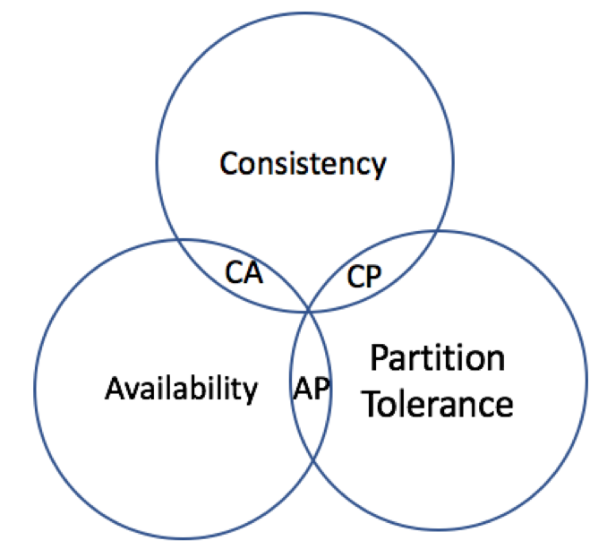
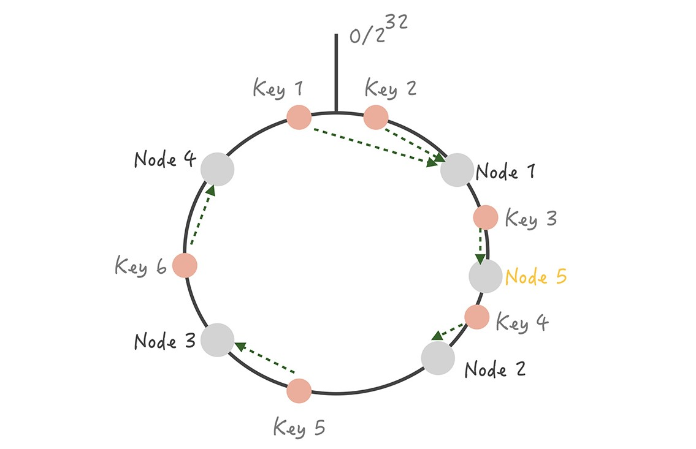
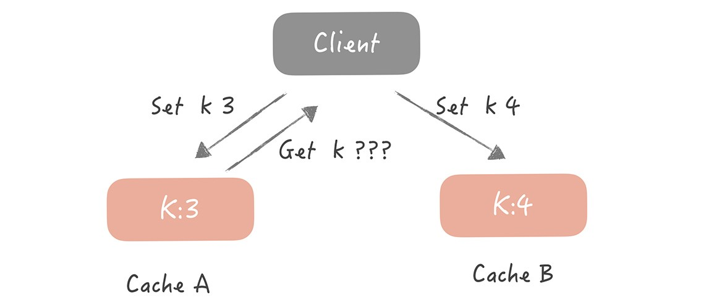
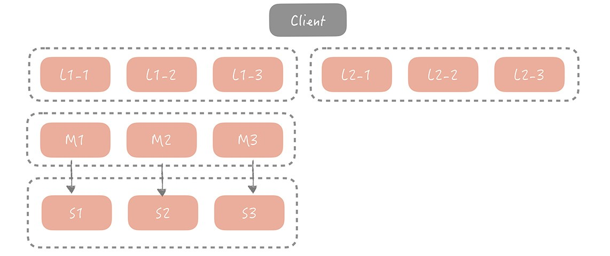
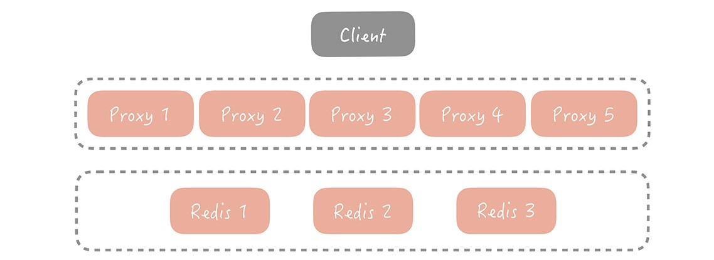
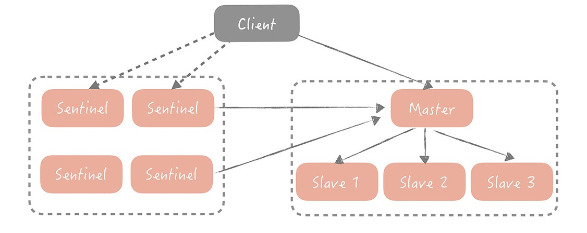

## 6.6 分布式存储

>date: 2019-12-23

### 6.6.1 `CAP`理论

1. 一致性(`C：Consistency`)

**一致性**是指所有节点在同一时刻的数据是相同的，即更新操作执行结束并响应用户完成后，所有节点存储的数据会保持相同。

在分布式环境下，一致性是指数据在多个副本之间能否保持一致的特性。在一致性的需求下，当一个系统在数据一致的状态下执行更新操作后，应该保证系统的数据仍然处于一致的状态。

在分布式系统中，如果能够做到针对一个数据项的更新操作执行成功后，所有的用户都可以读取到其最新的值，那么这样的系统就被认为具有**强一致性**。

2、可用性(`A：Availability`)

可用性是指系统提供的服务必须一直处于可用的状态，对于用户的每一个操作请求总是能够在有限的时间内返回结果。这里的重点是**有限时间内**和**返回结果**。

**有限时间内**是指，对于用户的一个操作请求，系统必须能够在指定的时间内返回对应的处理结果，如果超过了这个时间范围，那么系统就被认为是不可用的。

另外，**有限时间内**是指系统设计之初就设计好的运行指标，通常不同系统之间有很 大的不同，无论如何，对于用户请求，系统必须存在一个合理的响应时间，否则用户便会对系统感到失望。

**返回结果**是可用性的另一个非常重要的指标，它要求系统在完成对用户请求的处理后，返回一个正常的响应结果。正常的响应结果通常能够明确地反映出队请求的处理结果，即成功或失败，而不是一个让用户感到困惑的返回结果。

3、分区容错性(`P：Partition tolerance`)

分区容错性约束了一个分布式系统具有如下特性：分布式系统在遇到任何网络分区故障的时候，仍然需要能够保证对外提供满足一致性和可用性的服务，除非是整个网络环境都发生了故障。

网络分区是指在分布式系统中，不同的节点分布在不同的子网络（机房或异地网络） 中，由于一些特殊的原因导致这些子网络出现网络不连通的状况，但各个子网络的内部网络是正常的，从而导致整个系统的网络环境被切分成了若干个孤立的区域。需要注意的是，组成一个分布式系统的每个节点的加入与退出都可以看作是一个特殊的网络分区。

一个分布式系统不可能同时满足一致性(`C：Consistency`)、可用性(`A：Availability`)和分区容错性(`P：Partition tolerance`)这三个基本需求，最多只能同时满足其中两项。

**放弃`P`**：

如果希望能够避免系统出现分区容错性问题，一种较为简单的做法是将所有的数据（或者仅仅是哪些与事务相关的数据）都放在一个分布式节点上。这样做虽然无法100%保证系统不会出错，但至少不会碰到由于网络分区带来的负面影响。但同时需要注意的是，放弃P的同时也就意味着放弃了系统的可扩展性。

**放弃`A`**：

一旦系统遇到网络分区或其他故障或为了保证一致性时，放弃可用性，那么受到影响的服务需要等待一定的时间，因此在等待期间系统无法对外提供正常的服务，即不可用。

**放弃`C`**：

这里所说的放弃一致性，实际上指的是放弃数据的强一致性，而保留数据的最终一致性。这样的系统无法保证数据保持实时的一致性，但是能够承诺的是，数据最终会达到一个一致的状态。

分布式存储系统的核心逻辑，就是将用户需要存储的数据根据某种规则存储到不同机器上，当用户想要获取指定数据时候，再按照规则到存储数据的机器上获取。

* **分布式存储系统三要素**

当应用程序需要访问某些数据时候，分布式操作引擎会根据一些映射规则，从存储的节点上获取指定的数据。

上面的过程就涉及到了分布式存储系统的三要素：**数据生产者/消费者**、**数据索引**、**数据存储**。

### 6.6.2 数据的生产和消费

**数据生产者/消费者**：生产者负责给存储系统添加数据，而消费者则可以使用系统中存储的数据。

而不同应用场景中数据的类型、格式等都不一样。根据数据的特征，这些不同的数据通常被划分为三类：**结构化数据**、**半结构化数据**和**非结构化数据**：

- 1) **结构化数据**通常是指关系模型数据，其特征是数据关联较大、格式固定。其具有格式固定的特征，因此一般采用分布式关系数据库进行存储和查询；

- 2) **半结构化数据**通常是指非关系模型的，有基本固定结构模式的数据，其特征是数据之间关系比较简单。半结构化数据大多可以采用键值对形式来表示，一般采用分布式键值系统进行存储和使用。

- 3) **非结构化数据**是指没有固定模式的数据，其特征是数据之间关联不大。比如文本数据就是一种非结构化数据。这种数据可以存储到文档中，通过相关检索引擎进行检索。

### 6.6.3 数据分片和数据复制

* **数据索引和数据分布**

**数据索引**：分布式存储系统中，必须有响应的数据索引规则，不然系统的响应就会非常慢，效率很低。

**数据分布**主要是数据分布，而**数据分片技术**就是将分布式存储系统中的数据按照一定的规则将数据存储到相对应的存储节点中，同样，按照这个规则也能从相对应的节点中获取数据。

这个技术一方面需要降低单个存储节点的存储和访问压力，一方面需要有相关的规则来快速索引数据，降低搜索延迟，提高用户体验。

常见的数据分片方案有：数据范围、哈希映射、一致性哈希环等。

- * 存储选型

存储方案选型：在分布式数据存储系统中，存储方案选型时，通常会考虑**数据均匀、数据稳定和节点异构性**这三个维度。

- 1) **数据均匀**：不同存储节点中存储的数据要尽量均衡，避免让某一个或某几个节点存储压力过大，而其他节点却几乎没什么数据；而用户访问时也需要均衡，避免出现某一个或某几个节点的访问量很大，但其他节点却没有访问的情况；

- 2) **数据稳定**：当存储节点出现故障需要移除或扩增时，数据按照分布规则得到的记过应该尽量保持稳定，不要出现大规模的数据迁移；

- 3) **节点异构性**：不同的存储节点的硬件配置可能差别很大，这本身就是一种不均衡，而在设计分布规则时，将这种节点异构性导致的不均衡考虑进去也是必须的。

另外还需要考虑诸如隔离故障域和性能稳定性等因素。

- 4) **隔离故障域**：保证数据的可用和可靠性；

- 5) **性能稳定性**：数据存储和查询的效率要有保证，不能因为节点的添加或者移除，造成存储或访问性能的严重下降。

- * 分布方法

- 1) **哈希**

**哈希**是常用的数据分布方法，核心思想就是确定一个哈希函数，然后通过计算得到对应的存储节点。

假设存在 `3` 个节点：`Node1`、`Node2`、`Node3`，哈希函数为`id % 节点个数`，其结果即该 `id` 存储的节点。

其最大的问题就是稳定性较差，如果随着数据量的增加，当前的节点容量已经无法满足存储需求了，就需要添加一个节点，而之前的哈希函数变成了 `id % 4` ，原本存储在 `3` 个节点的数据就需要重新计算，然后存入相应的节点。这就需要大规模的数据迁移，显然会降低系统稳定性。

综上，哈希方法适用于**同类型节点且节点数量比较固定的场景**。

- 2) **一致性哈希**

**一致性哈希**是指将存储节点和数据映射到一个首尾相连的**哈希环**上，存储节点可以根据 `IP` 地址进行哈希，数据通常通过顺时针方向寻找的方式，来确定自己所属的存储节点，即从数据映射在环上的位置开始，顺时针方向找到的第一个存储节点。

一致性哈希是对哈希方法的改进，其在数据存储前，对存储节点预先进行了哈希，然后在数据存储的时候，也采用哈希的方式来确定存储的节点位置。

这种改进能很好地解决上面哈希方法中存在的稳定性问题。因为在节点增加或退出时，只会影响到相邻的后继节点。

当然，这种改进同样带来的问题也是很明显的，如果有节点退出了，那么后继节点负载也会增大，导致节点的数据均匀不均衡了，后继节点也会承担更大的压力。

综上，一致性哈希方法比较适合**同类型节点、节点规模会发生变化的场景**。

- 3) **带有限负载的一致性哈希**

**带有限负载的一致性哈希**是指给每个存储节点设置了一个存储上限值来控制存储节点添加或移除造成的数据不均匀。

当数据按照一致性哈希算法找到相应的存储节点时，要先判断该存储节点是否达到了存储上限；如果已经达到了上限，则需要继续寻找该存储节点顺时针方向之后的节点进行存储。

综上，带有限负载的一致性哈希方法比较适合同类型节点、节点规模会发生变化的场景。

而**哈希、一致性哈希、带有限负载的一致性哈希**都没有考虑**节点异构性**的问题。如果存储节点的性能好坏不一，数据分布方案还按照这些方法的话，其实还是没做到数据的均匀分布。

- 4) **带虚拟节点的一致性哈希**

**带虚拟节点的一致性哈希方法**是指根据每个节点的性能，为每个节点划分不同数量的虚拟节点，并将这些虚拟节点映射到哈希环中，然后再按照一致性哈希算法进行数据映射和存储。

带虚拟节点的一致性哈希方法比较适合**异构节点、节点规模会发生变化的场景**。

这种方法不仅解决了节点异构性问题，还提高了系统的稳定性。当节点变化时，会有多个节点共同分担系统的变化，因此稳定性更高。

当然，这种方法引入了虚拟节点，增加了节点规模，从而增加了节点的维护和管理的复杂度。

* **数据复制**

**数据复制**是一个非常重要的方法，其将数据备份到多个节点，以提高系统的可用性和可靠性。

在实际的分布式存储系统中，数据分片和数据复制通常是共存的：

- * 数据通过分片方式存储到不同的节点上，以减少单节点的性能瓶颈问题；

- * 数据的存储通常用主备方式保证可靠性，也就是对每个节点上存储的分片数据，采用主备方式存储，以保证数据的可靠性。其中，主备节点上数据的一致，是通过数据复制技术实现的。

在分布式存储系统中，分区容错是必须需要满足的，所以就需要在一致性和可用性之间进行权衡。

因此，也就出现了多种数据复制技术方法，大体上有三类：

比较注重一致性的**同步复制技术**，更注重可用性的**异步复制技术**，介于两者之间的**半同步复制技术**。

- * **同步复制技术**

**同步复制技术**指的是，当用户请求更新数据时，主数据库必须同步到备数据库之后才能给用户返回，即如果主数据库没有同步到备数据库，用户的更新操作会一直阻塞。这种方式**保证了数据的强一致性**，但**牺牲了系统的可用性**。

同步复制技术经常用于**分布式数据库主备场景**（对于一主多备场景，由于多个备节点均要更新成功后，主节点才响应，所需时延比较长）或**对数据一致性有严格要求的场合**，比如金融、交易之类的场景。

- * **异步复制技术**

**异步复制技术**是指，当用户请求更新数据时，主数据库处理完请求后可直接给用户响应，而不必等待备数据库完成同步，即备数据库会异步进行数据的同步，用户的更新操作不会因为备数据库未完成数据同步而导致阻塞。显然，这种方式**保证了系统的可用性**，但**牺牲了数据的一致性**。

`MySQL` 集群默认的复制模式就是异步复制技术：

- 1) 主数据库完成写操作后，可直接给用户回复执行成功，将写操作写入 `binary log` 中，`binary log` 中记录着主数据库执行的所有更新操作，以便备数据库获取更新信息；

- 2) 备数据库启动一个 `IO` 线程专门读取 `binary log` 中的内容然后写入 `relay log` 中；

- 3) 备数据库启动一个 `SQL` 线程会定时检查 `relay log` 里的内容，如发现有新内容则会立即在备数据库中执行，从而实现数据的一致。

**异步复制技术大多应用在对用户请求响应时延要求很高的场景**。

- * **半同步复制技术**

**半同步复制技术**的核心是，用户发出写请求后，主数据库会执行写操作，并给备数据库发送同步请求，但主数据库不用等待所有备数据库回复数据同步成功便可响应用户，也就是说主数据库可以等待一部分备数据库同步完成后响应用户写操作执行成功。

半同步复制技术通常有两种方式：

- 1) 当主数据库收到多个备数据库中的某一个回复数据同步成功后，便可给用户响应写操作完成；

- 2) 主数据库等超过一半节点（包括主数据库）回复数据更新成功后，再给用户响应写操作成功。

`ZooKeeper` 集群就是采用第二种半同步复制方案的：

在 `ZooKeeper` 集群中，写请求必须由 `Leader` 节点进行处理，每次写请求 `Leader` 会征求其他 `Follower` 的同意，只有当多数节点同意后写操作才可成功，因此保证了较高的一致性。

### 6.6.4 分布式缓存

**分布式缓存**就是指在分布式环境或系统下，把一些热门数据存储到离用户近、离应用近的位置，并尽量存储到更快的设备，以减少远程数据传输的延迟，让用户和应用可以很快访问到想要的数据。

目前主流的分布式缓存系统是 `Redis` 和 `Memcached`，下面就简单介绍下。

* `Memcache`

高性能、分布式内存类型的对象缓存系统。在内存中维护一个统一的巨大的`Hash`表，能够存储图像、视频、文件、数据库检索结果等数据。

特性：

1. 使用物理内存作为缓存区，可独立运行在服务器上。每个进程最大2G，如果想缓存更多的数据，可以开辟更多的`Memcache`进程（不同端口）或者使用分布式`Memcache`进行缓存，将数据缓存到不同的物理机或者虚拟机上。

2. 使用`key-value`的方式来存储数据，这是一种单索引的结构化数据组织形式，可使数据项查询时间复杂度为`O(1)`。

3. 协议简单：基于文本行的协议，直接通过`telnet`在`Memcache`服务器上可进行存取数据操作，简单，方便多种缓存参考此协议。

4. 基于`libevent`高性能通信：`Libevent`是一套利用C开发的程序库，它将`BSD`系统的`kqueue`，`Linux`系统的`epoll`等事件处理功能封装成一个接口，与传统的`select`相比，提高了性能。

5. 内置的内存管理方式：所有数据都保存在内存中，存取数据比硬盘快，当内存满后，通过LRU算法自动删除不使用的缓存，但没有考虑数据的容灾问题，重启服务，所有数据会丢失。

6. 分布式：各个`Memcache`服务器之间互不通信，各自独立存取数据，不共享任何信息。服务器并不具有分布式功能，分布式部署取决于`Memcache`客户端。当向`Memcache`集群存入（取出）`key-value`时，`Memcache`客户端程序根据一定的算法选择存入哪台服务器，然后再把`key-value`值存到此服务器中。

- 1) 余数算法

先求得键的整数散列值，再除以服务器台数，根据余数确定存取服务器。

优点：计算简单，高效；

缺点：在`Memcache`服务器增加或减少时，几乎所有的缓存都会失效。

- 2) 散列算法（一致性`Hash`）：

先算出`Memcache`服务器的散列值，并将其分布到`0~2^(32)`的圆上；

然后用同样的方法算出存储数据的键的散列值并映射至圆上；

最后从数据映射到的位置开始顺时针查找，将数据保存到查找到的第一个服务器上。

如果超过`0~2^(32)`，依然找不到服务器，就将数据保存到第一台`Memcache`服务器上。

如果添加了一台`Memcache`服务器，只在圆上增加服务器的逆时针方向的第一台服务器上的键会受到影响。

一致性`Hash`算法：解决了余数算法增加节点命中大幅额度降低的问题，理论上，插入一个实体节点，平均会影响到：`虚拟节点数/2` 的节点数据的命中。

7. 缓存策略：`Memcache`的缓存策略是`LRU`（最近最少使用）到期失效策略。在`Memcache`内存储数据项时，可以指定它在缓存的失效时间，默认为永久。当`Memcache`服务器用完分配的内存时，失效的数据被首先替换，然后是最近未使用的数据。

在`LRU`中，`Memcache`使用的是一种`Lazy Expiration`策略，自己不会监控存入的`key/vlue`对是否过期，而是在获取`key`值时查看记录的时间戳，检查`key/value`对空间是否过期，这样可减轻服务器的负载。

* `Redis`

常用数据类型

1. `String`

应用场景：与`Memcache`的`key-value`存储方式类似。

2. `Hash`

应用场景：以存储一个用户信息对象数据为例，用户`ID`为`key`，用户的相关属性为`field`，属性对应的值为`value`。

`Hash`有`2`种不同实现：

- 1) `Hash`的成员比较少时，`Redis`为了节省内存会采用类似一维数组的方式来紧凑存储，而不会采用真正的`HashMap`结构，对应的基础结构为`Zipmap`；

- 2) 当成员数量增大时会自动转成真正的`HashMap`，对应的基础结构为`Hash`。

3. `List`

应用场景：列表数据等都可以用`List`结构来实现。

其实现为一个双向链表，可以支持反向查找和遍历，方便操作。不过带来了部分额外的内存开销，`Redis`内部的很多实现，包括发送缓冲队列等也都是用的这个数据结构。

4. `Set`

应用场景：类似列表，但其内部能自动进行去重的操作，只保留唯一值。

`Set`的内部实现是一个`value`永远为`null`的`HashMap`，实际就是通过计算`Hash`的方式来快速排重的，这也是`Set`能提供判断一个成员是否在集合内的原因。

5. `Sorted Set`

应用场景：与`Set`类似，而`Sorted Set`可以通过用户额外提供一个优先级(`score`)的参数来为成员排序，并且是插入有序的，即自动排序。

其内部使用`HashMap`和跳跃表(`SkipList`)来保证数据的存储和有序，`HashMap`里放的是成员到`score`的映射，而跳跃表里存放的 是所有的成员，排序依据是`HashMap`里存的`score`，使用跳跃表的结构可以获得比较高的查找效率，并且在实现上比较简单。

* `Memcache`与`Redis`的比较

1. 数据结构：`Memcache`只支持`key-value`存储方式，`Redis`支持更多的数据类型，比如`key-value`，`Hash`，`List`，`Set`，`Zset`；

2. 多线程：`Memcache`支持多线程，`Redis`支持单线程；`CPU`利用方面`Memcache`优于`Redis`；

3. 持久化：`Memcache`不支持持久化，`Redis`支持持久化；

4. 内存利用率：`Memcache`高，`redis`低（采用压缩的情况下比`Memcache`高）；

5. 过期策略：`Memcache`过期后，不删除缓存，会导致下次取数据数据的问题，`Redis`有专门线程，清除缓存数据；

* 缓存高可用

在存在缓存层的系统中，需要关注缓存命中率这个指标（`缓存命中率 = 命中的请求数 / 总请求数`），一般的系统核心的缓存命中率需要维持在`99%`甚至是`99.99%`，如果命中率下降一点，都会对系统带来致命的打击。

假设系统的`QPS = 10000/s`，每一次的调用会访问`10`次缓存或者数据库中的数据。当缓存命中率仅仅减少`1%`时候，数据库每秒就会增加`10000 * 10 * 1% = 1000`次请求，而当个的`MySQL`节点的读请求量峰值为`1500/s`，这`1000`次请求对数据库就造成了极大的冲击。

**常见的分布式缓存高可用方案**：

- **客户端方案**：

  即客户端配置多个缓存的节点，通过缓存写入和读取算法策略来实现分布式，从而提高缓存的可用性。

  写入数据时：将被写入缓存的数据分散到多个节点中，进行数据分片；

  读取数据时：利用多组的缓存进行容错，提高系统的可用性。一般采用主从或者多副本策略进行。

  1) 数据分片

  ​	单个的缓存节点受到本身的性能所限，不能承担较高的并发，所以考虑将数据进行分片，使用分片算法将数据打散到不同的节点上。同时当某个节点故障的情况下，其它节点还能继续提供服务，保证一定的可用性。

  ​	常见的分片算法是**Hash分片算法**和**一致性Hash分片算法**。

  ​	**Hash分片算法**：即对缓存的`key`进行`Hash`计算，然后对总的缓存节点个数取余，得到的结果即需存取的节点位置。

  ​	这个算法简单易懂，但其缺点也十分明显，即缓存的总节点数量的变化，会导致缓存失效不可用，造成缓存命中率下降。针对这个问题常见的解决措施是增加多一层缓存。

  ​	**一致性Hash分片算法**：即将整个`Hash`空间组织成一个虚拟的圆环，将缓存节点的编号进行`Hash`取值后，放置在这个圆环上，当需要确定某一个`key`存取的节点时候，先对这个`key`进行同样的`Hash`取值，**确定在环上的位置**，然后按照顺时针方向在环上遍历，遇到的第一个节点即需要缓存的节点。

  ​	

  	>如上图所示：
  	>
  	>1) 每个节点在环上的位置确定了，使用`hash`算法对需缓存的`key`进行计算，确定了在环上的位置，然后顺时针遍历到的第一个节点即需缓存的节点。即图上`key1, key2`缓存在`Node1`节点上，其它以此类推。
  	>
  	>2) 当缓存节点增加时，只对当前需缓存的`key`有影响。即图上在`Node1`和`Node2`之间增加新的节点`Node5`，之前需要命中到节点`Node2`的`key3`现在命中到`Node5`，对其它的`key`无影响。
  	>
  	>3) 同理，当缓存节点减少时，影响的也只有`key5`。
  	>
  	>在缓存节点增加或者删除时，只会有少量的`key`命中到其它的节点上， 对大部分的`key`的命中无较大影响，从而保证命中率不会大幅下降。

  ​	这个算法在面对因节点总数量变化时候，命中率下降的问题，提供了很好的解决思路。

  ​	但是缓存节点在环上的分布不均匀，会造成部分缓存节点的压力较大，当某个缓存节点故障时，会给后续的节点造成压力。假设存在`A -> B -> C`三个节点，如果`A, B`节点都故障了，会造成整体缓存系统的雪崩。

  ​	这时候，就需要使用**虚拟节点**的方式了，即当一个节点故障或退出时候，将数据接收到虚拟节点上，虚拟节点通过一定的方式将数据**平均**到其它正常的节点上，防止雪崩的发生。

  ​	还有一个问题就是，会有**脏数据**的问题产生。

   

  >  如上图所示：
  >
  > 1) 节点`A`因网络等原因故障，接收到`A`上的数据`key = 3`发生更新`key = 4`并缓存到正常节点`B`上。
  >
  > 2) 节点`A`经过一段时间恢复正常，此时从节点`A`上读取的值还是`key = 3`，产生了数据的脏读。
  >
  > 为了解决这个问题，常见的方式是对缓存数据进行过期时间的设置，能减少脏数据的概率。

  2) 主从机制

  ​	为每一组 `Master` 配置一组 `Slave`，更新数据时主从同步更新。读取时，优先从 `Slave` 中读数据，如果读取不到数据就穿透到 `Master` 读取，并且将数据回写到 `Slave` 中以保持 `Slave` 数据的热度。

  主从机制最大的优点就是当某一个 `Slave` 宕机时，还会有 `Master` 作为兜底，不会有大量请求穿透到数据库的情况发生，提升了缓存系统的高可用性。
  
  3) 多副本

  ​	主从方式已经能够解决大部分场景的问题，但是对于极端流量的场景下，一组 `Slave` 通常来说并不能完全承担所有流量，`Slave` 网卡带宽可能成为瓶颈。
  
  ​	为了解决这个问题，在 `Master/Slave` 之前增加一层副本层，即：
  
  

​		当客户端发起查询请求时，请求首先会先从多个副本组中选取一个副本组发起查询，如果查询失败，就继续查询 `Master/Slave`，并且将查询的结果回写到所有副本组中，避免副本组中脏数据的存在。

- **中间代理层方案**：

  是在应用代码和缓存节点之间增加代理层，客户端所有的写入和读取的请求都通过代理层，而代理层中会内置高可用策略，帮助提升缓存系统的高可用。

  

- **服务端方案**：

  就是 `Redis 2.4` 版本后提出的 `Redis Sentinel` 方案。即主节点故障以后自动将从节点提升为主节点，保证整体集群的可用性。
  
  
  
  `Sentinel` 节点在架构上和主从是平级的，是作为管理者存在的 。每一个 `Sentinel `节点都是无状态的，为了避免 `Sentinel` 节点挂掉造成无法自动故障恢复的问题，`Redis Sentinel` 是集群部署的。

* 缓存雪崩

缓存失效导致系统性能急剧下降的情况；如高并发业务下并发访问存储系统，更新缓存造成的系统崩溃。

解决方案：对缓存更新操作进行加锁保护，保证只有一个线程在进行缓存更新；后台线程（非业务线程）进行缓存更新，后台线程定时进行，或者业务线程缓存失败后通知后台线程进行缓存更新。

* 缓存穿透

缓存穿透指的是从缓存中未查到数据，不得不从数据库中查询的情况。

* 缓存穿透的不可避免

在互联网系统中，通常缓存的容量是有限的，不可能存储所有的数据，那么在查询未被缓存的数据的时候就会发生缓存穿透。

同时，互联网系统的数据访问模型一般会遵循`80/20`原则，这个又称为帕累托法则。它指的是在一组事物中，经常被访问的数据只占`20%`，剩余的`80%`的数据并不常被访问到。

这样看来，在缓存容量有限的情况下，有限的空间只存储`20%`的热点数据就可以有效保护脆弱的后端系统，而其余`80%`的非热点数据造成的缓存穿透不可避免，但是对系统损害并不大。

* 解决方案

以查询用户`ID` 为例，如果查询的用户是不存在的，这时候肯定会穿透到数据库，如果查询大量的不存在用户，这时候就会导致大量的缓存穿透，给数据库带来较大的压力，如何避免这个问题？一般会有两种方案去解决。

**回写空值**或者**使用布隆过滤器**

* **回写空值**

即当在数据库和缓存中未查询到数据时，就在缓存中回写一个空值，并且给该空值一个较短的过期时间。

但是这个方案有个问题，就是当存在大量的未注册用户时候，就会有大量空值缓存，这样会浪费大量的存储空间，同时会剔除一些已缓存的已知用户信息，造成缓存命中率下降。

* **布隆过滤器**

布隆过滤器的原理就是对集合中的每个值计算`hash`值，然后将`hash`值对数组长度取模后，的到需要的索引值，并将数组的这个位置的值从`0`改为`1`。

判断元素是否存在集合中，只需计算上述的索引值即可。

使用布隆过滤器的方式进行，即将用户`ID` 映射到初始化的大数组中，来避免异常查询或者用户不存在时候造成的缓存穿透。

但是它存在两个缺陷：

1) 判断一个元素在集合中是否存在有一定的错误几率，会将不是集合中的元素判断为处于集合中；

`hash` 算法存在一定的碰撞几率，比如`32`位的`hash`算法，其能存储`42`亿的元素，假如已经使用了`50%`，其碰撞的几率仍然接近`50%`。

布隆过滤器有个特点，即当判断一个元素不存在集合中时，其一定不再集合中，这样就能很好解决大量不存在的数据问题。

2) 不支持元素的删除。

当然，布隆过滤器还是会存在误判的情况，这时候可以使用多个`hash`算法计算多个`hash` 值，只有所有的`hash`值全为`1`的时候，在认为元素在集合中。
