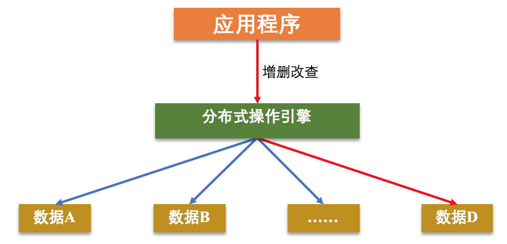

## 6.6 分布式概述

>date: 2019-12-23

### 6.6.1 `CAP`理论

1. 一致性(`C：Consistency`)

**一致性**是指所有节点在同一时刻的数据是相同的，即更新操作执行结束并响应用户完成后，所有节点存储的数据会保持相同。

在分布式环境下，一致性是指数据在多个副本之间能否保持一致的特性。在一致性的需求下，当一个系统在数据一致的状态下执行更新操作后，应该保证系统的数据仍然处于一致的状态。

在分布式系统中，如果能够做到针对一个数据项的更新操作执行成功后，所有的用户都可以读取到其最新的值，那么这样的系统就被认为具有**强一致性**。

2、可用性(`A：Availability`)

可用性是指系统提供的服务必须一直处于可用的状态，对于用户的每一个操作请求总是能够在有限的时间内返回结果。这里的重点是**有限时间内**和**返回结果**。

**有限时间内**是指，对于用户的一个操作请求，系统必须能够在指定的时间内返回对应的处理结果，如果超过了这个时间范围，那么系统就被认为是不可用的。

另外，**有限时间内**是指系统设计之初就设计好的运行指标，通常不同系统之间有很 大的不同，无论如何，对于用户请求，系统必须存在一个合理的响应时间，否则用户便会对系统感到失望。

**返回结果**是可用性的另一个非常重要的指标，它要求系统在完成对用户请求的处理后，返回一个正常的响应结果。正常的响应结果通常能够明确地反映出队请求的处理结果，即成功或失败，而不是一个让用户感到困惑的返回结果。

3、分区容错性(`P：Partition tolerance`)

分区容错性约束了一个分布式系统具有如下特性：分布式系统在遇到任何网络分区故障的时候，仍然需要能够保证对外提供满足一致性和可用性的服务，除非是整个网络环境都发生了故障。

网络分区是指在分布式系统中，不同的节点分布在不同的子网络（机房或异地网络） 中，由于一些特殊的原因导致这些子网络出现网络不连通的状况，但各个子网络的内部网络是正常的，从而导致整个系统的网络环境被切分成了若干个孤立的区域。需要注意的是，组成一个分布式系统的每个节点的加入与退出都可以看作是一个特殊的网络分区。

一个分布式系统不可能同时满足一致性(`C：Consistency`)、可用性(`A：Availability`)和分区容错性(`P：Partition tolerance`)这三个基本需求，最多只能同时满足其中两项。

**放弃`P`**：

如果希望能够避免系统出现分区容错性问题，一种较为简单的做法是将所有的数据（或者仅仅是哪些与事务相关的数据）都放在一个分布式节点上。这样做虽然无法100%保证系统不会出错，但至少不会碰到由于网络分区带来的负面影响。但同时需要注意的是，放弃P的同时也就意味着放弃了系统的可扩展性。

**放弃`A`**：

一旦系统遇到网络分区或其他故障或为了保证一致性时，放弃可用性，那么受到影响的服务需要等待一定的时间，因此在等待期间系统无法对外提供正常的服务，即不可用。

**放弃`C`**：

这里所说的放弃一致性，实际上指的是放弃数据的强一致性，而保留数据的最终一致性。这样的系统无法保证数据保持实时的一致性，但是能够承诺的是，数据最终会达到一个一致的状态。

#### 6.6.2 分布式数据存储系统

分布式存储系统的核心逻辑，就是将用户需要存储的数据根据某种规则存储到不同机器上，当用户想要获取指定数据时候，再按照规则到存储数据的机器上获取。

* **分布式存储系统三要素**

当应用程序需要访问某些数据时候，分布式操作引擎会根据一些映射规则，从存储的节点上获取指定的数据。

上面的过程就涉及到了分布式存储系统的三要素：**数据生产者/消费者**、**数据索引**、**数据存储**。

**数据生产者/消费者**：生产者负责给存储系统添加数据，而消费者则可以使用系统中存储的数据。

而不同应用场景中数据的类型、格式等都不一样。根据数据的特征，这些不同的数据通常被划分为三类：**结构化数据**、**半结构化数据**和**非结构化数据**：

- 1) **结构化数据**通常是指关系模型数据，其特征是数据关联较大、格式固定。其具有格式固定的特征，因此一般采用分布式关系数据库进行存储和查询；

- 2) **半结构化数据**通常是指非关系模型的，有基本固定结构模式的数据，其特征是数据之间关系比较简单。半结构化数据大多可以采用键值对形式来表示，一般采用分布式键值系统进行存储和使用。

- 3) **非结构化数据**是指没有固定模式的数据，其特征是数据之间关联不大。比如文本数据就是一种非结构化数据。这种数据可以存储到文档中，通过相关检索引擎进行检索。

**数据索引**：分布式存储系统中，必须有响应的数据索引规则，不然系统的响应就会非常慢，效率很低。

**数据分片技术**就是将分布式存储系统中的数据按照一定的规则将数据存储到相对应的存储节点中，同样，按照这个规则也能从相对应的节点中获取数据。

这个技术一方面需要降低单个存储节点的存储和访问压力，一方面需要有相关的规则来快速索引数据，降低搜索延迟，提高用户体验。

常见的数据分片方案有：数据范围、哈希映射、一致性哈希环等。

而**数据复制**也是一个非常重要的方法，其将数据备份到多个节点，以提高系统的可用性和可靠性。

在实际的分布式存储系统中，数据分片和数据复制通常是共存的：

- * 数据通过分片方式存储到不同的节点上，以减少单节点的性能瓶颈问题；

- * 数据的存储通常用主备方式保证可靠性，也就是对每个节点上存储的分片数据，采用主备方式存储，以保证数据的可靠性。其中，主备节点上数据的一致，是通过数据复制技术实现的。

