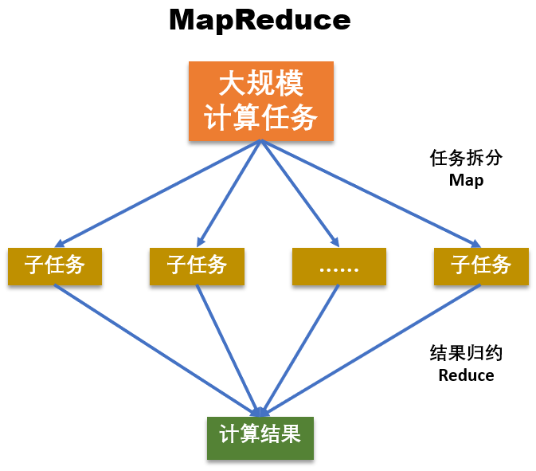
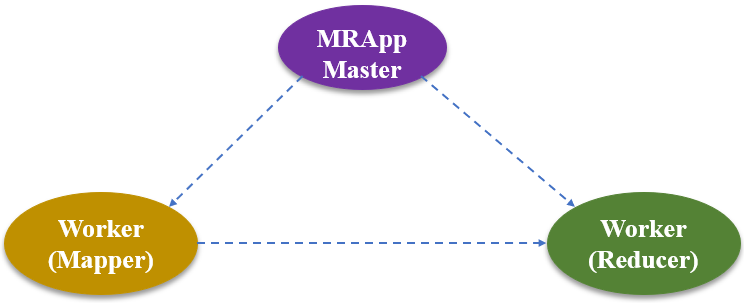
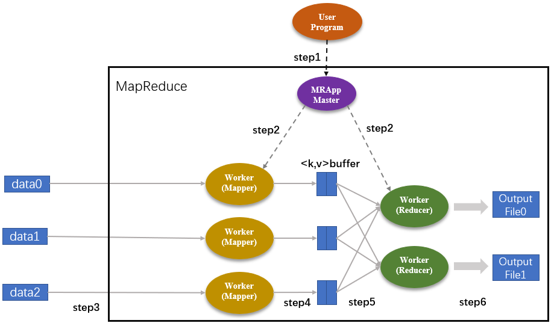
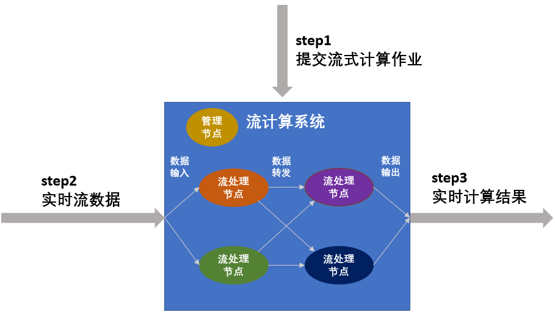
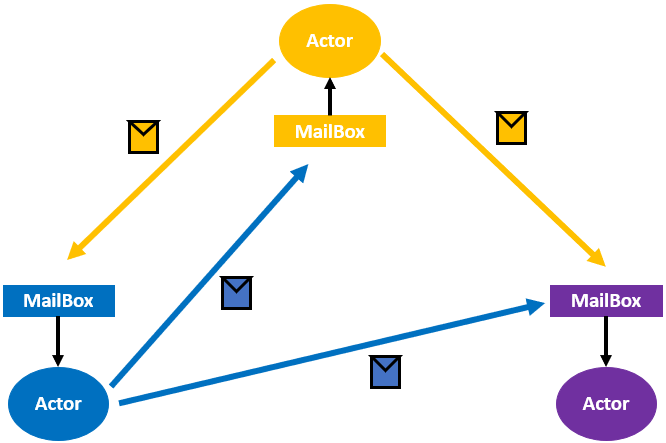

## 6.4 分布式计算模式

>date: 2019-12-16

### 6.4.1 分而治之计算模式

**分而治之**就是将一个复杂、难以直接解决的大问题，分割成一些规模较小的、可以比较简单的问题或可以直接求解的子问题，这些子问题之间相互独立并且与原问题形式相同，递归地求解这些子问题，然后将子问题的解合并得到原问题的解。

**适合的问题**：

- * 问题规模比较大或复杂，且问题可以分解为几个规模较小的、简单的同类型问题进行求解；

- * 子问题之间相互独立，不包含公共子问题；

- * 子问题的解可以合并得到原问题的解。

**核心步骤**：

- 1) **分解原问题**：将原问题分解为若干个规模较小，相互独立，且与原问题形式相同的子问题；

- 2) **求解子问题**：若子问题的规模较小且容易被解决则直接求解，否则递归地求解各个子问题；

- 3) **合并解**：将各个子问题的解合并为原问题的解。

* **`MapReduce` 模型**

- * 抽象模型

`MapReduce` 分为 `Map` 和 `Reduce` 两个核心阶段，其中 `Map` 对应**分**，即将复杂任务分解为若干个简单的任务；`Reduce` 对应着**合**，即将 `Map` 阶段的结果汇总。

- * 工作原理

- 1) `Master`，也就是 `MRAppMaster`，该模块负责分配任务，协调任务的运行，并为 `Mapper` 分配 `map()` 函数操作、为 `Reducer` 分配 `reduce()` 函数操作；

- 2) `Mapper worker`，负责 `Map` 函数功能，即负责执行子任务。

- 3) `Reducer worker`，负责 `Reduce` 函数功能，即负责汇总各个子任务的结果。

- * 工作流程

- 1) `step1`：`User Program` 将任务下发到 `MRAppMaster` 中。然后，`MRAppMaster` 执行任务拆分步骤，把 `User Program` 下发的任务划分成 `M` 个子任务（`M` 是用户自定义的数值）；

- 2) `step2`：`MRAppMaster` 分别为 `Mapper` 和 `Reducer` 分配相应的 `Map` 和 `Reduce` 作业。`Map` 和 `Reduce` 作业的数量就是划分后的子任务数量；

- 3) `step3`：被分配了 `Map` 作业的 `Worker`，开始读取子任务的输入数据，并从输入数据中抽取出 `<key, value>` 键值对，每一个键值对都作为参数传递给 `map()` 函数；

- 4) `step4`：`map()` 函数的输出结果存储在环形缓冲区 `kvBuffer` 中，这些 `Map` 结果会被定期写入本地磁盘中，被存储在 `R` 个不同的磁盘区。这里的 `R` 表示 `Reduce` 作业的数量，也是由用户定义的。此外，每个 `Map` 结果的存储位置都会上报给 `MRAppMaster`。

- 5) `step5`：`MRAppMaster` 通知 `Reducer` 它负责的作业在哪一个分区，`Reducer` 远程读取相应的 `Map` 结果，即中间键值对。当 `Reducer` 把它负责的所有中间键值对都读过来后，首先根据键值对的 `key` 值对中间键值对进行排序，将相同 `key` 值的键值对聚集在一起，从而有利于 `Reducer` 对 `Map` 结果进行统计。

- 6) `step6`：`Reducer` 遍历排序后的中间键值对，将具有相同 `key` 值的键值对合并，并将统计结果作为输出文件存入负责的分区中。

整个 `MapReduce` 的工作流程主要可以概括为 `5` 个阶段，即：`Input`（输入）、`Splitting`（拆分）、`Mapping`（映射）、`Reducing`（化简）以及 `Final Result`（输出）。

**特点**：可以进行大规模扩展，适合大型计算机集群；拆分后的任务，可以扩多个计算机执行，并且各个小任务之间不会相互通信。

### 6.4.2 流计算模式

**流数据**：如流水般涌现的，需要实时处理的数据。流数据具有以下的特点：

1) 数据如流水般持续，快速地到达；

2) 海量数据规模，数据量可达 `TB` 级甚至 `PB` 级别；

3) 对实时性要求高，随着时间流逝，数据的价值会答复降低；

4) 数据顺序无法保证，系统无法控制将要处理的数据元素的顺序。

在分布式领域，处理流数据的计算模式叫做**流计算**，也叫** `Stream` **。

流计算一般用于处理数据密集型的应用。

* **`Stream` 工作原理**

流计算强调实时性，数据一旦产生就会被立即处理，当一条数据被处理完成后，会序列化存储到缓存中，然后立即通过网络传输到下一个节点，由下一个节点继续处理。

流计算中不会存储任何数据，属于持续性、低时延、事件驱动型的计算作业。

流计算的过程一般包括 `3` 个步骤：

- 1) **提交流式计算作业**：常驻服务进行流式计算作业，由于收集的是同一类型的数据，执行相同的工作，且不提供数据存储服务，所以流式计算的处理逻辑不可以更改，并且之前计算完成的数据无法重新再次计算；

- 2) **加载流式数据进行计算**：作业一旦启动，就一直处于等待时间触发的状态，一有数进入流式数据存储，系统立即执行计算逻辑并迅速得到结果。

- 3) **持续输出计算结果**：流式计算不提供流式数据的存储服务，数据是持续流动的，在计算完后就丢弃。对数据处理有较高的实时性要求，所以需要流计算框架必须是低延迟、可扩展、高可靠的。

### 6.4.3 `Actor` 计算模式

* **`Actor` 模型**

一种分布式并行计算模型，规定了 `Actor` 内部的计算逻辑和多个 `Actor` 之间的通信规则。多个 `Actor` 之间通过消息进行通信，`Actor` 接收到消息后，根据消息去执行计算操作，`Actor` 相当于系统的一个组件，都是基本的计算单元。

`Actor` 通过消息通信，采用异步的方式，能够克服类似 `OOP` 中同步访问时，出现的死锁、竞争等问题，适合高并发的分布式系统。

* **`Actor` 计算模型**

`Actor` 模型的三要素是**状态、行为、消息**，即 `Actor` 模型 = （状态 + 行为） + 消息。

- * **状态(`State`)**：`Actor` 的状态指的是 `Actor` 组件本身的信息，相当于 `OOP` 对象中的属性。`Actor` 的状态会受 `Actor` 自身行为的影响，且只能被自己修改。

- * **行为(`Behavior`)**：`Actor` 的行为指的是 `Actor` 的计算处理操作，相当于 `OOP` 对象中的成员函数。`Actor` 之间不能直接调用其他 `Actor` 的计算逻辑。`Actor` 只有收到消息才会触发自身的计算行为。

- * **消息(`Mail`)**：`Actor` 的消息以邮件形式在多个 `Actor` 之间通信传递，每个 `Actor` 会有一个自己的邮箱(`MailBox`)，用于接收来自其他 `Actor` 的消息，因此 `Actor` 模型中的消息也称为**邮件**。一般情况下，对于邮箱里面的消息，`Actor` 是按照消息达到的**先后顺序(`FIFO`)**进行读取和处理的。

* **`Actor` 关键特征**

- * **实现了更高级的抽象**：`Actor` 封装了状态和行为，`Actor` 之间是异步通信的，多个 `Actor` 可以独立运行且不会被干扰，解决了 `OOP` 存在的竞争问题。

- * **非阻塞性**：`Actor` 之间是异步通信的，所以当一个 `Actor `发送信息给另外一个 `Actor` 之后，无需等待响应，发送完信息之后可以在本地继续运行其他任务，即通过消息传递机制，从而避免了阻塞。

- * **无需使用锁**：`Actor` 从 `MailBox` 中一次只能读取一个消息，也就是说，`Actor` 内部只能同时处理一个消息，是一个**天然的互斥锁**，所以无需额外对代码加锁。

- * **并发度高**：每个 `Actor` 只需处理本地 `MailBox` 的消息，因此多个 `Actor` 可以并行地工作，从而提高整个分布式系统的并行处理能力。

- * **易扩展**：每个 `Actor` 都可以创建多个 `Actor`，从而减轻单个 `Actor` 的工作负载。当本地 `Actor` 处理不过来的时候，可以在远程节点上启动 `Actor` 然后转发消息过去。

* **`Actor` 模型不足**

- * 提供了模块和封装，但缺少继承和分层。即使多个 `Actor` 之间有公共逻辑或代码部分，都必须在每个 `Actor` 中重写这部分代码，重用性小，业务逻辑的改变会导致整体代码的重写。

- * `Actor` 可以动态创建多个 `Actor`，使得整个 `Actor` 模型的行为不断变化，因此在工程中不易实现 `Actor` 模型。此外，增加 `Actor` 的同时，也会增加系统开销。

- * `Actor` 模型不适用于对消息处理顺序有严格要求的系统。因为在 `Actor` 模型中，消息均为异步消息，无法确定每个消息的执行顺序。虽然可以通过阻塞 `Actor` 去解决顺序问题，但会严重影响 `Actor` 模型的任务处理效率。