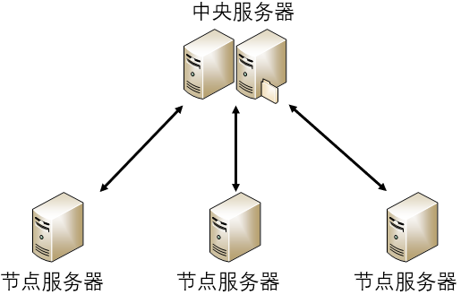
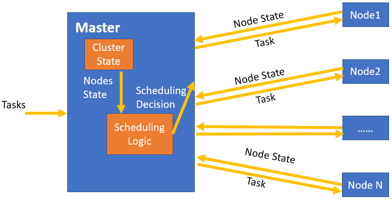
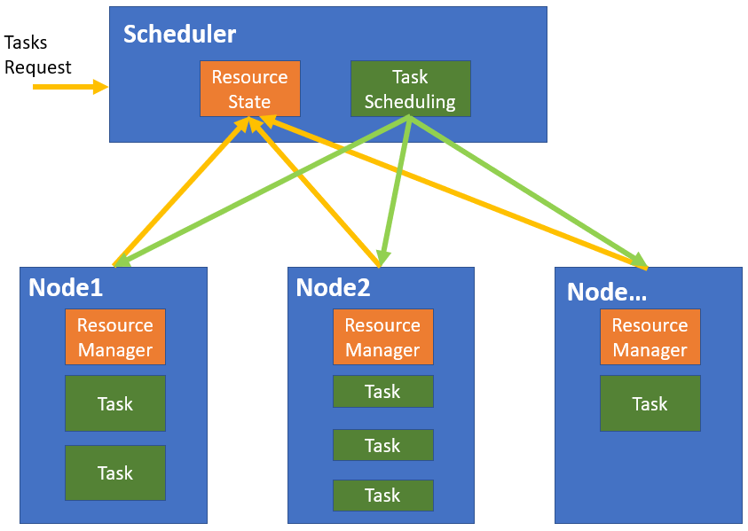
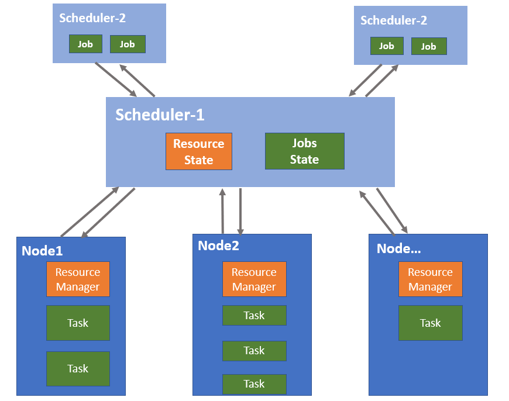
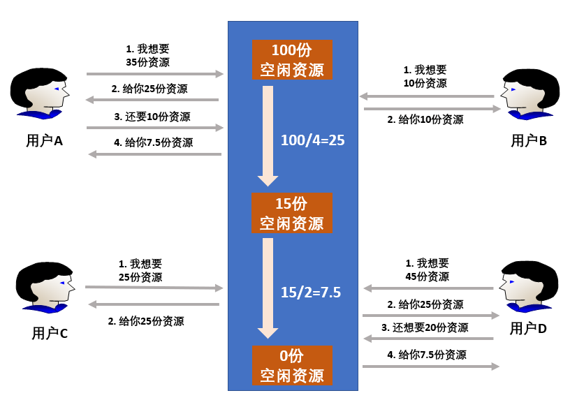
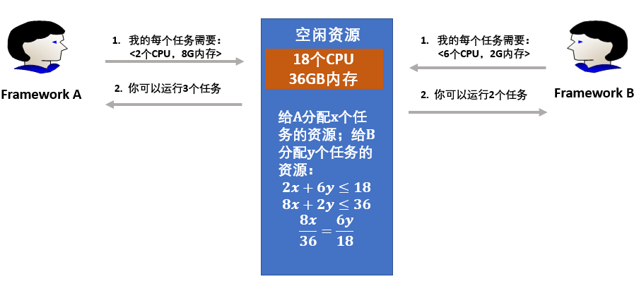
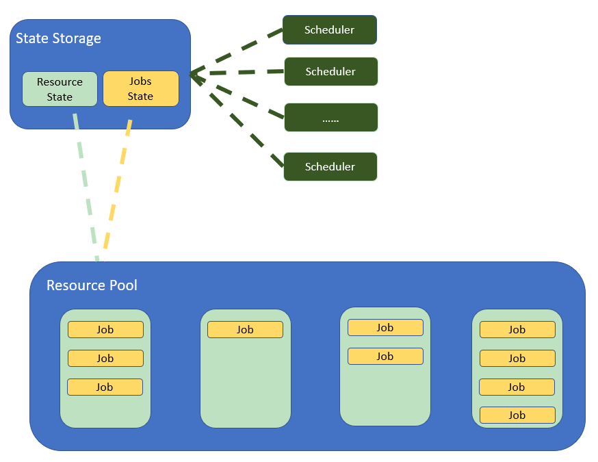

## 6.3 分布式资源管理和负载调度

>date: 2019-12-15

### 6.3.1 分布式体系结构

#### 集中式结构

**集中式结构**(也称为 `Master/Slave` 架构)就是由一台或多台服务器组成中央服务器，系统内的所有数据都存储在中央服务器中，系统内所有的业务也均先由中央服务器处理。

多个节点服务器与中央服务器连接，并将自己的信息汇报给中央服务器，由中央服务器统一进行资源和任务调度：中央服务器根据这些信息，将任务下达给节点服务器；节点服务器执行任务，并将结果反馈给中央服务器。

**特点**：**部署结构简单**，中央服务器进行统一管理和调度任务，无需考虑对任务的多节点部署，而节点服务器之间无需通信和协作，只要与中央服务器通信协作即可。

常见**集中式集群管理系统**：`Google Borg`、`Kubernetes`、`Apache Mesos`。

#### 非集中式结构

**非集中式结构**将服务的执行和数据的存储分散到不同的服务器集群，服务器集群间通过消息传递进行通信和协调。

在这结构中，没有中央服务器和节点服务器之分，所有的服务器地位都是平等的。

相比于集中式结构，非集中式结构降低了某一个或莫一簇计算机集群的压力，在解决单点瓶颈和单点故障问题的同时，还提升了系统的并发度。

* `Gossip` 协议

**`Gossip` 协议** 也叫 `Epidemic Protocol`(流行病协议)、流言算法、疫情传播算法等。

`Gossip` 的原理是每个节点周期性地从自己维护的集群节点列表中，随机选择 `k` 个节点，将自己存储的数据信息发给这 `k` 个节点，接收到该信息的节点基于某些**共识原则**，对收到的数据和本地数据进行合并。这样迭代几个周期后，集群中所有节点上的数据信息就一致了。

这个过程可能需要一定的时间，由于不能保证某个时刻所有节点都收到消息，但是理论上最终所有节点都会收到消息，因此它是一个**最终一致性**协议。

常见的**非集中式架构系统**：`Akka` 集群、`Redis` 集群和 `Cassandra` 集群。

### 6.3.2 分布式调度架构

为用户任务寻找合适的服务器这个过程，在分布式领域中叫作**调度**。在分布式系统架构中，**调度器**就是一个非常重要的组件，它通常会提供多种调度策略，负责完成具体的调度工作。

#### 单体调度

**单体调度**是指一个集群中只有一个节点运行调度进程，该节点对集群中的其他节点具有访问权限，可以搜集其他节点的资源信息、节点状态等进行统一管理，同时根据下发的任务对资源的需求，在调度器中进行任务与资源匹配，然后根据匹配结果将任务指派给其他节点。

**单体调度器拥有全局资源视图和全局任务，可以很容易地实现对任务的约束并实施全局性的调度策略**。目前如 `Google Borg`、`Kubernetes` 等很多集群管理系统采用了单体调度设计。

上图是一个典型的单体调度框架。其中 `Master` 节点上运行了调度进程，其负责资源管理、`Tasks` 和资源匹配等工作。

而 `Node1`、`Node2`、`...`、`NodeN` 对应着 `Master/Slave` 架构中的 `Slave` 节点。

`Slave` 节点会将 `Node State` 上报给 `Master` 节点中的 `Cluster State` 模块，`Cluster State` 模块用于管理集群中节点的资源等状态，并将节点的资源状态传送给 `Scheduling Logic` 模块，以便 `Scheduling Logic` 模块进行 `Tasks` 与资源匹配，并根据匹配结果将 `Task `发送给匹配到的节点。

* **单体调度设计**

在集群管理中，单体调度模块称为 `Scheduler` 或**单体调度器**。单体调度器也叫作**集中式调度器**，指的是使用中心化的方式去管理资源和调度任务。

调度器本身在系统中以**单实例**形式存在，所有的资源请求和任务调度都通过这个实例进行。**集中式调度器模型**中，资源的使用状态和任务的执行状态都**由调度器进行管理**。

**特点**：单体调度器拥有全局资源视图和全局任务，可以容易地实现对任务的约束并实施全局性的调度策略。但是其同样存在**单点瓶颈**和**单点故障**的问题。

#### 两层调度

单体调度架构会随着任务类型的增加而变得越来越复杂，最终出现扩展瓶颈。为了提升调度效率并支持多种类型的任务，就出现了两层调度。

**两层调度架构**就是将资源了任务管理分开调度，即一层调度其只负责**资源管理和分配**，另一层调度器**负责任务和资源的匹配**。

资源的使用状态同时由中央调度器和第二层调度器管理，中央调度器从整体上进行资源的管理与分配，将资源分配到第二层调度器；再由第二层调度器负责将资源与具体的任务配对，因此第二层调度可以有多个调度器，以支持不同的任务类型。

如下图所示，`Scheduler-1` 表示第一层调度，负责收集和管理集群中的资源信息；`Scheduler-2` 表示第二层调度，`Scheduler-1` 会将集群资源发送给 `Scheduler-2`，然后 `Scheduler-2` 根据任务的资源需求和 `Scheduler-1` 发送的资源信息进行任务匹配和调度。

两层调度器中的第一层调度器仍是一个经简化的中央调度器，通常放在分布式集群管理系统中，而第二层调度则是由各个应用程序框架完成。

两层调度器的职责分别是：第一层调度器负责管理资源并向框架分配资源，第二层调度器接收分布式集群管理系统中第一层调度器分配的资源，然后根据任务和接收到的资源进行匹配。

采用两层调度结构的集群管理系统有很多，典型代表是 `Apache Mesos` 和` Hadoop YARN`。

* **资源分配算法**

- * **最大最小公平算法(`Max-min Fairness`，`MMF`)**

这个算法有 `3` 个主要原则：

- 1) 按照用户对资源需求量递增的顺序进行空闲资源分配；

- 2) 不存在用户得到的资源超过自己需求的情况；

- 3) 对于分配的资源不满足需求的用户，所获得的资源是相等的。

在执行资源分配时，最大最小公平算法按照上述 `3` 条原则进行多次迭代，每次迭代中资源均平均分配，如果还有剩余资源，就进入下一次迭代，一直到所有用户资源得到满足或集群资源分配完毕，迭代结束。

最大最小公平算法采用了绝对公平的方式分配资源，会导致大量的资源浪费。

比如用户需求量为 `35` 和 `45` 的用户 `A` 和用户 `D`，均分配了 `32.5` 的空闲资源，但由于资源不满足需求，这两个用户均无法使用。

- * **主导资源公平算法(`Dominant Resource Fairness`，`DRF`)**

主导资源公平算法在考虑用户公平性的前提下，还考虑了用户对不同资源类型的需求，以尽可能地合理分配资源，即尽可能地满足更多的用户。

针对多种资源的需求，主导资源公平算法首先计算已经分配给用户的每一种资源的占用率(`Resource Share`)，比如已经分配的 `CPU` 占总资源量的多少，已经分配的内存占总资源量的多少。所有资源占用率中的最大值称作该用户的**主导资源占用率**，而主导资源占用率对应的资源就是用户的主导资源。

如下图所示，假设系统中的资源共包括 `18` 个 `CPU` 和 `36 GB` 内存，有两个 `Framework`(`Framework A` 和 `Framework B`)分别运行了两种任务，假设 `Framework A` 运行内存密集型任务，`Framework B` 运行 `CPU` 密集型任务，且每个任务所需要的资源量是一致的，分别是 `<2 CPU, 8 GB>` 和 `<6 CPU, 2 GB>`。

- 1) 计算资源分配量。

假设 `x` 和 `y` 分别是 `Framework A` 和 `Framework B` 分配的任务数，那么 `Framework A` 消耗的资源为`{2x CPU，8x GB}`，`Framework B` 消耗的资源数为`{6y CPU，2y GB}`，分配给两个 `Framework` 的总资源量为 `2x+6y` 个 `CPU` 和 `8x+2y GB` 内存。

- 2) 确定主导资源。

对于 `Framework A` 来说，每个任务要消耗总 `CPU` 资源的 `2/18`，总内存资源的 `8/36`，**所以 `Framework A` 的主导资源为内存**；对于 `Framework B` 来说，每个任务要消耗总 `CPU` 资源的` 6/18` 和总内存资源的 `2/36`，**因而 `Framework B` 的主导资源为 `CPU`**。

- 3) `DRF` 算法的核心是平衡所有用户的主导资源占用率，尽可能试图最大化所有用户中最小的主导资源占用率。

通过求解公式 `8x/36=6y/18`，可以计算出 `Framework A` 和 `Framework B` 分配的任务数，并且要在满足公式的条件下，使得 `x` 和 `y` 越大越好。

通过求解可以得出：`x=3`，即 `Framework A` 可以运行 `3` 个任务；`y=2`，即 `Framework B` 可以运行 `2` 个任务。这样分配的话，每个 `Framework` 获取了相同比例的主导资源，即：`A` 获取了 `2/3` 的内存，`B` 获取了 `2/3` 的 `CPU`，从而在主导资源上体现了调度算法的公平性。

在实际任务分配过程中，主导资源率是根据已经分配给 `Framework` 的资源，占集群中总资源量的多少进行计算的，并且在每次分配过程中，会选择主导资源最小的 `Framework` 进行分配，也就是试图最大化所有用户中最小的主导资源占用率。

最大最小公平算法适用于**单一类型的资源分配场景**，而主导资源公平算法适用于**多种类型资源混合的场景**。并且，最大最小公平算法**从公平的角度出发**，为每个用户分配不多于需求量的资源；而主导资源公平算法**从任务的角度出发**，目的在于尽量充分利用资源使得能够执行的任务越多越好。

#### 共享状态调度

集群中需要管理的对象主要包括两种：资源的分配和使用状态；任务的调度和执行状态。

**单体调度**中，这两种对象都是由单体调度器管理的，因此可以比较容易地保证全局状态的一致性，但问题是**可扩展性较差**（支持业务类型受限），且存在**单点瓶颈**问题。

**两层调度**中，这两种对象分别由第一层中央调度器和第二层 `Framework` 调度器管理，由于 `Framework` 调度器只能看到部分资源，因此**不能保证全局状态的一致性**，也**不容易实现全局最优的调度**。

**共享状态调度器**沿袭了单体调度器的模式，通过将多个单体调度器分解为多个调度器，每个调度器都有全局的资源状态信息，从而实现最优的任务调度。在支持多种任务类型的同时，还能拥有全局的资源状态信息。

共享状态调度架构为了提供高可用性和可扩展性，将集群状态之外的功能抽出来作为独立的服务。具体来说就是：

- * `State Storage` 模块（资源维护模块）负责存储和维护资源及任务状态，以便 Scheduler 查询资源状态和调度任务；

- * `Resource Pool` 即为多个节点集群，接收并执行 Scheduler 调度的任务；

- * `Scheduler` 只包含任务调度操作，而不是像单体调度器那样还需要管理集群资源等。

共享状态调度也支持多种任务类型，但**与两层调度架构相比**，主要有两个不同之处：

- * 存在多个调度器，每个调度器都可以拥有集群全局的资源状态信息，可以根据该信息进行任务调度；

- * 共享状态调度是**乐观并发调度**，在执行了任务匹配算法后，调度器将其调度结果提交给 `State Storage`，由其决定是否进行本次调度，从而解决竞争同一种资源而引起的冲突问题，实现全局最优调度。而两层调度是**悲观并发调度**，在执行任务之前避免冲突，无法实现全局最优匹配。

**优点**：解决了单体调度架构中，中央服务器的单点瓶颈问题；解决了两层调度中任务匹配无法达到全局最优的问题，可扩展性强。

**缺点**：存在潜在的资源冲突问题，实现复杂。