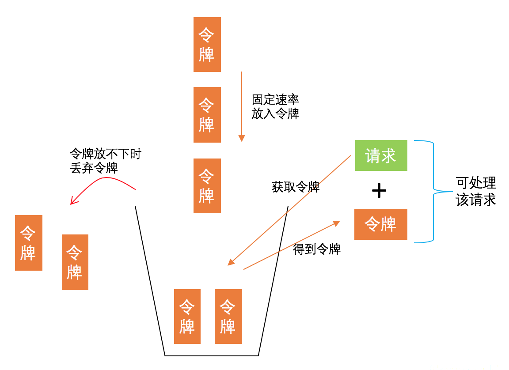

## 6.7 分布式高可靠

>date: 2019-12-29

### 6.7.1 负载均衡

负载均衡 （`Load Balance`），其意思就是将负载（工作任务）进行平衡、分摊到多个操作单元上进行执行

分布式系统中，服务请求的负载均衡是指，当处理大量用户请求时，请求应尽量均衡地分配到多台服务器进行处理，每台服务器处理其中一部分而不是所有的用户请求，以完成高并发的请求处理，避免因单机处理能力的上限，导致系统崩溃而无法提供服务的问题。

比如，有 `N` 个请求、`M` 个节点，负载均衡就是将 `N` 个请求，均衡地转发到这 `M` 个节点进行处理。

通常情况下，计算机领域中，在不同层有不同的负载均衡方法。比如，从网络层的角度，通常有基于 `DNS`、`IP` 报文等的负载均衡方法；在中间件层，常见的负载均衡策略主要包括**轮询策略**、**随机策略**、**哈希和一致性哈希**等策略，下面也是着重介绍中间件层的策略。

* **轮询策略**

- * **顺序轮询**

顺序轮流进行请求一次每个服务器，并循环进行该过程。

例如：假设有 `6` 个请求，编号为请求 `1~6`，有 `3` 台服务器可以处理请求，编号为服务器 `1~3`，如果采用顺序轮询策略，则会按照服务器 `1`、`2`、`3` 的顺序轮流进行请求。最终的处理结果是，服务器 `1` 处理请求 `1` 和请求 `4`，服务器 `2` 处理请求 `2` 和请求 `5`，服务器 `3` 处理请求 `3` 和请求 `6`。

- * **加权轮询**

为每个服务器设置了优先级，每次请求过来时会挑选优先级最高的服务器进行处理。

例如：假设服务器 `1~3` 分配了优先级`{4，1，1}`，一共有 `6` 个请求到来：

- 1) 请求 `1` 由优先级最高的服务器 `1` 处理，服务器 `1` 的优先级相应减 `1`，此时各服务器优先级为`{3，1，1}`；

- 2) 请求 `2` 由目前优先级最高的服务器 `1` 进行处理，服务器 `1` 优先级相应减 `1`，此时各服务器优先级为`{2，1，1}`。

- 3) 以此类推，直到处理完这 `6` 个请求。每个请求处理完后，相应服务器的优先级会减 `1`。最终的处理结果是，服务器 `1` 处理请求 `1~4`，服务器 `2` 处理请求 `5`，服务器 `3` 会处理请求 `6`。

`Nginx` 默认的负载均衡策略就是一种改进的加权轮询策略。

**优点**：实现简单，且对于请求所需开销差不多时，负载均衡效果比较明显，同时加权轮询策略还考虑了服务器节点的异构性，即可以让性能更好的服务器具有更高的优先级，从而可以处理更多的请求，使得分布更加均衡。

**缺点**：每次请求到达的目的节点不确定，不适用于有状态请求的场景。并且，轮询策略主要强调请求数的均衡性，所以不适用于处理请求所需开销不同的场景。

* **随机策略**

当用户请求到来时，随机分发到某个服务节点进行处理，即让请求尽可能分散到不同节点，防止有请求放在同一节点或少量几个节点上。

**优点**：实现简单。

**缺点**：每次请求到达的目的节点不确定，不适用于有状态的场景，而且没有考虑到处理请求所需开销。没有考虑服务器节点的异构性，即性能差距较大的服务器可能处理的请求差不多。

**随机策略**与**轮询策略**相同，适用于集群中服务器节点处理能力相差不大，**用户请求所需资源比较接近的场景**。

* **哈希和一致性哈希策略**

**随机策略**和**轮询策略**都无法保证一个客户端的多次请求都落在同一个服务器，如果这是一个请求缓存服务器的请求，那么就很可能对缓存同步带来很大的挑战。

如果无法保证结果都来自同一台缓存服务器，在系统繁忙的时候，主从延迟带来同步缓慢会导致同一客户端两次相同的请求的到不同的结果。

使用**哈希与一致性哈希策略**的目的就是让数据的存储均匀和数据请求的均匀。

**优点**：哈希函数设置合理的话，负载会比较均衡。而且，相同 `key` 的请求会落在同一个服务节点上，可以用于有状态请求的场景。除此之外，带虚拟节点的一致性哈希策略还可以解决服务器节点异构的问题。

**缺点**：当某个节点出现故障时，采用**哈希策略**会出现数据大规模迁移的情况，采用**一致性哈希策略**可能会造成一定的数据倾斜问题。同时，这两种策略也没考虑请求开销不同造成的不均衡问题。

### 6.7.2 流量控制

在一些高并发、大流量的场景下，服务器的处理能力成为了整个的系统的瓶颈，如果处理不好就会导致系统崩溃，服务不可用，这时候**流量控制**就十分关键了。

**分布式流量控制**就是在分布式系统下，控制每个服务器接收的请求数，以保证服务器来得及处理这些请求，也就是说尽可能保证用户请求持续地被处理，而不是让大量的用户请求**阻塞**在服务器中，等待被执行。

* **消息队列**

这也是一种**流量控制**的方法，通过一个队列来存放用户请求，然后服务器到消息队列中逐个消费，可以避免消息过多时服务处理压力过大的问题。

* **漏桶策略**

**漏桶策略**(`Leaky Bucket`)主要目的是控制数据注入到网络的速率，平滑网络上的突发流量。

其先将请求先进入到漏桶里，漏桶以一定的速度出水，当水请求过大会直接溢出。这样能强行限制数据的传输速率，突发流量可以被整形以便为网络提供一个稳定的流量。这是一种**宽进严出**的策略。

漏桶策略**适用于间隔性突发流量且流量不用即时处理的场景**，即可以在**流量较小时的空闲期，处理大流量时流入漏桶的流量**。

**不适合流量需要即时处理的场景**，即突发流量时可以放入桶中，但缺乏效率，始终以固定速率进行处理。

* **令牌桶策略**

**令牌桶策略**(`Token Bucket`)是网络流量整形(`Traffic Shaping`)和速率限制(`Rate Limiting`)中最常使用的一种算法。

典型情况下，令牌桶算法用来控制发送到网络上的数据的数目，并允许突发数据的发送。

首先存在一个固定容量的桶存放令牌，以固定的速率往桶中放入令牌，而当桶满的收就会丢弃多余的令牌。当请求到来时，必须先从桶汇总取出一个令牌才能被服务器处理。

当有**突发大流量**时，只要令牌桶里有足够多的令牌，请求就会被迅速执行。通常情况下，**令牌桶容量的设置，可以接近服务器处理的极限**，这样就可以有效利用服务器的资源。

令牌桶策略**适用于有突发特性的流量，且流量需要即时处理的场景**。

### 6.7.3 故障隔离

在分布式系统中，**故障隔离**就是采用一定的策略，以实现当某个模块故障时，不会影响其他模块继续提供服务，以**保证整个系统的可用性**。

故障隔离，可以避免分布式系统出现大规模的故障，甚至是瘫痪，降低损失。

* 分布式故障隔离策略

- 1) 以系统功能模块为粒度进行隔离

通过系统功能/服务进行划分，将系统分为多个功能/服务模块，各个功能/模块之间实现松耦合，当一个功能/服务出现故障时候，不会影响其他功能/服务模块。

根据功能模块/服务是由线程执行或进程执行的，通常分为线程级隔离、进程级隔离。

- 2) 通过资源隔离来实现

系统中各个模块拥有自己独立的资源，不会发生资源争抢，从而大大提升系统性能。

根据资源所属粒度，通常分为进程级隔离（比如采用容器隔离）、虚拟机隔离、服务器隔离和机房隔离等。

* 线程级隔离

线程级故障隔离，是指使用不同的线程池处理不同的请求任务。当某种请求任务出现故障时，负责其他请求任务的线程池不会受到影响，即会继续提供服务，从而实现故障的隔离。

线程级的故障隔离策略，在生产环境中较为常用，尤其对于单体应用（单进程多线程的应用）。在单体应用场景下，应用被单个进程执行，但单进程中包括多个线程，因此该场景下，只需要实现线程级隔离即可，实现简单、效果好，因此是一种很常用的方式。

系统实现线程级隔离后，线程间的通信通常使用**共享变量**来实现。

* 进程级隔离

将系统按照功能分为不同的进程，分布到相同或不同的机器中。

如果系统的进程分布到不同机器上的话，从资源的角度来看，也可以说成是主机级的故障隔离。

因为系统分布在不同的机器上，当某个机器出现故障时，不会对其他机器造成影响。

系统实现进程级隔离后，进程间的协同必须通过进程间通信(`IPC`)来实现。如果进程都在同一台机器上，则可以通过管道、消息队列、信号量、共享内存等方式，来实现；如果进程分布在不同机器上，则可以通过远程调用来实现。

* 资源隔离

资源隔离就是将分布式系统的所有资源分成几个部分，每部分资源负责一个模块，这样系统各个模块就不会争抢资源，即资源之间互不干扰。这种方式不仅可以提高硬件资源利用率，也便于系统的维护与管理，可以大幅提升系统性能。

微服务就是一个典型的例子，在微服务的理念中，是尽可能将服务最小化，服务与服务之间进行解耦合，包括运行环境的相互隔离等。在微服务中，一个服务通常对应一个容器，而一个容器其实就是操作系统中一个进程，不同容器负责不同的服务，类似不同进程负责系统不同的功能模块。

与进程级隔离不同的是，微服务框架采用容器进行故障隔离。容器虽然本质上是操作系统的一个进程，**但具备普通进程不具备的特性，比如资源隔离**。

容器可以实现资源限制，让每个容器占用的资源都有一个上限，比如 `CPU`、内存，均会设置一个上限值，这个上限值限定了该容器的处理能力，就好比一台服务器具有资源上限值一样。

因此，一个容器使用的资源不会影响其他容器的资源，从而避免资源争抢，提高性能。

容器是一种**虚拟化技术**，可以为应用提供一整套运行环境，其通过限制自身使用的资源来实现资源隔离。

* 其它隔离方式

**虚拟机级别的隔离**也是资源隔离的一种常用手段，一台物理机可以安装多个虚拟机，每个虚拟机都会分配一定的资源，即进行资源隔离。

**主机级别的隔离**也可以说是一种资源隔离，每台机器的资源是独享的，不会与其他机器发生资源争夺，从而做到资源隔离。

**集群隔离、机房隔离**等也是一些更粗力度的隔离策略，这些策略主要是跨集群或跨地域的隔离策略。这些粗粒度的隔离策略，不仅可以根据系统功能/服务等维度对系统进行划分，比如每个功能/服务由一个集群或一个机房单独负责，而且也是一种资源隔离策略，即集群间或机房间资源互相隔离，不会发生资源争夺，互不影响。