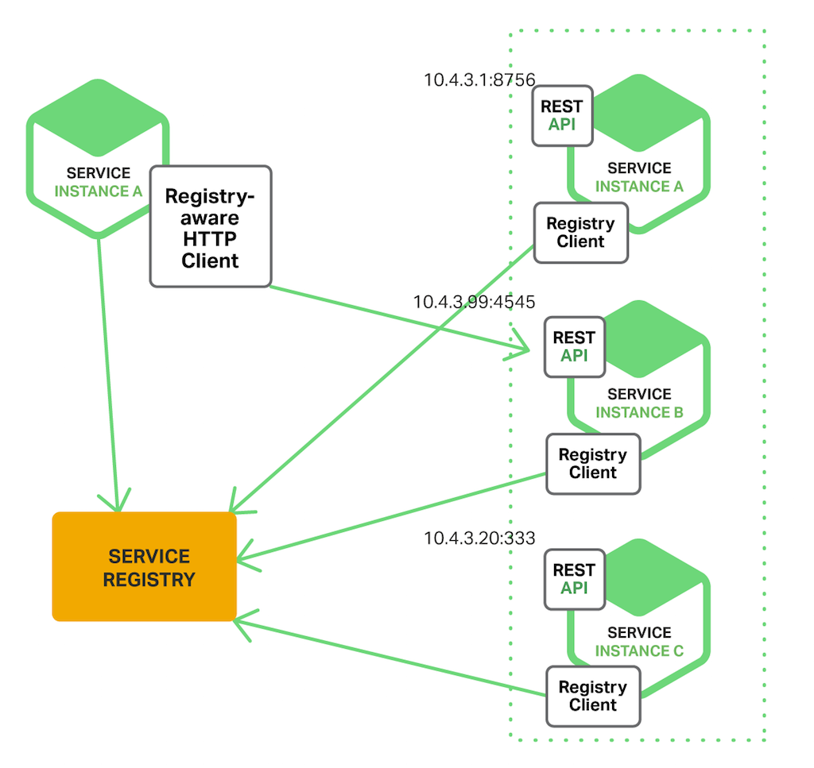
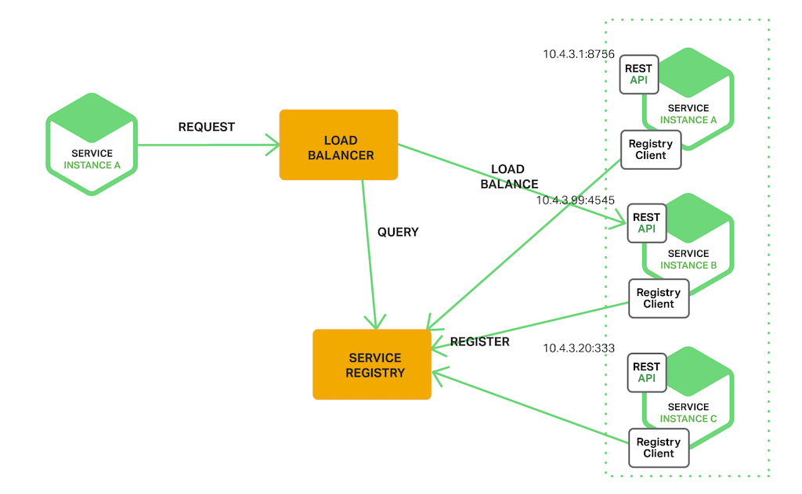

## 6.6 微服务

>date: 2019-05-18


`REST/RPC`和序列化
服务注册和发现
负载均衡 策略
容错保护 熔断 服务调用方配置熔断 网关配置服务降级
API网关 路由规则 限流 认证和鉴权
配置中心
消息总线
CI/CD
服务监控 监控日志
链路追踪 标明上下游请求的关系
服务容器 Docker

### 6.6.1 微服务架构

微服务是具有业务功能、拥有自己的处理机制和轻量通讯机制、松耦合、有一定的有界上下文的小型服务架构。

相对于单体架构和`SOA`，它的主要特点是组件化、松耦合、自治、去中心化。

* 一组小的服务

服务粒度小，每个服务是针对单一的业务进行封装。

* 服务能独立部署运行和扩展

每个服务能够独立被部署并运行在一个进程内，能够赋予系统灵活的代码组织方式和发布节奏，可以进行快速交付。

* 独立开发和演化

技术选型灵活，不受遗留系统技术约束。合适的业务问题选择合适的技术可以独立演化。服务与服务之间采取与语言无关的`API`进行集成。

* 独立团队和自治

团队对服务的整个生命周期负责，工作在独立的上下文中，自己决策自己治理，而不需要统一的指挥中心。团队和团队之间通过松散的社区部落进行衔接。

微服务就是通过解耦系统中各个业务模块，分而治之以减少不必要的损耗，使得整个复杂的系统和组织能够快速的应对变化。

#### 微服务优点和缺点

* 优点

1. 每个服务聚焦一个指定的业务功能或业务需求；

2. 能够被小团队单独开发；

3. 是松耦合的，是有功能意义的服务，无论是在开发阶段或部署阶段都是独立的；

4. 能使用不同的语言开发；

5. 允许容易且灵活的方式通过持续集成工具进行集成自动部署；

6. 易于被一个开发人员理解，修改和维护；

7. 允许利用融合最新技术；

8. 能够即时被要求扩展；

9. 能部署中低端配置的服务器上；

10. 易于和第三方集成；

11. 有自己的存储能力，或者使用统一的数据库。

* 缺点

1. `DevOps`难度加大，当服务数量增加，管理复杂性增加；

2. `CAP`原理的约束，无法实现强一致性，追求最终一致性具有一定挑战；

3. 服务更改，需要协调依赖于被依赖的服务。

### 6.6.2 服务间通信

* 同步调用

同步调用比较简单，一致性强，但是容易出调用问题，性能体验上也会差些，特别是调用层次多的时候。

* 异步调用
异步消息的方式既能减低服务之间的耦合，又能成为服务调用之间的缓冲，确保消息积压不会冲垮被调用方，同时能保证调用方的服务体验，不被后台性能拖慢。

但需要付出的代价是一致性的减弱，需要接受数据最终一致性；后台服务同时需要实现幂等性。

* `REST`和`RPC`

`REST`一般基于`HTTP`，更容易实现和被接受，服务端实现技术灵活，支持多语言，同时能跨客户端。

但`RPC`也有自己的优点，传输协议更高效，安全更可控。

#### `gRPC`和`protobuf`

传统的`RESTful API`形式的通信协议，无法保证进行双向实时的通信，同时默认同步性、顺序的特性迫使其采用消息队列进行反向通信，遇到性能问题就需要花大力气优化。

`gRPC`是`Google`发明的一套使用`HTTP/2`的全部能力的基于`RPC`语义的协议，得益于`HTTP/2`所支持的服务端推送功能，它可以用一条持久连接同时支持请求、响应逻辑 和双向的消息流。

* `protobuf`

`gRPC`采用广泛使用的`protobuf`来编码过程调用信息，它本质上是一种可变长编码方式，内部用固定的标签、类型、域位置信息来编码基本的消息结构， 提供有效的信息压缩的同时兼顾了编解码的效率；客户端和服务端用于编解码的开销和`JSON`相差不大，而编码出来的二进制数据则比`JSON`要紧凑很多，大概仅相当于基于`SOAP`的`WSDL`消息的几分之一。

下面来简单看下一个`.proto`文件的定义

```
// service 定义开放调用的服务，即 Greeter 微服务
service Greeter {
    // rpc 定义服务内的 SayHello 远程调用
    rpc SayHello (HelloRequest) returns (HelloReply) {}
}

// message 对应生成代码的 struct
// 定义客户端请求的数据格式
message HelloRequest {
    // [修饰符] 类型 字段名 = 标识符;
    string name = 1;
}

// 定义服务端响应的数据格式
message HelloReply {
    int32 id = 1;
    string name = 2;
    int32 age = 3;
    repeated string title = 4; // repeated 修饰符表示字段是可变数组
}
```

编译

```
python3 -m grpc_tools.protoc -I. --python_out=. --grpc_python_out=. ./proto/Greeter.proto
```

上面编译的过程会生成用于`gRPC`客户端和服务端通信的类库，基于生成的类库能进一步定义`RPC`接口。

同时还能基于不同的开发语言生成相应的类库文件，

[官方指南`proto3`](https://developers.google.com/protocol-buffers/docs/proto3)


* `gRPC`

`RPC`是远程方法调用的过程，基本思路就是跨越网络进行过程调用。

客户端准备好过程调用的参数，然后发起一个本地调用（类似于一个函数调用），然后本地的一个服务`Stub`则将对应的调用信息封装成网络消息，并将请求发送给真正的服务端。

服务端随后可以解析收到的请求 在服务提供方自己的机器上完成运算，然后将结果封装为消息返回。

此时客户端的`Stub`调用往往处于阻塞状态，在收到返回消息后，它再完成消息的反序列化和结构化，然后将结果返回给上层。

传统的`RPC`框架往往需要自己手工写大量的代码，处理诸如网络异常、消息收发调度等和具体过程调用逻辑无关的代码才能顺利使用`RPC`。 

`gRPC`则抽象了这些底层细节，用`protobuf`的格式来定义过程请求的语义，用`HTTP/2`做高效的传输层，使应用层仅仅通过使用`protobuf`格式定义自己的服务原语，框架则可以自动生成上述这些繁琐的代码，而服务使用者仅仅需要关注自己的领域逻辑即可。


`gRPC`的主要优点是服务端代码或客户端代码不需要去解析`JSON`或其他基于文本的消息格式。网络上传输的内​​容是二进制格式，会被组装成对象。此外，当需要处理多个微服务并确保和维护互操作性时，通过`IDL`(接口描述语言)定义服务接口是一个强大的功能。

**分布式服务架构强调的是服务化以及服务的分散化，微服务则更强调服务的专业化和精细分工**，微服务架构通常是分布式服务架构，选择微服务通常意味着需要解决分布式架构的各种难题。

在上面所述的观点上，`gRPC`构建微服务之间通信是完全能胜任。

`gRPC`主要应用场景如下：

低延迟、高扩展性、分布式的系统
同云服务器进行通信的移动应用客户端
设计语言独立、高效、精确的新协议
便于各方面扩展的分层设计，如认证、负载均衡、日志记录、监控等

### 6.6.3 `API`网关


`API`网关是系统的唯一入口。其封装了系统内部架构，为每个客户端提供一个定制的`API`。

同事还具有其它职责，如身份验证、监控、负载均衡、缓存、请求分片与管理、静态响应处理。

`API`网关方式的核心要点是，所有的客户端和消费端都通过统一的网关接入微服务，在网关层处理所有的非业务功能。网关提供`REST/HTTP`的访问`API`。服务端通过`API-GW`注册和管理服务。

### 6.6.4 微服务治理

#### 服务注册和发现

[服务治理](分布式设计.md#614-服务治理)

* 客户端发现

客户端负责决定可用服务实例的网络地址并且在集群中对请求负载均衡，客户端访问服务登记表，然后客户端使用一种负载均衡算法选择一个可用的服务实例然后发起请求。



* 服务端发现

客户端通过一个负载均衡器向服务发送请求，负载均衡器查询服务注册表并把请求路由到一台可用的服务实例上。和客户端发现一样，服务实例通过服务注册表进行服务的注册和注销。



上面介绍的`gRPC`本身不是分布式的，但是相较于其它`RPC`框架，它并没有服务治理的功能，所以一般在其基础上进行扩展来实现服务治理，

下面介绍如何使用[`consual`](./分布式设计.md#614-服务治理)和`gRPC`实现服务注册和发现。

1. 服务注册

```python
import time
import grpc
import consul
import json
from concurrent import futures

import Greeter_pb2_grpc
import Greeter_pb2

class ServerInterface(Greeter_pb2_grpc.ServerInterfaceServicer):
    def SayHello(self, request, context):
        return Greeter_pb2.HelloReply(
            id = 1234,
            name = 'Jason',
            int = 24,
            title = ['apple', 'purple']
        )

def register(server_name, ip, port):
    c = consul.Consul() # 连接consul 服务器，默认是127.0.0.1，可用host参数指定host
    print("开始注册服务{}".format(server_name))
    check = consul.Check.tcp(ip, port, "10s") # 健康检查的ip，端口，检查时间
    c.agent.service.register(server_name, '{}-{}-{}'.format(server_name, ip, port),
            address=ip, port=port, check=check) # 注册服务部分
    print("注册服务{}成功".format(server_name))

def unregister(server_name, ip, port):
    c = consul.Consul()
    print("开始退出服务{}".format(server_name))
    c.agent.service.deregister('{}-{}-{}'.format(server_name, ip, port))

def serve():
    server = grpc.server(futures.ThreadPoolExecutor(max_workers=10))
    G_pb2_grpc.add_ServerInterfaceServicer_to_server(ServerInterface(), server)
    server.add_insecure_port('[::]:{}'.format(12006))
    register("greeter_server", "0.0.0.0", 12006)
    server.start()
    try:
        while True:
            time.sleep(10000)
    except KeyboardInterrupt:
        unregister("greeter_server", "0.0.0.0", 12006)
        server.stop(0)

if __name__ == '__main__':
    logging.basicConfig()
    serve()
```

2. 客户端连接

```python
import grpc
from dns import resolver
from dns.exception import DNSException

import Greeter_pb2_grpc
import Greeter_pb2

# 连接consul服务，作为dns服务器
consul_resolver = resolver.Resolver()
consul_resolver.port = 8900
consul_resolver.nameservers=["127.0.0.1"]

def get_ip_port(server_name):
'''查询出可用的一个ip，和端口'''
    try:
        dnsanswer = consul_resolver.query('{}.service.consul'.format(server_name), "A")
        dnsanswer_srv = consul_resolver.query("{}.service.consul".format(server_name), "SRV")
    except DNSException:
        return None, None
    return dnsanswer[0].address, dnsanswer_srv[0].port

if __name__ == '__main__':
    ip, port = get_ip_port("greeter_server")

    with grpc.insecure_channel('{}:{}'.format(ip, port)) as channel:
        stub = Greeter_pb2_grpc.ServerInterfaceStub(channel)
        response = stub.SayHello(Greeter_pb2.HelloRequest(name = 'Jason'))
        print("Greeter client received: {}, {}, {}, {}".format(response.id, response.name, response.age, response.title))
```

#### 服务容错

* 超时

* 熔断

* 隔离

* 限流

* 降级

#### 服务框架

* 服务注册、发现、负载均衡和健康检查

假定采用进程内`LB`方案，那么服务自注册一般统一做在服务器端框架中，健康检查逻辑由具体业务服务定制，框架层提供调用健康检查逻辑的机制，服务发现和负载均衡则集成在服务客户端框架中。

* 监控日志

框架一方面要记录重要的框架层日志、`metrics`和调用链数据，还要将日志、`metrics`等接口暴露出来，让业务层能根据需要记录业务日志数据。在运行环境中，所有日志数据一般集中落地到企业后台日志系统，做进一步分析和处理。

* `REST/RPC`和序列化

框架层要支持将业务逻辑以`HTTP/REST`或者`RPC`方式暴露出来，`HTTP/REST`是当前主流`API`暴露方式，在性能要求高的场合则可采用`Binary/RPC`方式。

* 配置

除了支持普通配置文件方式的配置，框架层还可集成动态运行时配置，能够在运行时针对不同环境动态调整服务的参数和配置。

* 限流和容错

框架集成限流容错组件，能够在运行时自动限流和容错，保护服务，如果进一步和动态配置相结合，还可以实现动态限流和熔断。

* 管理接口

框架集成管理接口，一方面可以在线查看框架和服务内部状态，同时还可以动态调整内部状态，对调试、监控和管理能提供快速反馈。

* 统一错误处理

对于框架层和服务的内部异常，如果框架层能够统一处理并记录日志，对服务监控和快速问题定位有很大帮助。

* 安全

安全和访问控制逻辑可以在框架层统一进行封装，可做成插件形式，具体业务服务根据需要加载相关安全插件。

* 文档自动生成

文档的书写和同步一直是一个痛点，框架层如果能支持文档的自动生成和同步，会给使用API的开发和测试人员带来极大便利。`Swagger`是一种流行`Restful API`的文档方案。

一个完整的微服务系统会包含这些功能：

1. 日志和审计，主要是日志的汇总，分类和查询
2. 监控和告警，主要是监控每个服务的状态，必要时产生告警
3. 消息总线，轻量级的`MQ`或`HTTP`
4. 注册发现
5. 负载均衡
6. 部署和升级
7. 事件调度机制
8. 资源管理，如：底层的虚拟机，物理机和网络管理
9. 认证和鉴权
10. 支持多种编程语言
11. 统一服务构建和打包
12. 统一服务测试
13. 微服务CI/CD流水线
14. 服务依赖关系管理
15. 统一问题跟踪调试框架，俗称调用链
16. 灰度发布，将部分流量引入到新版本，新老版本同时提供服务。等待灰度的版本OK，可全量覆盖老版本。
17. 蓝绿部署，部署新版本然后进行测试，确认OK，将流量切到新版本，然后老版本同时也升级到新版本。
