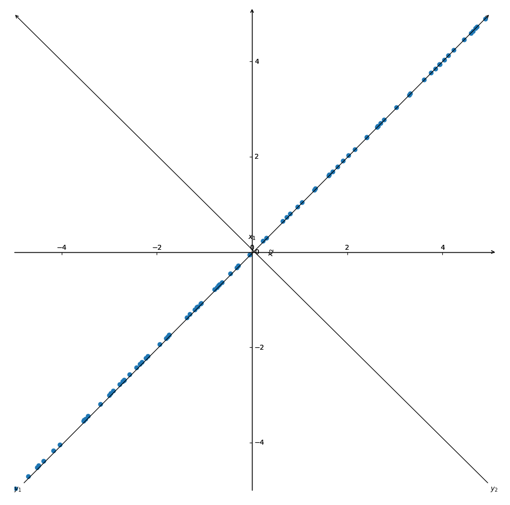

## 7.2 数据分析方法

>date: 2019-03-19


### 7.2.1 主成分分析与典型相关分析

#### 主成分分析原理

假设存在二维随机向量$\mathbf{X} = (X_1, X_2)$，并且$E(\mathbf{X}) = 0$，对其进行$n$次观测得到数据$\mathbf{x_i} = (x_{i1}, x_{i2}) (i = 1, 2, ..., n)$

考虑当$X_1$和$X_2$的相关系数的绝对值为$1$，则作为平面上的点，$(x_{i1}, x_{i2})(i = 1, 2, ..., n)$基本分布在某条直线$l$上，若将原坐标系$x_1 O x_2$逆时针旋转一个角度$\theta$得到新的坐标系$y_1 O y_2$，使坐标轴$O y_1$与$l$重合，这时候观测点$(x_{i1}, x_{i2})(i = 1, 2, ..., n)$基本可由它们在$O y_1$上的坐标决定。

$$y_{i1} = x_{i1}\cos \theta + x_{i2} \sin \theta  (i = 1, 2, ..., n)​$$

这时候，$y_{i1}$是原数据的线性组合在$O y_1$轴上的分散性（样本方差）达到最大，即对原变量$(X_1, X_2)$做了线性变换得到新变量$Y_1$。

$$Y_1 = X_1 \cos \theta + X_2 \theta​$$

这时候$Y_1$就能代表之前二维变量$(X_1, X_2)​$的观测值了。



一般情况下，需要将$O x_1$轴逆时针旋转到观测点$(x_{i1}, x_{i2})(i = 1, 2, ..., n)$具有最大分散性的方向上，设转动的角度为$\theta$，则原数据在新坐标系表示为：

$$\begin{cases} y_{i1} = x_{i1}\cos\theta + x_{i2} \sin \theta \\ y_{i2} = -x_{i1}\sin \theta + x_{i2} \cos \theta \end{cases}$$

即：

$$\begin{cases} Y_1 = X_1 \cos \theta + X_2 \sin \theta \\ Y_2 = - X_1 \sin \theta + X_2 \cos \theta \end{cases}​$$

上面的$Y_1, Y_2$代表着原变量$X_1, X_2​$的线性组合，并且$Var(Y_1)​$达到最大，称$Y_1, Y_2​$分别为$(X_1, X_2)​$的第一、第二主成分。

#### 总体主成分

由上，假设$\mathbf{X} = (X_1, X_2, ..., X_p)$为$p$维随机向量，则其协方差矩阵为$Cov(\mathbf{X}) = \Sigma = E[(\mathbf{X} - E(\mathbf{X}))(\mathbf{X} - E(\mathbf{X}))^{T}]$，这是一个$p$阶非负定方阵。

构造$Y_1 = \mathbf{a_{1}}^{T} \mathbf{X} = a_{11} X_1 + a_{12} X_2 + ... + a_{1p} X_p$

需要在约束条件$\mathbf{a_{1}^{T} \mathbf{a_1}} = 1​$下，确定$Var(Y_1) = Var(\mathbf{a_{1}}^{T} \mathbf{X}) = \mathbf{a_{1}^{T}\Sigma \mathbf{a_1}}​$达到最大。

此时得到第一主成分。

而进一步推广可以得到$Y_k = \mathbf{a_{k}}^{T} \mathbf{X} = a_{k1} X_1 + a_{k2} X_2 + ... + a_{kp} X_p$个主成分，

并且每个主成分之间的信息互不重叠，即不互相关，有$Cov(Y_k, Y_i) = \mathbf{a_{k}^{T}\Sigma \mathbf{a_i}} = 0, (i = 1, 2, ..., k - 1)​$

如上所述可以构造$p$个方差大于零的主成分。

* 主成分解法

1) 特征值

$$\mathbf{\Lambda} e_i = \lambda_i e_i$$，$\mathbf{\Lambda}$为矩阵，$e_i$为$\mathbf{\Lambda} $一个的特征向量，$\lambda_i$为$e_i​$的特征值

2) 特征分解矩阵

$\mathbf{\Lambda} $有一组特征向量$e_i$，对这组向量进行正交单位化。

则矩阵$\mathbf{\Lambda} ​$分解为：

$$\mathbf{\Lambda}  = \mathbf{P \Sigma P^{-1}}  =  \mathbf{P \Sigma P^{T}}= Diag(\lambda_1, \lambda_2, ..., \lambda_p)​$$

$$(\mathbf{P \Sigma P^{T}})^{\mathbf{T}} =  \mathbf{P^T \Sigma P}​$$

$\mathbf{P}$为特征向量组成的矩阵，$\mathbf{\Sigma}$为对角阵，对角线元素为特征值

3) 主成分

$\mathbf{X} = (X_1, X_2, ..., X_p)​$的协方差矩阵为$Cov(\mathbf{X}) = \Sigma​$其特征值从大到小排序为$\lambda_1 \geq \lambda_2 \geq ... \geq \lambda_{\gamma} \geq 0​$，对应的正交单位化特征向量为$\mathbf{e_1}, \mathbf{e_2}, ..., \mathbf{e_p}​$

则$\mathbf{X}​$的第$k​$个主成分可表示为：

$$Y_k = \mathbf{e_k^TX} = e_{k1}X_1 + e_{k2}X2 + ... + e_{kp}X_p, k = 1, 2, ..., p​$$

这时候有

$$\begin{cases} Var(Y_k) = \mathbf{e_k^T\Sigma e_k} = \lambda_k \mathbf{e_k^T e_k} = \lambda_k, & k = 1, 2, ..., p \\ Cov(Y_j, Y_k) = \mathbf{e_j^T \Sigma e_k} = \lambda_k \mathbf{e_j^T e_k} = 0, & j \neq k  \end{cases}​$$

这里令$\mathbf{P} = (\mathbf{e_1}, \mathbf{e_2}, ..., \mathbf{e_p})$，其为正交矩阵，假设$\lambda_k$为第$k$个主成分，$Y_k = \mathbf{a_k^TX}$，其中$\mathbf{a_k^T a_k} = 1$，令

$$\mathbf{z_k} = (z_{11}, z_{12}, ..., z_{1p})^T = \mathbf{P^Ta_1}​$$

则$\mathbf{z_k^T z_k} = \mathbf{a_k^T PP^Ta_k} = \mathbf{a_k^T a_k} = 1​$

所以：

$$Var(Y_1) = \mathbf{a_k^T \Sigma a_k} = \mathbf{z_k^T P^T \Sigma P z_k} =  \mathbf{z_k^T} Diag(\lambda_1, \lambda_2, ..., \lambda_p) \mathbf{z_k} = \lambda_1 z_{k1}^2 + \lambda_2 z_{k2}^2 + ... + \lambda_p z_{kp}^2 \leq \lambda_k \mathbf{z_k^T z_k}  = \lambda_k​$$

当$\mathbf{z_k}$为单位基向量，（如$\mathbf{z_1} = (1, 0, ..., 0)$），等号成立，此时$\mathbf{a_k} = \mathbf{Pz_k} = \mathbf{e_k}$。

可以知道，在约束条件$\mathbf{a_{k}^{T} \mathbf{a_k}} = 1$下，$Var(Y_k) = \lambda_k $达到最大，而此时$\mathbf{a_k} = \mathbf{e_k}$

4) 贡献率和累计贡献率

贡献率

$$\frac{\lambda_k}{\sum_{i = 1}^p \lambda_k} = \frac{Var(Y_k)}{\sum_{i=1}^p Var(X_k)}$$

累计贡献率

$$\frac{\sum_{k = 1}^m \lambda_k}{\sum_{i = 1}^p  \lambda_k}$$

* 用途

1) 能降低所研究的数据空间的维数；

2) 通过因子负荷$a_{ki}$的结论，弄清$X_i$变量间的某些关系；

3) 构造回归模型，即把各主成分作为新自变量代替原来自变量做回归分析。

```python
>>> # https://scikit-learn.org/stable/modules/generated/sklearn.decomposition.PCA.html
>>> import numpy as np
>>> from sklearn.decomposition import PCA
>>> X = np.array([[-1, -1], [-2, -1], [-3, -2], [1, 1], [2, 1], [3, 2]])
>>> pca = PCA(n_components=2)
>>> pca.fit(X)
PCA(copy=True, iterated_power='auto', n_components=2, random_state=None,
  svd_solver='auto', tol=0.0, whiten=False)
>>> print(pca.explained_variance_ratio_) # 累计贡献率
[0.99244289 0.00755711]
```

#### 典型相关分析

随机变量之间$X$和$Y$之间的相关系数

$$\rho_{X,Y} = \frac{Cov(X, Y)}{\sqrt{Var(X) \cdot Var(Y)}}$$

上述式子虽然能了解每对变量$X_i, Y_j$之间的相关性，但是却不能却面反映两组变量间的整体相关性，当两组变量的维数均较大时，只鼓励地了解各对变量$X_i$和$Y_j$之间的相关性，不利于实际问题的全面分析和解决。

因此，借助于主成分分析的思想，可以将两组变量的相关性转化为两个变量的相关性来考虑。即：

$$U = a_1 X_1 + a_2 X_2 + ... + a_p X_p, \\ V = b_1Y_1 + b_2 Y_2 + ... + b_q Y_q$$

其中$\mathbf{a} = (a_1, a_2, ..., a_p), \mathbf{b} = (b_1, b_2, ..., b_q)$，需要$U,V$尽最大的可能提取$\mathbf{X, Y}$的相关性，就称$(U,V)为一对典型相关变量$。

#### 总体的典型变量与典型相关

$$\mathbf{X} = (X_1, X_2, ..., X_p)^T, \mathbf{Y} = (Y_1, Y_2, ... Y_q)^T$$

$(\mathbf{X^T, Y^T})^T = (X_1, X_2, ..., X_p, Y_1, Y_2, ... Y_q)$的协方差矩阵为：

$$\mathbf{\Sigma} = \begin{bmatrix} \mathbf{\Sigma_{11}} & \mathbf{\Sigma_{12}} \\ \mathbf{\Sigma_{21}} & \mathbf{\Sigma_{22}} \end{bmatrix}$$

其中

$$\mathbf{\Sigma_{11}} = Cov(\mathbf{X}) = E[\mathbf{X} - E(\mathbf{X})][\mathbf{X} - E(\mathbf{X})]^T$$

$$\mathbf{\Sigma_{22}} = Cov(\mathbf{Y}) = E[\mathbf{Y} - E(\mathbf{Y})][\mathbf{Y} - E(\mathbf{Y})]^T$$

$$\mathbf{\Sigma_{21}^{T}} = \mathbf{\Sigma_{12}} = Cov(\mathbf{X}, \mathbf{Y}) = E[\mathbf{X} - E(\mathbf{X})][\mathbf{Y} - E(\mathbf{Y})]^T$$

分别考虑$\mathbf{X, Y}$的线性组合

$$U_k = a_{k1} X_1 + a_{k2} X_2 + ... + a_{kp} X_p, \\ V_k = b_{k1}Y_1 + b_{k2} Y_2 + ... + b_{kq} Y_q​$$

其中

$$Var(U_k) = Var(\mathbf{a_k^TX}) = \mathbf{a_k^T \Sigma_{11} a_k} \\ Var(V_k) = Var(\mathbf{b_k^T Y}) = \mathbf{b_k^T \Sigma_{22}b_k} \\ Cov(U_k, V_k) = Cov(\mathbf{a_k^T X, b_k^T Y}) = \mathbf{a_k^T \Sigma_{12} b_k}$$

则$U_k, V_k$的相关系数为：

$$\rho_{U_k, V_k} = \frac{\mathbf{a_k^T \Sigma_{12} b_k}}{\sqrt{\mathbf{a_k^T \Sigma_{11} a_k}} \sqrt{\mathbf{b_k^T \Sigma_{22}b_k}}}​$$

确定$\mathbf{a_k, b_k}​$就能使得$\rho_{U_k, V_k}​$达到最大。

这里为了简化目标函数表达式，增加一组简单的约束，即：

$$\mathbf{a_k^T \Sigma_{11} a_k} = \mathbf{b_k^T \Sigma_{22}b_k} = 1 \\ Cov(U_k, U_j) = Cov(V_k, V_j) = Cov(U_k, V_j) = Cov(V_k, U_j) = 0, 1 \leq j < k$$

此时问题变成了求$\mathbf{a_k^T \Sigma_{12} b_k}$最大值。

* 典型变量与典型相关系数求法

设$\mathbf{X} = (X_1, X_2, ..., X_p)^T, \mathbf{Y} = (Y_1, Y_2, ..., Y_q)^T, \\ Cov(\mathbf{X}) = \Sigma_{11}, Cov(\mathbf{Y}) = \Sigma_{22}, \\ \Sigma_{12} = Cov(\mathbf{X,Y}), \Sigma_{21} = Cov(\mathbf{Y,X}) = \Sigma_{12}^T$

其中$\mathbf{\Sigma_{11}, \Sigma_{22}}$均为满秩矩阵且$p \leq q$

$$A = \mathbf{\Sigma_{11}^{-1}\Sigma_{12}\Sigma_{22}^{-1}\Sigma_{21}}, B = \mathbf{\Sigma_{22}^{-1} \Sigma_{21} \Sigma_{11}^{-1} \Sigma_{12}}$$

设$\rho_1^2 \geq \rho_2^2 ... \geq \rho_p^2$为$p$阶矩阵$A$的特征值，$e_1, e_2, ..., e_p$为相应的正交单位化特征向量。

$f_1, f_2, ..., f_p$为$q$阶矩阵$B$的相应于前$p$个最大特征值的正交单位化特征向量，则$\mathbf{X, Y}$的第$k$对典型相关变量为：

$$U_k = \mathbf{a_k^T X} = \mathbf{e_k^T \Sigma_{11}^{- 1/2} X}, V_k = \mathbf{b_k^T Y} = \mathbf{f_k^T \Sigma_{22}^{- 1/2} Y}, k = 1, 2, ..., p​$$

其相关系数为：

$$\rho_{U_k, V_k} = \rho_k, k = 1, 2, ..., p$$

其中$\mathbf{\Sigma_{11}^{- 1/2}}, \mathbf{\Sigma_{22}^{- 1/2}}$分别为$\mathbf{\Sigma_{11}, \Sigma_{22}}$的平方根矩阵的逆矩阵，$\rho_k$为$\rho_k^2$的正平方根。

* 用途

在实际分析问题中，当面临两组多变量数据，并希望研究两组变量之间的关系时，就要用到典型相关分析。

1) 为了研究扩张性财政政策实施以后对宏观经济发展的影响，就需要考察有关财政政策的一系列指标如财政支出总额的增长率、财政赤字增长率、国债发行额的增长率、税率降低率等与经济发展的一系列指标如国内生产总值增长率、就业增长率、物价上涨率等两组变量之间的相关程度；

2) 为了研究宏观经济走势与股票市场走势之间的关系，就需要考察各种宏观经济指标如经济增长率、失业率、物价指数、进出口增长率等与各种反映股票市场状况的指标如股票价格指数、股票市场融资金额等两组变量之间的相关关系；

3) 在分析评估某种经济投入与产出系统时，研究投入和产出情况之间的联系时，投入情况面可以从人力、物力等多个方面反映，产出情况也可以从产值、利税等方面反映。

```python
>>> # https://scikit-learn.org/stable/modules/generated/sklearn.cross_decomposition.CCA.html#sklearn.cross_decomposition.CCA
>>> from sklearn.cross_decomposition import CCA
>>> X = [[0., 0., 1.], [1.,0.,0.], [2.,2.,2.], [3.,5.,4.]]
>>> Y = [[0.1, -0.2], [0.9, 1.1], [6.2, 5.9], [11.9, 12.3]]
>>> cca = CCA(n_components=1)
>>> cca.fit(X, Y)
CCA(copy=True, max_iter=500, n_components=1, scale=True, tol=1e-06)
>>> X_c, Y_c = cca.transform(X, Y)
>>> X_c
array([[-1.3373174 ],
       [-1.10847164],
       [ 0.40763151],
       [ 2.03815753]])
>>> Y_c
array([[-0.85511537],
       [-0.70878547],
       [ 0.26065014],
       [ 1.3032507 ]])
>>>
```

### 7.2.2 因子分析

### 7.2.3 判别分析

### 7.2.4 聚类分析

### 7.2.5 `Bayes`分析


