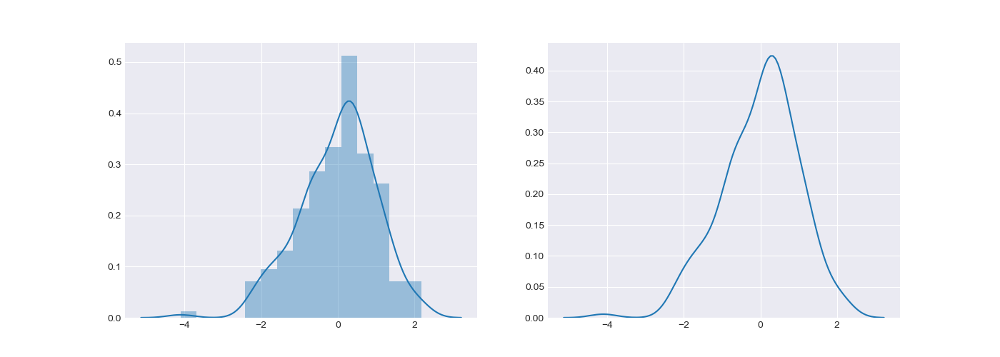

## 7.5 数据可视化

>date: 2019-06-04


### 7.5.1 `Matplotlib`入门

#### 折线图

```python
import random
import matplotlib.pyplot as plt

x = list(range(1, 11))
y = [random.randrange(1, 20) for i in range(1, 11)]

x2 = list(range(1, 11))
y2 = [random.randrange(1, 10) for i in range(1, 11)]

plt.plot(x, y, label='First Line') # 为线条指定名称
plt.plot(x2, y2, label='Second Line')

plt.xlabel('Plot Number') # X轴标签
plt.ylabel('Important var') # Y轴标签
plt.title('Interesting Graph\nJust A Demo') # 标题
plt.legend() # 生成默认图例
plt.savefig('../images/751_01.png')
plt.show()
```


#### 条形图（直方图）

```python
import random
import matplotlib.pyplot as plt

x = list(range(1, 11, 2))
y = [random.randrange(1, 20) for i in range(1, 6)]

x2 = list(range(2, 12, 2))
y2 = [random.randrange(1, 10) for i in range(1, 6)]

plt.bar(x, y, label="Example one")
plt.bar(x2, y2, label="Example two", color='g')

plt.xlabel('Bar Number')
plt.ylabel('Bar Height')
plt.title('Bar')
plt.legend()

plt.savefig('../images/751_02.png')
plt.show()
```


#### 散点图

```python
import random
import matplotlib.pyplot as plt

x = list(range(1, 11))
y = [random.randrange(1, 20) for i in range(1, 11)]

plt.scatter(x,y, label='Scatter', color='k', s=25, marker="o")

plt.xlabel('x')
plt.ylabel('y')
plt.title('Scatter')
plt.legend()
plt.savefig('../images/751_03.png')
plt.show()
```


#### 饼图

```python
import matplotlib.pyplot as plt

slices = [7,2,2,13]
activities = ['sleeping','eating','working','playing']
cols = ['#d091da', '#6477f0', '#264fc9', '#117510']

plt.pie(slices,
        labels=activities,
        colors=cols,
        startangle=130,
        shadow= True,
        explode=(0,0.1,0,0), # 拉出切片
        autopct='%1.1f%%') # 将百分比放置到图表

plt.title('Pie')
plt.savefig('../images/751_04.png')
plt.show()
```


#### 堆叠图

```python
import matplotlib.pyplot as plt

days = [1, 2, 3, 4, 5]
sleeping = [7, 8, 6, 11, 7]
eating =   [2, 3, 4, 3, 2]
working =  [7, 8, 7, 2, 2]
playing =  [8, 5, 7, 8, 13]

plt.stackplot(days, 
              sleeping, eating, working, playing,
              labels = ['sleeping', 'eating', 'working', 'playing'],
              colors = ['#7cb5ec', '#434348', '#90ed7d', '#f7a35c'])

plt.xlabel('X')
plt.ylabel('Y')
plt.title('Stack')
plt.legend(loc = 'upper left')
plt.savefig('../images/751_05.png')
plt.show()
```


#### 等高线图

```python
import numpy as np
import matplotlib.pyplot as plt

def f(x,y): # 高度函数
    return (1 - x / 2 + x**5 + y**3) * np.exp(-x**2 -y**2)

n = 256
x = np.linspace(-3, 3, n)
y = np.linspace(-3, 3, n)
X,Y = np.meshgrid(x, y)

plt.contourf(X, Y, f(X, Y), 8, alpha=.75, cmap = plt.cm.hot) # 进行颜色填充

C = plt.contour(X, Y, f(X, Y), 8, colors='black', linewidth = 0.5) 

plt.clabel(C, inline=True, fontsize=10) # 添加高度数字

# 隐藏坐标轴
plt.xticks(())
plt.yticks(())
plt.title('Contour')

plt.savefig('../images/751_06.png')
plt.show()
```


#### `3D`图

```python
import numpy as np
import matplotlib.pyplot as plt
from mpl_toolkits.mplot3d import Axes3D

fig = plt.figure()
ax = Axes3D(fig)

X = np.arange(-4, 4, 0.25)
Y = np.arange(-4, 4, 0.25)
X, Y = np.meshgrid(X, Y) # XY平面的网格 
R = np.sqrt(X ** 2 + Y ** 2)
Z = np.sin(R)

ax.plot_surface(X, Y, Z, rstride = 1, cstride = 1, cmap=plt.get_cmap('rainbow')) # 绘制等高线图，rstride 和 cstride 分别代表 row 和 column 的跨度
ax.contourf(X, Y, Z, zdir='z', offset=-2, cmap=plt.get_cmap('rainbow')) #  XY 平面的投影
ax.set_zlim(-2, 2)
plt.savefig('../images/751_07.png')
plt.show()
```


#### 样式相关

```python
import numpy as np
import matplotlib.pyplot as plt

x = np.linspace(0, 5 * np.pi, 1000)
y = np.sin(x)
y2 = np.sin(2 * x)

fig = plt.figure() # 创建一个图像窗口
ax = plt.subplot2grid((1, 1), (0, 0)) # 创建 1 个小图，整个图像窗口分成 1 行 1 列

ax.plot(x, y, label='First Line')
ax.plot(x, y2, label='Second Line')

# 填充
ax.fill(x, y, color = "g", alpha = 0.3) # 对函数与坐标轴之间的区域进行填充
ax.fill_between(x, y, y2, facecolor = "b", alpha = 0.5) # 填充两个函数之间的区域

# 坐标轴设置相关
ax.grid(True, color='g', linestyle='--', linewidth = 1)
ax.xaxis.label.set_color('c') # 设置 x 轴标签颜色
ax.yaxis.label.set_color('r') # 设置 y 轴标签颜色
ax.set_yticks([-1, 0, 1]) # 设置 y 轴刻度与范围

# 注释和标记相关
x0 = np.pi / 2
y0 = np.sin(x0)
plt.annotate(r'$sin(x)$', xy=(x0, y0), xycoords='data', xytext=(+30, -30), textcoords='offset points', fontsize=12, arrowprops=dict(arrowstyle='->', connectionstyle="arc3,rad=.2")) # xycoords='data' 基于数据的值来选位置, xytext = (+30, -30) xy 偏差值，textcoords='offset points' 对于标注位置的描述，arrowprops 箭头类型设置
plt.text(0, -1.1, r'$Some\ text.$', fontdict={'size': 12, 'color': 'r'}) # 0, -1.1 选取text的位置

plt.xlabel('X')
plt.ylabel('Y')
plt.title('Style')
plt.legend(loc = 'upper left')
plt.savefig('../images/751_08.png')
plt.show()
```


#### 多图显示

```python
import random
import matplotlib.pyplot as plt
import matplotlib.gridspec as gridspec

fig = plt.figure(figsize=(9, 16))

def create_plots():
    xs = []
    ys = []

    for x in range(10):
        y = random.randrange(10)
        xs.append(x)
        ys.append(y)
    return xs, ys

#### subplot 方式
plt.subplot(10, 2, 1)
plt.plot(*create_plots())

plt.subplot(10, 2, 2)
plt.plot(*create_plots())

plt.subplot(10, 2, 3)
plt.plot(*create_plots())

plt.subplot(10, 2, 4)
plt.plot(*create_plots())

#### 不均匀布局
plt.subplot(10, 1, 3)
plt.plot(*create_plots())

plt.subplot(10, 3, 10)
plt.plot(*create_plots())

plt.subplot(10, 3, 11)
plt.plot(*create_plots())

plt.subplot(10, 3, 12)
plt.plot(*create_plots())

#### subplot2grid 分格显示
ax1 = plt.subplot2grid((10, 3), (4, 0), colspan=3)
ax1.plot([1, 2], [1, 2])
ax1.set_title('ax1_title')
ax2 = plt.subplot2grid((10, 3), (5, 0), colspan=2)
ax3 = plt.subplot2grid((10, 3), (5, 2), rowspan=2)
ax4 = plt.subplot2grid((10, 3), (6, 0))
ax4.scatter([1, 2], [2, 2])
ax4.set_xlabel('ax4_x')
ax4.set_ylabel('ax4_y')
ax5 = plt.subplot2grid((10, 3), (6, 1))

#### gridspec 方式
gs = gridspec.GridSpec(10, 3)
ax6 = plt.subplot(gs[7, :])
ax7 = plt.subplot(gs[8, :2])
ax8 = plt.subplot(gs[8:, 2])
ax9 = plt.subplot(gs[-1, 0])
ax10 = plt.subplot(gs[-1, -2])

plt.savefig('../images/751_09.png')
plt.show()
```


#### 图中图

```python
import random
import matplotlib.pyplot as plt

fig = plt.figure()
x = list(range(1, 11))
y = [random.randrange(1, 20) for i in range(1, 11)]

#### 绘制大图区域
left, bottom, width, height = 0.1, 0.1, 0.8, 0.8
ax1 = fig.add_axes([left, bottom, width, height]) # 确定大图左下角的位置以及宽高
ax1.plot(x, y, 'r')
ax1.set_xlabel('x')
ax1.set_ylabel('y')
ax1.set_title('title')

#### 绘制左上角的小图
ax2 = fig.add_axes([0.2, 0.6, 0.25, 0.25])
ax2.plot(x, y, 'b')
ax2.set_xlabel('x')
ax2.set_ylabel('y')
ax2.set_title('title inside 1')

#### 绘制右下角的小图，直接往plt里添加新的坐标系
plt.axes([0.6, 0.2, 0.25, 0.25])
plt.plot(y[::-1], x, 'g')
plt.xlabel('x')
plt.ylabel('y')
plt.title('title inside 2')
plt.savefig('../images/751_10.png')
plt.show()
```


### 7.5.2 `Seaborn`入门

#### 预设样式主题

```python
import numpy as np
import matplotlib as mpl
import matplotlib.pyplot as plt
import seaborn as sns

def sinplot(flip=1):
    x = np.linspace(0, 14, 100)
    for i in range(1, 7):
        plt.plot(x, np.sin(x + i * .5) * (7 - i) * flip)

# 对两种画图进行比较
fig = plt.figure()
sns.set() # sns.set_style('dark') 预设的主题，一共有五种，darkgrid，whitegrid，dark，white，和ticks
sinplot()
plt.savefig('../images/752_01.png')
plt.show()
```


#### 单变量分布

```python
import numpy as np
import matplotlib as mpl
import matplotlib.pyplot as plt
import seaborn as sns

x = np.random.randn(200)

fig = plt.figure(figsize=(14, 5))
sns.set_style('darkgrid')

plt.subplot(1, 2, 1)
sns.distplot(x) # 单变量分布

plt.subplot(1, 2, 2)
sns.distplot(x, hist = False) # 取消直方图显示

plt.savefig('../images/752_02.png')
plt.show()
```



#### 双变量分布

```python
import numpy as np
import matplotlib.pyplot as plt
import seaborn as sns
import pandas as pd

mean, cov = [0, 1], [(1, .5), (.5, 1)]
data = np.random.multivariate_normal(mean, cov, 200)
df = pd.DataFrame(data, columns=["x", "y"])

sns.set_style('darkgrid')

sns.jointplot(x="x", y="y", data=df)
# sns.jointplot(x="x", y="y", data=df, kind="kde") # 指定绘制的图像类型，scatter, reg, resid, kde, hex

plt.savefig('../images/752_03.png')
plt.show()
```


#### 多变量成对双变量分析

```python
import numpy as np
import matplotlib.pyplot as plt
import seaborn as sns
import pandas as pd

sns.set_style('darkgrid')

iris = sns.load_dataset("iris")
sns.pairplot(iris);
# 对角线化的是单变量的分布

plt.savefig('../images/752_04.png')
plt.show()
```


### 7.5.3 `pyecharts`