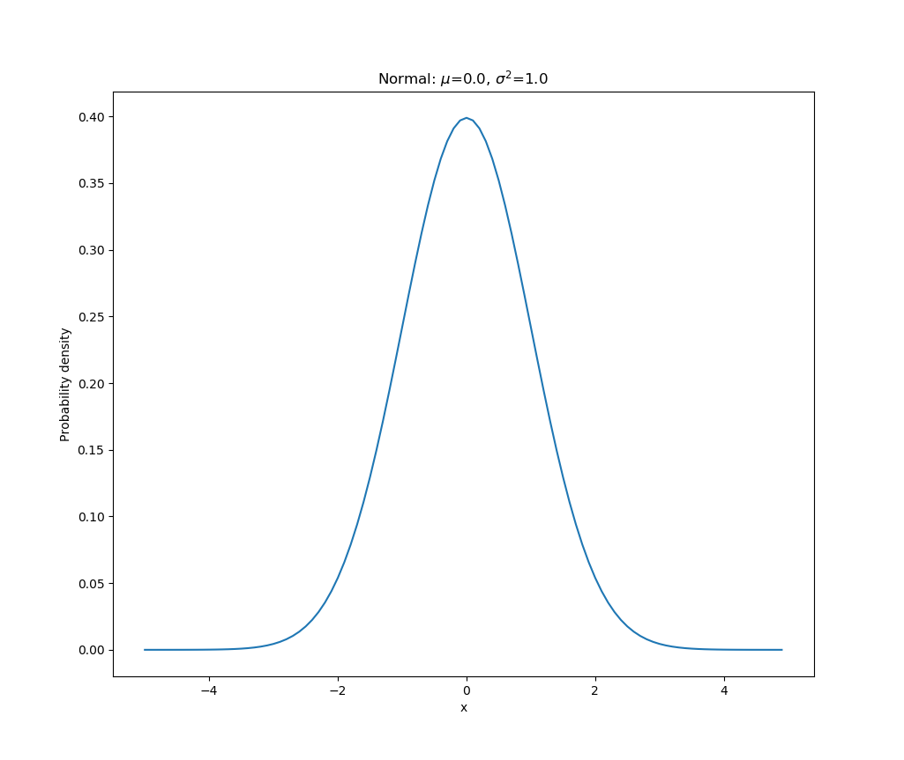
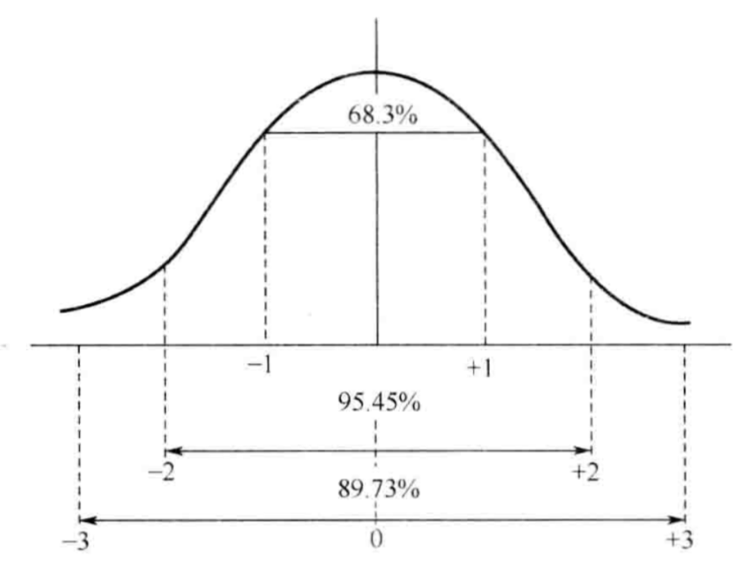

## 7.1 统计学基础

>date: 2019-03-06


### 7.1.1 描述性统计分析

#### 集中趋势

集中趋势测度目的在寻找数据水平代表值或中心组，使用一些确切的指标来表明大量数据下整体的状态。

* 平均数

描述定量数据的集中趋势。

这里的平均数指算数平均数。

$$ \overline x = \frac{\sum_{i = 1}^n x_i}{n} $$

```python
import numpy as np

nums = [1, 2, 3, 4]
np.mean(nums)
```

* 中位数

一组数据按照大小顺序排序后，处于数列中点的数值。

```python
import numpy as np

nums = [1, 2, 3, 4]
np.median(nums)
```

* 四分位数

一组数据按照大小顺序排序后，分成四等份，处于三个分割点位置的数值。

```python
import numpy as np

nums = [1, 2, 3, 4]
np.percentile(nums, [25, 50, 75])
```

* 众数

一组数据中出现次数最多的变量值。

```python
# numpy 计算
import numpy as np

nums = [1, 2, 3, 4]
counts = np.bincount(nums)
np.argmax(counts)

# scipy 计算
from scipy import stats
stats.mode(nums)[0][0]
```

#### 离中趋势

离中趋势指一组数据向某一中心值分散的程度，反映了各个数据远离中心点的程度。

* 极差

一组数据中最大值和最小值的差距。

```python
import numpy as np

nums = [1, 2, 3, 4]
np.ptp(nums)
```

* 四分位距

在一组数据中剔除数列两端$25%$单位标志值后，按照如下公式计算：

$$ 四分位距 = \frac{ 第三个四分位数 - 第一个四分位数}{2} $$

反映了数组中间部分各变量值的最大数与最小数距离中位数的平均离差。

* 平均差

数列中各数值与其算术平均数离差绝对值的算术平均数。

$$ M.D = \frac{\sum|x - \overline x|}{n} $$

* 方差和标准差

方差是数列中各数值与其算术平均数离差平方的算术平均数。

$$ \sigma^2 = \frac{\sum_{i=1}^{n} (x_i - \overline x)^2}{n} $$

标准差就是方差的开方。

$$ \sigma = \sqrt{\frac{\sum_{i=1}^{n} (x_i - \overline x)^2}{n}} $$

```python
import numpy as np

nums = [1, 2, 3, 4]
var_ = np.var(nums)
std_ = np.std(nums)
```

* 离散系数——标准差系数(变异系数)

标准差系数是将一组数据的标准差与其算术平均数对比，以测定相对离中程度。

$$ V_{\sigma} = \frac{\sigma}{x} \times 100% $$

#### 数据分布

* 偏态

数据分布的不对称性称作偏态，偏态是指数据分布的偏斜方向和程度。偏态通常分为左偏和右偏，是以对称分布为标准的。

偏态系数$SK$是测量偏态的指标。

$$ SK = \frac{n}{(n-1)(n-2)}\sum(\frac{x_i - \overline x}{s})^3 $$

$ SK = 0 $，分布对称；

$ SK < 0 $，分布左偏；

$ SK < 0 $，分布右偏。

* 峰度

指数据分布的尖峭程度或者峰凸程度。根据变量值的集中和分散程度，峰度一般表现为：尖顶峰度，平顶峰度，标准峰度。

峰度系数$K$是对数据分布尖峭程度的测度。

$$ K = \frac{n(n+1)}{(n-1)(n-2)(n-3)}\sum(\frac{x_i - \overline x}{s})^4 - \frac{3(n-1)^2}{(n-2)(n-3)} $$

$ K < 0 $，一般为扁平、瘦尾、肩部较胖；

$ K > 0 $，一般为尖峰、肥尾、肩部较瘦。

### 7.1.2 数理统计

#### 随机事件

* 随机现象

在一定条件下可能发生也可能不发生，结果具有偶然性的现象，称为随机现象。

* 样本空间

随机现象中一切可能结果组成的集合，记作$ \Omega = \{\omega\}$，其中，$\omega$表示基本结果，称作样本点。

* 随机事件

样本空间中某些元素组成的集合，即由随机现象的某详解结果组成的集合叫做随机事件。是样本空间的子集。

* 随机事件概率

随机事件出现的可能性的度量。

在一定条件下，重复做$n$次试验，$n_A$为$n$次试验总随机事件$A$发生的次数，如果随着$n$逐渐增大，概率$n_A/n$逐渐稳定在某一数值$p$附近，则数值$p$称为随机事件$A$在改条件下发生的概率，记作$P(A) = p$。

$P(A) = p$是个分数，它的分子数大量实验中随机事件可能发生的机会数，分母是随机事件中可能发生或不发生的全部机会数。

当$P(A) = 1$时，随机事件为必然事件；当$P(A) = 0$时，随机事件为不可能事件。

设在同一样本空间$\Omega$下，有两个随机事件，记作$A$和$B$，两个随机事件的概率记作$P(A)$和$P(B)$，事件$A$和$B$同时发生的概率记作$P(AB)$。

* 条件概率

在事件$B$发生的条件下，事件$A$发生的概率称为事件$A$在事件$B$已发生下的条件概率，记作$P(A|B)$。当$P(B) > 0$时，规定$P(A|B) = \frac{P(AB)}{P(B)}$；当$P(B) = 0$时，规定$P(A|B) = 0$。

* 相互独立事件

如果时间$A$与$B$满足$P(A) = P(A|B)$，则称事件$A$关于事件$B$是独立的。

可以推导出当事件$A, B$独立时，有$P(AB) = P(A)P(B)$。独立性是相互的。

#### 随机变量

* 随机变量

用来表示随机现象结果的变量称为随机变量，常用$X,Y,Z,...$表示。

假如一个随机变量仅取数轴上有限个点或可列个点，则称此随机变量为离散随机变量，或离散型随机变量。

假如一个随机变量的所有可能取值充满数轴上一个区间$(a, b)$，则称此随机变量为连续随机变量，或连续型随机变量，其中$a$可以等于$-\infty$，$b$可以是$+\infty$。

* 随机变量的概率分布

随机变量取值的统计规律称为概率分布。

1) 离散型随机变量分布

$$0 \leq P(x_i) \leq 1 (i = 1, 2, ...)$$

$$ \sum_{i = 1}^{n} P(X = x_i) = 1 $$

2) 连续型随机变量分布

概率密度函数：$$ f(x) $$；

概率分布函数：$$F(x) = \int_{-\infty}^{x} f(x) dx$$；

$$P\{x_1 < X \leq x_2\} = \int_{x_1}^{x_2} f(x) dx$$。

* 数学期望

1) 离散型随机变量

$$E(X) = \sum_{i = 1}^{\infty}x_{i}p_{i}$$

2) 连续型随机变量

若$\int_{-\infty}^{\infty} |x| f(x) dx$收敛，则：

$$E(X) = \int_{-\infty}^{+\infty}xf(x)dx$$

否则，期望不存在。

* 方差和标准差

1) 离散型随机变量

$$V(x) = \sum_{i = 1}^{\infty}[x_i - E(X)]^{2}p_i$$

2) 连续型随机变量

$$V(x) = \int_{-\infty}^{+\infty}[x - E(X)]^{2}f(x)dx$$

3) 标准差

$$SD = \sqrt{V(X)}$$

4) 性质

$$E(X_1 + X_2) = E(X_1) + E(X_2)$$

$$E(aX + b) = aE(X) + b$$

$$V(aX + b) = a^{2}V(X)$$

$$V(X_1 + X_2) = V(X_1) + V(X_2)$$

$$\sigma(X_1 + X_2) = \sqrt{V(X_1) + V(X_2)}$$

#### 正态分布

在相同条件下，随机对某一测试对象进行多次测试，测得数值在一定范围内波动，其中接近平均值的数据占大多数，远离平均值的占少数，具有这种分布规律的随机变量的分布称为正态分布。

* 概率密度函数

$$f(x) = \frac{1}{\sigma \sqrt(2\pi)}e^{-\frac{(x - \mu)^2}{2\sigma^2}}, -\infty < x < +\infty$$

符合上述公式的$X$服从正态分布，记为$X~N(\mu, \sigma^2)$。其中不同的$\mu, \sigma$对应不同的正态分布。

正态分布曲线呈钟形，两头低，中间高，左右对称。

1) 对称性：正态分布以$x = \mu$为对称轴，左右完全对称地向两边扩展；

2) 非负性：密度函数$f(x)$都处于$O_x$轴的上方；

3) $\mu$是正态分布的位置参数，描述正态分布的集中趋势位置。$\sigma$描述正态分布资料数据分布的离散程度，越大分布越分散；越小分布越集中。

* 标准正态分布

当$\mu = 0, \sigma = 1$时，正态分布称为标准正态分布，记作$N~(0,1)$。它的概率密度函数记为：

$$\phi(x) = \frac{1}{\sqrt(2\pi)}e^{-\frac{x^2}{2}}$$

```python
import numpy as np
import matplotlib.pyplot as plt
from scipy import stats

mu = 0
sigma = 1

x = np.arange(-5, 5, 0.1)
y = stats.norm.pdf(x, 0, 1)

plt.plot(x, y)
plt.title('Normal: $\mu$=%.1f, $\sigma^2$=%.1f'%(mu, sigma))
plt.xlabel('x')
plt.ylabel('Probability density')
plt.show()
```



* $3\sigma$原则

对正态分布$X~N(\mu, \sigma^2)$取值的概率，在区间$(\mu - \sigma, \mu + \sigma), (\mu - 2\sigma, \mu + 2\sigma), (\mu - 3\sigma, \mu + 3\sigma)$内的取值概率分别是$68.3%, 95.7%, 99.7%$。

#### $\chi^2$分布

设独立随机变量$X_1, X_2, ..., X_n$均满足标准正态分布$N(0, 1)$则随机变量$\chi^2 = \sum_{i = 1}^{n}X_{i}^2$的分布称为服从自由度为$n$的$\chi^2$分布，记作$\chi^2 ~ \chi^2(n)$，其分布密度函数为：

$$f(x) = \begin{cases} \frac{1}{2^{\frac{n}{1}}\Gamma(\frac{n}{2})}x^{\frac{n}{2} - 1}e^{-\frac{x}{2}}, & x>0 \\ 0, & x \leq 0 \end{cases}$$

* 常用于拟合优度检验

#### $t$分布

设$X~N(0, 1), Y~\chi^2(n)$，且$X$与$Y$相互独立，则随机变量为：

$$t = \frac{X}{\sqrt{Y/n}}$$

其所服从的分布称为自由度为$n$的$t$分布，记作$t ~ t(n)$，其分布密度函数为：

$$f(x) = \frac{\Gamma(\frac{n + 1}{2})}{\sqrt{n\pi}\Gamma(\frac{n}{2})}(1 + \frac{x^2}{n})^{-\frac{n + 1}{2}}, -\infty < x < + \infty$$

* 在信息不足的情况下，只能用$t$分布，比如在整体方差不知的情况下，对总体均值的估计和检验通常用到$t$统计量。

#### $F$分布

设$X~\chi^2(n_1), Y~\chi^2(n_2)$，并且$X$和$Y$相互独立，则随机变量所服从的分布称为自由度为$(n_1, n_2)$的$F$分布，记作$F~F(n_1, n_2)$，其分布密度函数为：

$$f(x) = \begin{cases} \frac{\Gamma(\frac{n_1 + n_2}{2})}{\Gamma(\frac{n_1}{2})\Gamma(\frac{n_2}{2})}(\frac{n_1}{n_2})(\frac{n_1}{n_2}x)^{\frac{n_1 - 1}{2}}(1 + \frac{n_1}{n_2}x)^{- \frac{n_1 + n_2}{2}}, & x>0 \\ 0, & x \leq 0 \end{cases}$$

* 多用于比例的估计和检验，用于方差分析、协方差分析和回归分析等。

#### 中心极限定理

在一定条件下，多个相互独立的随机变量的平均值，服从或近似服从正态分布。即凡是在一定条件下断定随机变量之和的极限分布式正态分布的定理，在概率论中统称为中心极限定理。

* 意义

大量的独立随机变量之和具有近似于正态的分布。

* 隶美弗拉普拉斯积分定理

假设$\mu_n{(n = 1, 2, ...)}$表示$n$重贝努里试验中成功的次数，一直每次试验成功的概率为$p(0<P<1>)$，那么关于$x\in(-\infty, +\infty)$一致，有：

$$\lim_{n \rightarrow \infty}p\begin{Bmatrix} \frac{\mu_n - np}{\sqrt{np(1- p)}}\leq x \end{Bmatrix} = \frac{1}{\sqrt{2\pi}}\int_{-\infty}^{x}e^{-\frac{-\mu^2}{2}}du$$

这表明，正态分布式二项分布极限分布。

### 7.1.3 抽样估计

#### 基本概念

抽样估计又叫抽样推断，也叫参数估计。

从内涵上来说，包括抽样调查和抽样估计两部分。

抽样调查就是照随机的原则从调查对象的全部单位中抽取部分单位后进行调查，取得各项准确的数据；

抽样估计是指运用数理统计原理，根据抽样调查资料，对研究对象全体的数量特征，作出具有可靠程度的估计和判断，以达到现象总体正确认识的目的。

* 总体

总体是研究对象的全体，是由所研究范围内具有某种共同性质的许多单位组成的集合体。

* 样本

从总体中随机抽取，用以代表总体的部分单位的集合。

随机性：总体中的每一个个体都有相同的机会进入样本。

独立性：从总体中抽取的每个样本对其他样本的抽取无任何影响。

* 抽样方法

重复抽样；不重复抽样。

* 样本容量

样本容量指样本中的单位数。

* 总体指标和样本统计量

||总体指标|样本统计量|
|:--:|:--:|:--:|
|均值|$\mu$|$\overline x = \frac{\sum_{i = 1}^{n}x_i}{n}$|
|方差|$\sigma^2$|$s^2 = \frac{\sum(x - \overline x)^2}{n - 1}$|
|标准差|$\sigma$|$s$|

$\overline x$的分布会随着$n$的变大，其样本均值$\overline x$的分布式近似正态的。当$n$变大时候，$\overline x$近似于$N(\mu, \sigma^2/n)$

* 抽样误差

指随机抽样的偶然因素使样本各单位的结构对总体各单位结构的代表性差别，而引起的样本统计量和总体指标之间的绝对离差。

* 抽样的平均误差

指抽样平均数的标准差，反映抽样平均数与总体平均数的平均误差程度。

* 抽样估计的理论基础

大数定律证明：如果随机变量总体存在有限的平均数和方差，则对于充分大的抽样单位数$n$，可以几乎趋近$1$的概率来期望抽样平均数与总体平均数的绝对离差为任意小。

设$\varepsilon$为任意小的正数，则：

$$\lim_{n\rightarrow \infty}P(|\overline x - \overline X|\leq \varepsilon) = 1$$

$\overline x$为抽样平均数，$\overline X$为总体平均数，$n$为样本单位数。

* 一个样本统计量是否是总体参数的优良估计的三个基本标准：

1) 无偏性

如果抽样估计$\hat \theta$ 的期望值等于总体指标$\theta$。

$$E(\overline x) = \overline X, E(p) = p.$$

$$E(S^2)\neq \sigma^2, E(S^2) = \frac{n - 1}{n}\sigma^2$$

2) 有效性

用样本指标估计总体指标时，要求样本指标的方差最小，有效性即最小方差性。

3) 一致性

用样本指标估计总体指标，当样本容量增加时，样本指标越来越接近总体指标，称样本指标为总体指标的一致性估计量。

* 抽样估计的精度

抽样估计的准确程度。

$$ 估计精度 = 1 - 误差率 = 1 - \frac{|\overline x - \overline X|}{\overline x} $$

* 抽样估计的置信度

抽样误差分为越小，估计置信度越小，反之越大。

以正态分布为例：



如图所示，抽样平均数与总体平均数的误差范围不超过$1\mu, 2\mu, 3\mu$的概率分别为：$P(|\overline x - \overline X| \leq \mu) = 68.27%, P(|\overline x - \overline X| \leq 2\mu) = 95.45%, P(|\overline x - \overline X| \leq 3\mu) = 99.73%$。

$t = \frac{|\overline x - \overline X|}{\overline x}$为概率度，所以抽样误差概率就是概率度$t$的函数：

$$P(|\overline x - \overline X| \leq t\mu) = F(t)$$

当给定$t$时候，能根据对应的函数关系找到抽样误差概率，即估计置信度。

#### 点估计

点估计是一种以点代面的估计方法。其特点是根据总体指标的结构形式设计样本指标（统计量）作为总体参数的估计量，并且以样本指标的实际数值直接作为相应总体参数的估计值。

* 优点

简便、易行、原理直观。

* 缺点

任何点估计不是对就是错。

#### 区间估计

根据样本的分布律，确定$\theta_1, \theta_2$，使总体指标$\theta$包括在区间$[\theta_1, \theta_2]$内的概率$P(\theta_1 \leq \theta \leq \theta_2) = 1 - \alpha$为区间估计。

区间$\theta_1 \leq \theta \leq \theta_2$为置信区间。

$1 - \alpha$为置信系数（置信概率），$\alpha$为显著性水平。

置信区间表达了区间估计的准确性，置信系数表达了区间估计的可靠性，是区间估计的可靠概率，显著性水平表达了全进估计的不可靠概率。

#### 抽样调查组织方式

* 简单随机抽样

随机从总体$N$中抽取$n$个单位作为样本。

* 分层抽样

先对各单位主要标志分组，然后再从每组随机抽取一定单位构成样本。

* 等距抽样

总体全部单位按照某一标志排列，按固定顺序和间隔抽取调查单位来组成样本。

* 整群抽样

将总体各单位划分为若干群组，以群组为单位随机抽取一些群组组成样本。

* 阶段抽样

分阶段进行抽取，由大阶段到小阶段。

### 7.1.4 假设检验

#### 概述

概念

基本思想

#### 分析方法

基本步骤

与区间估计的联系

两类错误

`P`值

#### 常见的检验统计量

`z`统计量

`t`统计量

`X^2`统计量

`F`统计量

### 7.1.5 方差分析

#### 概述

概念

#### 单因素方差分析

原理

原假设

统计量

基本步骤

### 7.1.6 相关与回归分析

#### 变量间的关系

函数关系

相关关系

#### 相关分析

相关系数

相关系数的显著性检验

### 7.1.7 线性回归

#### 一元线性回归

一元回归模型

一元线性回归方程

回归模型检验

拟合优度

一元线性回归步骤

### 7.1.8 时间序列