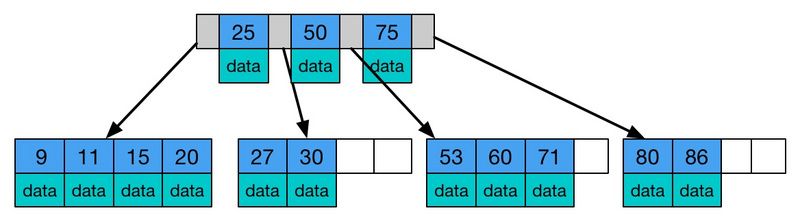
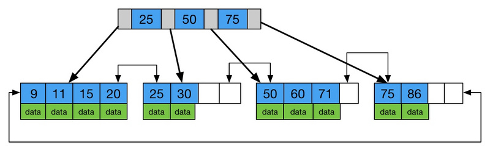
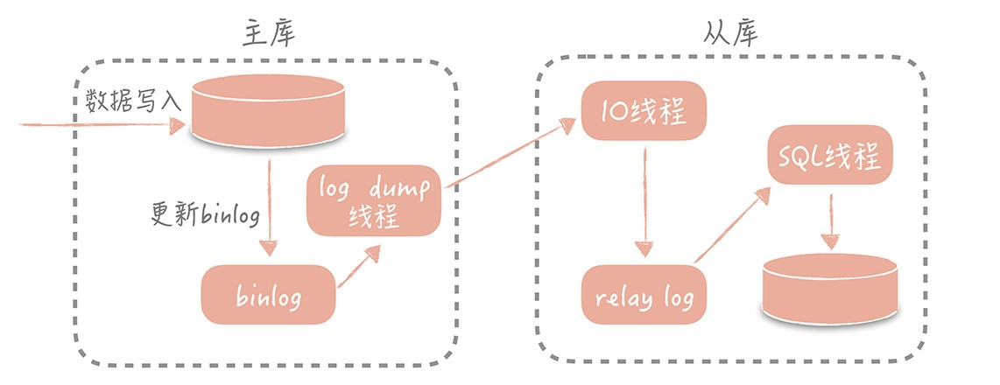

## 5.3 MySQL

>date: 2019-02-20


### 5.3.1 数据类型

`MySQL`支持的数据类型包括数字类型、字符串类型、日期和时间类型。

1字节=8位/8比特，1Byte=8bit。

* 数值类型

|整数类型|字节|最小值|最大值|
|:--:|:--:|:--:|:--:|
|TINYINT|1|有符号 -128<br/>无符号 0|有符号 127<br/>无符号 255|
|SMALLINT|2|有符号 -2^(16 - 1)<br/>无符号 0|有符号 2^(16 - 1) - 1<br/>无符号 2^16 - 1|
|MEDIUMINT|3|有符号 -2^(24 - 1)<br/>无符号 0|有符号 2^(24 - 1) - 1<br/>无符号 2^24 - 1|
|INT/INTEGER|4|有符号 -2^(32 - 1)<br/>无符号 0|有符号 2^(32 - 1) -1<br/>无符号 2^32 - 1|
|BIGINT|8|有符号 -2^(64 - 1)<br/>无符号 0|有符号 2^(64 - 1) - 1<br/>无符号 2^64 - 1|

|浮点数类型|字节|最小值|最大值|
|:--:|:--:|:--:|:--:|
|FLOAT|4|±1.175494351E-38|±3.402823466E+38|
|DOUBLE|8|±2.2250738585072014E-38|±1.7976931348623157E+308|

|定点数类型|字节|最小值&最大值|
|:--:|:--:|:--:|
|DEC(M, D)|M + 2|最大取值范围与DOUBLE相同，给定DECIMAL的有效值范围由M和D决定|

|位类型|字节|最小值|最大值|
|:--:|:--:|:--:|:--:|
|BIT(M)|1 ~ 8|BIT(1)|BIT(64)|

* 字符串类型

|字符串类型|字节|描述及存储需求|
|:--:|:--:|:--:|
|CHAR(M)|M|M为0 ~ 255之间的整数|
|VARCHAR(M)| |M为0 ~ 2^16 - 1之间的整数，值的长度 +1 个字节|
|TINYBLOB| |允许长度0 ~ 255字节，值的长度 +1 个字节|
|BLOB| |允许长度0 ~ 2^16 - 1字节，值的长度 +2 个字节|
|MEDIUMBLOB| |允许长度0 ~ 2^24 - 1字节，值的长度 +3 个字节|
|LONGBLOB| |允许长度0 ~ 2^32 - 1字节，值的长度 +3 个字节|
|TINYTEXT| |允许长度0 ~ 255字节，值的长度 +2 个字节|
|TEXT| |允许长度0 ~ 2^16 - 1字节，值的长度 +2 个字节|
|MEDIUMTEXT| |允许长度0 ~ 2^24 - 1字节，值的长度 +3 个字节|
|LONGBLOB| |允许长度0 ~ 2^32 - 1字节，值的长度 +4 个字节|
|VARBINARY(M)| |允许长度0 ~ M个字节的变长字节字符串，值的长度 +1 个字节|
|BINARY(M)|M|允许长度0 ~ M个字节的定长字节字符串|

* 日期类型

|日期和时间类型|字节|最小值|最大值|
|:--:|:--:|:--:|:--:|
|DATE|4|1000-01-01|9999-12-31|
|DATETIME(支持到微秒)|8|1000-01-01 00:00:00|9999-12-31 23:59:59|
|TIMESTAMP(支持到微秒)|4|19700101080001|2038年的某个时刻|
|TIME|3|-838:59:59|838:59:59|
|YEAR|1|1901|2155|

**常见问题**：

1) `int(11) VS int(21)` 存储空间，还是存储范围有区别？

答案是：两者完全一样，只是在显示的时候补全0的位数不一样。

```sql
create table t(a int(11) zerofill, b int(21) zerofill);
insert into t values (1, 1);
select * from t;
```

2) 精度丢失

```sql
create table t(a int(11), b float(7, 4));
insert into t values (2, 123.12345);
select * from t;
```

3) 选择合适的类型

存储性别、省份、类型等分类信息时选择`TINYINT`或者`ENUM`；

`BIGINT`存储空间更大，`INT`和`BIGINT`之间通常选择`BIGINT`；

交易等高精度数据选择使用`DECIMAL`。

4) `CAHR`与`VARCHAR`区别

`CHAR`和`VARCHAR`存储的单位都是字符，所以它们定义的长度是字符长度不是字节长度。

`CHAR`存储定长，容易造成空间的浪费；

`VARCHAR`存储变长，节省存储空间，存储字符串推荐使用`VARCHAR(N)`，`N`尽量小；

但处理`CHAR`比`VARCHAR`速度要更快。

5) `TEXT`与`CHAR`和`VARCHAR`的区别

`CHAR`和`VARCHAR`存储单位为字符；

`TEXT`存储单位为字节，总大小为`65535`字节，约为`64KB`；

`CHAR`数据类型最大为`255`字符；

`VARCHAR`数据类型为变长存储，可以超过`255`个字符；

`TEXT`在`MySQL`内部大多存储格式为溢出页，效率不如`CHAR`。

6) 字段类型与时区的关联关系

`TIMESTAMP`会根据系统时区进行转换，`DATETIME`则不会。

```sql
create table test (a datetime, b timestamp);
select now();
insert into test values (now(), now());
select * from test;
set time_zone = '+00:00';
select * from test;
```

### 5.3.2 权限管理

```sql
-- 删除所有MySQL中的用户，包括root超级用户
DELETE FROM mysql.user;

-- 增加admin并提升为超级管理员
GRANT ALL PRIVILEGES ON *.* TO 'admin'@'localhost' IDENTIFIED BY 'password' WITH GRANT OPTION;
FLUSH PRIVILEGES;

-- 命令行设置管理员密码
mysqladmin -uroot password 'newpassword' #没有密码的用户设置密码命令
mysqladmin -uroot -p'oldpassword' password 'newpasswrod' -S /usr/local/mysql/data/3306/mysql.sock # 指定sock适合多实例方式

-- 修改管理员密码
UPDATE mysql.user SET PASSWORD=PASSWORD('newpassword') where user='root' AND host='localhost'; # 此方法适合 --skip-grant-tables 方式登录修改密码
FLUSH PRIVILEGES;

SET PASSWORD=PASSWORD('newpassword')); # 此方法不适合 --skip-grant-tables 方式修改当前用户的密码
FLUSH PRIVILEGES;

-- 使用--skip-grant-tables参数启动MySQL，忽略授权登陆验证
mysqld_safe --skip-grant-tables --user=mysql &
mysql

-- 创建用户
GRANT ALL PRIVILEGES ON dbname.* to username@localhost IDENTIFIED BY 'password'; # 创建用户并授权

CREATE USER 'username'@'localhost' IDENTIFIED BY 'password'; # 创建用户
GRANT ALL PRIVILEGES ON test.* to 'username'@'localhost'; # 给用户授权
SHOW GRANTS FOR 'username'@'localhost'; # 查看用户权限明细

GRANT ALL ON *.* TO username@'192.168.1.%' IDENTIFIED BY 'password'; # 授权指定位置的用户可以访问
GRANT ALL ON *.* TO username@'192.168.1.0/255.255.255.0' IDENTIFIED BY 'password'; # 子网掩码方式

-- 删除用户
DROP USER 'username'@'localhost';

-- 设置权限
GRANT SELECT, RELOAD, SHOW DATABASES, LOCK TABLES, REPLICATION CLIENT, EVENT,TRIGGER ON *.* TO 'username'@'localhost' IDENTIFIED BY 'password'; 
FLUSH PRIVILEGES;

-- 查看当前用户权限
SHOW GRANTS;

-- 查看某个用户权限
SHOW GRANTS FOR 'username'@'%';

-- 回收权限
REVOKE DELETE ON *.* FROM 'username'@'localhost';

-- 重命名用户
RENAME USER 'username'@'%' to 'username1'@'%';
```

### 5.3.3 视图

视图是虚拟的表，可以替代复杂的`SQL`查询。通俗的讲，视图就是一条`SELECT`语句执行后返回的结果集。

在经常用到的查询或复杂的联合查询；或者，涉及到权限管理（比如表中某部分字段含有机密信息，不让低权限的用户看到，可以提供给他们一个适合他们权限的视图。

视图可以节省`SQL`语句（将一条复杂的查询结果通过视图保存），视图操作是怎对查询出来的结果，不会对原数据产生影响，相对安全，并且能更好的进行权限控制。

```sql
-- 创建视图
CREATE [OR REPLACE] [ALGORITHM = {UNDEFINED | MERGE | TEMPTABLE}]
    VIEW view_name [(column_list)]
    AS select_statement
   [WITH [CASCADED | LOCAL] CHECK OPTION];

CREATE VIEW v_match
AS 
SELECT a.PLAYERNO,a.NAME,MATCHNO,WON,LOST,c.TEAMNO,c.DIVISION
FROM
PLAYERS a,MATCHES b,TEAMS c
WHERE a.PLAYERNO=b.PLAYERNO AND b.TEAMNO=c.TEAMNO;

-- 查看视图
SHOW CREATE VIEW view_name;

-- 修改视图
CREATE OR REPLACE VIEW view_name AS select_statement;

ALTER
    [ALGORITHM = {UNDEFINED | MERGE | TEMPTABLE}]
    [DEFINER = { user | CURRENT_USER }]
    [SQL SECURITY { DEFINER | INVOKER }]
VIEW view_name [(column_list)]
AS select_statement
    [WITH [CASCADED | LOCAL] CHECK OPTION];

UPDATE v_match SET NAME='test' WHERE PLAYERNO='1';

-- 删除视图
DROP VIEW [IF EXISTS]   
view_name [, view_name] ...;
```

### 5.3.4 索引

索引优化是对查询性能优化最有效的手段，可以轻松提高几个数量级。

```sql
-- 创建索引
-- 如果是CHAR，VARCHAR类型，length可以小于字段实际长度；如果是BLOB和TEXT类型，必须指定 length。
CREATE INDEX indexName ON mytable(username(length)); 

-- 添加索引
ALTER table tableName ADD INDEX indexName(columnName);

CREATE TABLE mytable(
    ID INT NOT NULL,
    username VARCHAR(16) NOT NULL,
    INDEX [indexName] (username(length))
);

-- 删除索引
DROP INDEX [indexName] ON mytable; 


-- 唯一索引与前面的普通索引类似，不同的就是：索引列的值必须唯一，但允许有空值。如果是组合索引，则列值的组合必须唯一。
-- 创建唯一索引
CREATE UNIQUE INDEX indexName ON mytable(username(length));

-- 添加索引
ALTER table mytable ADD UNIQUE [indexName] (username(length));

CREATE TABLE mytable(
    ID INT NOT NULL,
    username VARCHAR(16) NOT NULL,
    UNIQUE [indexName] (username(length))
);

-- 显示索引信息
SHOW INDEX FROM table_name;
```

* `B+` 树

`B Tree`指的是`Balance Tree`，即多路搜索树，它是一种自平衡的树，能够保持数据有序。构成`B Tree`的规则如下：

1) 树种的每个节点最多拥有`m`个子节点且`m>=2`,空树除外（注：`m`阶代表一个树节点最多有多少个查找路径，`m`阶=`m`路，当`m=2`则是2叉树，`m=3`则是3叉树）；

2) 除根节点外每个节点的关键字数量大于等于`ceil(m/2)-1`个小于等于`m-1`个;（注：`ceil()`是个朝正无穷方向取整的函数 如`ceil(1.1)`结果为2)

3) 所有叶子节点均在同一层、叶子节点除了包含了关键字和关键字记录的指针外也有指向其子节点的指针只不过其指针地址都为`null`对应下图最后一层节点的空格子

4) 如果一个非叶节点有`N`个子节点，则该节点的关键字数等于`N-1`;

5) 所有节点关键字是按递增次序排列，并遵循左小右大原则；



`B+ Tree`是基于`B Tree`和叶子节点顺序访问指针进行实现，具有`B Tree`的平衡性，并且通过顺序访问指针来提高区间查询的性能。

它是`B Tree`的一个升级版，相对于`B Tree`来说`B+ Tree`更充分的利用了节点的空间，让查询速度更加稳定，其速度完全接近于二分法查找。

1) `B+ Tree`跟`B Tree`不同`B+ Tree`的非叶子节点不保存关键字记录的指针，这样使得`B+ Tree`每个节点所能保存的关键字大大增加；

2) `B+ Tree`叶子节点保存了父节点的所有关键字和关键字记录的指针，每个叶子节点的关键字从小到大链接；

3) `B+ Tree`的根节点关键字数量和其子节点个数相等；

4) `B+ Tree`的非叶子节点只进行数据索引，不会存实际的关键字记录的指针，所有数据地址必须要到叶子节点才能获取到，所以每次数据查询的次数都一样。



* `B+ Tree` 索引

`B+ Tree`索引分为主索引和辅助索引。

主索引的叶子节点 data 域记录着完整的数据记录，这种索引方式被称为聚簇索引。因为无法把数据行存放在两个不同的地方，所以一个表只能有一个聚簇索引。

辅助索引的叶子节点的 data 域记录着主键的值，因此在使用辅助索引进行查找时，需要先查找到主键值，然后再到主索引中进行查找。

* 哈希索引
哈希索引（hash index）基于哈希表实现，只有精确匹配查询索引所有列的查询才有效。

它能以 `O(1)` 时间进行查找，但是失去了有序性，即无法用于排序与分组；只支持精确查找，无法用于部分查找和范围查找。

`InnoDB` 存储引擎有一个特殊的功能叫“自适应哈希索引”，当某个索引值被使用的非常频繁时，会在 `B+ Tree` 索引之上再创建一个哈希索引，这样就让 `B+ Tree` 索引具有哈希索引的一些优点，比如快速的哈希查找。

* 全文索引

全文索引时一种特殊类型的索引，它查找的是文本中的关键词，而不是直接比较索引中的值。

全文索引更类似于搜索引擎做的事情，而不是简单的 `WHERE` 条件匹配。

全文索引适用于 `MATCH AGAINST` 操作，而不是普通的 `WHERE` 条件查询。

* 索引设计：

`where`子句中的列可能最适合做为索引；

不要尝试为性别或者有无这类字段等建立索引(因为类似性别的列，一般只含有0和1，无论搜索结果如何都会大约得出一半的数据)；

如果创建复合索引，要遵守最左前缀法则。即查询从索引的最左前列开始，并且不跳过索引中的列；

不要过度使用索引。每一次的更新，删除，插入都会维护该表的索引，更多的索引意味着占用更多的空间；

使用`InnoDB`存储引擎时，记录(行)默认会按照一定的顺序存储，如果已定义主键，则按照主键顺序存储，由于普通索引都会保存主键的键值，因此主键应尽可能的选择较短的数据类型，以便节省存储空间；

不要尝试在索引列上使用函数。

* 阿里开发强制要求的11条索引创建规范

1) 【强制】业务上具有唯一特性的字段，即使是多个字段的组合，也必须建成唯一索引。

说明：不要以为唯一索引影响了`insert`速度，这个速度损耗可以忽略，但提高查找速度是明显的；另外，即使在应用层做了非常完善的校验控制，只要没有唯一索引，根据墨菲定律，必然有脏数据产生。

2) 【强制】超过三个表禁止`join`。需要`join`的字段，数据类型必须绝对一致；多表关联查询时，保证被关联的字段需要有索引。

说明：即使双表`join`也要注意表索引、`SQL`性能。

3) 【强制】在`varchar`字段上建立索引时，必须指定索引长度，没必要对全字段建立索引，根据实际文本区分度决定索引长度即可。

说明：索引的长度与区分度是一对矛盾体，一般对字符串类型数据，长度为`20`的索引，区分度会高达`90%`以上，可以使用`count(distinct left(列名, 索引长度))/count(*)`的区分度来确定。

4) 【强制】页面搜索严禁左模糊或者全模糊，如果需要请走搜索引擎来解决。

说明：索引文件具有`B Tree`的最左前缀匹配特性，如果左边的值未确定，那么无法使用此索引。

5) 【推荐】如果有`order by`的场景，请注意利用索引的有序性。`order by` 最后的字段是组合索引的一部分，并且放在索引组合顺序的最后，避免出现`file_sort`的情况，影响查询性能。

正例：`where a=? and b=? order by c`; 索引：`a_b_c` 
反例：索引中有范围查找，那么索引有序性无法利用，如：`where a>10 order by b`; 索引`a_b`无法排序。

6) 【推荐】利用覆盖索引来进行查询操作，避免回表。

说明：如果一本书需要知道第11章是什么标题，会翻开第11章对应的那一页吗？目录浏览一下就好，这个目录就是起到覆盖索引的作用。

正例：能够建立索引的种类分为主键索引、唯一索引、普通索引三种，而覆盖索引只是一种查询的一种效果，用`explain`的结果，`extra`列会出现：`using index`。

7) 【推荐】利用延迟关联或者子查询优化超多分页场景。

说明：`MySQL`并不是跳过`offset`行，而是取`offset+N`行，然后返回放弃前`offset`行，返回`N`行，那当`offset`特别大的时候，效率就非常的低下，要么控制返回的总页数，要么对超过特定阈值的页数进行`SQL`改写。

正例：先快速定位需要获取的`id`段，然后再关联：` SELECT a.* FROM 表1 a, (select id from 表1 where 条件 LIMIT 100000,20 ) b where a.id=b.id`

8) 【推荐】 `SQL`性能优化的目标：至少要达到 `range` 级别，要求是 `ref` 级别，如果可以是 `consts` 最好。 说明：

`consts` 单表中最多只有一个匹配行（主键或者唯一索引），在优化阶段即可读取到数据。

`ref` 指的是使用普通的索引（`normal index`）。

`range` 对索引进行范围检索。

反例：`explain`表的结果，`type=index`，索引物理文件全扫描，速度非常慢，这个`index`级别比较`range`还低，与全表扫描是小巫见大巫。

9) 【推荐】建组合索引的时候，区分度最高的在最左边。

说明：存在非等号和等号混合时，在建索引时，请把等号条件的列前置。如：`where c>? and d=?` 那么即使`c`的区分度更高，也必须把`d`放在索引的最前列，即索引`idx_d_c`。

正例：如果`where a=? and b=?` ，如果`a`列的几乎接近于唯一值，那么只需要单建`idx_a`索引即可。

10) 【推荐】防止因字段类型不同造成的隐式转换，导致索引失效。

11) 【参考】创建索引时避免有如下极端误解：

宁滥勿缺。认为一个查询就需要建一个索引。

宁缺勿滥。认为索引会消耗空间、严重拖慢更新和新增速度。

抵制惟一索引。认为业务的惟一性一律需要在应用层通过“先查后插”方式解决。

### 5.3.5 查询性能优化

* `EXPLAIN`使用

`MySQL` 提供了一个 `EXPLAIN` 命令，它可以对 `SELECT` 语句进行分析，并输出 `SELECT` 执行的详细信息，以供开发人员针对性优化。

```sql
mysql> explain select * from user_info where id = 2\G
*************************** 1. row ***************************
           id: 1 # SELECT 查询的标识符. 每个 SELECT 都会自动分配一个唯一的标识符.
  select_type: SIMPLE # SELECT 查询的类型.
        table: user_info # 查询的是哪个表
   partitions: NULL # 匹配的分区
         type: const # join 类型
possible_keys: PRIMARY # 此次查询中可能选用的索引
          key: PRIMARY # 此次查询中确切使用到的索引
      key_len: 8
          ref: const # 哪个字段或常数与 key 一起被使用
         rows: 1 # 显示此查询一共扫描了多少行，这个是一个估计值
     filtered: 100.00 # 表示此查询条件所过滤的数据的百分比
        Extra: NULL # 额外的信息
1 row in set, 1 warning (0.00 sec)
```

比较重要的字段：

1) `select_type` 表示了查询的类型, 它的常用取值有：

`SIMPLE`：表示此查询不包含 `UNION` 查询或子查询；

`PRIMARY`：表示此查询是最外层的查询；

`UNION`：表示此查询是 `UNION` 的第二或随后的查询；

`DEPENDENT UNION`：`UNION` 中的第二个或后面的查询语句, 取决于外面的查询；

`UNION RESULT`：`UNION` 的结果；

`SUBQUERY`：子查询中的第一个 `SELECT`；

`DEPENDENT SUBQUERY`：子查询中的第一个 `SELECT`, 取决于外面的查询. 即子查询依赖于外层查询的结果。

2) `table`，表示查询涉及的表或衍生表。

3) `type` 字段，判断此次查询是全表扫描还是索引扫描等。常用取值有：

`system`：表中只有一条数据，这个类型是特殊的 `const` 类型；

`const`：针对主键或唯一索引的等值查询扫描，最多只返回一行数据。`const` 查询速度非常快, 因为它仅仅读取一次即可。

`eq_ref`：此类型通常出现在多表的 `join` 查询，表示对于前表的每一个结果，都只能匹配到后表的一行结果。并且查询的比较操作通常是 `=`, 查询效率较高。

`ref`：此类型通常出现在多表的 `join` 查询，针对于非唯一或非主键索引，或者是使用了最左前缀规则索引的查询。

`range`：表示使用索引范围查询，通过索引字段范围获取表中部分数据记录。这个类型通常出现在 `=, <>, >, >=, <, <=, IS NULL, <=>, BETWEEN, IN()` 操作中。

当 `type` 是 `range` 时, 那么 `EXPLAIN` 输出的 `ref` 字段为 `NULL`，并且 `key_len` 字段是此次查询中使用到的索引的最长的那个。

`index`：表示全索引扫描(`full index scan`)，和 `ALL` 类型类似，只不过 `ALL` 类型是全表扫描，而 `index` 类型则仅仅扫描所有的索引，而不扫描数据。

`index` 类型通常出现在：所要查询的数据直接在索引树中就可以获取到，而不需要扫描数据。当是这种情况时，`Extra` 字段 会显示 `Using index`。

`ALL`：表示全表扫描, 这个类型的查询是性能最差的查询之一。

不同的 `type` 类型的性能关系如下：`ALL < index < range ~ index_merge < ref < eq_ref < const < system`

4) `key` 是 `MySQL` 在当前查询时所真正使用到的索引。

5) `rows` 是 `MySQL` 查询优化器根据统计信息，估算 `SQL` 要查找到结果集需要扫描读取的数据行数。

* 避免向数据库请求不需要的数据

在访问数据库时，应该只请求需要的行和列。请求多余的行和列会消耗 `MySQL` 服务器的`CPU`和内存资源，并增加网络开销。

例如在处理分页时，应该使用 `LIMIT` 限制 `MySQL` 只返回一页的数据，而不是向应用程序返回全部数据后，再由应用程序过滤不需要的行。

当一行数据被多次使用时可以考虑将数据行缓存起来，避免每次使用都要到 `MySQL` 查询。

避免使用 `SELECT *` 这种方式进行查询，应该只返回需要的列。

* 查询数据的方式

查询数据的方式有全表扫描、索引扫描、范围扫描、唯一索引查询、常数引用等。这些查询方式，速度从慢到快，扫描的行数也是从多到少。可以通过`EXPLAIN`语句中的`type`列反应查询采用的是哪种方式。

通常可以通过添加合适的索引改善查询数据的方式，使其尽可能减少扫描的数据行，加快查询速度。

例如，当发现查询需要扫描大量的数据行但只返回少数的行，那么可以考虑使用覆盖索引，即把所有需要用到的列都放到索引中。这样存储引擎无须回表获取对应行就可以返回结果了。

* 分解大的查询

可以将一个大查询切分成多个小查询执行，每个小查询只完成整个查询任务的一小部分，每次只返回一小部分结果。

删除旧的数据是一个很好的例子。如果只用一条语句一次性执行一个大的删除操作，则可能需要一次锁住很多数据，占满整个事务日志，耗尽系统资源、阻塞很多小的但重要的查询。

将一个大的删除操作分解成多个较小的删除操作可以将服务器上原本一次性的压力分散到多次操作上，尽可能小地影响 `MySQL` 性能，减少删除时锁的等待时间。同时也减少了 `MySQL` 主从复制的延迟。

另一个例子是分解关联查询，即对每个要关联的表进行单表查询，然后将结果在应用程序中进行关联。下面的这个查询：

```sql
SELECT * FROM tag
    JOIN tag_post ON tag_post.tag_id=tag.id    JOIN post ON tag_post.post_id=post.idWHERE tag.tag = 'mysql';
```

可以分解成下面这些查询来代替：

```sql
SELECT * FROM tag WHERE tag = 'mysql';SELECT * FROM tag_post WHERE tag_id = 1234;SELECT * FROM post WHERE post.id in (123,456,567,9098,8904);
```

将一个关联查询拆解成多个单表查询有如下优点：

让缓存的效率更高。如果缓存的是关联查询的结果，那么其中的一个表发生变化，整个缓存就失效了。而拆分后，如果只是某个表很少的改动，并不会破坏所有的缓存；

可以减少锁的竞争；

更容易对数据库进行拆分，更容易做到高性能和可扩展；

查询本身的效率也有可能会有所提升。例如上面用`IN()`代替关联查询比随机的关联更加高效。

* 优化`MIN()`和`MAX()`

添加索引可以优化`MIN()`和`MAX()`表达式。

例如，要找到某一列的最小值，只需要查询对应`B Tree`索引的最左端的记录即可。

类似的，如果要查询列中的最大值，也只需要读取`B Tree`索引的最后一条记录

对于这种查询，`EXPLAIN`中可以看到`Select tables optimized away`,表示优化器已经从执行计划中移除了该表，并以一个常数取而代之。

* 用`IN()`取代`OR`

在 `MySQL` 中，`IN()`先将自己列表中的数据进行排序，然后通过二分查找的方式确定列的值是否在`IN()`的列表中，这个时间复杂度是`O(logn)`。

如果换成`OR`操作，则时间复杂度是`O(n)`。

所以，对于`IN()`的列表中有大量取值的时候，用`IN()`替换`OR`操作将会更快。

* 优化关联查询

在 `MySQL` 中，任何一个查询都可以看成是一个关联查询，即使只有一个表的查询也是如此。

`MySQL` 对任何关联都执行嵌套循环的关联操作，例如对于下面的`SQL`语句：

```sql
SELECT tbl1.col1, tbl2.col2 FROM tbl1 INNER JOIN tbl2 USING(col3) WHERE tbl1.col1 IN(5, 6);
```

下面的伪代码表示 `MySQL` 将如何执行这个查询：

```sql
out_iter = iterator over tbl1 where col1 IN(5,6)
outer_row = out_iter.next # 先从第一个表中取出符合条件的所有行

# 在while循环中遍历第一个表结果集的每一行
while outer_row
    # 对于第一个表结果集中的每一行，在第二个表中找出符合条件的所有行
    inner_iter = iterator over tbl2 where col3 = outer_row.col3
    inner_row = inner_iter.next
    while inner_row
        # 将第一个表的结果列和第二个表的结果列拼装在一起作为结果输出
        output[outer_row.col1, inner_row.col2]
        inner_row = inner_iter.next
    end
    # 回溯，再根据第一个表结果集的下一行，继续上面的过程
    outer_row = outer_iter.next
end
```

对于单表查询，那么只需要完成上面外层的基本操作。

优化关联查询，要确保`ON`或者`USING`子句中的列上有索引，并且在建立索引时需要考虑到关联的顺序。通常来说，只需要在关联顺序中的第二个表的相应列上创建索引。

例如，当表`A`和表`B`用列`c`关联的时候，假设关联的顺序是`B`、`A`，那么就不需要在`B`表的`c`列上建立索引。没有用到的索引只会带来额外的负担。

此外，确保任何的`GROUP BY`和`ORDER BY`中的表达式只涉及到一个表中的列，这样才能使用索引来优化这个过程。

* 临时表(派生表)的概念

上面提到在 `MySQL` 中，任何一个查询实质上都是一个关联查询。那么对于子查询或`UNION`查询是如何实现关联操作的呢。

对于`UNION`查询， `MySQL` 先将每一个单表查询结果放到一个临时表中，然后再重新读出临时表数据来完成`UNION`查询。`MySQL` 读取结果临时表和普通表一样，也是采用的关联方式。

当遇到子查询时，先执行子查询并将结果放到一个临时表中，然后再将这个临时表当做一个普通表对待。

`MySQL` 的临时表是没有任何索引的，在编写复杂的子查询和关联查询的时候需要注意这一点。

* 排序优化

应该尽量让`MySQL`使用索引进行排序。当不能使用索引生成排序结果的时候，`MySQL`需要自己进行排序。

如果数据量小于“排序缓冲区”的大小，则`MySQL`使用内存进行“快速排序”操作。

如果数据量太大超过“排序缓冲区”的大小，那么`MySQL`只能采用文件排序，而文件排序的算法非常复杂，会消耗很多资源。

无论如何排序都是一个成本很高的操作，所以从性能角度考虑，应尽可能避免排序。所以让`MySQL`根据索引构造排序结果非常的重要。

* 子查询优化

`MySQL`的子查询实现的非常糟糕。最糟糕的一类查询是`WHERE`条件中包含`IN()`的子查询语句。

应该尽可能用关联替换子查询，可以提高查询效率。

* 优化`COUNT()`查询

`COUNT()`有两个不同的作用：统计某个列值的数量，即统计某列值不为`NULL`的个数；统计行数。

当使用`COUNT(*)`时，统计的是行数，它会忽略所有的列而直接统计所有的行数。而在括号中指定了一个列的话，则统计的是这个列上值不为`NULL`的个数。

可以考虑使用索引覆盖扫描或增加汇总表对`COUNT()`进行优化。

* 优化LIMIT分页

处理分页会使用到`LIMIT`，当翻页到非常靠后的页面的时候，偏移量会非常大，这时`LIMIT`的效率会非常差。

例如对于`LIMIT 10000，20`这样的查询，`MySQL`需要查询`10020`条记录，将前面`10000`条记录抛弃，只返回最后的`20`条。这样的代价非常高，如果所有的页面被访问的频率都相同，那么这样的查询平均需要访问半个表的数据。

优化此类分页查询的一个最简单的办法就是尽可能地使用索引覆盖扫描，而不是查询所有的列。然后根据需要与原表做一次关联操作返回所需的列。对于偏移量很大的时候，这样的效率会提升非常大。

考虑下面的查询：

```sql
SELECT film_id, description FROM sakila.film ORDER BY title LIMIT 50, 5;
```

如果这个表非常大，那么这个查询最好改写成下面的这样子：

```sql
SELECT film.film_id, film.description FROM sakila.film INNER JOIN (SELECT film_id FROM sakila.film ORDER BY title LIMIT 50, 5) AS lim USING (film_id);
```

注意优化中关联的子查询，因为只查询`film_id`一个列，数据量小，使得一个内存页可以容纳更多的数据，这让`MySQL`扫描尽可能少的页面。在获取到所需要的所有行之后再与原表进行关联以获得需要的全部列。

`LIMIT`的优化问题，其实是`OFFSET`的问题，它会导致`MySQL`扫描大量不需要的行然后再抛弃掉。

可以借助“书签”的思想记录上次取数据的位置，那么下次就可以直接从该“书签”记录的位置开始扫描，这样就避免了使用`OFFSET`。

可以把主键当做“书签”使用，例如下面的查询：

```sql
SELECT * FROM sakila.rental ORDER BY rental_id DESC LIMIT 20;
```

假设上面的查询返回的是主键为`16049`到`16030`的租借记录，那么下一页查询就可以直接从`16030`这个点开始：

```sql
SELECT * FROM sakila.rental WHERE rental_id < 16030 ORDER BY rental_id DESC LIMIT 20;
```

该技术的好处是无论翻页到多么后面，其性能都会很好。

此外，也可以用关联到一个冗余表的方式提高`LIMIT`的性能，冗余表只包含主键列和需要做排序的数据列。

* 优化UNION查询

除非确实需要服务器消除重复的行，否则一定要使用`UNION ALL`。

如果没有`ALL`关键字，`MySQL`会给临时表加上`DISTINCT`选项，这会导致对整个临时表的数据做唯一性检查。这样做的代价非常高。

### 5.3.6 存储引擎

数据库存储引擎就是使用各种不同的存储机制、索引技巧、锁定水平并且最终提供广泛的不同的功能和能力，将数据存储在文件（或者内存）中的方式。

利用数据库存储引擎可以控制访问权限并快速处理事务，来满足需要处理大量数据的要求。

* 修改数据库存储引擎

修改默认引擎：

```
[mysqld]
default-storage-engine=InnoDB
```

修改`MySQL`服务的`my.ini`文件，重启服务，即可修改默认引擎。

```sql
-- 建表时候指定
CREATE TABLE table_name(
    id INT PRIMARY KEY,
    name VARCHAR(50)
) TYPE=MyISAM;

-- 建表后修改
ALTER TABLE table_name TYPE=InnoDB;

-- 查看引擎
SHOW TABLE STATUS FROM table_name; 
SHOW CREATE TABLE table_name;

-- 查看支持的引擎
SHOW ENGINES;
```

* `InnoDB`引擎

`InnoDB`是一个健壮的事务型存储引擎，是`MySQL`默认的存储引擎。`InnoDB`还引入了行级锁定和外键约束，在以下场合下，使用`InnoDB`是最理想的选择：

1) 更新密集的表。`InnoDB`存储引擎特别适合处理多重并发的更新请求；

2) 事务。`InnoDB`存储引擎是支持事务的标准`MySQL`存储引擎；

3) 自动灾难恢复。与其它存储引擎不同，`InnoDB`表能够自动从灾难中恢复；

4) 外键约束。`MySQL`支持外键的存储引擎只有`InnoDB`；

5) 支持自动增加列`AUTO_INCREMENT`属性。

一般来说，如果需要事务支持，并且有较高的并发读取频率，`InnoDB`是不错的选择。

它实现了四个标准的隔离级别，默认级别是可重复读（`REPEATABLE READ`）。在可重复读隔离级别下，通过多版本并发控制（`MVCC`）+ 间隙锁（`Next-Key Locking`）防止幻影读。

主索引是聚簇索引，在索引中保存了数据，从而避免直接读取磁盘，因此对查询性能有很大的提升。

内部做了很多优化，包括从磁盘读取数据时采用的可预测性读、能够加快读操作并且自动创建的自适应哈希索引、能够加速插入操作的插入缓冲区等。

支持真正的在线热备份。其它存储引擎不支持在线热备份，要获取一致性视图需要停止对所有表的写入，而在读写混合场景中，停止写入可能也意味着停止读取。

* `MyISAM`引擎

`MyISAM`引擎是独立于操作系统的，可以轻松移植数据库；建立了一个`MyISAM`引擎的表，就会生成以下三个文件：

`*.frm`，存储表定义；`*.MYD`，存储数据；`*.MYI`，存储索引。

`MyISAM`表**无法处理事务**，设计简单，数据以紧密格式存储。对于只读数据，或者表比较小、可以容忍修复操作，可以使用它。

提供了大量的特性，包括压缩表、空间数据索引等。不支持行级锁，只能对整张表加锁，读取时会对需要读到的所有表加共享锁，写入时则对表加排它锁。但在表有读取操作的同时，也可以往表中插入新的记录，这被称为并发插入（`CONCURRENT INSERT`）。

`MyISAM`存储引擎特别适合在以下几种情况下使用：

1) 选择密集型的表。MyISAM存储引擎在筛选大量数据时非常迅速，这是它最突出的优点；

2) 插入密集型的表。MyISAM的并发插入特性允许同时选择和插入数据。

**`InnoDB`引擎和`MyISAM`引擎比较：**

事务：`InnoDB` 是事务型的，可以使用 `Commit` 和 `Rollback` 语句。

并发：`MyISAM` 只支持表级锁，而 `InnoDB` 还支持行级锁。

外键：`InnoDB` 支持外键，`MyISAM` 不支持。

备份：`InnoDB` 支持在线热备份。

崩溃恢复：`MyISAM` 崩溃后发生损坏的概率比 `InnoDB` 高很多，而且恢复的速度也更慢。

其它特性：`MyISAM` 支持压缩表和空间数据索引；`MyISAM` 适合查询以及插入为主的应用，而`InnoDB` 适合频繁修改以及涉及到安全性较高的应用。

### 5.3.7 读写分离和分库分表

* 读写分离

  曾有云厂商测试过单机`4`核心`8G`的机器上运行`MySQL 5.7`，其可支撑`500 TPS`和`10000 QPS`，但是当业务查询量骤增时候，这个性能是远远不能支撑的。所以提出以读写分离来解决查询量大的问题。

  大部分的系统访问模型都是读多写少，读写差距在几个数量级。针对后期读或者写的流量进行单独的扩展，有利于更高的性能要求。读写分离的目的就是分流。
  
  其基本原理就是让主数据库处理事务性的增(`INSERT`)、删(`DELETE`)、改(`UPDATE`)，从数据库处理查询(`SELECT`)请求，使用数据库复制来将事务性操作的变更同步到集群的从数据库中。
  
- * `MySQL`主从复制大致过程

  `MySQL` 的主从复制是依赖于`binlog` 的。下面介绍一种常见的主从复制方式：
  
  1) 首先从库在连接到主节点时会创建一个 `IO` 线程，用以请求主库更新的 `binlog`，并且把接收到的 `binlog` 信息写入一个叫做 `relay log` 的日志文件中；
  
  2) 主库创建一个 `log dump` 线程来发送 `binlog` 给从库，这是一个异步的方式，可以避免对主要线程产生影响；

  3) 从库创建一个 `SQL` 线程读取 `relay log` 中的内容，并且在从库中做回放，最终实现主从的一致性。采用`relay log`的方式，是为了避免直接写入时，从库实际存储会产生比较大的好事，从而造成从库和主库之间延迟变长。



  在读流量比较大的情况下，可以部署多个从库共同承担读流量，即**一主多从**的部署方式。同时，从库也可以当成一个备库来使用，以避免主库故障导致数据丢失。

  随着从库数量增加，从库连接上来的 IO 线程比较多，主库也需要创建同样多的 `log dump` 线程来处理复制的请求，对于主库资源消耗比较高，所以并不是可以无限制地增加从库的数量。并且受限于主库的网络带宽，所以在实际使用中，一般一个主库最多挂 `3～5` 个从库。

- * 主从复制延迟导致的数据读取问题解决

  1) 使用缓存，数据写入主库同时，也写入缓存中，优先读取缓存；

  2) 在主库压力不大的情况下，可以查询主库。

- * 多个数据库访问

  可以使用数据库代理，设置代理层来，屏蔽主从分离后的数据库访问细节。

* 分库分表

  当系统业务量持续增长，数据库的查询与写入性能下降，数据库存储持续增加，如何让系统持续高效正常运行：
  
  1) 当系统存储数据越来越多，单个表的数据量可能超过千万或者亿级别，如何提升查询性能？

  2) 数据库备份和恢复所需的空间和时间变多，如何让数据库系统支持如此大的数据量？

  3) 如果数据都存储在一个主库中，如何做到不同业务模块的隔离来抵御故障？

  4) 如何处理更高的并发写入请求？

  上面这些都是因为数据库写入数据量大造成的性能和可用性的问题，一个常见的方式的是分摊数据库每个节点间的读写压力，即对数据进行分片，同时也能保证数据存储的瓶颈。即对数据库进行**分库分表**。
  
  1) 垂直拆分

- * 垂直分表

  基于**列字段**进行，将不常用的，数据较大，长度较长的拆分到扩展表。

- * 垂直分库

  在业务上，针对不同业务进行划分，即一个业务一个库。也能对不同业务的数据分布进行管理、维护、监控、扩展。

  2) 水平拆分

- * 水平分表

  针对数据量巨大的单张表，按照某种规则（区域切分`RANGE`、`HASH`取模），切分到多张表上。

- * 水平分库

  将单张表的数据切分到多个数据库上。

- * 切分策略

  a. `RANGE`：从`0`到`10000`一个表，`10001`到`20000`一个表；

  b. `HASH`取模：针对用户表中数据量巨大的问题，取用户`id`，然后`HASH`取模，分配到不同的子表和数据库上。

  c. 地理区域：可以按照数据所属的地域进行划分，例如华东，华南，华北这样来区分业务。

  d. 时间：按照时间切分，就是将`6`个月前，甚至一年前的数据切出去放到另外的一张表，因为随着时间流逝，这些表的数据 被查询的概率变小，所以没必要和“热数据”放在一起，这个也是“冷热数据分离”。

### 5.3.8 基本架构


`MySQL`大致分为`Server`层和存储引擎层。

* `Server`层

`Server` 层包括连接器、查询缓存、分析器、优化器、执行器等，涵盖 `MySQL` 的大多数核心服务功能，以及所有的内置函数（如日期、时间、数学和加密函数等），所有跨存储引擎的功能都在这一层实现，比如存储过程、触发器、视图等。

- * 连接器

连接器负责跟客户端建立连接、获取权限、维持和管理连接。

客户端与服务端连接成功后，如果没有后续动作，整个连接就处于空闲状态，如果客户端长时间没有动作，连接器就会将其自动断开，默认的时间是`8`小时，由参数`wait_timeout`控制。

数据库中的长连接指的是连接成功后持续有请求，一直使用的连接。短连接指每次执行完很少的几次查询后就断开的连接，下次查询需要重新建立连接。

`MySQL`执行过程中的内存是管理在连接对象中的，资源会在连接断开的时候才释放，如果长连接累积过多，会导致内存占用过大，被系统强行杀掉（`OOM, Out Of Memory Killer`），从现象上看就是`MySQL`异常重启了。

为了避免这个问题，

a. 可以定期断开长连接，而当执行一个占用内存很多的查询后，即断开连接，需要时候再查询；

b. 如果是 `MySQL 5.7` 或更新版本，可以在每次执行一个比较大的操作后，通过执行
`mysql_reset_connection` 来重新初始化连接资源。这个过程不需要重连和重新做权限验
证，但是会将连接恢复到刚刚创建完时的状态。

- * 查询缓存

`MySQL` 拿到一个查询请求后，会先到查询缓存看看，之前是不是执行过这条语句。之前执
行过的语句及其结果可能会以 `key-value` 对的形式，被直接缓存在内存中。`key` 是查询的
语句，`value` 是查询的结果。如果你的查询能够直接在这个缓存中找到 `key`，那么这个
`value` 就会被直接返回给客户端。

只要对一个表进行更新，其上面的查询缓存就会被清空。而在大多数情况下，表中的数据会频繁更新，缓存失效会很频繁，这样的查询缓存命中率会非常低，这种情况下，并不适合使用查询缓存。

除非这张表示静态表，需要很长时间才会更新一次，这时候就适合使用查询缓存。

查询缓存使用`query_cache_type`参数进行控制，将其设置为`DEMAND`，即可对于默认的 `SQL` 不使用查询缓存。对于确定使用查询缓存的语句，可以使用 `SQL_CACHE` 显式指定：

```sql
select SQL_CACHE * from T where ID=10；
```

**注意：** `MySQL 8.0` 版本直接将查询缓存的整块功能删掉了，也就是说 `8.0` 开始彻
底没有这个功能了。

- * 分析器

分析器即对 `SQL` 语句进行解析后提供执行。其会先进行词法分析，然后进行语法分析。

- * 优化器

经过了分析器，会先经过优化器进行处理，其是进行索引处理、表关联时候，表连接顺序这些工作的。比如：

```sql
select * from t1 join t2 using(ID) where t1.c=10 and t2.d=20;
```

上面的语句中，既可以先从表 `t1` 里面取出 `c=10` 的记录的 `ID` 值，再根据 `ID` 值关联到表 `t2`，再判断 `t2` 里面 `d` 的值是否等于 `20`；

也可以先从表 `t2` 里面取出 `d=20` 的记录的 `ID` 值，再根据 `ID` 值关联到 `t1`，再判断 `t1` 里面 `c` 的值是否等于 `10`。

两种执行的逻辑结果都是一样的，但是执行的效率会有所不同，优化器就是决定使用那一个方案。

- * 执行器

执行器就是对语句进行执行的具体过程，其开始执行的时候，如果命中查询缓存，会在查询缓存返回结果的时候，做权限验证。如果有权限，就打开表继续执行。打开表的时候，执行器就会根据表的引擎定义，去使用这个引擎提供的接口。

* 存储引擎层

存储引擎层负责数据的存储和提取。其架构模式是插件式的，支持 `InnoDB`、`MyISAM`、`Memory` 等多个存储引擎。 `InnoDB`从 `MySQL 5.5.5` 版本成为默认存储引擎。

### 5.3.9 日志模块

一条查询语句的执行过程一般是经过连接器、分析器、优化器、执行器等功能模块，最后到达存储引擎。而在更新中也是如此，但是其还会涉及两个重要的日志模块，即`redo log`（重做日志）和`binlog`（归档日志）。

* `redo log`

`redo log` 是 `InnoDB` 引擎特有的日志。

如果再`MySQL`中每一次的更新操作都需要写进磁盘，然后磁盘找到相应的记录，然后进行更新，这整个过程的`IO`成本、查找成本是很高的。

为了提高更新效率，`MySQL`使用了`WAL`(`Write-Ahead Logging`)技术，其关键点是先写日志，然后写磁盘。

当有一条记录需要更新的时候，`InnoDB` 引擎就会先把记录写到 `redo log` 里面，并更新内存，这个更新就算完成了。同时，`InnoDB` 引擎会在系统比较空闲的时候，将这个操作记录更新到磁盘里面。

`InnoDB` 的`redo log`是固定大小的，它会从头开始写，写到末尾就在循环开始写。[`InnoDB` 的 `redo log` 记录方式](https://github.com/JasonJe/notes/issues/34)

有了`redo log`，`InnoDB` 可以在保证数据库发生异常重启的时候，之前提交的记录不会丢失，这种能力叫`crash-safe`。

* `binlog`

`redo log` 是 `InnoDB` 引擎特有的日志，而 `Server` 层也有自己的日志，即 `binlog`。

两种日志有以下的不同：

1. `redo log` 是 `InnoDB` 引擎特有的；`binlog` 是 `MySQL` 的 `Server` 层实现的，所有引擎都可以使用。

2. `redo log` 是**物理日志**，记录的是“在某个数据页上做了什么修改”；binlog 是**逻辑日志**，记录的是这个语句的原始逻辑，比如“给 `ID=2` 这一行的 `c` 字段加 `1` ”。

3. `redo log` 是循环写的，空间固定会用完；`binlog` 是可以追加写入的。“追加写”是指 `binlog` 文件写到一定大小后会切换到下一个，并不会覆盖以前的日志。


### 5.3.10 事务

[事务](数据库系统原理.md#511-事务)

这里的讨论的事务指的是`InnoDB`引擎的事务。

查看隔离级别的方式：`SHOW VARIABLES LIKE 'transaction_isolation'`

* 事务隔离的实现

假设一个值从 `1` 被按顺序改成了 `2, 3, 4`，就会存在 `3` 个`read-view`，该值对应的就是未改之前的值，即同一条记录在系统中存在多个版本，这个就是数据库的多版本控制`MVCC`。

如果要将值回滚回 `1`，就需要依次执行 `read-view` 的回滚操作才行。

同时，事务进行时候，其与其它`read-view`对应的事务是不会冲突的。

在长事务中，会存在很老的事务视图。由于这些事务随时可能访问数据库里面的任何数据，所以这个事务提交之前，数据库里面它可能用到的回滚记录都必须保留，这就会导致大量占用存储空间。所以尽量不要使用长事务。

* 事务的启动方式

1. 显式启动事务语句， `begin` 或 `start transaction`。配套的提交语句是 `commit`，回滚语句是 `rollback`；

2. `set autocommit=0`，这个命令会将这个线程的自动提交关掉。意味着如果执行了一个 `select` 语句，这个事务就启动了，而且并不会自动提交。这个事务持续存在直到你主动执行 `commit` 或 `rollback` 语句，或者断开连接。

推荐显示语句来启动事务，因为使用 `set autocommit=0` 会导致接下来的查询都在事务中，如果是长连接，则会导致意外的长事务。

在 `autocommit` 为 `1` 的情况下，用 `begin` 显式启动的事务，如果执行 `commit` 则提交事务。如果执行 `commit work and chain`，则是提交事务并自动启动下一个事务，这样也省去了再次执行 `begin` 语句的开销。同时也能明确地知道每个语句是否处于事务中。


### 5.3.11 扩展阅读

[10款常见MySQL高可用方案选型解读](https://cloud.tencent.com/developer/article/1120513)

[数据库 SQL 优化大总结之：百万级数据库优化方案](https://hsutimes.club/article/108/)

[【干货】MySQL数据库开发规范](https://juejin.im/post/5c15c2b3f265da6170070613)

[支撑日活百万用户的高并发系统，应该如何设计其数据库架构？【石杉的架构笔记】](https://juejin.im/post/5c6a9f25518825787e69e70a?utm_source=gold_browser_extension)

*待续补充...*

参考链接：

* [MySQL数据库对象与应用](https://github.com/yumendy/NTES_MySQL_notes/blob/master/chapter2.md)

* [深入解析MySQL视图VIEW](https://www.cnblogs.com/geaozhang/p/6792369.html)

* [阿里开发强制要求的11条索引创建规范，提高性能](http://news.51cto.com/art/201901/591018.htm)

* [MySql查询性能优化](https://cloud.tencent.com/developer/article/1165499)

* [Mysql 分页查询超过 1000 时变慢的原因](https://oyifan.com/2016/03/23/offsetSlow/)

* [MySQL](https://cyc2018.github.io/CS-Notes/#/notes/MySQL) 
