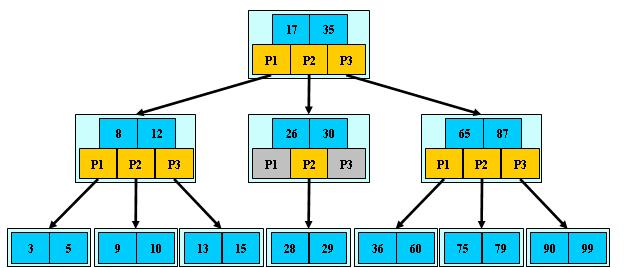
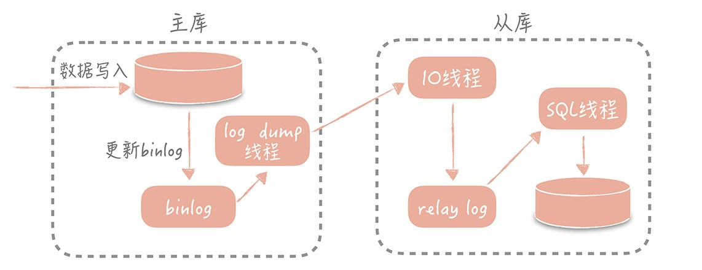

## 5.3 MySQL

>date: 2019-02-20


### 5.3.1 数据类型

`MySQL`支持的数据类型包括数字类型、字符串类型、日期和时间类型。

1字节=8位/8比特，1Byte=8bit。

* 数值类型

|整数类型|字节|最小值|最大值|
|:--:|:--:|:--:|:--:|
|TINYINT|1|有符号 -128<br/>无符号 0|有符号 127<br/>无符号 255|
|SMALLINT|2|有符号 -2^(16 - 1)<br/>无符号 0|有符号 2^(16 - 1) - 1<br/>无符号 2^16 - 1|
|MEDIUMINT|3|有符号 -2^(24 - 1)<br/>无符号 0|有符号 2^(24 - 1) - 1<br/>无符号 2^24 - 1|
|INT/INTEGER|4|有符号 -2^(32 - 1)<br/>无符号 0|有符号 2^(32 - 1) -1<br/>无符号 2^32 - 1|
|BIGINT|8|有符号 -2^(64 - 1)<br/>无符号 0|有符号 2^(64 - 1) - 1<br/>无符号 2^64 - 1|

|浮点数类型|字节|最小值|最大值|
|:--:|:--:|:--:|:--:|
|FLOAT|4|±1.175494351E-38|±3.402823466E+38|
|DOUBLE|8|±2.2250738585072014E-38|±1.7976931348623157E+308|

|定点数类型|字节|最小值&最大值|
|:--:|:--:|:--:|
|DEC(M, D)|M + 2|最大取值范围与DOUBLE相同，给定DECIMAL的有效值范围由M和D决定|

|位类型|字节|最小值|最大值|
|:--:|:--:|:--:|:--:|
|BIT(M)|1 ~ 8|BIT(1)|BIT(64)|

* 字符串类型

|字符串类型|字节|描述及存储需求|
|:--:|:--:|:--:|
|CHAR(M)|M|M为0 ~ 255之间的整数|
|VARCHAR(M)| |M为0 ~ 2^16 - 1之间的整数，值的长度 +1 个字节|
|TINYBLOB| |允许长度0 ~ 255字节，值的长度 +1 个字节|
|BLOB| |允许长度0 ~ 2^16 - 1字节，值的长度 +2 个字节|
|MEDIUMBLOB| |允许长度0 ~ 2^24 - 1字节，值的长度 +3 个字节|
|LONGBLOB| |允许长度0 ~ 2^32 - 1字节，值的长度 +3 个字节|
|TINYTEXT| |允许长度0 ~ 255字节，值的长度 +2 个字节|
|TEXT| |允许长度0 ~ 2^16 - 1字节，值的长度 +2 个字节|
|MEDIUMTEXT| |允许长度0 ~ 2^24 - 1字节，值的长度 +3 个字节|
|LONGBLOB| |允许长度0 ~ 2^32 - 1字节，值的长度 +4 个字节|
|VARBINARY(M)| |允许长度0 ~ M个字节的变长字节字符串，值的长度 +1 个字节|
|BINARY(M)|M|允许长度0 ~ M个字节的定长字节字符串|

* 日期类型

|日期和时间类型|字节|最小值|最大值|
|:--:|:--:|:--:|:--:|
|DATE|4|1000-01-01|9999-12-31|
|DATETIME(支持到微秒)|8|1000-01-01 00:00:00|9999-12-31 23:59:59|
|TIMESTAMP(支持到微秒)|4|19700101080001|2038年的某个时刻|
|TIME|3|-838:59:59|838:59:59|
|YEAR|1|1901|2155|

**常见问题**：

1) `int(11) VS int(21)` 存储空间，还是存储范围有区别？

答案是：两者完全一样，只是在显示的时候补全0的位数不一样。

```sql
create table t(a int(11) zerofill, b int(21) zerofill);
insert into t values (1, 1);
select * from t;
```

2) 精度丢失

```sql
create table t(a int(11), b float(7, 4));
insert into t values (2, 123.12345);
select * from t;
```

3) 选择合适的类型

存储性别、省份、类型等分类信息时选择`TINYINT`或者`ENUM`；

`BIGINT`存储空间更大，`INT`和`BIGINT`之间通常选择`BIGINT`；

交易等高精度数据选择使用`DECIMAL`。

4) `CAHR`与`VARCHAR`区别

`CHAR`和`VARCHAR`存储的单位都是字符，所以它们定义的长度是字符长度不是字节长度。

`CHAR`存储定长，容易造成空间的浪费；

`VARCHAR`存储变长，节省存储空间，存储字符串推荐使用`VARCHAR(N)`，`N`尽量小；

但处理`CHAR`比`VARCHAR`速度要更快。

5) `TEXT`与`CHAR`和`VARCHAR`的区别

`CHAR`和`VARCHAR`存储单位为字符；

`TEXT`存储单位为字节，总大小为`65535`字节，约为`64KB`；

`CHAR`数据类型最大为`255`字符；

`VARCHAR`数据类型为变长存储，可以超过`255`个字符；

`TEXT`在`MySQL`内部大多存储格式为溢出页，效率不如`CHAR`。

6) 字段类型与时区的关联关系

`TIMESTAMP`会根据系统时区进行转换，`DATETIME`则不会。

```sql
create table test (a datetime, b timestamp);
select now();
insert into test values (now(), now());
select * from test;
set time_zone = '+00:00';
select * from test;
```

### 5.3.2 权限管理

```sql
-- 删除所有MySQL中的用户，包括root超级用户
DELETE FROM mysql.user;

-- 增加admin并提升为超级管理员
GRANT ALL PRIVILEGES ON *.* TO 'admin'@'localhost' IDENTIFIED BY 'password' WITH GRANT OPTION;
FLUSH PRIVILEGES;

-- 命令行设置管理员密码
mysqladmin -uroot password 'newpassword' #没有密码的用户设置密码命令
mysqladmin -uroot -p'oldpassword' password 'newpasswrod' -S /usr/local/mysql/data/3306/mysql.sock # 指定sock适合多实例方式

-- 修改管理员密码
UPDATE mysql.user SET PASSWORD=PASSWORD('newpassword') where user='root' AND host='localhost'; # 此方法适合 --skip-grant-tables 方式登录修改密码
FLUSH PRIVILEGES;

SET PASSWORD=PASSWORD('newpassword')); # 此方法不适合 --skip-grant-tables 方式修改当前用户的密码
FLUSH PRIVILEGES;

-- 使用--skip-grant-tables参数启动MySQL，忽略授权登陆验证
mysqld_safe --skip-grant-tables --user=mysql &
mysql

-- 创建用户
GRANT ALL PRIVILEGES ON dbname.* to username@localhost IDENTIFIED BY 'password'; # 创建用户并授权

CREATE USER 'username'@'localhost' IDENTIFIED BY 'password'; # 创建用户
GRANT ALL PRIVILEGES ON test.* to 'username'@'localhost'; # 给用户授权
SHOW GRANTS FOR 'username'@'localhost'; # 查看用户权限明细

GRANT ALL ON *.* TO username@'192.168.1.%' IDENTIFIED BY 'password'; # 授权指定位置的用户可以访问
GRANT ALL ON *.* TO username@'192.168.1.0/255.255.255.0' IDENTIFIED BY 'password'; # 子网掩码方式

-- 删除用户
DROP USER 'username'@'localhost';

-- 设置权限
GRANT SELECT, RELOAD, SHOW DATABASES, LOCK TABLES, REPLICATION CLIENT, EVENT,TRIGGER ON *.* TO 'username'@'localhost' IDENTIFIED BY 'password'; 
FLUSH PRIVILEGES;

-- 查看当前用户权限
SHOW GRANTS;

-- 查看某个用户权限
SHOW GRANTS FOR 'username'@'%';

-- 回收权限
REVOKE DELETE ON *.* FROM 'username'@'localhost';

-- 重命名用户
RENAME USER 'username'@'%' to 'username1'@'%';
```

### 5.3.3 视图

视图是虚拟的表，可以替代复杂的`SQL`查询。通俗的讲，视图就是一条`SELECT`语句执行后返回的结果集。

在经常用到的查询或复杂的联合查询；或者，涉及到权限管理（比如表中某部分字段含有机密信息，不让低权限的用户看到，可以提供给他们一个适合他们权限的视图。

视图可以节省`SQL`语句（将一条复杂的查询结果通过视图保存），视图操作是怎对查询出来的结果，不会对原数据产生影响，相对安全，并且能更好的进行权限控制。

```sql
-- 创建视图
CREATE [OR REPLACE] [ALGORITHM = {UNDEFINED | MERGE | TEMPTABLE}]
    VIEW view_name [(column_list)]
    AS select_statement
   [WITH [CASCADED | LOCAL] CHECK OPTION];

CREATE VIEW v_match
AS 
SELECT a.PLAYERNO,a.NAME,MATCHNO,WON,LOST,c.TEAMNO,c.DIVISION
FROM
PLAYERS a,MATCHES b,TEAMS c
WHERE a.PLAYERNO=b.PLAYERNO AND b.TEAMNO=c.TEAMNO;

-- 查看视图
SHOW CREATE VIEW view_name;

-- 修改视图
CREATE OR REPLACE VIEW view_name AS select_statement;

ALTER
    [ALGORITHM = {UNDEFINED | MERGE | TEMPTABLE}]
    [DEFINER = { user | CURRENT_USER }]
    [SQL SECURITY { DEFINER | INVOKER }]
VIEW view_name [(column_list)]
AS select_statement
    [WITH [CASCADED | LOCAL] CHECK OPTION];

UPDATE v_match SET NAME='test' WHERE PLAYERNO='1';

-- 删除视图
DROP VIEW [IF EXISTS]   
view_name [, view_name] ...;
```

### 5.3.4 索引

索引优化是对查询性能优化最有效的手段，可以轻松提高几个数量级。

```sql
-- 创建索引
-- 如果是CHAR，VARCHAR类型，length可以小于字段实际长度；如果是BLOB和TEXT类型，必须指定 length。
CREATE INDEX indexName ON mytable(username(length)); 

-- 添加索引
ALTER table tableName ADD INDEX indexName(columnName);

CREATE TABLE mytable(
    ID INT NOT NULL,
    username VARCHAR(16) NOT NULL,
    INDEX [indexName] (username(length))
);

-- 删除索引
DROP INDEX [indexName] ON mytable; 


-- 唯一索引与前面的普通索引类似，不同的就是：索引列的值必须唯一，但允许有空值。如果是组合索引，则列值的组合必须唯一。
-- 创建唯一索引
CREATE UNIQUE INDEX indexName ON mytable(username(length));

-- 添加索引
ALTER table mytable ADD UNIQUE [indexName] (username(length));

CREATE TABLE mytable(
    ID INT NOT NULL,
    username VARCHAR(16) NOT NULL,
    UNIQUE [indexName] (username(length))
);

-- 显示索引信息
SHOW INDEX FROM table_name;
```

在 `MySQL` 中，索引是在存储引擎层实现的。这里针对`InnoDB`的索引进行讨论。

#### 索引模型

* `B+` 树

`B Tree`指的是`Balance Tree`，即多路搜索树，它是一种自平衡的树，能够保持数据有序。构成`B Tree`的规则如下：

1) 树种的每个节点最多拥有`m`个子节点且`m≥2`，空树除外；

2) 除根节点外每个节点的关键字数量大于等于`⌈m/2⌉-1`个小于等于`m-1`个;

3) 所有叶子节点均在同一层，叶子节点除了包含了关键字和关键字记录的指针外，也有指向其子节点的指针，只不过其指针地址都为`null`；

4) 如果一个非叶节点有`N`个子节点，则该节点的关键字数等于`N-1`;

5) 所有节点关键字是按递增次序排列，并遵循**左小右大**原则；



`B+ Tree`是基于`B Tree`和叶子节点顺序访问指针进行实现，具有`B Tree`的平衡性，并且通过顺序访问指针来提高区间查询的性能。

它是`B Tree`的一个升级版，相对于`B Tree`来说`B+ Tree`更充分的利用了节点的空间，让查询速度更加稳定，其速度完全接近于二分法查找。

1) 非叶子节点不保存关键字记录的指针，这样使得`B+ Tree`每个节点所能保存的关键字大大增加；

2) 叶子节点保存了父节点的所有关键字和关键字记录的指针，每个叶子节点的关键字从小到大链接；

3) 根节点关键字数量和其子节点个数相等；

4) 非叶子节点只进行数据索引，不会存实际的关键字记录的指针，所有数据地址必须要到叶子节点才能获取到，所以每次数据查询的次数都一样。


* `B+ Tree` 索引

- * 主键索引和非主键索引

`B+ Tree`索引分为主键索引和非主键索引。每一个索引在 `InnoDB` 里面对应一棵 `B+` 树。

1) 主键索引的叶子节点存的是整行数据。在 `InnoDB` 里，主键索引也被称为聚簇索引(`clustered index`)；

主键索引的叶子节点 `data` 域记录着完整的数据记录，一个表只能有一个主键索引。

如果语句是 `select * from T where ID=500`(`ID`为主键)，即主键查询方式，则只需要搜索 `ID` 这棵 `B+` 树；

2) 非主键索引的叶子节点内容是主键的值。在 `InnoDB` 里，非主键索引也被称为二级索引(`secondary index`)。

辅助索引的叶子节点的 `data` 域记录着主键的值，因此在使用辅助索引进行查找时，需要先查找到主键值，然后再到主索引中进行查找，这个过程叫**回表**。

如果语句是 `select * from T where k=5`(`ID`为主键)，即普通索引查询方式，则需要先搜索 `k` 索引树，得到 `ID` 的值为 `500`，再到 `ID` 索引树搜索一次。

在使用中尽量使用主键查询。

- * 索引维护

在`B+`树结构中，节点内部关键字记录和节点之间根据关键字的大小排列，而当主键是按照顺序递增的时候，每当新增一行即在最后的节点上新增一个节点即可；

相反，如果主键并不是按照顺序插入表中的时候，并且当数据页满了，按照`B+`树算法，这时候就需要申请一个新的数据页，然后将部分数据挪过去，这种过程叫做**页分裂**。

在页分裂的情况下，不仅会增加这个过程的消耗，影响性能，还会影响空间利用率，即原本放在一页的数据，现在分到两个页中，整体的空间利用率降低了大约`50%`。

所以在一般的建表时候，推荐使用自增主键作为主键。`NOT NULL PRIMARY KEY AUTO_INCREMENT`。

同时，根据非主键索引的特性，主键的长度越小，普通索引的叶子节点占用的空间也就越小。

- * 覆盖索引

考虑以下语句的执行(`ID`为主键)：

```sql
SELECT ID FORM T WHERE k BETWEEN 3 AND 5;
```

上面的语句中，只需要查`ID`的值，而`ID`的值已经在`k`索引树上了，因此可以直接提供查询结果，所以不需要回表。

当查询中非主键索引已经满足查询需求时，称为**覆盖查询**。

覆盖索引可以减少树的搜索次数，显著提升查询性能。

- * 最左前缀原则

针对`B+`树这种索引结构，可以利用**最左前缀**来定位记录。

在一个索引中，索引项中的字段的顺序是按照索引定义中的字段顺序排序的。

如果定义了一个联合索引，建议的是经常被查询到的字段放在索引定义的最左边，同时这个字段也不用单独建立索引了。即通过调整索引顺序，在一些场景下能加快索引速度，同时也可以少维护一个索引。

- * 索引下推

`MySQL 5.6`中引入了**索引下推优化(`index condition pushdown`)**，其可以在索引遍历过程中，对索引中包含的字段先做判断，知道过滤掉不满足条件的记录，减少回表次数。

考虑以下语句的执行(`ID`为主键，`(name, age)` 为联合索引)：

```sql
SELECT * FORM tuser WHERE name LIKE "张%" AND age=10 AND ismale=1;
```

无索引下推的过程：

查找到了所有`name LIKE '张%'`的主键`ID`，然后遍历进行回表过程，找出具体的每行记录并与其它过滤条件进行对比，最后得到结果集。

这个过程中并不会对联合查询的第二个字段进行查询，而是在回表过程中进行查询过滤。

索引下推过程：

在索引下推过程中，在查找时候，会同时对联合查询中的字段都进行过滤，所以最终的回表次数会远远比前面的情况少。

* 哈希索引

哈希索引（hash index）基于哈希表实现，只有精确匹配查询索引所有列的查询才有效。

它能以 `O(1)` 时间进行查找，但是失去了有序性，即无法用于排序与分组；只支持精确查找，无法用于部分查找和范围查找。

`InnoDB` 存储引擎有一个特殊的功能叫“自适应哈希索引”，当某个索引值被使用的非常频繁时，会在 `B+ Tree` 索引之上再创建一个哈希索引，这样就让 `B+ Tree` 索引具有哈希索引的一些优点，比如快速的哈希查找。

* 全文索引

全文索引时一种特殊类型的索引，它查找的是文本中的关键词，而不是直接比较索引中的值。

全文索引更类似于搜索引擎做的事情，而不是简单的 `WHERE` 条件匹配。

全文索引适用于 `MATCH AGAINST` 操作，而不是普通的 `WHERE` 条件查询。

* 索引设计：

`where`子句中的列可能最适合做为索引；

不要尝试为性别或者有无这类字段等建立索引(因为类似性别的列，一般只含有0和1，无论搜索结果如何都会大约得出一半的数据)；

如果创建复合索引，要遵守最左前缀法则。即查询从索引的最左前列开始，并且不跳过索引中的列；

不要过度使用索引。每一次的更新，删除，插入都会维护该表的索引，更多的索引意味着占用更多的空间；

使用`InnoDB`存储引擎时，记录(行)默认会按照一定的顺序存储，如果已定义主键，则按照主键顺序存储，由于普通索引都会保存主键的键值，因此主键应尽可能的选择较短的数据类型，以便节省存储空间；

不要尝试在索引列上使用函数。

### 5.3.5 存储引擎

数据库存储引擎就是使用各种不同的存储机制、索引技巧、锁定水平并且最终提供广泛的不同的功能和能力，将数据存储在文件（或者内存）中的方式。

利用数据库存储引擎可以控制访问权限并快速处理事务，来满足需要处理大量数据的要求。

* 修改数据库存储引擎

修改默认引擎：

```
[mysqld]
default-storage-engine=InnoDB
```

修改`MySQL`服务的`my.ini`文件，重启服务，即可修改默认引擎。

```sql
-- 建表时候指定
CREATE TABLE table_name(
    id INT PRIMARY KEY,
    name VARCHAR(50)
) TYPE=MyISAM;

-- 建表后修改
ALTER TABLE table_name TYPE=InnoDB;

-- 查看引擎
SHOW TABLE STATUS FROM table_name; 
SHOW CREATE TABLE table_name;

-- 查看支持的引擎
SHOW ENGINES;
```

* `InnoDB`引擎

`InnoDB`是一个健壮的事务型存储引擎，是`MySQL`默认的存储引擎。`InnoDB`还引入了行级锁定和外键约束，在以下场合下，使用`InnoDB`是最理想的选择：

1) 更新密集的表。`InnoDB`存储引擎特别适合处理多重并发的更新请求；

2) 事务。`InnoDB`存储引擎是支持事务的标准`MySQL`存储引擎；

3) 自动灾难恢复。与其它存储引擎不同，`InnoDB`表能够自动从灾难中恢复；

4) 外键约束。`MySQL`支持外键的存储引擎只有`InnoDB`；

5) 支持自动增加列`AUTO_INCREMENT`属性。

一般来说，如果需要事务支持，并且有较高的并发读取频率，`InnoDB`是不错的选择。

它实现了四个标准的隔离级别，默认级别是可重复读（`REPEATABLE READ`）。在可重复读隔离级别下，通过多版本并发控制（`MVCC`）+ 间隙锁（`Next-Key Locking`）防止幻影读。

主索引是聚簇索引，在索引中保存了数据，从而避免直接读取磁盘，因此对查询性能有很大的提升。

内部做了很多优化，包括从磁盘读取数据时采用的可预测性读、能够加快读操作并且自动创建的自适应哈希索引、能够加速插入操作的插入缓冲区等。

支持真正的在线热备份。其它存储引擎不支持在线热备份，要获取一致性视图需要停止对所有表的写入，而在读写混合场景中，停止写入可能也意味着停止读取。

* `MyISAM`引擎

`MyISAM`引擎是独立于操作系统的，可以轻松移植数据库；建立了一个`MyISAM`引擎的表，就会生成以下三个文件：

`*.frm`，存储表定义；`*.MYD`，存储数据；`*.MYI`，存储索引。

`MyISAM`表**无法处理事务**，设计简单，数据以紧密格式存储。对于只读数据，或者表比较小、可以容忍修复操作，可以使用它。

提供了大量的特性，包括压缩表、空间数据索引等。不支持行级锁，只能对整张表加锁，读取时会对需要读到的所有表加共享锁，写入时则对表加排它锁。但在表有读取操作的同时，也可以往表中插入新的记录，这被称为并发插入（`CONCURRENT INSERT`）。

`MyISAM`存储引擎特别适合在以下几种情况下使用：

1) 选择密集型的表。MyISAM存储引擎在筛选大量数据时非常迅速，这是它最突出的优点；

2) 插入密集型的表。MyISAM的并发插入特性允许同时选择和插入数据。

**`InnoDB`引擎和`MyISAM`引擎比较：**

事务：`InnoDB` 是事务型的，可以使用 `Commit` 和 `Rollback` 语句。

并发：`MyISAM` 只支持表级锁，而 `InnoDB` 还支持行级锁。

外键：`InnoDB` 支持外键，`MyISAM` 不支持。

备份：`InnoDB` 支持在线热备份。

崩溃恢复：`MyISAM` 崩溃后发生损坏的概率比 `InnoDB` 高很多，而且恢复的速度也更慢。

其它特性：`MyISAM` 支持压缩表和空间数据索引；`MyISAM` 适合查询以及插入为主的应用，而`InnoDB` 适合频繁修改以及涉及到安全性较高的应用。

### 5.3.6 读写分离和分库分表

* 读写分离

  曾有云厂商测试过单机`4`核心`8G`的机器上运行`MySQL 5.7`，其可支撑`500 TPS`和`10000 QPS`，但是当业务查询量骤增时候，这个性能是远远不能支撑的。所以提出以读写分离来解决查询量大的问题。

  大部分的系统访问模型都是读多写少，读写差距在几个数量级。针对后期读或者写的流量进行单独的扩展，有利于更高的性能要求。读写分离的目的就是分流。
  
  其基本原理就是让主数据库处理事务性的增(`INSERT`)、删(`DELETE`)、改(`UPDATE`)，从数据库处理查询(`SELECT`)请求，使用数据库复制来将事务性操作的变更同步到集群的从数据库中。
  
- * `MySQL`主从复制大致过程

  `MySQL` 的主从复制是依赖于`binlog` 的。下面介绍一种常见的主从复制方式：
  
  1) 首先从库在连接到主节点时会创建一个 `IO` 线程，用以请求主库更新的 `binlog`，并且把接收到的 `binlog` 信息写入一个叫做 `relay log` 的日志文件中；
  
  2) 主库创建一个 `log dump` 线程来发送 `binlog` 给从库，这是一个异步的方式，可以避免对主要线程产生影响；

  3) 从库创建一个 `SQL` 线程读取 `relay log` 中的内容，并且在从库中做回放，最终实现主从的一致性。采用`relay log`的方式，是为了避免直接写入时，从库实际存储会产生比较大的好事，从而造成从库和主库之间延迟变长。



  在读流量比较大的情况下，可以部署多个从库共同承担读流量，即**一主多从**的部署方式。同时，从库也可以当成一个备库来使用，以避免主库故障导致数据丢失。

  随着从库数量增加，从库连接上来的 IO 线程比较多，主库也需要创建同样多的 `log dump` 线程来处理复制的请求，对于主库资源消耗比较高，所以并不是可以无限制地增加从库的数量。并且受限于主库的网络带宽，所以在实际使用中，一般一个主库最多挂 `3～5` 个从库。

- * 主从复制延迟导致的数据读取问题解决

  1) 使用缓存，数据写入主库同时，也写入缓存中，优先读取缓存；

  2) 在主库压力不大的情况下，可以查询主库。

- * 多个数据库访问

  可以使用数据库代理，设置代理层来，屏蔽主从分离后的数据库访问细节。

* 分库分表

  当系统业务量持续增长，数据库的查询与写入性能下降，数据库存储持续增加，如何让系统持续高效正常运行：
  
  1) 当系统存储数据越来越多，单个表的数据量可能超过千万或者亿级别，如何提升查询性能？

  2) 数据库备份和恢复所需的空间和时间变多，如何让数据库系统支持如此大的数据量？

  3) 如果数据都存储在一个主库中，如何做到不同业务模块的隔离来抵御故障？

  4) 如何处理更高的并发写入请求？

  上面这些都是因为数据库写入数据量大造成的性能和可用性的问题，一个常见的方式的是分摊数据库每个节点间的读写压力，即对数据进行分片，同时也能保证数据存储的瓶颈。即对数据库进行**分库分表**。
  
  1) 垂直拆分

- * 垂直分表

  基于**列字段**进行，将不常用的，数据较大，长度较长的拆分到扩展表。

- * 垂直分库

  在业务上，针对不同业务进行划分，即一个业务一个库。也能对不同业务的数据分布进行管理、维护、监控、扩展。

  2) 水平拆分

- * 水平分表

  针对数据量巨大的单张表，按照某种规则（区域切分`RANGE`、`HASH`取模），切分到多张表上。

- * 水平分库

  将单张表的数据切分到多个数据库上。

- * 切分策略

  a. `RANGE`：从`0`到`10000`一个表，`10001`到`20000`一个表；

  b. `HASH`取模：针对用户表中数据量巨大的问题，取用户`id`，然后`HASH`取模，分配到不同的子表和数据库上。

  c. 地理区域：可以按照数据所属的地域进行划分，例如华东，华南，华北这样来区分业务。

  d. 时间：按照时间切分，就是将`6`个月前，甚至一年前的数据切出去放到另外的一张表，因为随着时间流逝，这些表的数据 被查询的概率变小，所以没必要和“热数据”放在一起，这个也是“冷热数据分离”。

### 5.3.7 基本架构


`MySQL`大致分为`Server`层和存储引擎层。

* `Server`层

`Server` 层包括连接器、查询缓存、分析器、优化器、执行器等，涵盖 `MySQL` 的大多数核心服务功能，以及所有的内置函数（如日期、时间、数学和加密函数等），所有跨存储引擎的功能都在这一层实现，比如存储过程、触发器、视图等。

- * 连接器

连接器负责跟客户端建立连接、获取权限、维持和管理连接。

客户端与服务端连接成功后，如果没有后续动作，整个连接就处于空闲状态，如果客户端长时间没有动作，连接器就会将其自动断开，默认的时间是`8`小时，由参数`wait_timeout`控制。

数据库中的长连接指的是连接成功后持续有请求，一直使用的连接。短连接指每次执行完很少的几次查询后就断开的连接，下次查询需要重新建立连接。

`MySQL`执行过程中的内存是管理在连接对象中的，资源会在连接断开的时候才释放，如果长连接累积过多，会导致内存占用过大，被系统强行杀掉（`OOM, Out Of Memory Killer`），从现象上看就是`MySQL`异常重启了。

为了避免这个问题，

a. 可以定期断开长连接，而当执行一个占用内存很多的查询后，即断开连接，需要时候再查询；

b. 如果是 `MySQL 5.7` 或更新版本，可以在每次执行一个比较大的操作后，通过执行
`mysql_reset_connection` 来重新初始化连接资源。这个过程不需要重连和重新做权限验
证，但是会将连接恢复到刚刚创建完时的状态。

- * 查询缓存

`MySQL` 拿到一个查询请求后，会先到查询缓存看看，之前是不是执行过这条语句。之前执
行过的语句及其结果可能会以 `key-value` 对的形式，被直接缓存在内存中。`key` 是查询的
语句，`value` 是查询的结果。如果你的查询能够直接在这个缓存中找到 `key`，那么这个
`value` 就会被直接返回给客户端。

只要对一个表进行更新，其上面的查询缓存就会被清空。而在大多数情况下，表中的数据会频繁更新，缓存失效会很频繁，这样的查询缓存命中率会非常低，这种情况下，并不适合使用查询缓存。

除非这张表示静态表，需要很长时间才会更新一次，这时候就适合使用查询缓存。

查询缓存使用`query_cache_type`参数进行控制，将其设置为`DEMAND`，即可对于默认的 `SQL` 不使用查询缓存。对于确定使用查询缓存的语句，可以使用 `SQL_CACHE` 显式指定：

```sql
select SQL_CACHE * from T where ID=10；
```

**注意：** `MySQL 8.0` 版本直接将查询缓存的整块功能删掉了，也就是说 `8.0` 开始彻
底没有这个功能了。

- * 分析器

分析器即对 `SQL` 语句进行解析后提供执行。其会先进行词法分析，然后进行语法分析。

- * 优化器

经过了分析器，会先经过优化器进行处理，其是进行索引处理、表关联时候，表连接顺序这些工作的。比如：

```sql
select * from t1 join t2 using(ID) where t1.c=10 and t2.d=20;
```

上面的语句中，既可以先从表 `t1` 里面取出 `c=10` 的记录的 `ID` 值，再根据 `ID` 值关联到表 `t2`，再判断 `t2` 里面 `d` 的值是否等于 `20`；

也可以先从表 `t2` 里面取出 `d=20` 的记录的 `ID` 值，再根据 `ID` 值关联到 `t1`，再判断 `t1` 里面 `c` 的值是否等于 `10`。

两种执行的逻辑结果都是一样的，但是执行的效率会有所不同，优化器就是决定使用那一个方案。

- * 执行器

执行器就是对语句进行执行的具体过程，其开始执行的时候，如果命中查询缓存，会在查询缓存返回结果的时候，做权限验证。如果有权限，就打开表继续执行。打开表的时候，执行器就会根据表的引擎定义，去使用这个引擎提供的接口。

* 存储引擎层

存储引擎层负责数据的存储和提取。其架构模式是插件式的，支持 `InnoDB`、`MyISAM`、`Memory` 等多个存储引擎。 `InnoDB`从 `MySQL 5.5.5` 版本成为默认存储引擎。

### 5.3.8 日志模块

一条查询语句的执行过程一般是经过连接器、分析器、优化器、执行器等功能模块，最后到达存储引擎。而在更新中也是如此，但是其还会涉及两个重要的日志模块，即`redo log`（重做日志）和`binlog`（归档日志）。

* `redo log`

`redo log` 是 `InnoDB` 引擎特有的日志。

如果再`MySQL`中每一次的更新操作都需要写进磁盘，然后磁盘找到相应的记录，然后进行更新，这整个过程的`IO`成本、查找成本是很高的。

为了提高更新效率，`MySQL`使用了`WAL`(`Write-Ahead Logging`)技术，其关键点是先写日志，然后写磁盘。

当有一条记录需要更新的时候，`InnoDB` 引擎就会先把记录写到 `redo log` 里面，并更新内存，这个更新就算完成了。同时，`InnoDB` 引擎会在系统比较空闲的时候，将这个操作记录更新到磁盘里面。

`InnoDB` 的`redo log`是固定大小的，它会从头开始写，写到末尾就在循环开始写。[`InnoDB` 的 `redo log` 记录方式](https://github.com/JasonJe/notes/issues/34)

有了`redo log`，`InnoDB` 可以在保证数据库发生异常重启的时候，之前提交的记录不会丢失，这种能力叫`crash-safe`。

* `binlog`

`redo log` 是 `InnoDB` 引擎特有的日志，而 `Server` 层也有自己的日志，即 `binlog`。

两种日志有以下的不同：

1. `redo log` 是 `InnoDB` 引擎特有的；`binlog` 是 `MySQL` 的 `Server` 层实现的，所有引擎都可以使用。

2. `redo log` 是**物理日志**，记录的是“在某个数据页上做了什么修改”；binlog 是**逻辑日志**，记录的是这个语句的原始逻辑，比如“给 `ID=2` 这一行的 `c` 字段加 `1` ”。

3. `redo log` 是循环写的，空间固定会用完；`binlog` 是可以追加写入的。“追加写”是指 `binlog` 文件写到一定大小后会切换到下一个，并不会覆盖以前的日志。


### 5.3.9 事务

[事务](数据库系统原理.md#511-事务)

这里的讨论的事务指的是`InnoDB`引擎的事务。

查看隔离级别的方式：`SHOW VARIABLES LIKE 'transaction_isolation'`

* 事务隔离的实现

假设一个值从 `1` 被按顺序改成了 `2, 3, 4`，就会存在 `3` 个`read-view`，该值对应的就是未改之前的值，即同一条记录在系统中存在多个版本，这个就是数据库的多版本控制`MVCC`。

如果要将值回滚回 `1`，就需要依次执行 `read-view` 的回滚操作才行。

同时，事务进行时候，其与其它`read-view`对应的事务是不会冲突的。

在长事务中，会存在很老的事务视图。由于这些事务随时可能访问数据库里面的任何数据，所以这个事务提交之前，数据库里面它可能用到的回滚记录都必须保留，这就会导致大量占用存储空间。所以尽量不要使用长事务。

* 事务的启动方式

1. 显式启动事务语句， `begin` 或 `start transaction`。配套的提交语句是 `commit`，回滚语句是 `rollback`；

2. `set autocommit=0`，这个命令会将这个线程的自动提交关掉。意味着如果执行了一个 `select` 语句，这个事务就启动了，而且并不会自动提交。这个事务持续存在直到你主动执行 `commit` 或 `rollback` 语句，或者断开连接。

推荐显示语句来启动事务，因为使用 `set autocommit=0` 会导致接下来的查询都在事务中，如果是长连接，则会导致意外的长事务。

在 `autocommit` 为 `1` 的情况下，用 `begin` 显式启动的事务，如果执行 `commit` 则提交事务。如果执行 `commit work and chain`，则是提交事务并自动启动下一个事务，这样也省去了再次执行 `begin` 语句的开销。同时也能明确地知道每个语句是否处于事务中。


### 5.3.10 扩展阅读

[10款常见MySQL高可用方案选型解读](https://cloud.tencent.com/developer/article/1120513)

[数据库 SQL 优化大总结之：百万级数据库优化方案](https://hsutimes.club/article/108/)

[【干货】MySQL数据库开发规范](https://juejin.im/post/5c15c2b3f265da6170070613)

[支撑日活百万用户的高并发系统，应该如何设计其数据库架构？【石杉的架构笔记】](https://juejin.im/post/5c6a9f25518825787e69e70a?utm_source=gold_browser_extension)

*待续补充...*

参考链接：

* [MySQL数据库对象与应用](https://github.com/yumendy/NTES_MySQL_notes/blob/master/chapter2.md)

* [深入解析MySQL视图VIEW](https://www.cnblogs.com/geaozhang/p/6792369.html)

* [阿里开发强制要求的11条索引创建规范，提高性能](http://news.51cto.com/art/201901/591018.htm)

* [MySql查询性能优化](https://cloud.tencent.com/developer/article/1165499)

* [Mysql 分页查询超过 1000 时变慢的原因](https://oyifan.com/2016/03/23/offsetSlow/)

* [MySQL](https://cyc2018.github.io/CS-Notes/#/notes/MySQL) 
