## 5.6 Redis

>date: 2019-02-23


### 5.6.1 简介

`Redis`是性能极高的非关系型内存键值数据库，它的读速度为`110000次/s`，写的速度为`81000次/s`。

在`Redis`中所有的操作都是原子性的，即操作要么成功执行要么失败完全不执行。同时它还有很多重要地特性，比如消息订阅发布机制，数据持久化，分片，复制等等。

### 5.6.2 数据类型

|数据类型|可以存储的值|操作|使用场景|
|:--:|:--:|:--:|:--:|
|STRING|字符串、整数或者浮点数|对整个字符串或者字符串的其中一部分执行操作<br/>对整数和浮点数执行自增或者自减操作|--|
|LIST|列表|从两端压入或者弹出元素<br/>对单个或者多个元素<br/>进行修剪，只保留一个范围内的元素|微博 TimeLine、消息队列|
|SET|无序集合|添加、获取、移除单个元素<br/>检查一个元素是否存在于集合中<br/>计算交集、并集、差集<br/>从集合里面随机获取元素|1.共同好友、二度好友<br/>2.利用唯一性，可以统计访问网站的所有独立 IP<br/>3.好友推荐的时候，根据 tag 求交集，大于某个 threshold 就可以推荐|
|HASH|包含键值对的无序散列表|添加、获取、移除单个键值对<br/>获取所有键值对<br/>检查某个键是否存在|存储、读取、修改用户属性|
|ZSET|有序集合|添加、获取、删除元素<br/>根据分值范围或者成员来获取元素<br/>计算一个键的排名|1.带有权重的元素，比如一个游戏的用户得分排行榜<br/>2.比较复杂的数据结构，一般用到的场景不算太多|

### 5.6.3 常用命令

* 连接

```bash
$ redis-cli
127.0.0.1:6379> auth 'password' # 验证登录
OK
127.0.0.1:6379> PING # 测试连接
PONG
127.0.0.1:6379>

$ redis-cli -h 192.168.1.1 -p 6379 -a "password" # 远程登录
```

* 键管理

```bash
COMMAND KEY_NAME

127.0.0.1:6379> SET test 123 # 设置一个SET，key为test
OK
127.0.0.1:6379> DEL test # 删除键
(integer) 1 # 没有该键的话，结果为 (integer) 0
127.0.0.1:6379> KEYS *test* # 查找所有符合给定模式 pattern 的键
1) test
127.0.0.1:6379> DUMP test # 序列化键
"\x00\xc0{\b\x00\xf1\xcf\xbf^\xa9c\xed\x81" # 不存在该键返回 (nil)
127.0.0.1:6379> EXISTS test # 检查键是否存在，存在返回1，不存在返回0
(integer) 1
127.0.0.1:6379> MOVE test 1 # 将键移到数据库1
(integer) 1

127.0.0.1:6379> EXPIRE test 60 # 为键设置过期时间60秒
(integer) 1
127.0.0.1:6379> EXPIREAT test 1293840000 # 以时间戳格式设置过期时间
(integer) 1
127.0.0.1:6379> PEXPIRE test 1500 # 为键设置过期时间1500毫秒
(integer) 1
127.0.0.1:6379> PERSIST test # 移除键的过期时间
(integer) 1
127.0.0.1:6379> PTTL test # 以毫秒返回键的剩余生存时间
(integer) 1489 # 键不存在返回-2，键不存在过期时间返回-1，键存在过期时间返回对应的时间
127.0.0.1:6379> TTL test # 以秒返回键的剩余生存时间
(integer) 57 # 键不存在返回-2，键不存在过期时间返回-1，键存在过期时间返回对应的时间

127.0.0.1:6379> RANDOMKEY # 随机从数据库中返回一个键
1) test #  当数据库为空时，返回 (nil)
127.0.0.1:6379> RENAME test test1 # 修改键的名称
OK # 键不存在时返回 (error) ERR no such key

127.0.0.1:6379> SET animal "bear"
OK
127.0.0.1:6379> SET favorite_animal "butterfly"
OK
127.0.0.1:6379> RENAMENX animal favorite_animal # 在新的键不存在时修改键的名称 
(integer) 0
127.0.0.1:6379> get animal
"bear"
127.0.0.1:6379> get favorite_animal
"butterfly"

127.0.0.1:6379> TYPE test # 返回键所储存的值的类型
set
```

* 字符串

```bash
127.0.0.1:6379> SET test "str" # 对不存在的键进行设置
OK
127.0.0.1:6379> GET test # 获取指定键的值。
"str"
127.0.0.1:6379> SET test "new_str" # 对已存在的键进行设置
OK
127.0.0.1:6379> GET test
"new_str"
127.0.0.1:6379> GETRANGE test 0 2 # 
"new"

127.0.0.1:6379> GETSET test "str" # 设置指定键的值，并返回键的旧值
(nil) # 没有旧值，返回 nil
127.0.0.1:6379> GETSET test "new_str"
"str"

127.0.0.1:6379> SETBIT test 10 1 # 对键所储存的字符串值，设置或清除指定偏移量上的位(bit)
(integer) 1
127.0.0.1:6379> GETBIT test # 对键所储存的字符串值，获取指定偏移量上的位(bit)
(integer) 1

127.0.0.1:6379> MGET test test1 # 返回所有(一个或多个)给定键的值
1) "str"
2) (nil)
127.0.0.1:6379> SETEX test 60 "str" # 为指定的键设置值及其过期时间
(integer) 1
127.0.0.1:6379> PSETEX test 1500 "str"# 为指定的键设置值及其过期时间(毫秒)

127.0.0.1:6379> SETNX test "str" # 在指定的键不存在时，为键设置指定的值
(integer) 0
127.0.0.1:6379> SETRANGE test 1 "uper" 用指定的字符串覆盖给定键所储存的字符串值，覆盖的位置从偏移量开始
(integer) 5 # 返回被修改后的字符串长度
127.0.0.1:6379> STRLEN test # 返回键所储存的字符串值的长度
(integer) 5
127.0.0.1:6379> MSET test1 "str1" test2 "str2" # 同时设置一个或多个 key-value 对
OK
127.0.0.1:6379> MSETNX test1 "str1" test2 "str2" # 同时设置一个或多个 key-value 对，当且仅当所有给定键都不存在
OK

127.0.0.1:6379> SET test 1
127.0.0.1:6379> INCR test # 将键中储存的数字值增一
2
127.0.0.1:6379> INCRBY test 2 #键所储存的值加上给定的减量值（decrement）
4
127.0.0.1:6379> GET test # 数字值在 Redis 中以字符串的形式保存
"4"
127.0.0.1:6379> DECR test # 将键中储存的数字值增一
3
127.0.0.1:6379> DECRBY test 2 #键所储存的值减去给定的减量值（decrement）
1
127.0.0.1:6379> APPEND test "_str"
(integer) 4
127.0.0.1:6379> GET test
"1_str"
```

* `Hash`

`Redis Hash` 是一个`string`类型的`field`和`value`的映射表，`Hash`特别适合用于存储对象。

`Redis` 中每个 `Hash` 可以存储 `2^32 - 1` 键值对（`40`多亿）。

```bash
127.0.0.1:6379> HSET test field0 0 # 将哈希表键中的字段 field 的值设为 value 
(integer) 1
127.0.0.1:6379> HMSET test field1 1 field2 2 # 同时将多个 field-value (域-值)对设置到哈希表键中
OK
127.0.0.1:6379> HSETNX test field3 3 # 只有在字段 field 不存在时，设置哈希表字段的值
(integer) 1
127.0.0.1:6379> HEXISTS test field0 # 查看哈希表键中，指定的字段是否存在
(integer) 1
127.0.0.1:6379> HGET test field0 # 获取存储在哈希表中指定字段的值
"0"
127.0.0.1:6379> HGETALL test # 获取在哈希表中指定键的所有字段和值
1) "field0"
2) "0"
3) "field1"
4) "1"
5) "field2"
6) "2"
7) "field3"
8) "3"
127.0.0.1:6379> HMGET test field0 field1 # 获取所有给定字段的值
1) "0"
2) "1"
127.0.0.1:6379> HKEYS test # 获取所有哈希表中的字段
1) "field0"
2) "field1"
3) "field2"
4) "field3"
127.0.0.1:6379> HVALS test # 获取哈希表中所有值
1) "0"
2) "1"
3) "2"
4) "3"
127.0.0.1:6379> HLEN test # 获取哈希表中字段的数量
(integer) 4
127.0.0.1:6379> HINCRBY test field0 1 # 为哈希表键中的指定字段的整数值加上增量 increment 
(integer) 1
127.0.0.1:6379> HINCRBYFLOAT test field1 0.5 # 为哈希表键中的指定字段的浮点数值加上增量 increment
"1.5"
127.0.0.1:6379> HSCAN test 0 MATCH field* COUNT 3 # 迭代哈希表中的键值对。
1) "0"
2) 1) "field0"
   2) "1"
   3) "field1"
   4) "1.5"
   5) "field2"
   6) "2"
   7) "field3"
   8) "3"
127.0.0.1:6379> HDEL test field0 field1 field2 # 删除一个或多个哈希表字段
(integer) 3
```

* 列表

`Redis`列表是简单的字符串列表，按照插入顺序排序。你可以添加一个元素到列表的头部（左边）或者尾部（右边）

```bash
127.0.0.1:6379> LPUSH test 1 3 5 7 # 将一个或多个值插入到列表头部
(integer) 4
127.0.0.1:6379> LPUSHX test 9 # 将一个值插入到已存在的列表头部
(integer) 5
127.0.0.1:6379> LRANGE test 0 4 # 获取列表指定范围内的元素
1) "9"
2) "7"
3) "5"
4) "3"
5) "1"
127.0.0.1:6379> LSET test 4 2 # 通过索引设置列表元素的值
OK
127.0.0.1:6379> RPUSH test 4 6 8 # 在列表尾部添加一个或多个值
(integer) 8
127.0.0.1:6379> RPUSHX test 0 # 为已存在的列表添加值
(integer) 9
127.0.0.1:6379> LLEN test # 获取列表长度
(integer) 9
127.0.0.1:6379> LRANGE test 0 -1
1) "9"
2) "7"
3) "5"
4) "3"
5) "2"
6) "4"
7) "6"
8) "8"
9) "0"

127.0.0.1:6379> LINSERT test AFTER 3 1 # LINSERT KEY_NAME BEFORE|AFTER pivot value 在列表的元素前或者后插入元素
(integer) 10
127.0.0.1:6379> LRANGE test 0 -1
 1) "9"
 2) "7"
 3) "5"
 4) "3"
 5) "1"
 6) "2"
 7) "4"
 8) "6"
 9) "8"
10) "0"

127.0.0.1:6379> LINDEX test 9 # 通过索引获取列表中的元素
"0"
127.0.0.1:6379> LPOP test # 移出并获取列表的第一个元素
"9"
127.0.0.1:6379> RPOP test # 移出并获取列表的最后一个元素
"0"
127.0.0.1:6379> BLPOP test 10 # 移出并获取列表的第一个元素， 如果列表没有元素会阻塞列表直到等待超时10秒或发现可弹出元素为止
1) "test"
2) "7"
127.0.0.1:6379> BRPOP test 10 # 移出并获取列表的最后一个元素， 如果列表没有元素会阻塞列表直到等待超时10秒或发现可弹出元素为止
1) "test"
2) "8"
127.0.0.1:6379> RPOPLPUSH test new_test # 移除列表的最后一个元素，并将该元素添加到另一个列表并返回
"6"
127.0.0.1:6379> BRPOPLPUSH test new_test 10 # 从列表中弹出一个值，将弹出的元素插入到另外一个列表中并返回它； 如果列表没有元素会阻塞列表直到等待超时10秒或发现可弹出元素为止
"4"
127.0.0.1:6379> LRANGE test 0 -1
1) "5"
2) "3"
3) "1"
4) "2"

127.0.0.1:6379> LTRIM test 1 2 # 对一个列表进行修剪(trim)，就是说，让列表只保留指定区间内的元素，不在指定区间之内的元素都将被删除
OK
127.0.0.1:6379> LRANGE test 0 -1
1) "3"
2) "1"


127.0.0.1:6379> LREM test -2 3 # LREM KEY_NAME COUNT VALUE 
# count > 0 : 从表头开始向表尾搜索，移除与 VALUE 相等的元素，数量为 COUNT
# count < 0 : 从表尾开始向表头搜索，移除与 VALUE 相等的元素，数量为 COUNT
# count = 0 : 移除表中所有与 VALUE 相等的值
(integer) 1
127.0.0.1:6379> LRANGE test 0 -1
1) "1"
```

* 集合

`Redis` 的 `Set` 是 `String` 类型的无序集合。集合成员是**唯一**的，这就意味着集合中不能出现重复的数据。

`Redis` 中集合是通过哈希表实现的，所以添加，删除，查找的复杂度都是 `O(1)`。

集合中最大的成员数为 `2^32 - 1` (`4294967295`, 每个集合可存储`40`多亿个成员)。

```bash
127.0.0.1:6379> SADD test 1 3 5 7 9 # 向集合添加一个或多个成员
(integer) 5
127.0.0.1:6379> SCARD test # 获取集合的成员数
(integer) 5
127.0.0.1:6379> SMEMBERS test # 返回集合中的所有成员
1) "1"
2) "3"
3) "5"
4) "7"
5) "9"

127.0.0.1:6379> SADD test1 1 3 5
(integer) 3
127.0.0.1:6379> SDIFF test test1 # 返回给定所有集合的差集
1) "7"
2) "9"
127.0.0.1:6379> SDIFFSTORE test2 test test1 # 返回给定所有集合的差集并存储在 destination 中
(integer) 2
127.0.0.1:6379> SMEMBERS test2
1) "7"
2) "9"

127.0.0.1:6379> SINTER test test1 # 返回给定所有集合的交集
1) "1"
2) "3"
3) "5"
127.0.0.1:6379> SINTERSTORE test2 test test1 # 返回给定所有集合的交集并存储在 destination 中
(integer) 3
127.0.0.1:6379> SMEMBERS test2
1) "1"
2) "3"
3) "5"

127.0.0.1:6379> SISMEMBER test 3 # 判断 member 元素是否是集合 key 的成员
(integer) 1

127.0.0.1:6379> SMOVE test test2 7 # 将 member 元素从 source 集合移动到 destination 集合
(integer) 1
127.0.0.1:6379> SMEMBERS test2
1) "1"
2) "3"
3) "5"
4) "7"

127.0.0.1:6379> SRANDMEMBER test 3 # 返回集合中一个或多个随机数
1) "9"
2) "1"
3) "3"

127.0.0.1:6379> SUNION test test1 # 返回所有给定集合的并集
1) "1"
2) "3"
3) "5"
4) "9"
127.0.0.1:6379> SUNIONSTORE test2 test test1 # 所有给定集合的并集存储在 destination 集合中
(integer) 4
127.0.0.1:6379> SMEMBERS test2
1) "1"
2) "3"
3) "5"
4) "9"

127.0.0.1:6379> SSCAN test2 0 MATCH * COUNT 10 # 迭代集合中的元素
1) "0"
2) 1) "1"
   2) "3"
   3) "5"
   4) "9"

127.0.0.1:6379> SPOP test # 移除并返回集合中的一个随机元素
"3"
127.0.0.1:6379> SREM test 1 5 # 移除集合中一个或多个成员
(integer) 2
127.0.0.1:6379> SMEMBERS test
1) "9"
```

* 有序集合

`Redis` 有序集合和集合一样也是`string`类型元素的集合,且不允许重复的成员。

不同的是每个元素都会关联一个`double`类型的分数。`Redis`正是通过分数来为集合中的成员进行从小到大的排序。

有序集合的成员是唯一的,但分数(`score`)却可以重复。

集合是通过哈希表实现的，所以添加，删除，查找的复杂度都是`O(1)`。 集合中最大的成员数为 `2^32 - 1` (`4294967295`, 每个集合可存储`40`多亿个成员)。

```bash
127.0.0.1:6379> ZADD test 1 member1 2 member2 2 member3 # 向有序集合添加一个或多个成员，或者更新已存在成员的分数
(integer) 3
127.0.0.1:6379> ZCARD test # 获取有序集合的成员数
(integer) 3
127.0.0.1:6379> ZCOUNT test 1 2 # 计算在有序集合中指定区间分数的成员数
(integer) 3

127.0.0.1:6379> ZLEXCOUNT test - + # 在有序集合中计算指定字典区间内成员数量
(integer) 3
127.0.0.1:6379> ZADD new_test 0 a 0 b 0 c 0 d 0 e
(integer) 5
127.0.0.1:6379> ZLEXCOUNT new_test [b [f
(integer) 4

127.0.0.1:6379> ZINCRBY test 1 member3 # 有序集合中对指定成员的分数加上增量 increment
"3"

127.0.0.1:6379> ZRANGE test 0 -1 # 通过索引区间返回有序集合成指定区间内的成员
1) "member1"
2) "member2"
3) "member3"
127.0.0.1:6379> ZRANGE test 0 -1 WITHSCORES
1) "member1"
2) "1"
3) "member2"
4) "2"
5) "member3"
6) "3"

127.0.0.1:6379> ZRANGEBYLEX test - + # 通过字典区间返回有序集合的成员
1) "member1"
2) "member2"
3) "member3"
127.0.0.1:6379> ZRANGEBYLEX new_test - (c
1) "a"
2) "b"
127.0.0.1:6379> ZRANGEBYLEX new_test [aaa (g
1) "b"
2) "c"
3) "d"
4) "e"

127.0.0.1:6379> ZRANGEBYSCORE test 1 2 # 通过分数返回有序集合指定区间内的成员
1) "member1"
2) "member2"
127.0.0.1:6379> ZRANGEBYSCORE test 1 2 WITHSCORES
1) "member1"
2) "1"
3) "member2"
4) "2"
127.0.0.1:6379> ZRANGEBYSCORE test 1 2 WITHSCORES LIMIT 1 2
1) "member2"
2) "2"

127.0.0.1:6379> ZRANK test member2 # 返回有序集合中指定成员的索引
(integer) 1
127.0.0.1:6379> ZREVRANGE test 0 -1 # 返回有序集中指定区间内的成员，通过索引，分数从高到底
1) "member3"
2) "member2"
3) "member1"
127.0.0.1:6379> ZREVRANGE test 0 -1 WITHSCORES
1) "member3"
2) "3"
3) "member2"
4) "2"
5) "member1"
6) "1"

127.0.0.1:6379> ZREVRANGEBYSCORE test 2 1 # 返回有序集中指定分数区间内的成员，分数从高到低排序
1) "member2"
2) "member1"
127.0.0.1:6379> ZREVRANGEBYSCORE test 2 1 WITHSCORES
1) "member2"
2) "2"
3) "member1"
4) "1"

127.0.0.1:6379> ZREVRANK test member1 3 # 返回有序集合中指定成员的排名，有序集成员按分数值递减(从大到小)排序
(integer) 2

127.0.0.1:6379> ZSCORE test member1 # 返回有序集中，成员的分数值
"1"

127.0.0.1:6379> ZADD mid_test 70 "Li Lei" 70 "Han Meimei" 99.5 "Tom"
(integer) 3
127.0.0.1:6379> ZADD fin_test 88 "Li Lei" 75 "Han Meimei" 99.5 "Tom"
(integer) 3
127.0.0.1:6379> ZINTERSTORE sum_point 2 mid_test fin_test # 计算给定的一个或多个有序集的交集并将结果集存储在新的有序集合 key 中
(integer) 3
127.0.0.1:6379> ZRANGE sum_point 0 -1 WITHSCORES
1) "Han Meimei"
2) "145"
3) "Li Lei"
4) "158"
5) "Tom"
6) "199"

127.0.0.1:6379> ZADD programmer 2000 "peter" 3500 "jack" 5000 "tom"
(integer) 3
127.0.0.1:6379> ZADD manager 2000 "herry" 3500 "mary" 4000 "bob"
(integer) 3
127.0.0.1:6379> ZUNIONSTORE salary 2 programmer manager WEIGHTS 1 3 # 计算给定的一个或多个有序集的并集，并存储在新的 key 中
(integer) 6
127.0.0.1:6379> ZRANGE salary 0 -1 WITHSCORES
 1) "peter"
 2) "2000"
 3) "jack"
 4) "3500"
 5) "tom"
 6) "5000"
 7) "herry"
 8) "6000"
 9) "mary"
10) "10500"
11) "bob"
12) "12000"

127.0.0.1:6379> ZSCAN test 0 MATCH * COUNT 2 # 迭代有序集合中的元素（包括元素成员和元素分值）
1) "0"
2) 1) "member1"
   2) "1"
   3) "member2"
   4) "2"
   5) "member3"
   6) "3"

127.0.0.1:6379> ZREM test member3 # 移除有序集合中的一个或多个成员
(integer) 1
127.0.0.1:6379> ZREMRANGEBYLEX test - + # 移除有序集合中给定的字典区间的所有成员
(integer) 2
127.0.0.1:6379> ZREMRANGEBYRANK test 0 -1 # 移除有序集合中给定的排名区间的所有成员
(integer) 0
127.0.0.1:6379> ZREMRANGEBYSCORE test 1 2 # 移除有序集合中给定的分数区间的所有成员
(integer) 0
```

### 5.6.4 持久化

`Redis`的强大很大程度上是因为其将所有的数据都存储到了内存中，为了是`Redis`在服务重启之后仍能保证数据不丢失，就需要将内存中的数据以某种方式持久化到硬盘中，所以`Redis`提供了`RDB`和`AOF`持久化。

* `RDB`

在指定时间间隔内生成数据集的时间点快照（`point-in-time-snapshot`）。

1) 优点

`RDB`是一个非常紧凑的文件，保存了`Redis`在某个时间点上的数据集，非常适合进行灾难恢复，同时`RDB`文件也可以进行加密，然后保存到其它地方。

它还可以最大化`Redis`的性能，父进程在保存`RDB`文件时唯一要做的就是`fork`出一个子进程，然后子进程就会处理接下来所有的保存工作，父进程无需任何磁盘`I/O`操作。

`RDB`在恢复大数据集时候的速度比`AOF`的速度要快。

2) 缺点

`RDB`是保存的是整个数据集的状态，所以需要你频繁进行保存，并且这不是一个轻松的工作。如果你5分钟才保存一次`RDB`文件，而当服务器发生故障，就可能丢失好几分钟的数据。

`Redis`在每次进行`RDB`保存的时候都会`fork()`出一个子进程，这个`fork()`的过程会比较耗时并可能会阻塞住主进程。

3) 常用配置

```bash
# 时间策略
save 900 1 # 表示900s内如果有1条是写入命令，就触发产生一次快照
save 300 10 # 表示300s内有10条写入，就产生快照
save 60 10000
save "" # 禁用RDB

# 文件名称
dbfilename dump.rdb

# 文件保存路径
dir /home/work/app/redis/data/

# 如果持久化出错，主进程是否停止写入
stop-writes-on-bgsave-error yes # 当备份进程出错时，主进程就停止接受新的写入操作

# 是否压缩
rdbcompression yes # 建议没有必要开启，开启压缩会带来更多的CPU消耗

# 导入时是否检查
rdbchecksum yes
```

**手动触发**

```bash
127.0.0.1:6379> SAVE # 会阻塞当前Redis服务器，直到持久化完成，线上应该禁止使用。
127.0.0.1:6379> BGSAVE # 该触发方式会fork一个子进程，由子进程负责持久化过程，因此阻塞只会发生在fork子进程的时候。
```

4) 运作方式


* `AOF`

`AOF`记录服务器执行的所有写操作命令，需要恢复时通过重新执行这些命令来还原数据集。

1) 优点

`AOF`会让`Redis`变的非常耐久，可以设置不同的`fsync`策略，即使设置每秒一次，也能保持很好的性能。当发生故障的时候，最多也才丢失一秒钟的数据。

`AOF` 文件是一个只进行追加操作的日志文件，如果日志文件因某些原因不能写入完整的命令时候，`redis-check-aof`可以轻松修复这些问题。

`Redis` 可以在 `AOF` 文件体积变得过大时，自动地在后台对 `AOF` 进行重写，重写后的新 `AOF` 文件包含了恢复当前数据集所需的最小命令集合。并且整个重写过程是绝对安全的，只有在新的`AOF`文件创建完毕，才会从旧文件切换到新文件。

`AOF` 文件有序地保存了对数据库执行的所有写入操作，这些写入操作以 `Redis` 协议的格式保存， 因此 `AOF` 文件的内容非常容易被人读懂，对文件进行分析也很轻松。

2) 缺点

`AOF` 文件的体积通常要大于 `RDB` 文件的体积。

`AOF` 的速度可能会慢于 `RDB`。在处理巨大的写入载入时，`RDB` 可以提供更有保证的最大延迟时间。

`Redis`在每次进行`AOF`重写的时候都会`fork()`出一个子进程，这个`fork()`的过程会比较耗时并可能会阻塞住主进程。

3) 常用配置

```bash
# 是否开启aof
appendonly yes

# 文件名称
appendfilename "appendonly.aof"

# 同步方式
appendfsync always # 把每个写命令都立即同步到aof，很慢，但是很安全
appendfsync everysec # 每秒同步一次，是折中方案，默认方案
appendfsync no # redis不处理交给OS来处理，非常快，但是也最不安全

# aof重写期间是否同步
no-appendfsync-on-rewrite no

# 重写触发配置
auto-aof-rewrite-percentage 100
auto-aof-rewrite-min-size 64mb

# 加载aof时如果有错如何处理
aof-load-truncated yes # 如果该配置启用，在加载时发现aof尾部不正确时，会向客户端写入一个log，但是会继续执行，如果设置为 no ，发现错误就会停止，必须修复后才能重新加载

# 文件重写策略
aof-rewrite-incremental-fsync yes
```

**手动触发**

```bash
127.0.0.1:6379> BGREWRITEAOF # 异步执行一个 AOF 文件重写操作。重写会创建一个当前 AOF 文件的体积优化版本。
```

4) 运作方式

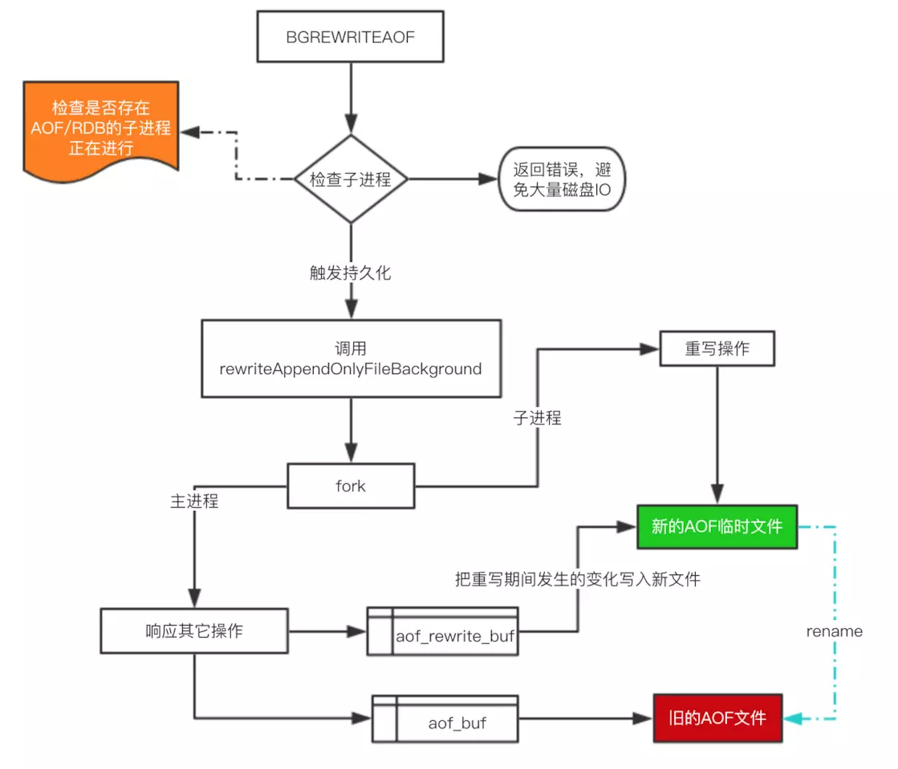

* `RDB`和`AOF`

当进行了`RDB`和`AOF`持久化后，如果需要回复数据，只需要重新启动`Redis`即可。

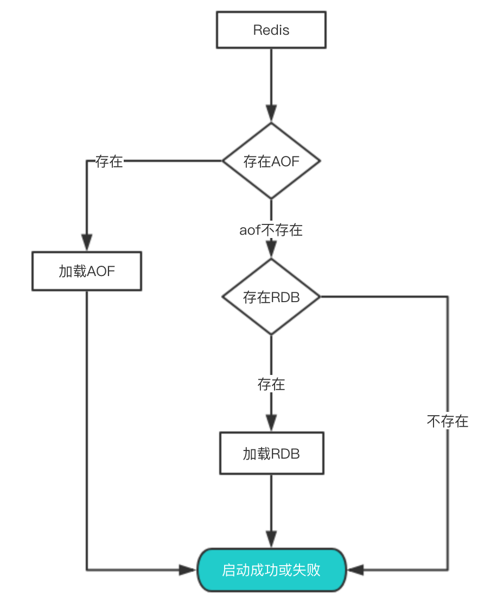

> 一般来说，如果想达到足以媲美 `PostgreSQL` 的数据安全性， 你应该同时使用两种持久化功能。

### 5.6.5 事务

`Redis` 事务可以一次执行多个命令，并且带有以下三个重要的保证：

1) 批量操作在发送 `EXEC` 命令前被放入队列缓存。

2) 收到 `EXEC` 命令后进入事务执行，命令要么全部执行，要么全部不执行，因此`Redis`的事务是原子性的。

3) 在事务执行过程，其他客户端提交的命令请求不会插入到事务执行命令序列中。

一个事务从开始到执行会经历以下三个阶段：开始事务、命令入队、执行事务。

事务中的多个命令被一次性发送给服务器，而不是一条一条发送，这种方式被称为**流水线**，它可以减少客户端与服务器之间的网络通信次数从而提升性能。

```bash
127.0.0.1:6379> MULTI # 标记一个事务块的开始
OK
127.0.0.1:6379> SET book-name "Mastering C++ in 21 days"
QUEUED
127.0.0.1:6379> GET book-name
QUEUED
127.0.0.1:6379> SADD tag "C++" "Programming" "Mastering Series"
QUEUED
127.0.0.1:6379> SMEMBERS tag
QUEUED
127.0.0.1:6379> EXEC # 执行所有事务块内的命令
1) OK
2) "Mastering C++ in 21 days"
3) (integer) 3
4) 1) "Mastering Series"
   2) "C++"
   3) "Programming"

127.0.0.1:6379> DISCARD # 取消事务，放弃执行事务块内的所有命令
127.0.0.1:6379> WATCH key [key ...] # 监视一个(或多个)键，如果在事务执行之前这个(或这些)键被其他命令所改动，那么事务将被打断
127.0.0.1:6379> UNWATCH # 取消 WATCH 命令对所有 key 的监视
```

### 5.6.6 发布和订阅

`Redis`发布订阅(`pub/sub`)是一种消息通信模式：发送者(`pub`)发送消息，订阅者(`sub`)接收消息。

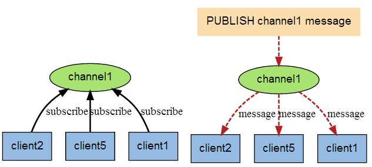

```bash
# 订阅频道
127.0.0.1:6379> SUBSCRIBE redisChat # 订阅给定的一个或多个频道的信息
Reading messages... (press Ctrl-C to quit)
1) "subscribe"
2) "redisChat"
3) (integer) 1
1) "message"
2) "redisChat"
3) "Redis is a great caching technique"
127.0.0.1:6379> UNSUBSCRIBE redisChat # 退订给定的频道
1) "unsubscribe"
2) "redisChat"
3) (integer) 0

# 发布消息
192.168.1.235:6379> PUBLISH redisChat "Redis is a great caching technique" # 将信息发送到指定的频道
(integer) 1
192.168.1.235:6379> PUBSUB CHANNELS # 查看订阅与发布系统状态
1) "redisChat"
192.168.1.235:6379> PSUBSCRIBE * # 订阅一个或多个符合给定模式的频道
Reading messages... (press Ctrl-C to quit)
1) "psubscribe"
2) "*"
3) (integer) 1
```

### 5.6.7 事件

`Redis` 是一个事件驱动的内存数据库，服务器需要处理两种类型的事件：文件事件、时间事件。

#### 文件事件

`Redis`基于[`Reactor`模式](http://www.cnblogs.com/dawen/archive/2011/05/18/2050358.htm)开发出自己的网络时间处理器——文件事件处理器（`file event handler`）。

文件事件处理器视同了[`I/O`多路复用](../Python高级编程/并发编程.md#146-IO模型)（`multiplexing`）程序来同时监听多个套接字，并根据套接字目前执行的任务来为套接字关联不同的时间处理器

当被监听的套接字准备好连接应答（`accept`）、读取（`read`）、写入（`write`）、关闭（`close`）等操作时，与操作相关的文件事件（文件事件是对套接字操作的抽象）就会产生，这时文件事件处理器就会调用套接字之前关联好的时间处理器来处理这些事件。

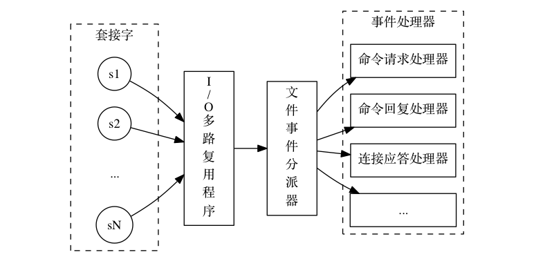

文件事件处理器由四部分组成：套接字、`I/O`多路复用程序、文件事件分派器（`dispatcher`）、事件处理器。

一个服务器通常会连接多个套接字，所以多个文件事件会**并发**地出现。

尽管多个文件事件可能会并发地出现，但`I/O`多路复用程序总是会将所有产生事件的套接字都入队到一个队列里面，然后通过这个队列，以有序（`sequentially`）、同步（`synchronously`）、每次一个套接字的方式向文件事件分派器传送套接字。

当上一个套接字产生的事件被处理完毕之后（该套接字为事件所关联的事件处理器执行完毕）， `I/O` 多路复用程序才会继续向文件事件分派器传送下一个套接字。

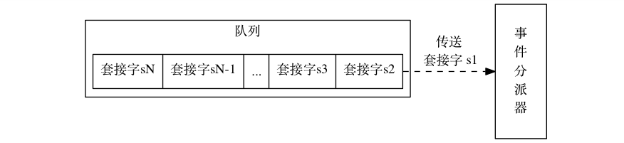

文件事件分派器接收 `I/O` 多路复用程序传来的套接字，并根据套接字产生的事件的类型，调用相应的事件处理器。

服务器会为执行不同任务的套接字关联不同的事件处理器，这些处理器是一个个函数，它们定义了某个事件发生时，服务器应该执行的动作。

`I/O` 多路复用程序封装了底层的 `select`、`epoll`、`avport` 以及 `kqueue` 这些 `I/O` 多路复用函数，为上层提供了相同的接口。

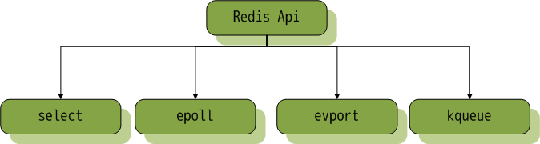

#### 时间事件

`Redis`服务器中的一些操作（如，`serverCron`函数）需要在指定的时间点执行，而时间事件就是对这类定时操作的抽象。

`Redis`的时间事件分为以下两类：定时事件、周期性事件。

* 时间事件的组成：

`id`：服务器为时间事件生成的全局唯一的`ID`（标志号）。该`ID`是自增的，即新的事件`ID`总是比旧事件`ID`要大；

`when`：毫秒精度的时间戳，记录了事件的到达（`arrive`）时间；

`timeProc`：时间事件处理器（函数）。

`Redis` 将所有时间事件都放在一个**无序链表**中，通过遍历整个链表查找出已到达的时间事件，并调用相应的事件处理器。

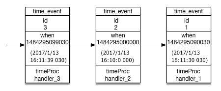

#### 文件事件和时间事件的关系

由于文件事件是随机出现的，如果等待并处理完一次文件事件之后，仍然未有任何事件到达，那么服务器将再次等待并处理文件事件。

随着文件事件的不断执行，时间会逐渐向时间事件所设置的到达时间逼近，并最终来到到达时间，这时，服务器就可以开始处理到达的时间事件了。

因为时间事件在文件事件之后执行，并且事件之间不会出现抢占，所以时间事件的实际处理时间一般会比设定的时间稍晚一些。

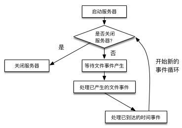

文件事件和时间事件之间是合作关系，服务器会轮流处理这两种事件。并且由于文件事件和时间事件的处理都是同步、有序、原子地执行的，服务器也不会终端正在执行的事件处理，也不会对事件进行抢占。

### 5.6.8 内存回收机制和数据淘汰策略

* 内存回收

`Redis` 采用两种算法进行内存回收，引用计数法和`LRU`算法，其中引用计算法类似与`Python`的内存回收机制，即`Redis` 通过跟踪中 `redisObject` 引用计数信息，在适当的时候自动释放对象并进行内存回收。

**引用计数回收：**

对象的计数信息变化大致如下：

1. 创建对象：创建一个新对象的时候，引用计数的值初始化为`1`；

2. 操作对象：当对象被新程序使用时，引用计数值会被增加`1`（`incrRefCount`）；

3. 操作对象：当对象不被一个程序使用时候，引用计数会被减`1`（`decrRefCount`）；

4. 释放对象：当对象的引用计数值变为`0`时候，对象占用的内存会被释放。

**`LRU`回收（`Least Frequently Used`）：**

在内存有限的情况下，当内存不足时，选择最近一段时间内，最久未使用的对象将其淘汰。

*注：* 在操作系统中 `LRU` 算法淘汰的不是内存中的对象，而是页。当内存中数据不足时，通过`LRU`算法，选择一页（一般是`4KB`），将其交换到虚拟内存区（`Swap`区）。

`Redis`中的`redisObject`定义如下：

```c
#define REDIS_LRU_BITS 24
#define REDIS_LRU_CLOCK_MAX ((1<<REDIS_LRU_BITS)-1) /* Max value of obj->lru */
#define REDIS_LRU_CLOCK_RESOLUTION 1000 /* LRU clock resolution in ms */
typedef struct redisObject {
    unsigned type:4;
    unsigned encoding:4;
    unsigned lru:REDIS_LRU_BITS; /* lru time (relative to server.lruclock) */\
    int refcount;
    void *ptr;
} robj;
```

其中的`refcount`是引用计数器，而`lru`是与`server.lruclock`的差值，这个变量会在定时器中定时刷新，获取当前系统的毫秒值，作为`LRU`的时钟数，共占位`24`个。

```c
...
/* volatile-lru and allkeys-lru policy */
else if (server.maxmemory_policy == REDIS_MAXMEMORY_ALLKEYS_LRU ||
    server.maxmemory_policy == REDIS_MAXMEMORY_VOLATILE_LRU)
{
	struct evictionPoolEntry *pool = db->eviction_pool;
 
	while(bestkey == NULL) {
		evictionPoolPopulate(dict, db->dict, db->eviction_pool);
		/* Go backward from best to worst element to evict. */
		for (k = REDIS_EVICTION_POOL_SIZE-1; k >= 0; k--) {
			if (pool[k].key == NULL) continue;
			de = dictFind(dict,pool[k].key);
 
			/* Remove the entry from the pool. */
			sdsfree(pool[k].key);
			/* Shift all elements on its right to left. */
			memmove(pool+k,pool+k+1,
				sizeof(pool[0])*(REDIS_EVICTION_POOL_SIZE-k-1));
			/* Clear the element on the right which is empty
			 * since we shifted one position to the left.  */
			pool[REDIS_EVICTION_POOL_SIZE-1].key = NULL;
			pool[REDIS_EVICTION_POOL_SIZE-1].idle = 0;
 
			/* If the key exists, is our pick. Otherwise it is
			 * a ghost and we need to try the next element. */
			if (de) {
				bestkey = dictGetKey(de);
				break;
			} else {
				/* Ghost... */
				continue;
			}
		}
	}
}

#define EVICTION_SAMPLES_ARRAY_SIZE 16
void evictionPoolPopulate(dict *sampledict, dict *keydict, struct evictionPoolEntry *pool) {
    int j, k, count;
    dictEntry *_samples[EVICTION_SAMPLES_ARRAY_SIZE];
    dictEntry **samples;
    if (server.maxmemory_samples <= EVICTION_SAMPLES_ARRAY_SIZE) {
        samples = _samples;
    } else {
        samples = zmalloc(sizeof(samples[0])*server.maxmemory_samples);
    }
 
#if 1 /* Use bulk get by default. */
    count = dictGetRandomKeys(sampledict,samples,server.maxmemory_samples);
#else
    count = server.maxmemory_samples;
    for (j = 0; j < count; j++) samples[j] = dictGetRandomKey(sampledict);
#endif
 
    for (j = 0; j < count; j++) {
        unsigned long long idle;
        sds key;
        robj *o;
        dictEntry *de;
        de = samples[j];
        key = dictGetKey(de);
        if (sampledict != keydict) de = dictFind(keydict, key);
        o = dictGetVal(de);
       
        idle = estimateObjectIdleTime(o);
        k = 0;
        
        while (k < REDIS_EVICTION_POOL_SIZE &&
               pool[k].key &&
               pool[k].idle < idle) k++;
        if (k == 0 && pool[REDIS_EVICTION_POOL_SIZE-1].key != NULL) {
            /* Can't insert if the element is < the worst element we have
             * and there are no empty buckets. */
            continue;
        } else if (k < REDIS_EVICTION_POOL_SIZE && pool[k].key == NULL) {
            /* Inserting into empty position. No setup needed before insert. */
        } else {
            if (pool[REDIS_EVICTION_POOL_SIZE-1].key == NULL) {
                memmove(pool+k+1,pool+k,
                    sizeof(pool[0])*(REDIS_EVICTION_POOL_SIZE-k-1));
            } else {
                /* No free space on right? Insert at k-1 */
                k--;
                /* Shift all elements on the left of k (included) to the
                 * left, so we discard the element with smaller idle time. */
                sdsfree(pool[0].key);
                memmove(pool,pool+1,sizeof(pool[0])*k);
            }
        }
        pool[k].key = sdsdup(key);
        pool[k].idle = idle;
    }
   if (samples != _samples) zfree(samples);
}

unsigned long long estimateObjectIdleTime(robj *o) {
    unsigned long long lruclock = LRU_CLOCK();
    if (lruclock >= o->lru) {
        return (lruclock - o->lru) * REDIS_LRU_CLOCK_RESOLUTION;
    } else {
        return (lruclock + (REDIS_LRU_CLOCK_MAX - o->lru)) *
                    REDIS_LRU_CLOCK_RESOLUTION;
    }
}
```

上面这段代码是`Redis`实现`LRU`算法的过程，它会基于`server.maxmemory_samples`配置选取固定数目（默认为`16`条）的`key`，然后`estimateObjectIdleTime`计算`lru`时间，根据这个时间来在数据库中升序排序，将末尾的元素删除，即淘汰最近最久没有访问的`key`。

`maxmemory_samples`的值越大，`Redis`的近似`LRU`算法就越接近于严格`LRU`算法，但是相应消耗也变高。所以，频繁的进行这种内存回收是会降低`Redis`性能的，主要是查找回收节点和删除需要回收节点的开销。

一般配置`Redis`时候，尽量不进行这种内存溢出的回收操作。

若是启用了`Redis`快照功能，应该设置`maxmemory`值为系统可使用内存的`45%`，因为快照时需要一倍的内存来复制整个数据集，也就是说如果当前已使用`45%`，在快照期间会变成`95%(45%+45%+5%)`，其中`5%`是预留给其他的开销。 如果没开启快照功能，`maxmemory`最高能设置为系统可用内存的`95%`。


* 数据淘汰策略

在 `Redis` 中，允许用户设置最大使用内存大小 `server.maxmemory`，在内存限定的情况下是很有用的。

`Redis` 内存数据集大小上升到一定大小的时候，就会施行数据淘汰策略。

`Redis` 提供 `6` 种数据淘汰策略：

1) `volatile-lru`：从已设置过期时间的数据集（`server.db[i].expires`）中挑选**最近最少使用**的数据淘汰；

2) `volatile-ttl`：从已设置过期时间的数据集（`server.db[i].expires`）中挑选**将要过期**的数据淘汰；

3) `volatile-random`：从已设置过期时间的数据集（`server.db[i].expires`）中**任意选择**数据淘汰；

4) `allkeys-lru`：从数据集（`server.db[i].dict`）中挑选**最近最少使用**的数据淘汰；

5) `allkeys-random`：从数据集（`server.db[i].dict`）中**任意选择**数据淘汰；

6) `no-enviction`（驱逐）：**禁止**驱逐数据。

使用 `Redis` 缓存数据时，为了提高缓存命中率，需要保证缓存数据都是**热点数据**。可以将内存最大使用量设置为热点数据占用的内存量，然后启用 `allkeys-lru` 淘汰策略，将最近最少使用的数据淘汰。

`Redis 4.0` 引入了 `volatile-lfu` 和 `allkeys-lfu` 淘汰策略，`LFU` 策略通过统计访问频率，将访问频率最少的键值对淘汰。

### 5.6.9 底层数据结构

上述[数据类型](#562-数据类型)介绍了`Redis`的常用基本数据类型，每一种数据类型内部包含多种数据结构。

可以使用`object encoding`指令来查看具体的数据结构：

```bash
127.0.0.1:6379> set name jason
OK
127.0.0.1:6379> set age 18
OK
127.0.0.1:6379> object encoding name
"embstr"
127.0.0.1:6379> object encoding age
"int"
```
* 数据结构类型

|底层数据结构|编码常量|`object encoding`指令输出|
|:--:|:--:|:--:|
|整数类型|`REDIS_ENCODING_INT`|`"int"`|
|`embstr`字符串类型|`REDIS_ENCODING_EMBSTR`|`"embstr"`|
|整数类型|`REDIS_ENCODING_RAW`|`"raw"`|
|整数类型|`REDIS_ENCODING_HT`|`"ziplist"`|
|整数类型|`REDIS_ENCODING_LINKEDLIST`|`"ziplist"`|
|整数类型|`REDIS_ENCODING_ZIPLIST`|`"ziplist"`|
|整数类型|`REDIS_ENCODING_INTSET`|`"intset"`|
|跳表和字典|`REDIS_ENCODING_SKIPLIST`|`"skiplist"`|

##### 数据模型

当使用`set hello world`时，会涉及的数据模型如下图所示：


在`Redis`中，存储会涉及到内存分配器(`jemalloc`)，简单动态字符串(`sds`)，字典实体(`dictEntry`)， 数据类型及内部编码、`redisObject`等。

- * `dictEntry`：`Redis`是`key-value`的数据库，每个键值对都是一个`dictEntry`，其包含`3`部分内容：`key`的指针，`val`的指针，`next`的指针（指向下一个`dictEntry`，形成链表，其可将多个哈希值相同的键值对链接在一起，通过**链地址法**解决哈希冲突问题）；

- * `sds`：`Simple Dynamic String`，存储字符串数据；

- * `redisObject`：具体存储`Redis`数据的对象，其中的`type`字段表示对象的数据类型，`ptr`字段指向对象的地址。

- * `jemalloc`：`Redis`将`jemalloc`作为默认内存分配器，减小内存碎片。`jemalloc`在`64`位系统中，将内存空间划分为小、大、巨大三个范围；每个范围内又划分了许多小的内存块单位；当Redis存储数据时，会选择大小最合适的内存块进行存储。

1. `STRING`

`Redis`的字符串类型在底层是以字节数组的形式存在的，称为`sds`。

```c
struct SDS<T> {
  T capacity;     // 数组容量
  T len;          // 数组长度
  byte[] content; // 数组内容
}
```

而其的编码类型有`int`，`embstr`，`raw`三种。

- * `int`：保存可以使用`long`类型表示的整数值；

- * `raw`：保存长度大于`44`字节的字符串（`Redis 3.2`之前为`39`字节）；

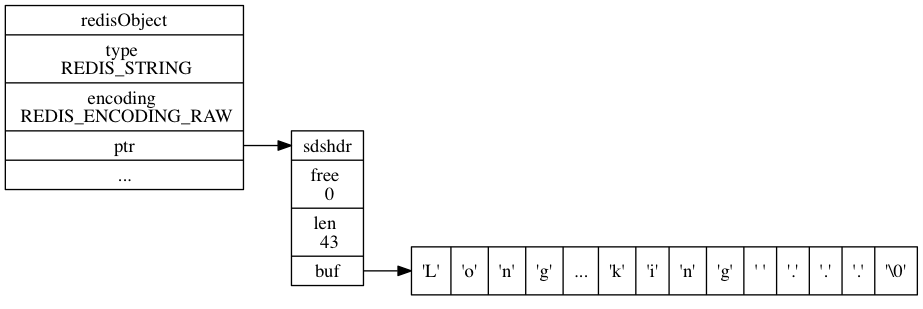

- * `embstr`：保存长度小于`44`字节的字符串（`Redis 3.2`之前为`39`字节）。

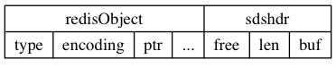

`embstr`的`redisObject`和`sds`是连续的，只需要分配一次内存；而`raw`需要分别为`redisObject`和`sds`分配内存，即需要分配两次内存。内存释放也是同理。

但`embstr`也有明显的缺点：例如要增加长度，`redisObject`和`sds`都需要重新分配内存。

2. `LIST`

列表对象的底层编码最开始是`ziplist`（压缩列表）或者 `linkedlist`（双端列表）实现的。现在是通过`quicklist`（快速列表）实现的。

- * `ziplist`

其是为了节省内存而开发的，通过特殊编码在连续的内存块中组成顺序的数据结构，在内部结构中，节点与节点之间不存在指针的指向，而是多个元素相邻，没有间隔。

```c
struct ziplist<T> {
    int32 zlbytes;       // 整个压缩列表占用字节数
    int32 zltail_offset; // 最后一个元素距离压缩列表起始位置的偏移量，用于快速定位到最后一个节点
    int16 zllength;      // 元素个数
    T[] entries;         // 元素内容列表，挨个挨个紧凑存储
    int8 zlend;          // 标志压缩列表的结束，值恒为 0xFF
}
```

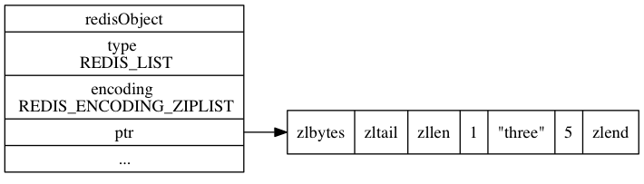

压缩列表占用内存少，但是顺序结构的设计，其插入删除元素也比较复杂。

- * `linkedlist`

其是一种双向列表的结构，节点中存在`prev`，`next`，`head`，`tail`指针，能进行前置、后置、表头、表尾节点的获取，复杂度都在`O(1)`。

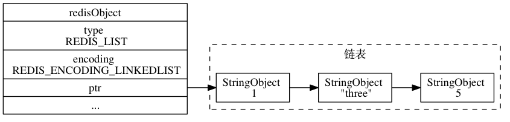

- * `quicklist`

`quicklist`是基于`ziplist`和`linkedlist`的优点和特点开发的，结合了数组和链表的优点。

```c
struct ziplist {
    ...
}
struct ziplist_compressed {
    int32 size;
    byte[] compressed_data;
}
struct quicklistNode {
    quicklistNode* prev;
    quicklistNode* next;
    ziplist* zl;   // 指向压缩列表
    int32 size;    // ziplist 的字节总数
    int16 count;   // ziplist 中的元素数量
    int2 encoding; // 存储形式 2bit，原生字节数组还是 LZF 压缩存储
    ...
}
struct quicklist {
    quicklistNode* head;
    quicklistNode* tail;
    long count;        // 元素总数
    int nodes;         // ziplist 节点的个数
    int compressDepth; // LZF 算法压缩深度
    ...
}
```

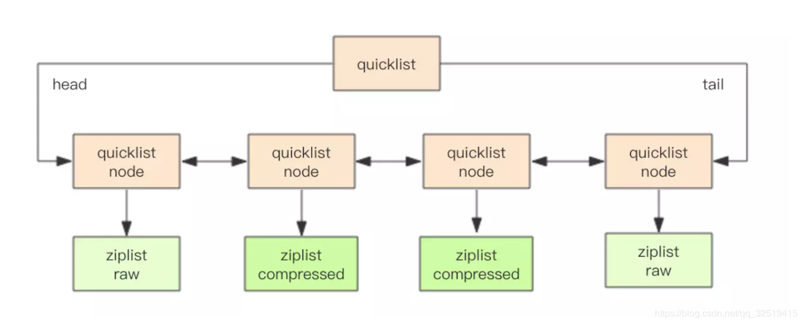

为了进一步节约空间，`Redis`会对`ziplist`进行压缩，同时还可以选择压缩深度。

其中`list-max-ziplist-size`配置决定`ziplist`的存储长度，`list-compress-depth`配置决定压缩的深度。

为了快速进行`push`、`pop`等操作，默认`quicklist`的首尾两个`ziplist`不进行压缩，此时的深度为`1`。

而深度为`2`时，`quicklist`的首尾前两个 `ziplist` 都不压缩，以此类推。

3. `HASH`

`HASH`对象的底层编码是`ziplist`（压缩列表）或者`hashtable`（字典\散列表）实现的。

设置键值对时，如果每个值的字节数不超过`64`，则默认使用`ziplist`，当有值的字节数超过`64`时，此时默认的数据结构变为`hashtable`。

`HASH`对象只有同时满足下面两个条件时，才会使用`ziplist`（压缩列表）：

* `HASH`中元素数量小于`512`个；

* `HASH`中所有键值对的键和值字符串长度都小于`64`字节。

`Redis`中的 `dict` 结构内部包含两个`hashtable`，通常情况下只有一个 `hashtable` 是有值的。但是在 `dict` 扩容缩容时，需要分配新的 `hashtable`，然后进行渐进式搬迁，这时两个 `hashtable` 存储的分别是旧的 `hashtable` 和新的` hashtable`。待搬迁结束后，旧的 `hashtable` 被删除，新的 `hashtable` 取代之。

4. `SET`

`SET`对象的底层编码是`intset`（整数集）或者是`hashtable`。

当数据**都是整数**并且数量不多时，使用`intset`作为底层数据结构；当有除整数以外的数据或者数据量增多时，使用`hashtable`作为底层数据结构。

```c
typedef struct intset {
    uint32_t encoding; // 编码方式
    uint32_t length;   // 集合包含的元素数量
    int8_t contents[]; // 保存元素的数组
} intset;
```

`intset`底层实现为有序、无重复数的数组。`intset`的整数类型可以是`16`位的、`32`位的、`64`位的。如果数组里所有的整数都是`16`位长度的，新加入一个`32`位的整数，那么整个`16`的数组将升级成一个`32`位的数组。升级可以提升`intset`的灵活性，又可以节约内存，但不可逆。

5. `ZSET`

`ZSET`对象的底层编码是`ziplist`（压缩列表）或者是`skiplist`（跳跃表）。

```c
typedef struct zskiplist {
    struct zskiplistNode *header, *tail; // 表头节点和表尾节点
    unsigned long length;                // 表中节点的数量
    int level;                           // 表中层数最大的节点的层数
} zskiplist;

typedef struct zskiplistNode {
    robj *obj;                         // 成员对象
    double score;                      // 分值
    struct zskiplistNode *backward;    // 后退指针
    struct zskiplistLevel {            // 层
        struct zskiplistNode *forward; // 前进指针
        unsigned int span;             // 跨度---前进指针所指向节点与当前节点的距离
    } level[];
} zskiplistNode;
```

跳表是在链表的基础上使用二分法的思想，其开发难度比红黑树容易得多，并且在各方面性能上表现很好，可以快速进行查询、插入、删除操作，所以在`Redis`上使用跳表而不是红黑树。

基于链表的二分查找，支持快速的插入、删除，其时间复杂度都为`O(logn)`。

### 5.6.10 分布式相关

#### 复制

`Redis`的复制方式有两种，一种是主（`master`）-从（`slave`）模式，一种是从（`slave`）-从（`slave`）模式。

复制优点：高可用性、高性能、水平扩展性。

复制缺点：复制实时性和数据一致性矛盾，编程复杂。

**简单部署命令：**

```bash
$ ./redis-server ../redis8000.conf --port 8000 # master 节点
$ ./redis-server ../redis8001.conf --port 8001 --slaveof 127.0.0.1 8000 # slave 从节点
$ ./redis-server ../redis8002.conf --port 8002 --slaveof 127.0.0.1 8000 # slave 从节点
$ ./redis-server ../redis8003.conf --port 8003 --slaveof 127.0.0.1 8000 # slave 从节点
```

复制过程：

1) `slave`向`master`发送`sync`命令；

2) `master`开启子进程来将`dataset`写入`RDB`文件，同时将子进程完成之前接收到的写命令缓存起来；

3) 子进程写完，父进程得知，开始将`RDB`文件发送给`slave`；

4) `master`发送完`RDB`文件，将缓存的命令也发给`slave`；

5) `master`增量地把写命令发给`slave`。

值得注意的是，当`slave`跟`master`的连接断开时，`slave`可以自动的重新连接`master`，在`redis2.8`版本之前，每当slave进程挂掉重新连接master的时候都会开始新的一轮全量复制。如果`master`同时接收到多个`slave`的同步请求，则master只需要备份一次`RDB`文件。

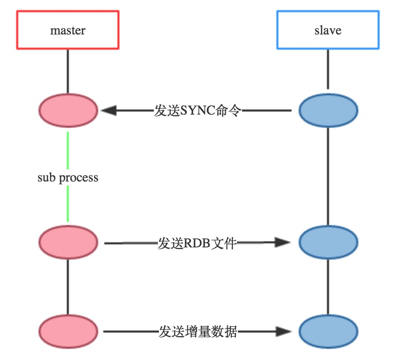

`master`除了备份`RDB`文件之外还会维护一个环形队列，以及环形队列的写索引和`slave`同步的全局`offset`。

环形队列用于存储最新的操作数据，当`slave`和`master`断开重连之后，会把`slave`维护的`offset`，也就是上一次同步到哪里的这个值告诉`master`，同时会告诉`master`上次和当前`slave`连接的`master`的`run id`。

满足上面两个条件，`Redis`就不会全量复制，这样的好处是大大的提高的性能，不做无效的功：

1) `slave`传递的`run id`和`master`的`run id`一致；

2) `master`在环形队列上可以找到对应的`offset`的值。

增量复制是由`psync`命令实现的，`slave`可以通过`psync`命令来让`Redis`进行增量复制，当然最终是否能够增量复制取决于环形队列的大小和`slave`的断线时间长短和重连的这个`master`是否是之前的`master`。

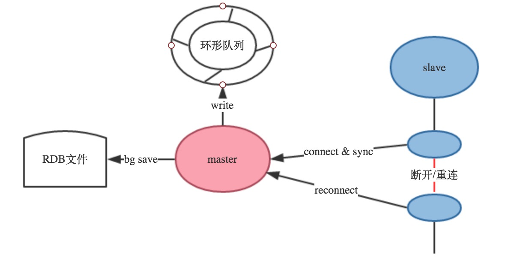、

```bash
repl-backlog-size 1mb # 环形队列大小配置参数
repl-backlog-ttl 3600 # 当没有slave需要同步的时候，多久可以释放环形队列
```

#### Sentinel

`Redis Sentinel`是`Redis`高可用的实现方案。Sentinel`是一个管理多个`Redis`实例的工具，它可以实现对`Redis`的监控、通知、自动故障转移。

#### 分片

`Redis`的分片（`Sharding`或者`Partitioning`）技术是指将数据分散到多个`Redis`实例中的方法，分片之后，每个`Redis`拥有一部分原数据集的子集。

在数据量非常大时，这种技术能够将数据量分散到若干主机的`Redis`实例上，进而减轻单台`Redis`实例的压力。

分片技术能够以更易扩展的方式使用多台计算机的内存的存储能力和计算能力。

假设有 `4` 个 `Reids` 实例 `R0`，`R1`，`R2`，`R3`，还有很多表示用户的键 `user:1，user:2，...` ，有不同的方式来选择一个指定的键存储在哪个实例中。

最简单的方式是范围分片，例如用户 `id` 从 `0~1000` 的存储到实例 `R0` 中，用户 `id` 从 `1001~2000` 的存储到实例 `R1` 中，等等。但是这样需要维护一张映射范围表，维护操作代价很高。

还有一种方式是哈希分片，使用 `CRC32` 哈希函数将键转换为一个数字，再对实例数量求模就能知道应该存储的实例。

根据执行分片的位置，可以分为三种分片方式：

1) 客户端分片：客户端使用一致性哈希等算法决定键应当分布到哪个节点；

2) 代理分片：将客户端请求发送到代理上，由代理转发请求到正确的节点上；

3) 服务器分片：`Redis Cluster`。

#### 分布式锁

在分布式场景下，无法使用单机环境下的锁来对多个节点上的进程进行同步。可以使用 `Reids` 自带的 `SETNX` 命令实现分布式锁。除此之外，还可以使用官方提供的 [`RedLock`](https://github.com/SPSCommerce/redlock-py) 分布式锁实现。

```python
# -*- coding:utf-8 -*-
from __future__ import print_function
import redis
import time
import multiprocessing
from contextlib import contextmanager as _contextmanager
# 简单创建redis的客户端
r = redis.Redis(host='localhost', port=6379, db=0)

# 分布式锁实现
# finally中验证本线程是否获得锁, 是为了防止误删别的线程获取的锁
@_contextmanager
def dist_lock(client, key):
    dist_lock_key = 'lock:%s' % key
    is_acquire_lock = False
    try:
        is_acquire_lock = _acquire_lock(client, dist_lock_key)
        yield
    finally:
        if is_acquire_lock:
            _release_lock(client, dist_lock_key)

# 尝试获取锁
# 成功: 返回True, 失败: 抛出异常
# 使用set nx ex原语, 使得setnx和expire操作成为原子操作
def _acquire_lock(client, key):
    is_lock = r.set(key, 1, nx=True, ex=10)
    if not is_lock:
        raise Exception("already locked!")
    return is_lock

# 释放锁
# 简单删除key
# 如果删除失败, 锁也会通过expire时间超时
def _release_lock(client, key):
    client.delete(key)

# 测试函数
# 获取锁成功, 打印成功, 并持有锁3s
# 获取锁失败, 直接打印
def func():
    while 1:
        try:
            with dist_lock(r, 'key'):
                print("*", end='')
                time.sleep(3)
        except Exception, ex:
            print('!', end='')

# 多进程启动
# 这种模式下, 线程锁无效, 可以验证分布式锁
process_list = list()
for i in range(2):
    process_list.append(multiprocessing.Process(target=func))
for process in process_list:
    process.start()
for process in process_list:
    process.join()
```

### 5.6.11 相关问题

* `Redis` 和 `Memcache` 区别

1. `Redis`不仅仅支持简单的`Key-Value`类型的数据，同时还提供`List`，`Set`，`Sort Set`，`Hash`等数据结构的存储。`Memcache`支持简单的数据类型，`String`。

2. `Redis`支持数据的备份，即`Master-Slave`模式的数据备份。

3. `Redis`支持数据的持久化（`AOF, RDB`），可以将内存中的数据保持在磁盘中，重启的时候可以再次加载进行使用,而`Memecache`把数据全部存在内存之中。

4. `Redis`的速度比`Memcached`快很多。

5. `Memcached`是多线程，非阻塞`IO`复用的网络模型；`Redis`使用单线程的`IO`复用模型。


### 5.6.12 扩展阅读

[分布式之 Redis 复习精讲](http://blog.jobbole.com/114050/)

[Redis 和 Memcache 的区别](http://blog.leanote.com/post/huangjiecong@163.com/Redis-%E5%92%8C-Memcache-%E7%9A%84%E5%8C%BA%E5%88%AB)

参考链接：

* [Redis 教程](http://www.runoob.com/redis/redis-tutorial.html)

* [Redis 命令参考](http://redisdoc.com/index.html)

* [一文看懂Redis的持久化原理](https://juejin.im/post/5b70dfcf518825610f1f5c16)

* [Redis 设计与实现](http://redisbook.com/preview/event/file_event.html)

* [浅析 Redis 复制](http://blog.jobbole.com/101678/)
