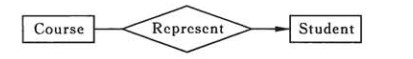
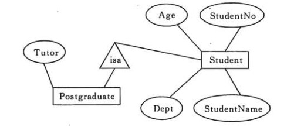

## 5.1 数据库系统原理

>date: 2019-02-17


### 5.1.1 事务

* `ACID` 四大特性

1) 原子性(`Atomicity`)，事务被视为不可分割的最小单元，要么全部提交成功，要么失败回滚；

2) 一致性(`Consistency`)，事务执行前后都保持一致性状态。在一致性状态下，所有事务对一个数据的读取结果都是相同的；

3) 隔离性(`Isolation`)，一个事务所做的修改在最终提交以前，对其它事务是不可见的；

4) 持久性(`Durability`)，一旦事务提交，则其所做的修改将会永远保存在数据库中。即使系统发生崩溃，事务执行的结果页不能丢失。可以通过数据库备份和恢复来保证持久性。

**事务**指的是满足`ACID`特性的一系列操作。在数据库中，可以`Commit`提交一个事务，也可以使用`Rollback`进行回滚。

### 5.1.2 并发一致性问题

在并发环境下，一个事务如果受到另一个事务的影响，那么事务操作就无法满足一致性条件。

会出现以下情况的问题：

1) 丢失修改：T<sub>1</sub> 和 T<sub>2</sub> 两个事务都对一个数据进行修改，T<sub>1</sub> 先修改，T<sub>2</sub> 随后修改，T<sub>2</sub> 的修改覆盖了 T<sub>1</sub> 的修改。


2) 读脏数据：T<sub>1</sub> 修改一个数据，T<sub>2</sub> 随后读取这个数据。如果 T<sub>1</sub> 撤销了这次修改，那么 T<sub>2</sub> 读取的数据是脏数据。


3) 不可重复读：T<sub>2</sub> 读取一个数据，T<sub>1</sub> 对该数据做了修改。如果 T<sub>2</sub> 再次读取这个数据，此时读取的结果和第一次读取的结果不同。


4) 幻影读：T<sub>1</sub> 读取某个范围的数据，T<sub>2</sub> 在这个范围内插入新的数据，T<sub>1</sub> 再次读取这个范围的数据，此时读取的结果和和第一次读取的结果不同。


解决方法：产生并发不一致性的问题主要原因是破坏了事务的隔离性，解决方法是通过并发控制来保证隔离性。

在没有并发的情况下，事务以串行的方式执行，互不干扰，因此具有隔离性。在并发的情况下，如果能通过并发控制，让事务的执行结果和某一个串行执行的结果相同，就认为事务的执行结果满足隔离性要求，也就是说是正确的。把这种事务执行方式称为**可串行化调度**。

如果数据库中所有的事务都是串行执行的，那么它非常容易成为整个应用的性能瓶颈，虽然说没法水平扩展的节点在最后都会成为瓶颈，但是串行执行事务的数据库会加快这一过程；而并发(`Concurrency`)使一切事情的发生都有了可能，它能解决一定的性能问题，但它会带来更多诡异的错误。如何进行并发控制，是非常重要的问题。

**并发控制可以通过封锁来实现，但是封锁操作都要用户自己控制，相当复杂。数据库管理系统提供了事务的隔离级别，让用户以一种更轻松的方式处理并发一致性问题。**

* 隔离级别

1) 未提交读（`READ UNCOMMITTED`）

事务中的修改，即使没有提交，对其它事务也是可见的。

2) 提交读（`READ COMMITTED`）

一个事务只能读取已经提交的事务所做的修改。换句话说，一个事务所做的修改在提交之前对其它事务是不可见的。

3) 可重复读（`REPEATABLE READ`）

保证在同一个事务中多次读取同样数据的结果是一样的。

4) 可串行化（`SERIALIZABLE`）

强制事务串行执行。

### 5.1.3 常见的并发控制

#### 悲观并发控制

如果能保证事务在同一时间对同一资源有着独占的能力，就能保证同一资源的不同事务不会相互影响。

最简单的方式就是使用**锁**来解决。当事务需要对资源进行操作时，需要先获得资源对应的锁，保证其他事务不会访问该资源后，才能对其进行操作。

* 读写锁

1) 排它锁(`Exclusive`)：简写为`X`锁，又称写锁。一次只能有一个独占锁用在一个资源上，并且阻止其他所有的锁包括共享锁。写是独占锁，可以有效的防止“脏读”。

> 一个事务对数据对象 `A` 加了 `X` 锁，就可以对 `A` 进行读取和更新。加锁期间其它事务不能对 `A` 加任何锁。

2) 共享锁(`Shared`)：简写为`S`锁，又称读锁。用于只读操作(`SELECT`)，锁定共享的资源。共享锁不会阻止其他用户读，但是阻止其他的用户写和修改。

> 一个事务对数据对象 `A` 加了 `S` 锁，可以对 `A` 进行读取操作，但是不能进行更新操作。加锁期间其它事务能对 `A` 加 `S` 锁。

* 两阶段锁协议

两阶段锁协议（`2PL`）是一种能够保证事务可串行化的协议，它将事务的加锁和解锁划分成了增长（`Growing`）和缩减（`Shrinking`）两个不同的阶段。在增长阶段，一个事务可以获得锁但是不能释放锁；而在缩减阶段事务只可以释放锁，并不能获得新的锁。

其通过并发控制，使得并发执行的事务结果与某个串行执行的事务结果相同。

事务遵循**两段锁协议**是保证可串行化调度的**充分条件**。例如以下操作满足两段锁协议，它是可串行化调度。

```
Slock A ... Slock B ... Xlock C ... Unlock C ... Unlock B ... Unlock A
```

但不是**必要条件**，例如以下操作不满足两段锁协议，但是它还是可串行化调度。

```
Slock A ... Unlock A ... Slock B ... Xlock C ... Unlock C ... Unlock B
```

`MySQL` 的 `InnoDB` 存储引擎采用两段锁协议，会根据隔离级别在需要的时候自动加锁，并且所有的锁都是在同一时刻被释放，这被称为隐式锁定。

`InnoDB` 也可以使用特定的语句进行显示锁定：

```sql
SELECT ... LOCK In SHARE MODE;
SELECT ... FOR UPDATE;
```

* 死锁

虽然锁的使用能够为我们解决不同事务之间由于并发执行造成的问题，但是两阶段锁的使用却引入了另一个严重的问题，死锁；不同的事务等待对方已经锁定的资源就会造成死锁。


如上，两个事务在刚开始时分别获取了 `draven` 和 `beacon` 资源上面的锁，然后再请求对方已经获得的锁时就会发生死锁，双方都没有办法等到锁的释放，如果没有死锁的处理机制就会无限等待下去，两个事务都没有办法完成。

- 1) 互斥条件。

- 2) 不可抢占条件。

- 3) 占有且申请条件。

- 4) 循环等待条件。

死锁在多线程编程中是经常遇到的事情，一旦涉及多个线程对资源进行争夺就需要考虑当前的几个线程或者事务是否会造成死锁；解决死锁大体来看有两种办法，一种是从源头杜绝死锁的产生和出现，另一种是允许系统进入死锁的状态，但是在系统出现死锁时能够及时发现并且进行恢复。

1) 预防死锁

一种方式是：按照一定的顺序为所有数据行加锁结合`2PL`协议，在加锁节点保证所有的数据航都是从小到大依次进行加锁的。不过这种方式依然需要事务提前知道将要加锁的数据集。

另一种方式是：使用抢占 + 事务回滚的方式预防死锁，当事务开始执行时先获取一个时间戳，数据库程序依据事务的时间戳决定事务应该等待还是回滚。它也有两种方式进行：

**`wait-die`机制**

当执行事务的时间戳小于另一事务时，即事务`A`先于`B`开始，那么它就会等待另一事务释放对应资源的锁，否则就保持当前的时间戳回滚。

**`wound-wait`机制**

当前事务如果先于另一事务执行并请求了另一事务的资源，那么另一事务就会立刻回滚，将资源让给先执行的事务，否则就会等待其他事务释放资源。这是一种抢占的解决方案，它和 `wait-die` 机制的结果完全相反

2) 死锁检测与恢复

如果数据库中出现了如下的状态：

```
TransB -> TransE -> TransF -> TransD -> TransB
```

即在该状态的有向图中出现了环，这时候就需要死锁恢复机制接入了。出现这种环的状态时候，最常见的解决方式就是在选择这个环中的一个事务进行回滚，以打破整个等待图中的环。

在这个过程中，需要考虑三个事情：

	* 选择哪一个任务去进行回滚，保证**最小化代价**；

	* 全部回滚还是部分回滚，部分回滚需要设置事务的检查点；

	* 需要保证事务在有穷的时间内执行，所以需要将选择回滚的任务时间戳加入考虑范围。

* 锁的粒度

上面开始讨论的都是数据行锁，但是有时候希望将多个节点看做一个数据单元，使用锁直接将这个数据单元、表甚至数据库锁定起来。这个目标的实现就需要在数据库中定义不同粒度的锁。

当拥有不同粒度的锁之后，如果某个事务想要锁定整个数据库或者整张表时只需要简单的锁住对应的节点，就会在当前的节点加上显式(`explicit`)锁，在所有的子节点上加隐式(`implicit`)锁。

虽然这种不同粒度的锁能够解决父节点被加锁时，子节点不能被加锁的问题，但是却没有办法在子节点被加锁时，立刻确定父节点不能被加锁。

这时候就出现了**意向锁**，其可以更容易地支持多粒度封锁。

在存在行级锁和表级锁的情况下，事务`T`想要对表`A`加`X`锁，就需要先检测是否有其它事务对表`A`或者表`A`中的任何一行加了锁，那么就需要对表`A`的每一行都检测一次，这是很耗时的。

意向锁在原来`X/S`锁之上引入了`IX/IS`，`IX/IS`都是表锁，用来表示一个事务想要在表中的某个数据行加`X`锁或`S`锁。即：

> 一个事务在获得某个数据行对象的`S`锁之前，必须先获得表的`IS`锁或者更强的锁。
>

> 一个事务在获得某个数据行对象的`X`锁之前，必须获得表的`IX`锁。
>

通过引入意向锁，事务`T`想要对表`A`加`X`锁，只需要检测是否有其它事务对表`A`加了`X/IX/S/IS`锁，如果加了就表示有其它事务正在使用这个表或者表中某一行的锁，因此事务`T`加`X`锁失败。

各种锁的兼容关系如下：


* 封锁协议

1) 一级封锁协议

事务`T`要修改数据`A`必须加`X`锁，直到`T`结束才释放锁。


2) 二级封锁协议

在一级的基础上，要求读取数据`A`时，必须加`S`锁，读完马上释放`S`锁


3) 三级封锁协议

在二级的基础上，要求读取数据`A`时必须加`S`锁，直到事务结束才能释放`S`锁。


#### 乐观并发控制

上面介绍的是一种悲观控制机制——锁，除了使用锁来进行并发控制之外，还有其它的并发控制机制。

乐观并发控制也被叫做乐观锁，但是它不是真正意义上的锁，而是一种并发控制思想。

下面就介绍两种并发控制机制：

* 基于**时间戳**的控制协议

每个事务都会有一个全局唯一的时间戳，它即可以使用系统的时钟时间，也可以使用计数器，只要保证所有的时间戳都是唯一并且是随时间递增就可以。

基于时间戳的协议能够保证事务并行执行的顺序与事务按照时间戳串行执行的效果完全相同。

每一个数据项都有两个时间戳，读时间戳和写时间戳，分别代表了当前成功执行对应操作事务的时间戳。在执行对应操作时候，只需要关系数据项对应时间戳的值就可以了。


在进行读操作或者写操作时候，从左到右依次比较读写时间戳的值，如果小于当前值就会被直接拒绝然后回滚，数据库系统会给回滚的事务添加一个新的时间戳并重新执行这个事务。

* 基于**验证**的协议

数据库系统中，只读的事务占了绝大多数，事务之间因为操作造成的冲突的可能非常小，而并发控制会给整个数据库系统添加很多开销，所以就有通过验证协议来降低这部分开销。

验证指的是：

1) 读阶段，数据库执行事务中全部的读操作和写操作，并将所有写后的值存入临时变量中，先不进行数据库内容更新；

2) 数据库程序会检查当前的改动是否合法，即检查其他事务在`READ PHASE`期间是否更新了数据，如果没有就进入`WRITE PHASE`将临时变量的数据全部写入数据库，而发生更新的数据就会被终止。

### 5.1.4 多版本并发控制

多版本并发控制（`Multi-Version Concurrency Control`, `MVCC`）每一个写操作都创建一个新版本的数据，读操作会从有限多个版本的数据中挑选一个最合适的结果直接返回。

在这时，读写操作之间的冲突就不需要被关注，而管理和挑选数据的版本就成了`MVCC`需要解决的主要问题。

* `MySQL`

在 `MySQL` 中，它是 `InnoDB` 存储引擎实现隔离级别的一种具体方式，用于实现提交读和可重复读这两种隔离级别。而未提交读隔离级别总是读取最新的数据行，无需使用 `MVCC`。可串行化隔离级别需要对所有读取的行都加锁，单纯使用 `MVCC` 无法实现。

`MySQL`中每一个版本的数据行都具有唯一的时间戳，当有读事务请求时，数据库程序就会直接从多个版本的数据项中选择具有最大时间戳的返回。

更新数据时候，会读取最新版本的数据计算出数据更新后的记录，然后创建一个新版本的数据，新数据的时间戳是目前数据行的最大版本 `+1`。

数据删除时候，会定时删除版本最低的数据以保证不会出现大量的遗留内容。

* `PostgreSQL`

与`MySQL`使用悲观并发控制不同的是，`PostgreSQL`是使用乐观并发控制的，其最终实现的叫做多版本时间戳排序协议(`Multiversion Timestamp Ordering`)。

在这个协议中，所有的事务在执行之前都会分配一个唯一的时间戳，每一个数据项都有读、写两个时间戳。

当 `PostgreSQL` 的事务发出了一个读请求，数据库直接将最新版本的数据返回，不会被任何操作阻塞，而写操作在执行时，事务的时间戳一定要大或者等于数据行的读时间戳，否则就会被回滚。

### 5.1.5 关系型数据库设计

* 函数依赖

记 `A->B` 表示 `A` 函数决定 `B`，也可以说 `B` 函数依赖于 `A`。

如果 `{A1，A2，... ，An}` 是关系的一个或多个属性的集合，该集合函数决定了关系的其它所有属性并且是最小的，那么该集合就称为**键码**。

对于 `A->B`，如果能找到 `A` 的真子集 `A'`，使得 `A'-> B`，那么 `A->B` 就是**部分函数依赖**，否则就是**完全函数依赖**。

对于 `A->B`，`B->C`，则 `A->C` 是一个**传递函数依赖**。

* 异常

以下的学生课程关系的函数依赖为 `Sno`, `Cname -> Sname`, `Sdept`, `Mname`, `Grade`，键码为 `{Sno, Cname}`。也就是说，确定学生和课程之后，就能确定其它信息。

|Sno|Sname|Sdept|Mname|Cname|Grade|
|:--:|:--:|:--:|:--:|:--:|:--:|
|1|学生-1|学院-1|院长-1|课程-1|90|
|2|学生-2|学院-2|院长-2|课程-2|80|
|2|学生-2|学院-2|院长-2|课程-1|100|
|3|学生-3|学院-2|院长-2|课程-2|95|

不符合范式的关系，会产生很多异常，主要有以下四种异常：

冗余数据：例如 学生-2 出现了两次。

修改异常：修改了一个记录中的信息，但是另一个记录中相同的信息却没有被修改

删除异常：删除一个信息，那么也会丢失其它信息。例如删除了 课程-1 需要删除第一行和第三行，那么 学生-1 的信息就会丢失。

插入异常：例如想要插入一个学生的信息，如果这个学生还没选课，那么就无法插入。

* 范式

范式理论是为了解决以上提到四种异常。

高级别范式的依赖于低级别的范式，`1NF` 是最低级别的范式。

1) 第一范式 (`1NF`)
属性不可分。

2) 第二范式 (`2NF`)
每个非主属性完全函数依赖于键码。

可以通过分解来满足。

**分解前**

|Sno|Sname|Sdept|Mname|Cname|Grade|
|:--:|:--:|:--:|:--:|:--:|:--:|
|1|学生-1|学院-1|院长-1|课程-1|90|
|2|学生-2|学院-2|院长-2|课程-2|80|
|2|学生-2|学院-2|院长-2|课程-1|100|
|3|学生-3|学院-2|院长-2|课程-2|95|

以上学生课程关系中，`{Sno, Cname}` 为键码，有如下函数依赖：

`Sno -> Sname, Sdept`、`Sdept -> Mname`、`Sno, Cname-> Grade`

`Grade` 完全函数依赖于键码，它没有任何冗余数据，每个学生的每门课都有特定的成绩。

`Sname`, `Sdept` 和 `Mname` 都部分依赖于键码，当一个学生选修了多门课时，这些数据就会出现多次，造成大量冗余数据。

**分解后**

关系-1

|Sno|Sname|Sdept|Mname|
|:--:|:--:|:--:|:--:|
|1|学生-1|学院-1|院长-1|
|2|学生-2|学院-2|院长-2|
|3|学生-3|学院-2|院长-2|

有以下函数依赖：

`Sno -> Sname, Sdept`、`Sdept -> Mname`

关系-2

|Sno|Cname|Grade|
|:--:|:--:|:--:|
|1|课程-1|90|
|2|课程-2|80|
|2|课程-1|100|
|3|课程-2|95|

有以下函数依赖：

`Sno, Cname -> Grade`

3) 第三范式 (`3NF`)

非主属性不传递函数依赖于键码。

上面的 关系-1 中存在以下传递函数依赖：

`Sno -> Sdept -> Mname`

可以进行以下分解：

关系-11

|Sno|Sname|Sdept|
|:--:|:--:|:--:|
|1|学生-1|学院-1|
|2|学生-2|学院-2|
|3|学生-3|学院-2|

关系-12

|Sdept|Mname|
|:--:|:--:|
|学院-1|院长-1|
|学院-2|院长-2|

### 5.1.6 `ER` 图

`Entity-Relationship`，有三个组成部分：实体、属性、联系。用来进行关系型数据库系统的概念设计。

* 实体的三种联系

包含一对一，一对多，多对多三种。

1) 如果 A 到 B 是一对多关系，那么画个带箭头的线段指向 B；

2) 如果是一对一，画两个带箭头的线段；

3) 如果是多对多，画两个不带箭头的线段。

下图的 Course 和 Student 是一对多的关系。



* 表示出现多次的关系

一个实体在联系出现几次，就要用几条线连接。

下图表示一个课程的先修关系，先修关系出现两个 Course 实体，第一个是先修课程，后一个是后修课程，因此需要用两条线来表示这种关系。


* 联系的多向性

虽然老师可以开设多门课，并且可以教授多名学生，但是对于特定的学生和课程，只有一个老师教授，这就构成了一个三元联系。


一般只使用二元联系，可以把多元联系转换为二元联系。


* 表示子类

用一个三角形和两条线来连接类和子类，与子类有关的属性和联系都连到子类上，而与父类和子类都有关的连到父类上。



参考链接：

* [浅谈数据库并发控制 - 锁和 MVCC](https://draveness.me/database-concurrency-control.html)

* [数据库系统原理](https://cyc2018.github.io/CS-Notes/#/notes/%E6%95%B0%E6%8D%AE%E5%BA%93%E7%B3%BB%E7%BB%9F%E5%8E%9F%E7%90%86)
