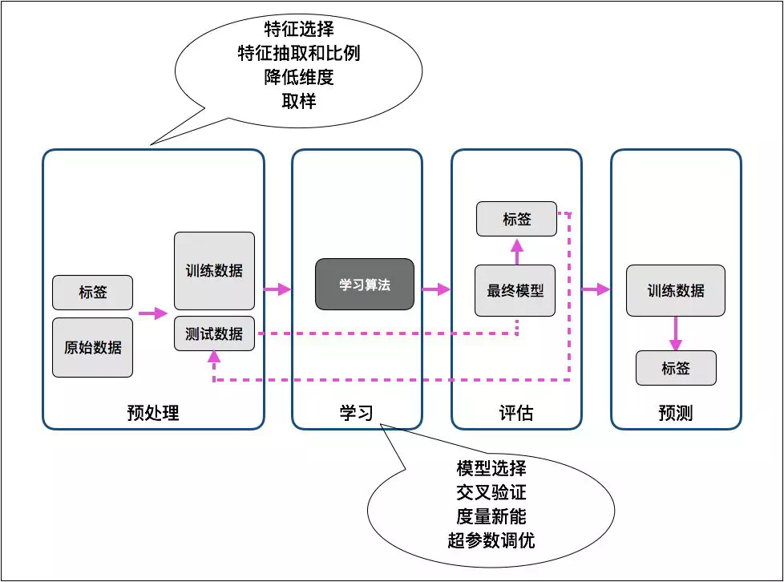
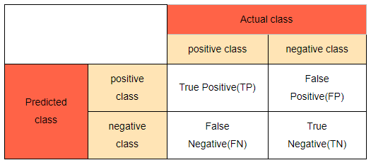
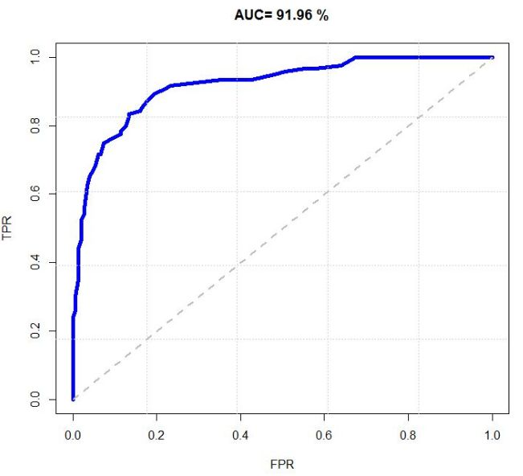
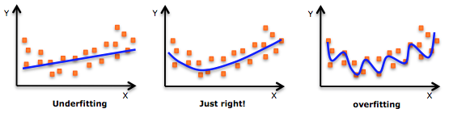

## 8.1 基础概念

>date: 2019-06-12


### 8.1.1 概述

* 机器学习的分类

1. 监督学习

指利用一组已知类别的样本调整分类器的参数，使其达到所要求性能的过程。

从有标签的训练数据中学习模型，对未来未知的数据进行预测。

2. 无监督学习

指针对一组不知道类别的样本进行自动的分类或者划分的过程。

从无标签的数据中，利用相关方法寻找数据中隐藏的结构。

3. 半监督学习

是监督学习与无监督学习相结合的一种学习方法。使用大量的未标记数据，以及同时使用标记数据，来进行模式识别工作。

4. 强化学习

一直激励学习的方式，通过激励函数来让模型不断根据遇到的情况做出调整。

* 机器学习流程

实际问题抽象成数学问题 --> 数据集获取 --> 特征工程 --> 模型训练与调优 --> 模型评估 --> 模型预测



* 数据集

用来进行机器学习的一个数据集往往会被分为两个数据集——测试集（`training data`）和测试集（`testing data`）。 

如果在训练的过程中需要确定方法的准确度，有时会将训练数据分成训练集（`training set`）和验证集（`validation set`）。

训练集是在机器学习的过程中使用，目的是找出一套机器学习的模型；

测试集用于判断学习的模型是否足够有效，其在模型建立后才被使用的。

验证集与测试集不同的地方在于验证集在训练过程中使用，用于相关参数的调节。

### 8.1.2 模型评估

#### 分类指标

二分类问题中，其类别可以划分为正例（`Positive Class`）和反例（`Negative Class`）。

* 混淆矩阵（Confusion Matrix）：



1. `True Positive`(真正, `TP`)：将正类预测为正类数；

2. `True Negative`(真负, `TN`)：将负类预测为负类数；

3. `False Positive`(假正, `FP`)：将负类预测为正类数 → 误报 (`Type I error`)；

4. `False Negative`(假负, `FN`)：将正类预测为负类数 → 漏报 (`Type II error`)。

* 准确率（`Accuracy`）是预测和标签一致的样本在所有样本中所占的比例：

$$ ACC = \frac{TP + TN}{TP + TN + FP + FN} $$

* 精确率（`Precision`）是预测为正类的数据中，有多少确实是正类：

$$ P = \frac{TP}{TP + FP} $$

* 召回率（`Recall`）是所有正类的数据中，预测为正类的数据有多少：

$$ R = \frac{TP}{TP + FN} $$

* $F_1$值是精确率和召回率的调和均值（精确率和准确率都高的情况下，$F_1$值也会高。）：

$$ F_1 = \frac{2TP}{2TP + FP + FN} $$

* `ROC`曲线（受试者工作特征曲线、感受性曲线）



其是横轴为`FRP`，纵轴为`TPR`组成的图形，其中

$$ TPR = \frac{TP}{TP + FN} $$

代表正例分对的概率。

$$ FRP = \frac{FP}{FP + TN} $$

代表将负例错分为正例的概率。

* `AUC`定义为`ROC`曲线下的面积：

`AUC`值越大的分类器，正确率越高。

1. `AUC=1`，完美分类器，采用这个预测模型时，不管设定什么阈值都能得出完美预测。绝大多数预测的场合，不存在完美分类器；

2. `0.5<AUC<1`，优于随机猜测。这个分类器（模型）妥善设定阈值的话，能有预测价值；

3. `AUC=0.5`，跟随机猜测一样（例：丢铜板），模型没有预测价值；

4. `AUC<0.5`，比随机猜测还差；但只要总是反预测而行，就优于随机猜测，因此不存在 `AUC<0.5` 的情况。

#### 回归指标

回归问题通常会计算误差来确定模型的精确性，又根据训练集和验证集的不同，分为训练误差和验证误差。同时根据衡量模型泛化误差的不同方面，又有偏差和方差。泛化误差可以分解为偏差、方差和噪声之和。

**偏差**指的是模型预测的期望值与真实值之间的差，用于描述模型的拟合能力；**方差**指的是模型预测的期望值和预测值之间的差平方和，用于描述模型的稳定性。

偏差过大会导致模型**欠拟合**，而方差过大会导致模型**过拟合**，泛化能力下降。

过拟合：曲线为了减少代价函数，一味地拟合数据，使得样本中几乎每一个数据都能正确被分类（回归），导致过度拟合，不能泛化新的样本，通常具有高方差（`high variance`）。

欠拟合：曲线的拟合度不够，太多的数据并没有被拟合到，通常具有高偏差（`high bias`）。



* 平均绝对误差($l_1$范数损失)

$$MAE(y, \hat{y}) = \frac{1}{n}\sum_{i = 1}^{n}|y_i - \hat y_i|$$

* 平均平方误差($l_2$范数损失)

$$MSE(y, \hat y) = \frac{1}{n}\sum_{i = 1}^{n}(y_i - \hat y_i)^2$$

#### 交叉检验

1. 留出法

将数据集分为训练集和测试集，使用训练集训练模型后，使用测试集进行模型性能评价。

2. `K`折交叉检验

将数据集分为`K`份，按次序选择一份作为测试集，其它`K-1`份作为训练集训练模型并对利用测试集进行评价，综合`K`次的结果，选择损失函数评估最优的模型和参数。

3. 自助法`Boostraping`

`n`个样本的样本集，重复有放回采样`n`次，构成测试集。样本作为训练集。

### 8.1.3 特征工程

* 特征缩放

1. 归一化（标准化）

- * 线性归一化

$$X = \frac{X - X_{min}}{X_{max} - X_{min}}$$

对原始数据进行线性变换，使得结果映射到$[0,1]$的范围。

```python
from sklearn.preprocessing import MinMaxScaler
from sklearn.datasets import load_iris
 
# 导入IRIS数据集
iris = load_iris()

#区间缩放，返回值为缩放到[0, 1]区间的数据
MinMaxScaler().fit_transform(iris.data)
```

- * 零均值归一化(`Z-Score`)

$$z = \frac{x - \mu}{\sigma}$$

将原始数据映射到均值为 `0`，标准差为 `1` 的分布上。

```python
from sklearn.preprocessing import StandardScaler
from sklearn.datasets import load_iris
 
# 导入IRIS数据集
iris = load_iris()
 
# 标准化，返回值为标准化后的数据
StandardScaler().fit_transform(iris.data)
```

2. 正则化

假设数据集为：

$$D = \{({\mathbf{x_1}, y_1}), ({\mathbf{x_2}, y_2}), ... ({\mathbf{x_N}, y_N})\}, \mathbf{x_i} = (x_i^{(1)}, x_i^{(2)}, ..., x_i^{(d)})^T$$

对样本计算$L_p$范数，得到

$$L_p(\mathbf{x_i}) = (|x_i^{(1)}|^p, |x_i^{(2)}|^p, ... |x_i^{(d)}|^p)^{\frac{1}{p}}$$

正则化的结果为：

$$\mathbf{x_i} = (\frac{x_i^{(1)}}{L_p(x_i)}, \frac{x_i^{(2)}}{L_p(x_i)}, ..., \frac{x_i^{(d)}}{L_p(x_i)})^T$$

正则化的过程是针对单个样本的，对每个样本将它缩放到单位范数。通常如果使用二次型（如点积）或者其他核方法计算两个样本之间的相似性时，该方法会很有用。

* 特征编码

1. 序号编码

处理类别间具有大小关系的数据。

将中文的"高>中>低"的大小关系转化为"3>2>1"的编码。

2. 独热编码

处理类别间不具有大小关系的特征。

如将血型`A`、`B`、`AB` 以及 `O` 型转为`4`维的稀疏向量。

`A`型：`(1,0,0,0)`、`B`型：`(0,1,0,0)`、`AB`型：`(0,0,1,0)`、`O`型：`(0,0,0,1)`。

```python

from sklearn.preprocessing import OneHotEncoder
from sklearn.datasets import load_iris
 
# 导入IRIS数据集
iris = load_iris()

# 哑编码，对IRIS数据集的目标值，返回值为哑编码后的数据
OneHotEncoder().fit_transform(iris.target.reshape((-1,1)))
```

3. 二进制编码

先采用序号编码给每个类别赋予一个类别 `ID`；接着将类别 `ID` 对应的二进制编码作为结果。

本质上是利用二进制对类别 `ID` 进行哈希映射，最终得到 `0/1` 特征向量，并且特征维度小于独热编码，更加节省存储空间。

4. 二元化

将数值型的属性转换为布尔型的属性。通常用于假设属性取值分布是伯努利分布的情形。

对属性 `j` 指定一个阈值 `m`。如果样本在属性 `j` 上的值大于等于 `m`, 则二元化后为 1；如果样本在属性 `j` 上的值小于 `m`，则二元化为 `0`

```python
from sklearn.preprocessing import Binarizer
from sklearn.datasets import load_iris
 
# 导入IRIS数据集
iris = load_iris()

# 二元化，阈值设置为3，返回值为二值化后的数据
Binarizer(threshold=3).fit_transform(iris.data)
```

5. 离散化

连续数据经常采用离散化处理之后再放入模型。离散化可以理解为提取特征的过程，比如在`LR`模型，由于是广义线性模型表达能力有限，因此通过特征离散化来了提高非线性学习能力。

等距离散：取值范围均匀划成`n`等份，每份的间距相等；

等频离散：均匀分为`n`等份，每份包含的观察点数相同。

* 特征选择

1. 方差选择法
　　使用方差选择法，先要计算各个特征的方差，然后根据阈值，选择方差大于阈值的特征。

```python
from sklearn.feature_selection import VarianceThreshold
from sklearn.datasets import load_iris
 
# 导入IRIS数据集
iris = load_iris()

# 方差选择法，返回值为特征选择后的数据，参数threshold为方差的阈值
VarianceThreshold(threshold=3).fit_transform(iris.data)
```

2. 相关系数法

使用相关系数法，先要计算各个特征对目标值的相关系数以及相关系数的`P`值。

用`feature_selection`库的`SelectKBest`类结合相关系数来选择特征的代码如下：

```python
from sklearn.feature_selection import SelectKBest
from scipy.stats import pearsonr
from sklearn.datasets import load_iris
 
# 导入IRIS数据集
iris = load_iris()

# 选择K个最好的特征，返回选择特征后的数据
# 第一个参数为计算评估特征是否好的函数，该函数输入特征矩阵和目标向量，输出二元组（评分，P值）的数组，数组第i项为第i个特征的评分和P值。在此定义为计算相关系数
# 参数k为选择的特征个数
SelectKBest(lambda X, Y: array(map(lambda x:pearsonr(x, Y), X.T)).T, k=2).fit_transform(iris.data, iris.target)
```

3. 卡方检验

经典的卡方检验是检验定性自变量对定性因变量的相关性。

假设自变量有`n`种取值，因变量有`m`种取值，考虑自变量等于`i`且因变量等于`j`的样本频数的观察值与期望的差距，构建统计量：

$$\chi^2 = \sum \frac{(A - E)^2}{E}$$

不难发现，这个统计量的含义简而言之就是自变量对因变量的相关性。用`feature_selection`库的`SelectKBest`类结合卡方检验来选择特征的代码如下：

```python
from sklearn.feature_selection import SelectKBest
from sklearn.feature_selection import chi2
from sklearn.datasets import load_iris
 
# 导入IRIS数据集
iris = load_iris()

#选择K个最好的特征，返回选择特征后的数据
SelectKBest(chi2, k=2).fit_transform(iris.data, iris.target)
```

4. 互信息法

经典的互信息也是评价定性自变量对定性因变量的相关性的，互信息计算公式如下：

$$I(X;Y) = \sum_{x \in X}\sum_{y \in Y}p(x, y)log\frac{p(x, y)}{p(x)p(y)}$$

为了处理定量数据，最大信息系数法被提出，使用`feature_selection`库的`SelectKBest`类结合最大信息系数法来选择特征的代码如下：

```python
from sklearn.feature_selection import SelectKBest
from sklearn.datasets import load_iris
from minepy import MINE
 
# 导入IRIS数据集
iris = load_iris()
 
# 由于MINE的设计不是函数式的，定义mic方法将其为函数式的，返回一个二元组，二元组的第2项设置成固定的P值0.5
def mic(x, y):
    m = MINE()
    m.compute_score(x, y)
    return (m.mic(), 0.5)

# 选择K个最好的特征，返回特征选择后的数据
SelectKBest(lambda X, Y: array(map(lambda x:mic(x, Y), X.T)).T, k=2).fit_transform(iris.data, iris.target)
```

5. 递归特征消除法

递归消除特征法使用一个基模型来进行多轮训练，每轮训练后，消除若干权值系数的特征，再基于新的特征集进行下一轮训练。使用`feature_selection`库的`RFE`类来选择特征的代码如下：

```python
from sklearn.feature_selection import RFE
from sklearn.linear_model import LogisticRegression
from sklearn.datasets import load_iris
 
# 导入IRIS数据集
iris = load_iris()

#递归特征消除法，返回特征选择后的数据
#参数estimator为基模型
#参数n_features_to_select为选择的特征个数
RFE(estimator=LogisticRegression(), n_features_to_select=2).fit_transform(iris.data, iris.target)
```

6. 基于惩罚项的特征选择法

使用带惩罚项的基模型，除了筛选出特征外，同时也进行了降维。使用`feature_selection`库的`SelectFromModel`类结合带`L1`惩罚项的逻辑回归模型，来选择特征的代码如下：

```python
from sklearn.feature_selection import SelectFromModel
from sklearn.linear_model import LogisticRegression
from sklearn.datasets import load_iris
 
# 导入IRIS数据集
iris = load_iris()

#带L1惩罚项的逻辑回归作为基模型的特征选择
SelectFromModel(LogisticRegression(penalty="l1", C=0.1)).fit_transform(iris.data, iris.target)
```

实际上，`L1`惩罚项降维的原理在于保留多个对目标值具有同等相关性的特征中的一个，所以没选到的特征不代表不重要。故可结合`L2`惩罚项来优化。

具体操作为：若一个特征在`L1`中的权值为`1`，选择在`L2`中权值差别不大且在`L1`中权值为`0`的特征构成同类集合，将这一集合中的特征平分`L1`中的权值，故需要构建一个新的逻辑回归模型：

```python
from sklearn.linear_model import LogisticRegression

class LR(LogisticRegression):
    def __init__(self, threshold=0.01, dual=False, tol=1e-4, C=1.0,
                 fit_intercept=True, intercept_scaling=1, class_weight=None,
                 random_state=None, solver='liblinear', max_iter=100,
                 multi_class='ovr', verbose=0, warm_start=False, n_jobs=1):

        #权值相近的阈值
        self.threshold = threshold
        LogisticRegression.__init__(self, penalty='l1', dual=dual, tol=tol, C=C,
                 fit_intercept=fit_intercept, intercept_scaling=intercept_scaling, class_weight=class_weight,
                 random_state=random_state, solver=solver, max_iter=max_iter,
                 multi_class=multi_class, verbose=verbose, warm_start=warm_start, n_jobs=n_jobs)
        #使用同样的参数创建L2逻辑回归
        self.l2 = LogisticRegression(penalty='l2', dual=dual, tol=tol, C=C, fit_intercept=fit_intercept, intercept_scaling=intercept_scaling, class_weight = class_weight, random_state=random_state, solver=solver, max_iter=max_iter, multi_class=multi_class, verbose=verbose, warm_start=warm_start, n_jobs=n_jobs)

    def fit(self, X, y, sample_weight=None):
        #训练L1逻辑回归
        super(LR, self).fit(X, y, sample_weight=sample_weight)
        self.coef_old_ = self.coef_.copy()
        #训练L2逻辑回归
        self.l2.fit(X, y, sample_weight=sample_weight)

        cntOfRow, cntOfCol = self.coef_.shape
        #权值系数矩阵的行数对应目标值的种类数目
        for i in range(cntOfRow):
            for j in range(cntOfCol):
                coef = self.coef_[i][j]
                #L1逻辑回归的权值系数不为0
                if coef != 0:
                    idx = [j]
                    #对应在L2逻辑回归中的权值系数
                    coef1 = self.l2.coef_[i][j]
                    for k in range(cntOfCol):
                        coef2 = self.l2.coef_[i][k]
                        #在L2逻辑回归中，权值系数之差小于设定的阈值，且在L1中对应的权值为0
                        if abs(coef1-coef2) < self.threshold and j != k and self.coef_[i][k] == 0:
                            idx.append(k)
                    #计算这一类特征的权值系数均值
                    mean = coef / len(idx)
                    self.coef_[i][idx] = mean
        return self

from sklearn.feature_selection import SelectFromModel
from sklearn.datasets import load_iris
 
# 导入IRIS数据集
iris = load_iris()
 
#带L1和L2惩罚项的逻辑回归作为基模型的特征选择
#参数threshold为权值系数之差的阈值
SelectFromModel(LR(threshold=0.5, C=0.1)).fit_transform(iris.data, iris.target)
```

7. 基于树模型的特征选择法

树模型中`GBDT`也可用来作为基模型进行特征选择，使用`feature_selection`库的`SelectFromModel`类结合`GBDT`模型，来选择特征的代码如下：

```python
from sklearn.feature_selection import SelectFromModel
from sklearn.ensemble import GradientBoostingClassifier
from sklearn.datasets import load_iris
 
# 导入IRIS数据集
iris = load_iris()

#GBDT作为基模型的特征选择
SelectFromModel(GradientBoostingClassifier()).fit_transform(iris.data, iris.target)
```

根据特征选择的形式分为以下三种：`1~4`为`Filter`，`5`为`Wrapper`，`6~7`为`Embedded`。

* 降维

1. [`PCA`](../数据分析/数据分析方法.md#721-主成分分析与典型相关分析)

```python
from sklearn.decomposition import PCA
from sklearn.datasets import load_iris
 
# 导入IRIS数据集
iris = load_iris()

#主成分分析法，返回降维后的数据
#参数n_components为主成分数目
PCA(n_components=2).fit_transform(iris.data)
```

2. [`LDA`](../数据分析/数据分析方法.md#723-判别分析)

```python
from sklearn.lda import LDA
from sklearn.datasets import load_iris
 
# 导入IRIS数据集
iris = load_iris()

#线性判别分析法，返回降维后的数据
#参数n_components为降维后的维数
LDA(n_components=2).fit_transform(iris.data, iris.target)
```

### 8.1.4 优化算法

1. 损失函数

损失函数(`loss function`)是用来估量你模型的预测值`f(x)`与真实值`Y`的不一致程度，它是一个非负实值函数，通常使用$L(Y, f(x))$来表示，损失函数越小，模型的鲁棒性就越好。损失函数是经验风险函数的核心部分，也是结构风险函数重要组成部分。模型的结构风险函数包括了经验风险项和正则项，通常可以表示成如下式子：

$$\theta^* = \arg \min_\theta \frac{1}{N}{}\sum_{i=1}^{N} L(y_i, f(x_i; \theta) + \lambda\  \Phi(\theta)$$

其中，前面的均值函数表示的是经验风险函数，$L$代表的是损失函数，后面的是正则化项`regularizer`或者叫惩罚项`penalty term`，它可以是$L1$，也可以是$L2$，或者其他的正则函数。整个式子表示的意思是找到使目标函数最小时的值。

* 对数损失函数 

$$L(Y,P(Y|X)) = -logP(Y|X)$$

`logistic`回归的损失函数就是对数损失函数，在`logistic`回归的推导中，它假设样本服从伯努利分布（`0-1`）分布，然后求得满足该分布的似然函数，接着用对数求极值。

`logistic`回归并没有求对数似然函数的最大值，而是把极大化当做一个思想，进而推导它的风险函数为最小化的负的似然函数。从损失函数的角度上，它就成为了对数损失函数。

* 平方损失函数

$$L(Y,f(X)) = (Y - f(x))^2$$

* 指数损失函数

$$L(y, f(x)) = \exp[-yf(x)]$$

`Adaboost`算法是前向分步加法算法的特例，是一个加和模型，损失函数就是指数函数。在`Adaboost`中，经过m此迭代之后，可以得到$f_{m} (x)$:

$$f_m (x) = f_{m-1}(x) + \alpha_m G_m(x)$$

`Adaboost`每次迭代时的目的是为了找到最小化下列式子时的参数$\alpha$和$G$：

$$\arg \min_{\alpha, G} = \sum_{i=1}^{N} exp[-y_{i} (f_{m-1}(x_i) + \alpha G(x_{i}))]$$

`Adaboost`的目标式子就是指数损失，在给定`n`个样本的情况下，`Adaboost`的损失函数为：

$$L(y, f(x)) = \frac{1}{n}\sum_{i=1}^{n}\exp[-y_if(x_i)]$$

* `Hinge`损失函数

$$L(y) = \max(0, 1-y\tilde{y}), y=\pm 1$$

在线性支持向量机中，最优化问题可以等价于下列式子：

$$\min_{w,b}  \ \sum_{i}^{N} [1 - y_i(w\cdot x_i + b)]_{+} + \lambda||w||^2 $$

下面来对式子做个变形，令：

$$[1 - y_i(w\cdot x_i + b)]_{+} = \xi_{i}$$

于是，原式就变成了：

$$\min_{w,b}  \ \sum_{i}^{N} \xi_i + \lambda||w||^2 $$

如若取$λ=\frac{1}{2C}$，式子就可以表示成：

$$\min_{w,b}  \frac{1}{C}\left ( \frac{1}{2}\ ||w||^2 $$ + C \sum_{i}^{N} \xi_i\right )$$

可以看出，该式子与下式非常相似：

$$\frac{1}{m} \sum_{i=1}^{m} l(w \cdot  x_i + b, y_i) + ||w||^2$$

前半部分中的$l$就是$Hinge$损失函数，而后面相当于$L2$正则项。

* `0-1`损失函数

$$L(Y, f(X)) = \left\{\begin{matrix}1 ,& Y \neq f(X)\\ 0 ,& y = f(X)    \end{matrix}\right$$

* 绝对值损失函数

$$L(Y, f(X)) = |Y-f(X)|$$

2. 正则化

正则化的作用实际上就是防止模型过拟合，提高模型的泛化能力。

就$L2$正则化而言，如果将$L2$正则化用于线性回归，那么这就对应了岭回归；如果将$L2$正则化用于神经网络，那么$L2$对应为权重衰减。

* $L1$正则化


* $L2$正则化

3. `EM`

4. 梯度

5. `BP`反向传播

6. `Momentum`

7. `AdaGrad`

8. `Adam`