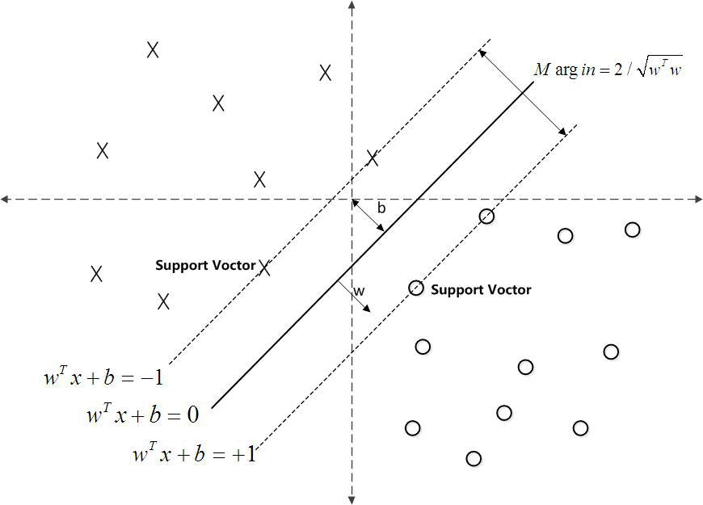

## 8.2 监督学习

>date: 2019-06-20


### 8.2.1 `Logistic`回归

将已知存在的数据点利用一条直线进行拟合（该直线被称为最佳拟合直线）的过程称为回归。

`Logistic`回归分类的主要思想就是依据现有已分类的数据样本建立回归公式，以此进行分类。

回归源于最佳拟合，而`Logistic`回归中训练分类器的做法就是利用一些最优算法寻找符合最佳拟合的拟合参数。

#### `Logistic`分布

设$X$是连续的随机变量，且具有如下的分布函数和密度函数：

$$ F(X) = P(X\leq{x}) = \frac{1}{1+e^{-\frac{(x-\mu)}{\gamma}}}$$

$$ f(X) = F'(X) = \frac{e^{-\frac{x-\mu}{\gamma}}}{\gamma(1+e^{-\frac{x-\mu}{\gamma}})^2}$$

其中$\mu​$为位置参数，$\gamma > 0​$为形状参数。

下图是$F(X),f(X)$的大致图像，人们又把$F(X)$函数称为$sigmoid$函数。


`Logistic`分布的累计分布函数关于点$(\mu, \frac{1}{2})$对称，即：

$$F(-x + \mu) - \frac{1}{2} = - F(x - \mu) + \frac{1}{2}$$

#### 二项式`Logistic`回归

从`Logistic`分布定义中引申出`Logistic`回归模型。

在上述$X​$中，将其分为$0​$、$1​$两类。即随机变量$X​$的取值为实数，其分类变量定义为$Y​$，每个$x​$所属类别可以通过条件概率分布$P(Y|X)​$进行表示。
条件概率分布如下：

$$P(Y=1\mid x) = \frac{\exp(w \cdot x+b)}{1+\exp(w \cdot x+b)}​$$

$$P(Y=0\mid x) = \frac{1}{1+\exp(w \cdot x+b)}$$

$x\in \Bbb{R}^n$是输入，$Y\in {0, 1}$是输出，$w \in \Bbb{R}^n$为权值向量，$b \in \Bbb{R}$为偏置，$w \cdot x$为$w$和$x$的内积。

这里将$w$和$x$进行扩充，即$w = (w ^{(1)},w ^{(2)},...,w ^{(n)},b)$和$x = (x^{(1)},x^{(2)},...,x^{(n)},1)$。

此时的`Logistic`回归模型如下：

$$P(Y=1\mid x) = \frac{\exp(w \cdot x)}{1+\exp(w \cdot x)}$$

$$P(Y=0\mid x) = \frac{1}{1+\exp(w \cdot x)}​$$

在考虑一个事件发生为$p​$，则不发生的概率为$1-p​$，那么这个事件发生的几率（`odds`）为$\frac{p}{1-p}​$。对数几率（`log odds`）为

$$logit(p) = \log{\frac{p}{1-p}}$$

将上述`Logistic`回归模型代入其中可以得到：

$$\log{\frac{P(Y = 1\mid x)}{1-P(Y = 1\mid x)}} = w \cdot x​$$

可以看出输出$Y = 1$的对数几率是输入$x$的线性函数，即$Y$可以用$x$的线性函数表示。自然地，在`Logistic`回归模型中，$x$的线性函数值$w \cdot x$越接近于$+∞$，其概率越接近于1，反之，$w \cdot x$越接近于$-∞$，其概率越接近于0。

#### 参数估计

假设给定训练数据集$T = \{(x_1,y_1),(x_2,y_2),...,(x_N,y_N)\}$，其中，$x_i \in \Bbb{R}^n$，$y_i \in \{0,1\}$，利用极大似然估计法估计模型参数。

设$P(Y=1\mid x) =\pi (x)$，则$P(Y=0\mid x) =1-\pi (x)$

似然函数为：

$$\prod_{i=1}^{N} [\pi(x_i)]^{y_i}[1-\pi(x_i)]^{1-y_i}$$

对数似然函数为：

$$L( w ) = \sum\_{i=1}^{N}[y\_i \log \pi(x)+(1-y\_i)\log(1-\pi(x\_i))]  = \sum\_{i=1}^{N}[y\_i\log(\frac{\pi(x\_i)}{1-\pi(x\_i)})+\log(1-\pi(x\_i))] = \sum\_{i=1}^{N}[y\_i( w \cdot x\_i)-\log(1+\exp( w \cdot x\_i))]$$

此时对$L(w)$求最大值，即得到$w$的估计值。
为此，后续利用梯度下降法或者拟牛顿法进行该值的求解。

假设$w$的极大似然估计值为$\hat w$，那么`Logistic`模型为：

$$P(Y=1\mid x) = \frac{\exp(\hat w \cdot x)}{1+\exp(\hat w \cdot x)}$$

$$P(Y=0\mid x) = \frac{1}{1+\exp(\hat w \cdot x)}$$

#### 梯度法求解估计值

对上述$L(w)$中的$w$求导，得到：

$$ \frac{\partial}{\partial w}L(w) = \sum\_{i=1}^{N} y\_i x\_i - \sum\_{i=1}^{N}\frac{exp(w \cdot x\_i)}{1+exp(w \cdot x\_i )} x\_i = \sum_{i=1}^{N}(y\_i - \pi(x\_i))x\_i $$

令$\frac{\partial}{\partial w}L(w) =0$，可以求得其最大的$L(w)$对应的$\hat w$，但由于无法直接求解，故采用梯度下降法进行求解。

由上求导过程可以知道，$L(w)$的梯度为

$$\triangledown\_{w}L(w) =\sum\_{i=1}^{N}(y\_i - \pi(x\_i)) x\_i$$

故迭代公式（此处为梯度上升算法）为

$$w = w + \alpha \sum_{i=1}^{N}(y_i - \pi(x_i))x_i$$

其中$\alpha$为步长，当$\mid\mid \triangledown_{w}L(w) \mid\mid < \varepsilon$，即可求得最大的$\hat w$，$\varepsilon$为误差。

#### `Logistic`分类器实现

以下列数据集为例，进行`Logistic`分类器的设计。

|  编号  |  色泽  |  根蒂  |  敲声  |  纹理  |  脐部  |  触感  |  密度   |  含糖率  |  好瓜  |
| :--: | :--: | :--: | :--: | :--: | :--: | :--: | :---: | :---: | :--: |
|  1   |  青绿  |  蜷缩  |  浊响  |  清晰  |  凹陷  |  硬滑  | 0.697 | 0.460 |  是   |
|  2   |  乌黑  |  蜷缩  |  沉闷  |  清晰  |  凹陷  |  硬滑  | 0.774 | 0.376 |  是   |
|  3   |  乌黑  |  蜷缩  |  浊响  |  清晰  |  凹陷  |  硬滑  | 0.634 | 0.264 |  是   |
|  4   |  青绿  |  蜷缩  |  沉闷  |  清晰  |  凹陷  |  硬滑  | 0.608 | 0.318 |  是   |
|  5   |  浅白  |  蜷缩  |  浊响  |  清晰  |  凹陷  |  硬滑  | 0.556 | 0.215 |  是   |
|  6   |  青绿  |  稍蜷  |  浊响  |  清晰  |  稍凹  |  软粘  | 0.403 | 0.237 |  是   |
|  7   |  乌黑  |  稍蜷  |  浊响  |  稍糊  |  稍凹  |  软粘  | 0.481 | 0.149 |  是   |
|  8   |  乌黑  |  稍蜷  |  浊响  |  清晰  |  稍凹  |  硬滑  | 0.437 | 0.211 |  是   |
|  9   |  乌黑  |  稍蜷  |  沉闷  |  稍糊  |  稍凹  |  硬滑  | 0.666 | 0.091 |  否   |
|  10  |  青绿  |  硬挺  |  清脆  |  清晰  |  平坦  |  软粘  | 0.243 | 0.267 |  否   |
|  11  |  浅白  |  硬挺  |  清脆  |  模糊  |  平坦  |  硬滑  | 0.245 | 0.057 |  否   |
|  12  |  浅白  |  蜷缩  |  浊响  |  模糊  |  平坦  |  软粘  | 0.343 | 0.099 |  否   |
|  13  |  青绿  |  稍蜷  |  浊响  |  稍糊  |  凹陷  |  硬滑  | 0.639 | 0.161 |  否   |
|  14  |  浅白  |  稍蜷  |  沉闷  |  稍糊  |  凹陷  |  硬滑  | 0.657 | 0.198 |  否   |
|  15  |  乌黑  |  稍蜷  |  浊响  |  清晰  |  稍凹  |  软粘  | 0.360 | 0.37  |  否   |
|  16  |  浅白  |  蜷缩  |  浊响  |  模糊  |  平坦  |  硬滑  | 0.593 | 0.042 |  否   |
|  17  |  青绿  |  蜷缩  |  沉闷  |  稍糊  |  稍凹  |  硬滑  | 0.719 | 0.103 |  否   |

```python
# 导入numpy和pandas库
import numpy as np
import pandas as pd

# 解析数据文件
def loadDataSet(filename):
    dataSet = pd.read_csv(filename, sep = ',', index_col = '编号')

    # 哑变量处理
    featureDict = []
    new_dataSet = pd.DataFrame()
    for i in range(len(dataSet.columns)):
        featureList = dataSet[dataSet.columns[i]]
        classSet = list(set(featureList))
        count = 0
        for feature in classSet:
            d = dict()
            if isinstance(feature, float):# 判断是否为连续变量
                continue
            else:
                featureList[featureList == feature] = count
                d[feature] = count
                count += 1
            featureDict.append(d)
        new_dataSet = pd.concat([new_dataSet, featureList], axis = 1)

    dataMat = [list(new_dataSet.loc[i][:-1]) for i in range(1,len(new_dataSet) + 1)]
    labelMat = list(new_dataSet[new_dataSet.columns[-1]])
    return dataMat, labelMat
```

```python
filename = '821_02.txt'
dataMat, labelMat = loadDataSet(filename)

import pprint
pprint.pprint(dataMat)
pprint.pprint(labelMat)

'''
[[1, 1, 2, 2, 0, 0, 0.69700000000000006, 0.46000000000000002],
[0, 1, 1, 2, 0, 0, 0.77400000000000002, 0.376],
[0, 1, 2, 2, 0, 0, 0.63400000000000001, 0.26400000000000001],
[1, 1, 1, 2, 0, 0, 0.60799999999999998, 0.318],
[2, 1, 2, 2, 0, 0, 0.55600000000000005, 0.215],
[1, 2, 2, 2, 1, 1, 0.40299999999999997, 0.23699999999999999],
[0, 2, 2, 0, 1, 1, 0.48100000000000004, 0.14899999999999999],
[0, 2, 2, 2, 1, 0, 0.43700000000000006, 0.21100000000000002],
[0, 2, 1, 0, 1, 0, 0.66599999999999993, 0.090999999999999998],
[1, 0, 0, 2, 2, 1, 0.24299999999999999, 0.26700000000000002],
[2, 0, 0, 1, 2, 0, 0.245, 0.057000000000000002],
[2, 1, 2, 1, 2, 1, 0.34299999999999997, 0.099000000000000005],
[1, 2, 2, 0, 0, 0, 0.63900000000000001, 0.161],
[2, 2, 1, 0, 0, 0, 0.65700000000000003, 0.19800000000000001],
[0, 2, 2, 2, 1, 1, 0.35999999999999999, 0.37],
[2, 1, 2, 1, 2, 0, 0.59299999999999997, 0.042000000000000003],
[1, 1, 1, 0, 1, 0, 0.71900000000000008, 0.10300000000000001]]
[1, 1, 1, 1, 1, 1, 1, 1, 0, 0, 0, 0, 0, 0, 0, 0, 0]
'''
```

可以看到，该操作将字符串型的分类变量解析成为了数值型的分类变量，从而方便了将要进行的数值运算。

* 利用梯度上升法求最佳回归系数

在前面的定义中，`Logistic`分布函数$F(X)$又被称为$sigmoid$函数，其对数几率为

$$\log{\frac{P(Y = 1\mid x)}{1-P(Y = 1\mid x)}} = w \cdot x$$

即将$sigmoid$函数的输入可以看作是：

$$z = w ^{(1)}x^{(1)}+w ^{(2)}x^{(2)}+,...,+w ^{(n)}x^{(n)}  = w^{T} \cdot x$$

由此，定义下面的代码进行梯度上升法的实现：

```python
# 定义Sigmoid函数
def sigmoid(inX):
    return 1.0/(1 + np.exp(- inX))

# 随机的梯度上升法
def gradAscent(dataMatIn, classLabels, numIter = 150):
    # 获得行数和列数，即样本数和特征数
    m, n = np.shape(dataMatIn)
    # 权重初始化
    weights = np.ones(n)
    for j in range(numIter):
        dataIndex = range(m)
        for i in range(m):
            alpha = 4/(1.0 + j + i) + 0.01
            randIndex = int(np.random.uniform(0, len(dataIndex)))
            h = sigmoid(sum(dataMatIn[randIndex] * weights))
            error = classLabels[randIndex] - h
            weights = weights + np.dot(alpha * error, dataMatIn[randIndex])
    return weights

weights = gradAscent(dataMat, labelMat)
print(weights)

'''
[-1.91739131 -2.37320272  3.30085298  1.32020706 -2.30328752  0.58413608
      0.84630395 -0.63702599]
'''
```

* 分类器设计

由上，求出了相应的输入特征对应权重，利用对数几率公式，可以简单实现分类的效果，相关设计代码如下：

```python
def classfy(testdir, weights):
    dataMat, labelMat = loadDataSet(testdir)
    dataMat = np.mat(dataMat)
    weights = np.mat(weights)
    h = sigmoid(dataMat * weights.transpose())
    h = h.tolist()
    m = len(h)
    error = 0.0
    for i in range(m):
        if h[i][0] > 0.5:
            print(int(labelMat[i]),'is classfied as: 1')
            if int(labelMat[i])!=1:
                error += 1
                print('error')
        else:
            print(int(labelMat[i]),'is classfied as: 0')
            if int(labelMat[i])!=0:
                error += 1
                print('error')
    print('error rate is:','%.4f' %(error/m))

print(classfy(filename, weights))
'''
1 is classfied as: 1
1 is classfied as: 1
1 is classfied as: 1
1 is classfied as: 1
1 is classfied as: 1
1 is classfied as: 1
1 is classfied as: 1
1 is classfied as: 1
0 is classfied as: 0
0 is classfied as: 0
0 is classfied as: 0
0 is classfied as: 0
0 is classfied as: 1
error
0 is classfied as: 0
0 is classfied as: 1
error
0 is classfied as: 0
0 is classfied as: 0
error rate is: 0.1176
'''
```

将训练的数据样本进行测试，可以看出上述分类中，只有两个样本被分类错误了，准确度达到了$88.24%$，分类效果不错。

* `Scikit-Learn`库简单实现`Logistic`分类

简单通过`Scikit-Learn`库实现`Logistic`的分类：

```python
from sklearn.linear_model import LogisticRegression

X, Y = loadDataSet(filename)

clf = LogisticRegression()
clf.fit(X, Y)
y_pred = clf.predict(X)
accuracy = np.mean(Y == y_pred)
print('准确度为：', accuracy)
'''
准确度为： 0.882352941176
'''
```

可以看出，上述实现的准确度与设计的分类器的准确度基本一样，效果不错。

* `Logistic`回归分类的优缺点：

1. 优点：计算代价低，易于理解和实现；
2. 缺点：易欠拟合，分类精度普遍不高。

### 8.2.2 决策树

决策树(`decision tree`)又叫判定树，是基于树结构对样本属性进行分类的分类算法。以二分类为例，当对某个问题进行决策时，会进行一系列的判断或者“子决策”，将每个判定问题可以简单理解为“开”或“关”，当达到一定条件的时候，就进行“开”或“关”的操作，操作就是对决策树的这个问题进行的测试。所有的“子决策”都完成的时候，就构建出了一颗完整的决策树。

一颗典型的决策树包括根结点、若干个内部结点和若干个叶结点；叶结点对应着决策结果，其它每个结点对应于一个属性测试；每个结点包含的样本集合根据属性测试的结果被划分到子结点中；根结点包含样本全集。

决策树学习的目的在于产生一颗泛化能力强，即处理未见示例能力强的决策树，基本流程遵循简单直观的“分而治之”(divide-and-conquer)策略。

一般而言，随着划分过程的不断进行，我们希望决策树的分支节点所包含的样本尽可能属于同一类别，即结点的“纯度”(purity)越来越高。

#### 信息熵(`information entropy`)

信息熵是度量样本集合纯度最常用的一种指标。在样本集合$D$中，第*k*类样本所占比例为$p_k(k=1,2,...,|y|)$，则$D$的信息熵为：

$$Ent(D)=-\sum_{k=1}^{|y|}p_klog_2p_k$$

$Ent(D)$的值越小，$D$的纯度越高。

#### 信息增益(`information gain`)

离散属性$a$中有$V$个可能取值$\{ a^1,a^2,...,a^V\}$，使用$a$对样本集$D$进行划分，则产生$V$个分支结点，其中第$v$个分支结点包含了$D$中所有在属性$a$上取值为$a^v$的样本，记作$D^v$，$D^v$信息熵即为$Ent(D^v)$。

考虑到不同分支结点包含样本数不同，则给分支结点赋权$\frac{|D^v|}{|D|}$，最后可计算出属性$a$对样本集$D$进行划分所得到的信息增益：

$$Gain(D,a)=Ent(D)-\sum_{v=1}^{V}\frac{|D^v|}{|D|}Ent(D^v)$$

著名的$ID3$算法就是基于信息增益构建的。

一般信息增益越大，则意味使用属性$a$进行划分所获得的“纯度提升”越大。

#### 信息增益率(`gain ratio`)

信息增益准则对可数数目较多属性有所偏好。这里考虑一个特殊情况，若分支数目就为样本数，则信息增益就为样本集信息熵，此时信息增益亦越大，此时决策树并不具有泛化能力，无法对新样本进行有效预测。

信息增益率就是为了解决上述问题而产生的。信息增益率的计算公式为：

$$Gain_{ratio}(D,a)=\frac{Gain(D,a)}{IV(a)}$$

其中

$$IV(a)=-\sum_{v=1}^V \frac{|D^v|}{|D|}log_2\frac{|D^v|}{|D|}$$

称为属性$a$的“固有值”(intrinsic value)，属性$a$的可能取值数目越多（即$V$越大），则$IV(a)$通常会越大。

基于$ID3$算法改进的$C4.5$算法就是基于信息增益率构建的。

需要注意的是，信息增益率对于可取值数目较少的属性有所偏好。

#### 基尼指数(`gini index`)

基尼指数是常用于$CART$决策树的一种划分准则，样本集$D$的“纯度”也可通过这个指数进行确定。基尼指数：

$$Gini(D)=\sum_{k=1}^{|y|}\sum_{k^{'}\neq{k}}p_kp_{k^{'}}=1-\sum_{k=1}^{|y|}p_k^2$$

它反映了从样本集$D$中随机抽取两个样本，其类别标记不一致的概率。

因此$Gini(D)$越小，样本集$D$纯度越高。

定义属性$a$的基尼指数为：

$$Gini_{index(D)}=\sum_{v=1}^{|V|}\frac{|D^v|}{|D|}Gini(D^v)$$

在候选属性集合$A$中，选择使得划分后基尼指数最小的属性做为最优划分属性。

#### 算法实现

采用以下样本集实现决策树

|  编号  |  色泽  |  根蒂  |  敲声  |  纹理  |  脐部  |  触感  |  好瓜  |
| :--: | :--: | :--: | :--: | :--: | :--: | :--: | :--: |
|  1   |  青绿  |  蜷缩  |  浊响  |  清晰  |  凹陷  |  硬滑  |  是   |
|  2   |  乌黑  |  蜷缩  |  沉闷  |  清晰  |  凹陷  |  硬滑  |  是   |
|  3   |  乌黑  |  蜷缩  |  浊响  |  清晰  |  凹陷  |  硬滑  |  是   |
|  4   |  青绿  |  蜷缩  |  沉闷  |  清晰  |  凹陷  |  硬滑  |  是   |
|  5   |  浅白  |  蜷缩  |  浊响  |  清晰  |  凹陷  |  硬滑  |  是   |
|  6   |  青绿  |  稍蜷  |  浊响  |  清晰  |  稍凹  |  软粘  |  是   |
|  7   |  乌黑  |  稍蜷  |  浊响  |  稍糊  |  稍凹  |  软粘  |  是   |
|  8   |  乌黑  |  稍蜷  |  浊响  |  清晰  |  稍凹  |  硬滑  |  是   |
|  9   |  乌黑  |  稍蜷  |  沉闷  |  稍糊  |  稍凹  |  硬滑  |  否   |
|  10  |  青绿  |  硬挺  |  清脆  |  清晰  |  平坦  |  软粘  |  否   |
|  11  |  浅白  |  硬挺  |  清脆  |  模糊  |  平坦  |  硬滑  |  否   |
|  12  |  浅白  |  蜷缩  |  浊响  |  模糊  |  平坦  |  软粘  |  否   |
|  13  |  青绿  |  稍蜷  |  浊响  |  稍糊  |  凹陷  |  硬滑  |  否   |
|  14  |  浅白  |  稍蜷  |  沉闷  |  稍糊  |  凹陷  |  硬滑  |  否   |
|  15  |  乌黑  |  稍蜷  |  浊响  |  清晰  |  稍凹  |  软粘  |  否   |
|  16  |  浅白  |  蜷缩  |  浊响  |  模糊  |  平坦  |  硬滑  |  否   |
|  17  |  青绿  |  蜷缩  |  沉闷  |  稍糊  |  稍凹  |  硬滑  |  否   |

```python
import pandas as pd#导入pandas库
import numpy as np#导入numpy库

data = pd.read_csv('822_01.txt', ',', index_col='编号')
labels = list(data.columns)
dataSet = np.array(data).tolist()#处理读入数据为list类型，方便后续计算
```

* 实现根结点信息熵的计算

```python
from math import log

def calcShannonEnt(dataSet):
    numEntries = len(dataSet)#计算样本集的总样本数量
    labelCounts = {}#设置一个空的dict类型变量
    for featVec in dataSet:#遍历每行样本集
        currentLabel = featVec[-1]#选取样本集最后一列，设置为labelCounts变量的key值
        if currentLabel not in labelCounts.keys():
            labelCounts[currentLabel] = 0#key对应value初始化
        labelCounts[currentLabel] += 1#累计value，即计算同类别样本数
    shannonEnt = 0.0#初始化信息熵
    for key in labelCounts:
        prob = float(labelCounts[key]) / numEntries#计算频率
        shannonEnt -= prob * log(prob, 2)#计算信息熵
    return shannonEnt

print(calcShannonEnt(dataSet))
'''
0.9975025463691153
'''
```

可以得到是否“好瓜”，即根结点的信息熵为$0.9975025463691153$。

* 计算不同子属性信息熵

判断是否“好瓜”的有｛色泽，根蒂，敲声，纹理，脐部，触感｝等$6$个子属性，同时以“色泽”属性为例，它有3个可能取值｛青绿，乌黑，浅白｝，分别记为$D^1$(色泽=青绿)、$D^2$(色泽=乌黑)和$D^1$(色泽=浅白)。

如果希望通过上面计算根结点的代码计算不同子属性信息熵，这里就需要对样本集进行划分，选择相应的子属性。这里通过下面的代码实现样本集的划分。

```python
def splitDataSet(dataSet, axis, value):
    #dataSet为样本集
    #axis为子属性下标，如0代表子属性“色泽”
    #value为上述子属性取值
    retDataSet = []
    for featVec in dataSet:
        if featVec[axis] == value:
            reducedFeatVec = featVec[:axis]
            reducedFeatVec.extend(featVec[axis + 1:])
            retDataSet.append(reducedFeatVec)
    return retDataSet

newdataSet1=splitDataSet(dataSet, 0, '青绿')#将为“青绿”的样本集合划分出来
'''
[['蜷缩', '浊响', '清晰', '凹陷', '硬滑', '是'], ['蜷缩', '沉闷', '清晰', '凹陷', '硬滑', '是'], ['稍蜷', '浊响', '清晰', '稍凹', '软粘', '是'], ['硬挺', '清脆', '清晰', '平坦', '软粘', '否'], ['稍蜷', '浊响', '稍糊', '凹陷', '硬滑', '否'], ['蜷缩', '沉闷', '稍糊', '稍凹', '硬滑', '否']]
'''
newdataSet2=splitDataSet(dataSet, 0, '乌黑')#将为“青绿”的样本集合划分出来
'''
[['蜷缩', '沉闷', '清晰', '凹陷', '硬滑', '是'], ['蜷缩', '浊响', '清晰', '凹陷', '硬滑', '是'], ['稍蜷', '浊响', '稍糊', '稍凹', '软粘', '是'], ['稍蜷', '浊响', '清晰', '稍凹', '硬滑', '是'], ['稍蜷', '沉闷', '稍糊', '稍凹', '硬滑', '否'], ['稍蜷', '浊响', '清晰', '稍凹', '软粘', '否']]
'''
newdataSet3=splitDataSet(dataSet, 0, '浅白')#将为“青绿”的样本集合划分出来
'''
[['蜷缩', '浊响', '清晰', '凹陷', '硬滑', '是'], ['硬挺', '清脆', '模糊', '平坦', '硬滑', '否'], ['蜷缩', '浊响', '模糊', '平坦', '软粘', '否'], ['稍蜷', '沉闷', '稍糊', '凹陷', '硬滑', '否'], ['蜷缩', '浊响', '模糊', '平坦', '硬滑', '否']]
'''

print(calcShannonEnt(newdataSet1))
print(calcShannonEnt(newdataSet2))
print(calcShannonEnt(newdataSet3))
'''
1.0
0.9182958340544896
0.7219280948873623
'''
```

可以得到$D^1$(色泽=青绿)的信息熵为：$1.0$，$D^2$(色泽=乌黑)的信息熵：为$0.9182958340544896$，$D^1$(色泽=浅白)的信息熵为：$0.7219280948873623$。

* 实现信息增益的计算

```python
numFeatures = len(dataSet[0]) - 1#计算子属性的数量
baseEntropy = calcShannonEnt(dataSet)#计算根结点信息熵
columns=['色泽','根蒂','敲声','纹理','脐部','触感']#子属性
for i in range(numFeatures):
    featList = [example[i] for example in dataSet]
    uniqueVals = set(featList)
    newEntropy = 0.0
    for value in uniqueVals:
        #根据子属性及其取值划分样本子集
        subDataSet = splitDataSet(dataSet, i, value)
        prob = len(subDataSet) / float(len(dataSet))#权值
        newEntropy += prob * calcShannonEnt(subDataSet)
        print(value,'的信息熵为：',calcShannonEnt(subDataSet))#不同取值的信息熵
    infoGain = baseEntropy - newEntropy#计算信息增益
    print(columns[i],'信息增益为：',infoGain)
    print('----------------------------------')

'''
青绿 的信息熵为： 1.0
乌黑 的信息熵为： 0.9182958340544896
浅白 的信息熵为： 0.7219280948873623
色泽 信息增益为： 0.10812516526536531
----------------------------------
蜷缩 的信息熵为： 0.9544340029249649
硬挺 的信息熵为： 0.0
稍蜷 的信息熵为： 0.9852281360342516
根蒂 信息增益为： 0.14267495956679288
----------------------------------
清脆 的信息熵为： 0.0
浊响 的信息熵为： 0.9709505944546686
沉闷 的信息熵为： 0.9709505944546686
敲声 信息增益为： 0.14078143361499584
----------------------------------
模糊 的信息熵为： 0.0
清晰 的信息熵为： 0.7642045065086203
稍糊 的信息熵为： 0.7219280948873623
纹理 信息增益为： 0.3805918973682686
----------------------------------
稍凹 的信息熵为： 1.0
平坦 的信息熵为： 0.0
凹陷 的信息熵为： 0.863120568566631
脐部 信息增益为： 0.28915878284167895
----------------------------------
硬滑 的信息熵为： 1.0
软粘 的信息熵为： 0.9709505944546686
触感 信息增益为： 0.006046489176565584
----------------------------------
'''
```

* 基于信息增益选择最优划分属性

一般某个子属性的信息增益越大，意味着使用该属性进行划分的“纯度提升”越大，下面通过改造上述代码，选取最优的划分属性。

```python
# 基于信息增益选择最优划分属性
def chooseBestFeatureToSplit_Gain(dataSet):
    numFeatures = len(dataSet[0]) - 1
    baseEntropy = calcShannonEnt(dataSet)
    bestInfoGain = 0.0#初始最优信息增益
    bestFeature = -1#初始最优子属性
    for i in range(numFeatures):
        featList = [example[i] for example in dataSet]
        uniqueVals = set(featList)
        newEntropy = 0.0
        for value in uniqueVals:
            subDataSet = splitDataSet(dataSet, i, value)
            prob = len(subDataSet) / float(len(dataSet))
            newEntropy += prob * calcShannonEnt(subDataSet)
        infoGain = baseEntropy - newEntropy
        if (infoGain > bestInfoGain):#选择最优子属性
            bestInfoGain = infoGain
            bestFeature = i
    return bestFeature

chooseBestFeatureToSplit_Gain(dataSet)
'''
3
'''

上述结果表示在这个样本集中，最优的划分子属性是“纹理”，接下来根结点就通过该子属性进行划分。在该划分之后，通过剩余的其它子属性再进行信息增益的计算得到下个最优划分子属性，迭代进行，直到全部子属性变量完成。

* 基于信息增益率最优划分属性选取

计算信息增益率代码与上文计算信息增益的代码类似，同时下文基于该原则选择最优子属性的代码中有体现，这里不过多赘述。

同样的，基于信息增益率原则也是选择信息增益率最大的为最优划分结点，下面基于信息增益率划分最优子属性。

由于本文采用的样本集是离散型特征的样本，这里的信息增益率和基尼指数选择划分属性的实现并未针对连续型特征进行。后续会加以改进。

​```python
# 基于信息增益率选择最优划分属性
def chooseBestFeatureToSplit_GainRatio(dataSet):
    numFeatures = len(dataSet[0]) - 1
    baseEntropy = calcShannonEnt(dataSet)
    bestGainRatio = 0.0
    bestFeature = -1
    for i in range(numFeatures):
        featList = [example[i] for example in dataSet]
        uniqueVals = set(featList)
        newEntropy = 0.0
        iv = 0.0#初始化“固有值”
        GainRatio = 0.0
        for value in uniqueVals:
            subDataSet = splitDataSet(dataSet, i, value)
            prob = len(subDataSet) / float(len(dataSet))
            iv -= prob * log(prob, 2)#计算每个子属性“固有值”
            newEntropy += prob * calcShannonEnt(subDataSet)
        infoGain = baseEntropy - newEntropy
        GainRatio = infoGain / iv#计算信息增益率
        if (GainRatio > bestGainRatio):#选择最优节点
            bestGainRatio = GainRatio
            bestFeature = i
    return bestFeature

chooseBestFeatureToSplit_GainRatio(dataSet)
'''
3
'''
```

上述结果表示在这个样本集中，最优的划分子属性同样是“纹理”，接下来的划分实现过程就由该结点开始。

* 计算基尼指数及最优划分属性选取

```python
# 计算基尼指数
def calcGini(dataSet):
    numEntries = len(dataSet)
    labelCounts = {}
    for featVec in dataSet:
        currentLabel = featVec[-1]
        if currentLabel not in labelCounts.keys():
            labelCounts[currentLabel] = 0
        labelCounts[currentLabel] += 1
        Gini = 1.0
        for key in labelCounts:
            prob = float(labelCounts[key]) / numEntries
            Gini -= prob * prob
    return Gini

calcGini(dataSet)#根结点基尼指数
'''
0.49826989619377154
'''
```

* 基于基尼指数选择最优划分属性

```python
# 基于基尼指数选择最优划分属性(只能对离散型特征进行处理)
def chooseBestFeatureToSplit_Gini(dataSet):
    numFeatures = len(dataSet[0]) - 1
    bestGini = 100000.0
    bestFeature = -1
    for i in range(numFeatures):
        featList = [example[i] for example in dataSet]
        uniqueVals = set(featList)
        newGiniIndex = 0.0
        for value in uniqueVals:
            subDataSet = splitDataSet(dataSet, i, value)
            prob = len(subDataSet) / float(len(dataSet))
            newGiniIndex += prob * calcGini(subDataSet)
        if (newGiniIndex < bestGini):
            bestGini = newGiniIndex
            bestFeature = i
    return bestFeature

chooseBestFeatureToSplit_Gini(dataSet)
'''
3
'''
```

上述结果同样表示在这个样本集中，最优的划分子属性同样是“纹理”，接下来的划分实现过程也由该结点开始。

* 创建树

决策树的创建过程是迭代进行的，下面的代码是根据子属性的取值数目大小来进行每层根结点的选择的实现过程。即简单理解为选择“下一个根结点”。

```python
import operator

# 选择下一个根结点
def majorityCnt(classList):
    classCount = {}
    for vote in classList:
        if vote not in classCount.keys():
            classCount[vote] = 0#初始化子属性取值的计数
        classCount[vote] += 1#累计
    #根据第二个域，即dict的value降序排序
    sortedClassCount = sorted(classCount.items(), key=operator.itemgetter(1), reverse = True)
    return sortedClassCount[0][0]#返回子属性取值

# 创建树
def createTree(dataSet, labels, chooseBestFeatureToSplit):
    classList = [example[-1] for example in dataSet]#初始化根结点
    if classList.count(classList[0]) == len(classList):#只存在一种取值情况
        return classList[0]
    if len(dataSet[0]) == 1:#样本集只存在一个样本情况
        return majorityCnt(classList)
    bestFeat = chooseBestFeatureToSplit(dataSet)#最优划分属性选取
    bestFeatLabel = labels[bestFeat]
    myTree = {bestFeatLabel: {}}#初始化树
    del (labels[bestFeat])#删除已划分属性
    featValues = [example[bestFeat] for example in dataSet]#初始化下层根结点
    uniqueVals = set(featValues)
    for value in uniqueVals:
        subLabels = labels[:]
        #遍历实现树的创建
        myTree[bestFeatLabel][value] = createTree(splitDataSet(dataSet, bestFeat, value), subLabels, chooseBestFeatureToSplit)
    return myTree

chooseBestFeatureToSplit=chooseBestFeatureToSplit_Gain#根据信息增益创建树
# chooseBestFeatureToSplit=chooseBestFeatureToSplit_GainRatio#根据信息增益率创建树
# chooseBestFeatureToSplit=chooseBestFeatureToSplit_Gini#根据基尼指数创建树
myTree = createTree(dataSet, labels, chooseBestFeatureToSplit)

print(myTree)
'''
{'纹理': {'模糊': '否',
      '清晰': {'根蒂': {'硬挺': '否',
        '稍蜷': {'色泽': {'乌黑': {'触感': {'硬滑': '是', '软粘': '否'}}, '青绿': '是'}},
        '蜷缩': '是'}},
      '稍糊': {'触感': {'硬滑': '否', '软粘': '是'}}}}
'''
```

* 分类器实现

需要将划分好的决策树加载出来进行分类，这里定义一个分类的代码如下。

```python
# 分类测试器
def classify(inputTree, featLabels, testVec):
    firstStr = list(inputTree.keys())[0]
    secondDict = inputTree[firstStr]#下一层树
    featIndex = featLabels.index(firstStr)#将Labels标签转换为索引
    for key in secondDict.keys():
        if testVec[featIndex] == key:#判断是否为与分支节点相同，即向下探索子树
            if type(secondDict[key]).__name__ == 'dict':
                #递归实现
                classLabel = classify(secondDict[key], featLabels, testVec)
            else:
                classLabel = secondDict[key]
    return classLabel#返回判断结果

print(classify(myTree, ['色泽','根蒂','敲声','纹理','脐部','触感'],['乌黑','稍蜷','沉闷','稍糊','稍凹','硬滑']))
'''
'否' # 得到分类结果为'否'
'''
```

* 保存和加载树

由于决策树的训练是一件耗时的工作，当碰到较大的样本集的时候，为了下次使用的方便，这里将决策树保存起来。

通过`pickle`模块存储和加载决策树。

```python
# 保存树
def storeTree(inputTree,filename):
    import pickle
    fw = open(filename,'wb+')
    pickle.dump(inputTree,fw)
    fw.close()

# 加载树
def grabTree(filename):
    import pickle
    fr = open(filename,'rb')
    return pickle.load(fr)

storeTree(myTree,'myTree.txt') # 保存到mytree.txt文件中
grabTree('myTree.txt') # 加载保存的决策树
```

* 使用`Scikit-Learn`库实现决策树

基于信息熵简单实现决策树。

```python
import numpy as np
import pandas as pd
from sklearn import tree, preprocessing

'''由于在此库中需要使用数值进行运算，这里需要对样本集进行处理'''
data = pd.read_csv('822_01.txt', ',', index_col='编号')
for col in data.columns:
    data[col] = preprocessing.LabelEncoder().fit_transform(data[col])
labels = np.array(data['好瓜'])
dataSet = np.array(data[data.columns[:-1]])

clf = tree.DecisionTreeClassifier(criterion = 'entropy')#参数criterion = 'entropy'为基于信息熵，‘gini’为基于基尼指数
clf.fit(dataSet, labels)#训练模型
print(clf)

with open("822_01.dot", 'w') as f:#将构建好的决策树保存到tree.dot文件中
    f = tree.export_graphviz(clf,feature_names = np.array(data.columns[:-1]), out_file = f)
```

可以通过`Graphviz`将保存好的`822_01.dot`绘制出来，这里不赘述。

### 8.2.3 朴素贝叶斯法

朴素贝叶斯法是一种直观地方法，它使用每个属性归属于某个类的概率来进行预测。即在给定的已分类的数据集下，假设每个划分属性归属于某一类的概率是独立于其余属性，从而简化了概率的计算。通过计算这种强的独立性假设，来进行分类，这种分类是牺牲一定准确性的，但又是简单的。

#### 基本方法

假设存在训练数据集 $T = \{(x_1,y_1),(x_2,y_2),...,(x_N,y_N)\}$，其先验概率分布为 $P(Y = c_k) = \frac{c_k}{N}$，${k=1,2,...,K}$ ，其条件概率分布为 ${P(X = x|Y = c_k) ,x = (x^{(1)},x^{(2)},...,x^{(N)},), k=1,2,...,K }$，

于是求的其联合概率分布为$P(X,Y) = P(Y =  c_k)P(X = x|Y = c_k)$，

在贝叶斯定义中，贝叶斯定理为

$P(Y = c_k|X = x) = \frac{P(Y=c_k)P(x^{(1)},x^{(2)},...,x^{(N)}|Y = c_k)}{P(x^{(1)},x^{(2)},...,x^{(N)})} = \frac{P(Y=c_k)P(x^{(2)},...,x^{(N)}|Y = c_k,x^{(1)})}{P(x^{(1)},x^{(2)},...,x^{(N)})}  = ... = \frac{P(Y=c_k)P(x^{(1)}|P(Y=c_k))P(x^{(2)}|Y=c_k,X=x^{(1)})...P(x^{(N)}|Y = c_k,x^{(1)},...,x^{(N-1)})}{P(x^{(1)},x^{(2)},...,x^{(N)})}$

上式中分子部分的条件概率${P(X = x|Y = c_k)}$的计算是极其复杂的，其复杂度是相对于变量个数成指数增长的，当存在很多特征的时候，计算的过程极其痛苦，如果再考虑分母展开的链规则的话，整个过程就会呈现一个组合爆炸的情况！

为此，朴素贝叶斯法就针对条件概率分布作出了条件独立性的假设，本文介绍的朴素贝叶斯也因此得名。

具体地，其条件概率计算公式如下：

$$P(X = x | Y = c_k) = P(X^{(j)} = x^{(1)},...,X^{(n)} = x^{(n)}|Y = c_k)= \prod_{j=1}^{n} P(X^{(j)} = x^{(j)}|Y = c_k)$$

相较于贝叶斯定义中的条件概率，此时参数减少了，也很好地避免了计算上的组合爆炸问题，对于属性数越多的问题，其运用就越简单，也越迅速。

由此可以习得的后验概率为：

$$P(Y = c_k|X = x) = \frac{P(X = x|Y = c_k)P(Y=c_k)}{\sum_k{P(X = x|Y = c_k)P(Y=c_k)}}$$

#### 朴素贝叶斯分类器

基于此后验概率，即得到朴素贝叶斯分类器如下：

$$ y= \arg\max_{c_k} P(X = x|Y = c_k)P(Y=c_k)$$

#### 离散变量和连续变量

对离散变量而言，条件概率公式为：

$$P(X^{(j)} = x^{(j)}|Y = c_k) = \frac{P(X^{(j)} = x^{(j)},Y = c_k)}{P(Y=c_k)}$$

对连续变量而言，条件概率公式为：

$$P(X^{(j)} = x^{(j)}|Y = c_k) = \frac{1}{\sqrt{2\pi}\sigma}\exp{-\frac{(x^{(j)}-\mu)^2}{2\sigma^2}}$$

其中$\sigma$是在$c_k$类下的标准差，$\mu$为均值。

#### 拉普拉斯修正

在 $P(X = x|Y = c_k) =\prod_{j=1}^{n} P(X^{(j)} = x^{(j)}|Y = c_k)$ 中，会存在某个$P(X^{j} = x^{j}|Y = c_k) = 0$的情况，此时连乘会出现条件概率为0的情况，对此采用拉普拉斯修正（*Laplacian correction*）进行平滑（*smoothing*）。

在条件概率的式子下，将$P(X^{(j)} = x^{(j)}|Y = c_k) = \frac{P(X^{(j)} = x^{j}, Y = c_k) + 1}{P(Y = c_k) + N}$，其中$N$为类别数。

#### 算法实现

以下列数据集为例，进行朴素贝叶斯算法的设计。


|  编号  |  色泽  |  根蒂  |  敲声  |  纹理  |  脐部  |  触感  |  密度   |  含糖率  |  好瓜  |
| :--: | :--: | :--: | :--: | :--: | :--: | :--: | :---: | :---: | :--: |
|  1   |  青绿  |  蜷缩  |  浊响  |  清晰  |  凹陷  |  硬滑  | 0.697 | 0.460 |  是   |
|  2   |  乌黑  |  蜷缩  |  沉闷  |  清晰  |  凹陷  |  硬滑  | 0.774 | 0.376 |  是   |
|  3   |  乌黑  |  蜷缩  |  浊响  |  清晰  |  凹陷  |  硬滑  | 0.634 | 0.264 |  是   |
|  4   |  青绿  |  蜷缩  |  沉闷  |  清晰  |  凹陷  |  硬滑  | 0.608 | 0.318 |  是   |
|  5   |  浅白  |  蜷缩  |  浊响  |  清晰  |  凹陷  |  硬滑  | 0.556 | 0.215 |  是   |
|  6   |  青绿  |  稍蜷  |  浊响  |  清晰  |  稍凹  |  软粘  | 0.403 | 0.237 |  是   |
|  7   |  乌黑  |  稍蜷  |  浊响  |  稍糊  |  稍凹  |  软粘  | 0.481 | 0.149 |  是   |
|  8   |  乌黑  |  稍蜷  |  浊响  |  清晰  |  稍凹  |  硬滑  | 0.437 | 0.211 |  是   |
|  9   |  乌黑  |  稍蜷  |  沉闷  |  稍糊  |  稍凹  |  硬滑  | 0.666 | 0.091 |  否   |
|  10  |  青绿  |  硬挺  |  清脆  |  清晰  |  平坦  |  软粘  | 0.243 | 0.267 |  否   |
|  11  |  浅白  |  硬挺  |  清脆  |  模糊  |  平坦  |  硬滑  | 0.245 | 0.057 |  否   |
|  12  |  浅白  |  蜷缩  |  浊响  |  模糊  |  平坦  |  软粘  | 0.343 | 0.099 |  否   |
|  13  |  青绿  |  稍蜷  |  浊响  |  稍糊  |  凹陷  |  硬滑  | 0.639 | 0.161 |  否   |
|  14  |  浅白  |  稍蜷  |  沉闷  |  稍糊  |  凹陷  |  硬滑  | 0.657 | 0.198 |  否   |
|  15  |  乌黑  |  稍蜷  |  浊响  |  清晰  |  稍凹  |  软粘  | 0.360 | 0.37  |  否   |
|  16  |  浅白  |  蜷缩  |  浊响  |  模糊  |  平坦  |  硬滑  | 0.593 | 0.042 |  否   |
|  17  |  青绿  |  蜷缩  |  沉闷  |  稍糊  |  稍凹  |  硬滑  | 0.719 | 0.103 |  否   |

* 分类器简单设计

在这份数据中，“色泽”、“根蒂”、“敲声”、“纹理”、“脐部”和“触感”都为离散变量，而“密度”和“含糖率”为连续变量。对样本数据进行解析，相关代码如下：

```python
import numpy as np
import pandas as pd

#获取各个类别条件概率
def get_pred(dataSet, inputSimple):
    p0classData = []#初始化类别矩阵
    p1classData = []
    classLabels = dataSet[dataSet.columns[-1]]#选取类别列
    for i in range(len(dataSet.columns) - 1):
        columnLabels = dataSet[dataSet.columns[i]]#特征列
        pData = pd.concat([columnLabels, classLabels], axis = 1)#拼接特征列和类别列
        classSet = list(set(classLabels))
        for pclass in classSet:
            filterClass = pData[pData[pData.columns[-1]] == pclass]#根据类别划分数据集
            filterClass = filterClass[pData.columns[-2]]
            if isinstance(inputSimple[i], float):#判断是否是连续变量
                classVar = np.var(filterClass)#方差
                classMean = np.mean(filterClass)#均值
                pro_l = 1/(np.sqrt(2*np.pi) * np.sqrt(classVar))
                pro_r = np.exp(-(inputSimple[i] - classMean)**2/(2 * classVar))
                pro = pro_l * pro_r#概率
                if pclass == '是':
                    p0classData.append(pro)
                else:
                    p1classData.append(pro)
            else:
                classNum = np.count_nonzero(filterClass == inputSimple[i])#计算属于样本特征的数量
                pro = (classNum + 1)/(len(filterClass) + len(set(filterClass)))#此处进行了拉普拉斯修正
                if pclass == '是':
                    p0classData.append(pro)
                else:
                    p1classData.append(pro)
    return p0classData, p1classData
```

上述代码是根据前文的朴素贝叶斯定义进行的设计，我们通过传入测试样本进行检验，测试样本如下：

|  编号  |  色泽  |  根蒂  |  敲声  |  纹理  |  脐部  |  触感  |  密度   |  含糖率  |  好瓜  |
| :--: | :--: | :--: | :--: | :--: | :--: | :--: | :---: | :---: | :--: |
| 测试1  |  青绿  |  蜷缩  |  浊响  |  清晰  |  凹陷  |  硬滑  | 0.697 | 0.460 |  是   |

相关代码如下：

```python
filename = '821_02.txt'
dataSet = pd.read_csv(filename, sep = ',', index_col = '编号')
inputSimple = ['青绿', '蜷缩', '浊响', '清晰', '凹陷', '硬滑', 0.697, 0.460]
p0classData, p1classData = get_pred(dataSet, inputSimple)
if np.prod(p0classData) > np.prod(p1classData):#计算条件概率的累积
    print('该瓜是好瓜！')
else:
    print('烂瓜！')
```

结果将其划分为“好瓜”一类。

后续将训练数据集整合后传入进行测试，相关代码如下：

```python
testData =[list(dataSet.ix[i][:-1]) for i in range(1,len(dataSet) + 1)]#list化
testLabels = []
for test in testData:
    p0classData, p1classData = get_pred(dataSet, test)
    if np.prod(p0classData) > np.prod(p1classData):
        testLabels.append('是')#保存测试结果
    else:
        testLabels.append('否')
accuracy = np.mean(testLabels == dataSet[dataSet.columns[-1]])
print('模型精度为%f' %accuracy)
```

最后的测试精度为$82.3529%$，较为准确。

如果数据集较大的话，该测试精度还会进一步提高，即朴素贝叶斯分类的准确度会进一步提升，这是有利于判断决策的。

* `Scikit-Learn`库简单实现朴素贝叶斯

在这份数据集中，由于离散的特征变量都为字符串，这里需要对其进行哑变量处理，即转化为数值型数据，以便后续的数值计算。

具体实现如下：

```python
import pandas as pd

filename = '821_02.txt'
dataSet = pd.read_csv(filename, sep = ',', index_col = '编号')

#哑变量处理
featureDict = []
new_dataSet = pd.DataFrame()
for i in range(len(dataSet.columns)):
    featureList = dataSet[dataSet.columns[i]]
    classSet = list(set(featureList))
    count = 0
    for feature in classSet:
        d = dict()
        if isinstance(feature, float):#判断是否为连续变量
            continue
        else:
            featureList[featureList == feature] = count
            d[feature] = count
            count += 1
        featureDict.append(d)
    new_dataSet = pd.concat([new_dataSet, featureList], axis = 1)
```

处理完成的新数据集，通过`Scikit-Learn`库中的朴素贝叶斯模块进行训练和预测。

实现如下：

```python
import numpy as np
from sklearn.naive_bayes import MultinomialNB

#设置训练数据集
X = [list(new_dataSet.ix[i][:-1]) for i in range(1,len(new_dataSet) + 1)]
Y = list(new_dataSet[new_dataSet.columns[-1]])

clf = MultinomialNB()#分类器
clf.fit(X, Y)#训练
predicted = clf.predict(X)
print('精度为：%f ' %np.mean(predicted == Y))
```

最终的准确度为：$88.2353%$，与前文的测试结果相近。

* 朴素贝叶斯的优缺点

优点：具有稳定的分类效率、能够处理多分类问题、算法简单，对缺失数据不敏感，常用于文本分类；

缺点：准确度受到各个特征独立的影响，在实际应用中并不一定存在这种假设，需要先验概率和样本本身决定后验概率从而决定分类，并不一定准确。

### 8.2.4 `SVM`

`SVM`(支持向量机)是一种二类分类模型，其基本模型定义为特征空间上的间隔最大的线性分类器，其学习策略是间隔最大化，最终可转化为凸二次规划的问题求解。

#### 线性分类器

给定一些数据点，分别属于不同的类，现在需要一个线性分类器将这些数据分为两类（以$x$代表数据点，$y$取$1$、$-1$分布代表不同类别）。分类器的学习目标是从$n$维的数据空间中找到一个超平面(`Hyper Plane`)，其方程可以表示为：

$$w^{\mathrm{T}} x+b=0$$

假设函数

$$h_\theta(x) = g(\theta^{\mathrm{T}} x) = \frac{1}{1 + e^{-\theta^{\mathrm{T}}x}}$$，

$$g(z) = \frac{1}{1 + e^{-z}}$$

其中$x$是$n$维特征向量，函数$g$即为`Logistic`函数。

假设$h_\theta(x)​$就是特征为$1​$的概率，则有：

$$P(Y=1\mid x;\theta) =h_\theta(x)​$$

$$P(Y=0\mid x;\theta) = 1 - h_\theta(x)$$

由上，当要判别一个新来的特征属于哪个类时，只需求$h_\theta(x)​$即可，若$h_\theta(x) > 0.5​$就是$y=1​$的类，反之属于$y=0​$类。

而$h_\theta(x)$只与$\theta^{\mathrm{T}}x$有关，当$\theta^{\mathrm{T}}x >> 0$时，$h_\theta(x) = 1$，反之$h_\theta(x) = 0$。

$g(z)$是一个映射，其将$z = w^{\mathrm{T}} x+b$，最终形成的简单映射关系如下：

$$g(z) =\begin{cases}  1, & z\geq 0 \\ -1, & z < 0 \end{cases}$$

#### 函数间隔和几何间隔

根据上文提出的超平面，其可以用$f(x)=w^{\mathrm{T}} x+b$表示，如果假设数据空间是一个二维平面，超平面就是下图所示的一条直线，当$f(x) = 0$时，$x$就位于超平面上，$f(x) > 0$对应$y = 1$的数据点，$f(x) < 0$对应$y = -1$的数据点。


* 函数间隔

在超平面确定的情况下，$\mid w^{\mathrm{T}} x+b \mid$能够表示点$x$距离超平面的远近，通过观察$w^{\mathrm{T}} x+b$的符号和类标记$y$的符号可以判断出分类是否正确，即通过$y \times (w^{\mathrm{T}} x+b)$的正负性来判定分类的正确性，由此引出函数间隔(`Functional Margin`)：

$$\hat \gamma = y(w^{\mathrm{T}} x+b) = y f(x)$$

超平面关于样本集的函数间隔最小值就是关于训练集的函数间隔：

$$\hat \gamma = \mathbf{min} \gamma $$

当成比变化$w^{\mathrm{T}}, b$时候，函数间隔也会成比例变化，所以只有函数间隔远远不够。

* 几何间隔

可以对法向量$w$增加约束来引出真正定义的点到超平面的距离，几何间隔(`Geometrical Margin`)。

假设一个点$x$垂直投影到超平面上对应的点为$x_0$，$w$是垂直于超平面的一个向量，$\gamma$为样本$x$到超平面的距离，如下图：


$$x = x_0 + \gamma \frac{w}{||w||}$$

其中$\frac{w}{||w||}$是单位向量。

根据$w^{\mathrm{T}}x_0 = -b, w^{\mathrm{T}}w = ||w||^2$可以得到

$$\gamma = \frac{w^{\mathrm{T}} x+b}{||w||} + \frac{f(x)}{||w||}$$

为了得到$\gamma$的绝对值，令$\gamma$乘上对应的类别$y$，即可得出几何间隔$\overline \gamma$：

$$\overline \gamma = y \gamma = \frac{\overline \gamma}{||w||}$$

几何间隔就是函数间隔除以$||w||$，其才是直观上的点到超平面的距离。

#### 最大间隔分类器

对数据点进行分类的时候，超平面里数据点的间隔越大，分类的确信度(`Confidence`)就越大。即需要找最大间隔分类超平面的几何间隔。

最大间隔分类器(`Maximum Margin Classifier`)的目标函数定义为：

$$\mathbf{max}\overline \gamma$$

同时根据间隔的定义，需要满足以下的条件：

$$y_i(w^{\mathrm{T}}x_i + b) = \overline \gamma_i \geq \overline \gamma, i = 1, ..., n$$

根据几何间隔的定义$\overline \gamma = y \gamma = \frac{\overline \gamma}{||w||}$，假设$\overline \gamma = 1$，则有$\overline \gamma = \frac{1}{||w||}$，$y_i(w^{\mathrm{T}}x_i + b) \geq 1, i = 1, 2, ..., n$，目标函数转化为：

$$\mathbf{max} \frac{1}{||w||}, s.t., y_i(w^{\mathrm{T}}x_i + b)\geq 1, i = 1, 2, ..., n$$

上式的意思就是在约束条件$y_i(w^{\mathrm{T}}x_i + b)\geq 1, i = 1, 2, ..., n$下，最大化$\mathbf{max} \frac{1}{||w||}$，其中$\frac{1}{||w||}$就是几何间隔$\overline \gamma$。




如上图所示，中间实线就是最优超平面，两根虚线到实现的距离都为$\overline \gamma$，虚线间隔上的点就是支持向量，满足$y(w^{\mathrm{T}} x+b) = 1$。

#### 优化问题

上述的目标函数为：

$$\mathbf{max} \frac{1}{||w||}, s.t., y_i(w^{\mathrm{T}}x_i + b)\geq 1, i = 1, 2, ..., n$$

而求$\frac{1}{||w||}$的最大值相当于求$\frac{1}{2} ||w||^2$的最小值，上述目标函数等价于：

$$\mathbf{min} \frac{1}{2} ||w||^2, s.t., y_i(w^{\mathrm{T}}x_i + b)\geq 1, i = 1, 2, ..., n$$

现在的目标函数是二次的，约束条件是线性的，这是一个凸二次规划问题，即在一定的约束条件下，目标最优，损失最小。

* 拉格朗日对偶

从线性代数角度可以看待对偶问题。

> **对偶问题**：$x \in \Bbb{R}^n$，经过线性变换$\mathbf{A} \in \Bbb{R}^{m \times n}$，得到$\mathbf{A}x \in \Bbb{R}^m$。$\Bbb{R}^n$就可以被认为是主空间(`primal domain`)，$\Bbb{R}^m$则可以被认为是对偶空间(`dual domain`)。
>
> 对偶问题就是用两个空间都能考虑的优化问题。所谓的`duality`就是指在对偶空间的一些性质。
>

根据这种问题的特殊结构，可以通过拉格朗日对偶性变换到对偶变量的优化问题，即通过求解原问题的对偶问题来得到原问题的最优解。

拉格朗日对偶就是在每个约束条件上增加一个拉格朗日乘子$\alpha$，将有约束的原始目标函数转换为无约束的新构造的拉格朗日目标函数，故上述的目标函数转换为：

$$\mathcal{L}(\boldsymbol{w}, b, \boldsymbol{\alpha})=\frac{1}{2}\|\boldsymbol{w}\|^{2}-\sum_{i=1}^{n} \alpha_{i}\left(y_{i}\left(\boldsymbol{w}^{\mathrm{T}} \boldsymbol{x}_{i}+b\right)-1\right)$$

令$\theta(\boldsymbol{w}) = \mathbf{max}_{\alpha_i \geq 0} \mathcal{L}(\boldsymbol{w}, b, \boldsymbol{\alpha})$

当样本点不满足约束条件时，即在可行解区域外：$y_{i}\left(\boldsymbol{w}^{\mathrm{T}} \boldsymbol{x}_{i}+b\right) < 1$，此时将$\alpha_i$设为$+\infty$，此时$\theta(\boldsymbol{w})$也是$+ \infty$的。

当样本点满足约束条件时，即在可行解区域内：$y_{i}\left(\boldsymbol{w}^{\mathrm{T}} \boldsymbol{x}_{i}+b\right) \geq 1$，此时，$\theta(\boldsymbol{w})$就是原目标函数本身。

所以综上得到新目标函数：

$$ \theta(\boldsymbol{w}) = \begin{cases} \frac{1}{2} ||\boldsymbol{w}||^2, & y_{i}\left(\boldsymbol{w}^{\mathrm{T}} \boldsymbol{x}_{i}+b\right) - 1 \geq 0 \\ +\infty, & y_{i}\left(\boldsymbol{w}^{\mathrm{T}} \boldsymbol{x}_{i}+b\right) - 1 < 0 \end{cases} ​$$

由上，就建立起了在可行解区域内与原目标函数相同，在可行解区域外函数值趋近于$+\infty$的新函数，即：

$$\mathbf{min}_{w,b} \theta(\boldsymbol{w}) = \mathbf{min}_{w, b }\mathbf{max}_{\alpha_i \geq 0} \mathcal{L}(\boldsymbol{w}, b, \boldsymbol{\alpha}) = p^*$$

这里的$p^*$与原问题是等价的，直接针对$w, b$和$\alpha_i$这个不等式约束进行求解，不易。这里再做一次变换：

$$\mathbf{max}_{\alpha_i \geq 0}\mathbf{min}_{w, b} \mathcal{L}(\boldsymbol{w}, b, \boldsymbol{\alpha}) = d^*$$

变换后的新问题是未做变换的对偶问题，其最优值用$d^*$表示，其中$d^* \leq p^*$，在满足某些条件的情况下，两者相等，可以通过求解对偶问题来简介求解原始问题。

求解过程就是先求$\mathcal {L}$对$\boldsymbol{w}, b$的极小，再求$\mathcal {L}$对$\boldsymbol{\alpha}$的极大。

* `Slater`条件

上述的目标函数：

$$ \theta(\boldsymbol{w}) = \begin{cases} \frac{1}{2} ||\boldsymbol{w}||^2, & y_{i}\left(\boldsymbol{w}^{\mathrm{T}} \boldsymbol{x}_{i}+b\right) - 1 \geq 0 \\ +\infty, & y_{i}\left(\boldsymbol{w}^{\mathrm{T}} \boldsymbol{x}_{i}+b\right) - 1 < 0 \end{cases} ​$$

是形如下面的拉格朗日乘子函数：

$$ \mathcal{L}(\boldsymbol{w}, b, \boldsymbol{\alpha}) = f(x) + \sum_{i} \alpha_ig_i(x) + \sum_j b_j h_j(x) ​$$

`Slater`条件的含义就是：存在一个$x$，使得不等式约束$g_i(x) \leq 0$严格成立，这是原问题等价于对偶问题的一个充分条件，确保了鞍点的存在。

在上式中，即需要约束条件$y_i(w^{\mathrm{T}} x_i +b) - 1 \geq 0$。

* `KTT`条件

最优化模型的标准形式是：

$$\mathbf{min} f(x) \\ s.t. h_j(x) = 0, j = 1, 2, ..., p \\ g_k(x) \leq 0, k = 1, 2, ..., q \\ x \in \mathbf{X} \subset \Bbb{R}^n$$

`KKT`条件需要满足以下条件：

1. $g_{i}(x) \leq 0 \quad i=1,2, \ldots, p$ 和 $h_{j}(x)=0 ; j=1,2, \ldots, q$；

2. $\nabla f\left(x^{*}\right)+\sum_{i=1}^{p} \alpha_{i} \nabla g_{i}\left(x^{*}\right)+\sum_{j=1}^{q} \beta_{j} \nabla h_{j}\left(x^{*}\right)=0$；

3. $\beta_{j} \neq 0$ and $\alpha_{i} \geq 0$ and $\alpha_{i} g_{i}\left(x^{*}\right)=0 \quad i=1,2, \ldots, p$。


* 对偶问题求解

$$\mathbf{max}_{\alpha_i \geq 0}\mathbf{min}_{w, b} \mathcal{L}(\boldsymbol{w}, b, \boldsymbol{\alpha}) = d^*​$$

$$\mathcal{L}(\boldsymbol{w}, b, \boldsymbol{\alpha})=\frac{1}{2}\|\boldsymbol{w}\|^{2}-\sum_{i=1}^{n} \alpha_{i}\left(y_{i}\left(\boldsymbol{w}^{\mathrm{T}} \boldsymbol{x}_{i}+b\right)-1\right)$$

1. 针对上面两个式子，首先求解$\mathbf{min}_{w, b} \mathcal{L}(\boldsymbol{w}, b, \boldsymbol{\alpha})$。

固定$\boldsymbol{\alpha}$，让$\mathcal{L}(\boldsymbol{w}, b, \boldsymbol{\alpha})$关于$\boldsymbol{w}, b$最小化，分别对$\boldsymbol{w}, b$求偏导，令偏导等于$0$，有：

$$\begin{aligned} \frac{\partial \mathcal{L}}{\partial \boldsymbol{w}} &=0 \Rightarrow \boldsymbol{w}=\sum_{i=1}^{n} \alpha_{i} y_{i} \boldsymbol{x}_{i} \\ \frac{\partial \mathcal{L}}{\partial b} &=0 \Rightarrow \sum_{i=1}^{n} \alpha_{i} y_{i}=0 \end{aligned}$$

将上述结果带入$\mathcal{L} (w, b, \alpha)$，有：

$$\begin{aligned} \mathcal{L}(\boldsymbol{w}, b, \boldsymbol{\alpha}) &=\frac{1}{2}\|\boldsymbol{w}\|^{2}-\sum_{i=1}^{n} \alpha_{i}\left[y_{i}\left(\boldsymbol{w}^{\mathrm{T}} \boldsymbol{x}_{i}+b\right)-1\right] \\ &=\frac{1}{2} \boldsymbol{w}^{\mathrm{T}} \boldsymbol{w}-\boldsymbol{w}^{\mathrm{T}} \sum_{i=1}^{n} \alpha_{i} y_{i} \boldsymbol{x}_{i}-b \sum_{i=1}^{n} \alpha_{i} y_{i}+\sum_{i=1}^{n} \alpha_{i} \\ &=\frac{1}{2} \boldsymbol{w}^{\mathrm{T}} \sum_{i=1}^{n} \alpha_{i} y_{i} \boldsymbol{x}_{i}-\boldsymbol{w}^{\mathrm{T}} \sum_{i=1}^{n} \alpha_{i} y_{i} \boldsymbol{x}_{i}-b \cdot 0+\sum_{i=1}^{n} \alpha_{i} \\ &=\sum_{i=1}^{n} \alpha_{i}-\frac{1}{2}\left(\sum_{i=1}^{n} \alpha_{i} y_{i} \boldsymbol{x}_{i}\right)^{\mathrm{T}} \sum_{i=1}^{n} \alpha_{i} y_{i} \boldsymbol{x}_{i} \\ &=\sum_{i=1}^{n} \alpha_{i}-\frac{1}{2} \sum_{i, j=1}^{n} \alpha_{i} \alpha_{j} y_{i} y_{j} \boldsymbol{x}_{i}^{\mathrm{T}} \boldsymbol{x}_{j} \end{aligned}​$$

从最后一个式子可以看出，此时的$\mathcal{L}(\boldsymbol{w}, b, \boldsymbol{\alpha})$只含有一个变量$\alpha_{i}$。

2. 然后求解最大值，有式子：

$$\mathbf{max} _{\boldsymbol{\alpha}} \sum_{i=1}^{n} \alpha_{i}-\frac{1}{2} \sum_{i, j=1}^{n} \alpha_{i} \alpha_{j} y_{i} y_{j} \boldsymbol{x}_{i}^{\mathrm{T}} \boldsymbol{x}_{j} \\ s.t.\alpha_{i} \geq 0, i=1,2, \cdots, n \\ \sum_{i=1}^{n} \alpha_{i} y_{i}=0​$$

基于上述形式的优化问题，可以使用更加高效的序列最小优化(`SMO`)算法进行求解，先求解$\boldsymbol{\alpha}$，再根据$\boldsymbol{\alpha}$求解$\boldsymbol{w}, b$，进而得到超平面。

#### `SMO`算法

`SVM`的对偶问题需要对$(\alpha_1, \alpha_2, ...,\alpha_N)$进行优化，关于这个凸二次优化的问题，其它求解是算法的复杂度太高，`Platt`提出的`SMO`算法能高效地求解上述的对偶问题，他将原始问题求解`N`个参数二次规划问题分解为多个只需解`2`个参数的二次规划问题进行求解。

即：由于$\sum_{i=1}^{m} \alpha_{i} y_{i}=0$，假如将$\alpha_{3}, \alpha_{4}, \dots, \alpha_{m}$，那么$\alpha_1, \alpha_2$之间的关系就确定了，这样就将一个复杂的优化问题转变为简单的两变量优化问题了。

* 推导

将上述的目标函数：

$$\mathbf{max}_{\boldsymbol{\alpha}} \sum_{i=1}^{n} \alpha_{i}-\frac{1}{2} \sum_{i, j=1}^{n} \alpha_{i} \alpha_{j} y_{i} y_{j} \boldsymbol{x}_{i}^{\mathrm{T}} \boldsymbol{x}_{j} \\ s.t.\alpha_{i} \geq 0, i=1,2, \cdots, n \\ \sum_{i=1}^{n} \alpha_{i} y_{i}=0​$$

进行变形，即将最大值问题转变为最小值问题，有：

$$\mathbf{min}_{\boldsymbol{\alpha}} \frac{1}{2} \sum_{i=1}^{n} \sum_{j=1}^{n} \alpha_{i} \alpha_{j} y_{i} y_{j} \boldsymbol{x}_{i}^{T} \boldsymbol{x}_{j}-\sum_{i=1}^{n} \alpha_{i} \\ s.t. \quad \alpha_{i} \geq 0, \quad i=1,2, \cdots, n \\ \sum_{i=1}^{n} \alpha_{i} y_{i}=0$$

上述目标函数是在假设样本$100%$线性可分得出的，所以在实际情况中，需要引入松弛变量$\xi$和惩罚参数$C$。

这时候约束条件变成：

$$s.t. \quad C \geq \alpha_{i} \geq 0, \quad i=1,2, \cdots, n \\ \sum_{i=1}^{n} \alpha_{i} y_{i}=0$$

目标函数变为：

$$\frac{1}{2}\|w\|^{2}+C \sum_{i=1}^{N} \xi_{i}​$$

原问题的拉格朗日函数变为：

$$\mathcal{L}(\boldsymbol{w}, b, \xi, \boldsymbol{\alpha}, \mu)=\frac{1}{2}\|w\|^{2}+C \sum_{i=1}^{N} \xi_{i}-\sum_{i=1}^{N} \alpha_{i}\left(y_{i}\left(w \cdot x_{i}+b\right)-1+\xi_{i}\right)-\sum_{i=1}^{N} \mu_{i} \xi_{i}​$$

即优化问题为：

$$\begin{array}{ll}{\min _{\alpha}} & {\frac{1}{2} \sum_{i=1}^{N} \sum_{j=1}^{N} \alpha_{i} \alpha_{j} y_{i} y_{j}\left(x_{i} \cdot x_{j}\right)-\sum_{i=1}^{N} \alpha_{i}} \\ {\text { s.t. }} & {\sum_{i=1}^{N} \alpha_{i} y_{i}=0} \\ {} & {0 \leq \alpha_{i} \leq C, \quad i=1,2, \cdots, N}\end{array}$$

需要满足的`KKT`条件的对偶互补条件为：

$$\alpha_{i}\left(y_{i}\left(w \cdot x_{i}+b\right)-1+\xi_{i}\right)=0 \\ \mu_{i} \xi_{i}=0$$

根据这个`KKT`条件的对偶互补条件，有：

$$\alpha_{i}=0 \Rightarrow y_{i}\left(\boldsymbol{w}^{\mathrm{T}} x_i+b\right) \geq 1 \\ 0<\alpha_{i}<C \Rightarrow y_{i}\left(\boldsymbol{w}^{\mathrm{T}} x_i+b\right)=1 \\ \alpha_{i}=C \Rightarrow y_{i}\left(\boldsymbol{w}^{\mathrm{T}} x_i+b\right) \leq 1​$$

其中$y_{i}\left(\boldsymbol{w}^{\mathrm{T}} x_i+b\right)$就是每个样本点的函数间隔。