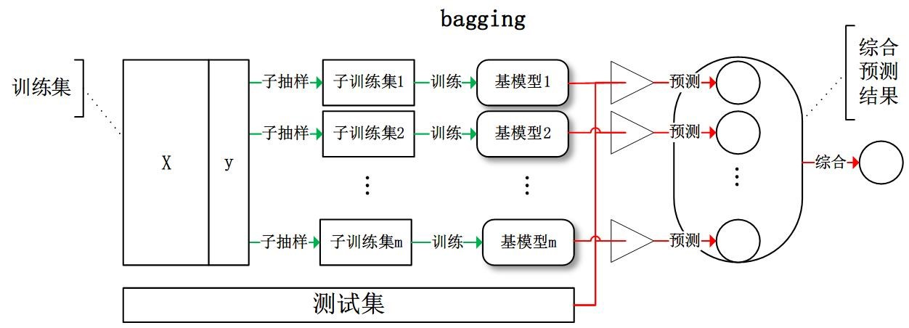
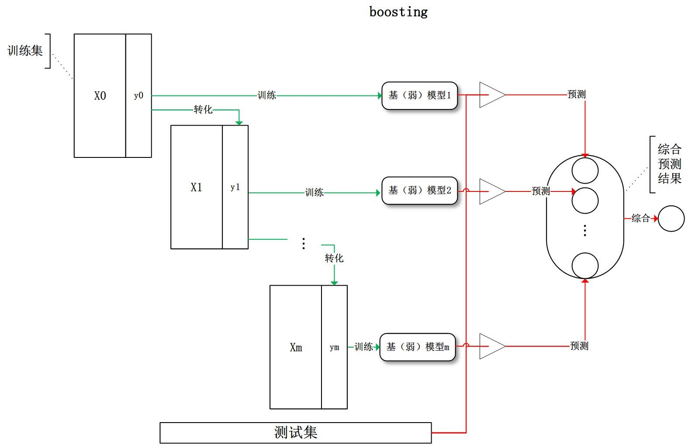
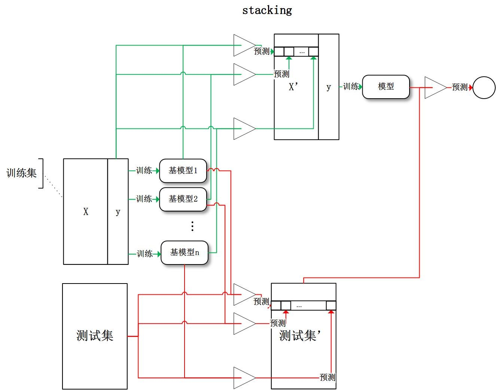

## 8.3 集成学习

>date: 2019-08-08


### 8.3.1 自助法(`Bootstrap`)

在统计学中，`Boostrap`可以指任何一种有放回的均匀抽样，也就是说，每当选中一个样本，它等可能地被再次选中并被再次添加到训练集中。

自助法能对采样估计的准确性（标准误差、置信区间和偏差）进行比较好的估计，它基本上能够对任何采样分布的统计量进行估计。

`Bootstrap`有两种形式：非参数`Bootstrap`和参数化的`Bootstrap`，但基本思想都是模拟。

* 非参数化`Bootstrap`

假设估计量为$\theta$，样本大小为$N$，从样本中有放回地再抽样$N$个样本，原来每一个样本被抽中的概率相同，均为$\frac{1}{N}$，得到的新样本称为`Bootstrap`样本。重复$B$次后得到$B$个`Bootstrap`样本集，每个样本集都有对应的估计量$\theta_b$，对于$B$个$\theta_b$，可以计算得到标准误差，置信区间，偏差等。

非参数化`Bootstrap`从原始样本中再抽样，得到的`Bootstrap`样本与原始样本有重合。

* 参数化`Bootstrap`

参数化的`Bootstrap`假设总体的分布已知或总体的分布形式已知，可以由样本估计出分布参数，再从参数化的分布中进行再采样得到`Bootstrap`样本。

集成学习的目的就是为了弥补单个模型某方面不稳定或表现较弱的情况而提出的。其基本方法就是组合这里的多个弱监督模型，最终形成一个更好更全面的模型。即使某一个弱分类器得到了错误的预测，其他的弱分类器也可以将错误纠正回来。

针对其多个模型组合的特点，其数据集的策略也有所变化，即：

* 数据集大：划分成多个小数据集，学习多个模型进行组合；

* 数据集小：利用`Bootstrap`方法进行抽样，得到多个数据集，分别训练多个模型再进行组合。

### 8.3.2 装袋法(`Bagging`)



`Bagging`对训练数据采用`Boostrap`抽样，其主要思想：

1. 从原始样本集中抽取训练集。样本集大小为$N$，从样本中有放回地再抽样$N$个样本。重复$B$次，得到$B$个训练集，每个训练集相互独立。

2. 每次使用一个训练集得到一个模型，$B$个训练集共得到$B$个模型，模型权重一致。

3. 对分类问题：将上步得到的$B$个模型采用投票的方式得到分类结果；对回归问题，计算上述模型的均值作为最后的结果。

#### 随机森林(`Random Forrest`)

随机森林使用了[$CART$决策树](./监督学习.md#基尼指数gini-index)作为弱分类器。在普通的决策树中，会从全部的$n$个特征中选择一个最优的特征作为决策树的左右子树，而随机森林则是随机选择一部分特征，从这一部分特征中选择最优特征来作为决策树的左右子树划分。其中这一部分特征的数目记为$n_{sub}$，$n_{sub} < n$。

这样做的方式有助于增强模型的泛化能力。$n_{sub}$越小，模型越健壮，拟合能力下降，方差减小，偏差变大。一般需要通过交叉验证调参来获取一个合适的$n_{sub}$的值。

随机森林步骤：

假设样本集为$D=\left\{\left(x, y_{1}\right),\left(x_{2}, y_{2}\right), \ldots\left(x_{m}, y_{m}\right)\right\}$，弱分类器迭代$T$次。

1. 对样本集进行第$t( t = 1, 2, ..., T)$次有放回的随机采样，共采集$m$次，得到第$t$次，包含$m$个样本的采样集$D_t$；

2. 用$D_t$训练第$t$个决策树模型$G_t(x)$，在训练决策树的节点时，从节点上所有的样本特征中随机选择一部分样本特征，再进一步在这部分特征中选择一个最优特征来进行决策树左右子树的划分。

3. 进行分类预测的情况下，$T$个弱分类器$G_t(x)$投票获取分类结果；回归预测的情况下，$T$个弱分类器$G_t(x)$得到的回归结果进行算术平均的值作为最终结果。

* 算法实现

```python
import numpy as np
import pandas as pd
from collections import Counter

def _calc_gini(data_set):
    '''
    计算基尼指数
    $gini = 1 - \sum_{k = 1}^{K} p_k^2$
    $k$为类别
    '''
    gini = 1
    labels = Counter(data_set[:, -1].tolist()) # 标签列
    for amount in labels.values():
        prob = amount / data_set.shape[0] # 类别 amount 的概率
        gini -= np.power(prob, 2)
    return gini

def _bootstrap(data_set):
    '''
    自助法进行采样
    '''
    m = data_set.shape[0]
    choosed_feature = np.random.choice(m, m, replace = True) # 可重复采样
    train_data = data_set[choosed_feature, :]
    return train_data

def _split(data_set, feature, value):
    '''
    分离数据集，只针对离散型数据集
    '''
    left = data_set[np.nonzero(data_set[:, feature] == value)[0], :]
    right = data_set[np.nonzero(data_set[:, feature] != value)[0], :]
    return left, right

def _choose_best_feature(data_set, max_features):
    '''
    基于基尼指数选取最优特征
    '''
    best_feature = -1
    best_value = 0
    min_gini = np.inf
    split_gini = 0
    n = data_set.shape[1] - 1

    rand_feature = np.random.choice(n, max_features, replace = False) # 随机选择特征，最多 max_features 个

    for feature in rand_feature:
        values = np.unique(data_set[:, feature]) # 获取该特征的唯一值列表
        for value in values:
            left, right = _split(data_set, feature, value) # 按照该特征进行划分
            split_gini = left.shape[0] / data_set.shape[0] * _calc_gini(left) + right.shape[0] / data_set.shape[0] * _calc_gini(right)
            if split_gini < min_gini:
                min_gini = split_gini
                best_feature = feature
                best_value = value

    return best_feature, best_value

def _create_tree(data_set, max_features):
    if data_set.shape[0] == 0:
        return
    if np.unique(data_set[:, -1]).shape[0] == 1:
        return data_set[0, -1]
    
    best_feature, best_value = _choose_best_feature(data_set, max_features)

    tree = {}
    tree['feature'] = best_feature
    tree['value'] = best_value
    left, right = _split(data_set, best_feature, best_value)
    tree['left'] = _create_tree(left, max_features)
    tree['right'] = _create_tree(right, max_features)
    return tree

def fit(data_set, n_estimators, max_features):
    data_set = np.array(data_set)
    rand_forests = []
    for i in range(n_estimators):
        train_data = _bootstrap(data_set)
        tree = _create_tree(train_data, max_features)
        rand_forests.append(tree)
    
    return rand_forests

def _predict_by_tree(tree, test_data):
    if not isinstance(tree, dict): 
        return tree
    feature = tree['feature']
    value = tree['value']
    if test_data[feature] == value:
        return _predict_by_tree(tree['left'], test_data)
    else: 
        return _predict_by_tree(tree['right'], test_data)

def predict(rand_forests, test_data):
    test_data = np.array(test_data)
    prediction = []
    for data in test_data:
        temp = []
        if isinstance(data, np.ndarray):
            for tree in rand_forests:
                temp.append(_predict_by_tree(tree, data))
            prediction.append(Counter(temp).most_common(1)[0][0])
        else:
            for tree in rand_forests:
                temp.append(_predict_by_tree(tree, test_data))
            prediction.append(Counter(temp).most_common(1)[0][0])
            break
    return prediction

if __name__ == "__main__":
    from sklearn.datasets import make_classification
    data, lables = make_classification(n_samples = 200, n_features = 100,n_classes = 2)
    data_set = np.concatenate((data, lables.reshape(200, 1)), axis=1)
    np.random.shuffle(data_set)

    train_data_set = data_set[:150, :]
    rand_forests = fit(train_data_set, n_estimators = 4, max_features = 20)
    prediction = predict(rand_forests, train_data_set[:, : -1])
    correct = [1 if a == b else 0 for a, b in zip(prediction, train_data_set[:, -1])]
    print(correct.count(1) / 150)
    
    test_data_set = data_set[150:, : -1]
    test_labels = data_set[150:, -1]
    
    prediction = predict(rand_forests, test_data_set)
    correct = [1 if a == b else 0 for a, b in zip(prediction, test_labels)]
    print(correct.count(1) / 50)

    from sklearn.ensemble import RandomForestClassifier

    rf = RandomForestClassifier(max_features = 20, n_estimators = 4) 
    rf.fit(train_data_set[:, :-1], train_data_set[:, -1])
    print(rf)

    prediction = rf.predict(train_data_set[:, :-1])
    correct = [1 if a == b else 0 for a, b in zip(prediction, train_data_set[:, -1])]
    print(correct.count(1) / 150)

    prediction = rf.predict(test_data_set)
    correct = [1 if a == b else 0 for a, b in zip(prediction, test_labels)]
    print(correct.count(1) / 50)
```

* 优点：

1. 具有极高的准确率；

2. 随机性的引入，使得随机森林不容易过拟合；

3. 随机性的引入，使得随机森林有很好的抗噪声能力；

4. 能处理很高维度的数据，并且不用做特征选择；

5. 既能处理离散型数据，也能处理连续型数据，数据集无需规范化；

6. 训练速度快，可以得到变量重要性排序；

7. 容易实现并行化。

* 缺点：

1. 当随机森林中的决策树个数很多时，训练时需要的空间和时间会较大；

2. 随机森林模型还有许多不好解释的地方，有点算个黑盒模型。

### 8.3.3 提升法(`Boosting`)



`Boosting`是一种与`Bagging`很类似的技术。`Boosting`的思路则是采用重赋权(`re-weighting`)法迭代地训练基分类器，主要思想：

1. 每一轮的训练数据样本赋予一个权重，并且每一轮样本的权重分布依赖上一轮的分类结果，即根据错误率不断调整样例的权值，错误率越大则权重越大。。

2. 每个弱分类器都有相应的权重，对于分类误差小的分类器会有更大的权重。基分类器之间采用序列式的线性加权方式进行组合。

#### `AdaBoost`

`Adaboost`是`Adaptive Boosting`的缩写，意指自适应增强。这是一种迭代算法，核心思想就是针对同一个训练集训练不同的弱分类器，然后这些弱分类器集合起来，构成一个更强的强分类器。

`Adaboost`的自适应指的是其能根据每次弱分类器的结果对数据样本进行调整，具体的就是对弱分类器分类错误的样本进行权值的提高，相反，分类正确进行权值的降低，使用加权后的全体样本进行下一个弱分类器的训练，知道错误率达到约定的大小，或者预先到达迭代次数。

其算法步骤如下：

1. 初始化训练样本权值分布，每个样本赋予相同的权值：

$$D_{1}=\left(w_{11}, w_{12} \cdots w_{1 i} \cdots, w_{1 N}\right), w_{1 i}=\frac{1}{N}, i=1,2, \cdots, N$$

2. 进行$M$轮迭代，使用权值分布为$D_m$的样本集来训练弱分类器$G_m(x)$：

$$G_{m}(x) : \quad \chi \rightarrow\{-1,+1\}$$

3. 计算$G_m(x)$在样本集的分类误差率：

$$e_{m}=P\left(G_{m}\left(x_{i}\right) \neq y_{i}\right)=\sum_{i=1}^{N} w_{m i} I\left(G_{m}\left(x_{i}\right) \neq y_{i}\right)$$

这个误差率$e_{m}$就是$G_m(x)$在样本集分类错误的样本的权值之和。

4. 计算$G_m(x)$的系数$a_m$，其表示$G_m(x)$在最终分类器的权重，即重要程度：

$$\alpha_{m}=\frac{1}{2} \ln \frac{1-e_{m}}{e_{m}}$$

当$e_{m} \leq \frac{1}{2}$时，$a_m \geq 0$，并且$a_m$随着$e_{m}$的减小而增大，意味着分类误差率越小的弱分类器的在最终的分类器的作用越大。

5. 更新样本数据的权重分布$D_{m+1}=\left(w_{m+1,1}, w_{m+1,2} \cdots w_{m+1, i} \cdots, w_{m+1, N}\right)$：

$$w_{m+1, i}=\frac{w_{m i}}{Z_{m}} e^{-\alpha_{m} y_{i} G_{m}\left(x_{i}\right)}, i=1,2, \cdots, N$$

其中$Z_{m}=\sum_{i=1}^{N} w_{m i} e^{-\alpha_{m} y_{i} G_{m}\left(x_{i}\right)}​$为规范化因子，能使$D_{m+1}​$变成一个概率分布。

6. 组合各个弱分类器，得到最终的分类器$G(x)​$：

$$G(x)=\operatorname{sign}\left(\sum_{m=1}^{M} \alpha_{m} G_{m}(x)\right)$$


### 8.3.4 `GBDT`

### 8.3.5 `XGBoost`

### 8.3.6 `Stacking`



`Stacking`先从初始样本集训练出初级学习器（个体学习器），然后第$j$个初级学习器对第$i$个初始样本集的预测值作为新样本集的第$i$个样本的第$j$个特征值。生成的新样本集（次级训练集）用于训练次级学习器（用于结合的学习器，也称元学习器`Meta Learner`）。

由于次级训练集是通过初级学习器产生的，若直接使用初级学习器的样本集来产生次级训练集，则过拟合风险会比较大，因此，一般是通过使用交叉验证的方式生成次级训练集。