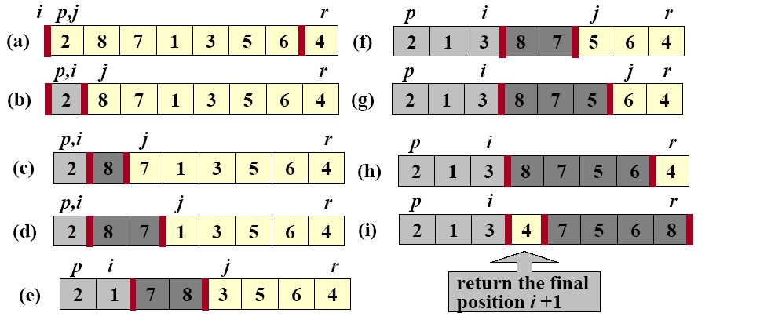
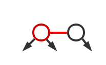
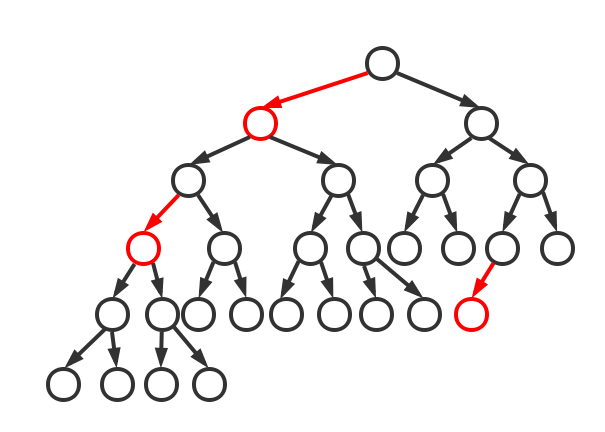
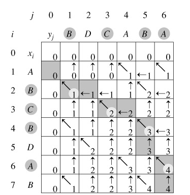
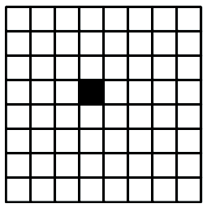
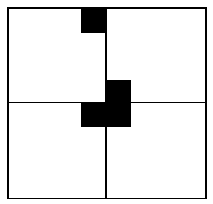

## 2.2 经典算法

>date: 2019-02-25


### 2.2.1 排序算法

##### 直接插入排序

直接插入排序的基本思想是：每次将待排序的记录，按照大小插入到已经排好序的子序列中适当的位置，直到全部记录插入完成为止。

```python
def insert_sort(relist):
    for i in range(len(relist)):
        for j in range(i): # j < i 
            if relist[j] > relist[i]: # 此时 relist[i] 前存在 relist[j] ，并且relist[j] > relist[i]
                relist.insert(j, relist[i]) # 在 j 位置插入 relist[i]
                relist.pop(i + 1) # 原来位置的 relist[i] 索引向后移动一位，所以是 i + 1
                break
    return relist

def insert_sort(relist):
    for i in range(len(relist)):
        for j in range(i):
            if relist[j] > relist[i]:
                relist[j], relist[i] = relist[i], relist[j] # 交换 relist[j] 和 relist[i] 位置
    return relist
```


**时间复杂度：** `O(N^2)`

假设被排序的数列中有`N`个数。遍历一趟的时间复杂度是`O(N)`，需要遍历多少次呢？`(N-1)！`因此，直接插入排序的时间复杂度是`O(N^2)`。

**稳定性：** 稳定

假设在数列中存在`a[i]=a[j]`，若在排序之前，`a[i]`在`a[j]`前面；并且排序之后，`a[i]`仍然在`a[j]`前面。则这个排序算法是稳定的。

##### 希尔排序

希尔排序的基本思想是：对于`n`个待排序的数列，取一个小于`n`的整数`gap`(`gap`被称为步长)将待排序元素分成若干个组子序列，所有距离为`gap`的倍数的记录放在同一个组中；然后，对各组内的元素进行**直接插入排序**。

这一趟排序完成之后，每一个组的元素都是有序的。然后减小`gap`的值，并重复执行上述的分组和排序。重复这样的操作，当`gap=1`时，整个数列就是有序的。

```python
def shell_sort(relist):
    gap = len(relist) // 2
    while gap >= 1:
        for i in range(gap, len(relist)): # 分组
            if relist[i] < relist[i - gap]:
                relist[i], relist[i - gap] = relist[i - gap], relist[i] # 进行直接插入排序
        gap //= 2
    return relist
```

**时间复杂度：** `O(N^(3/2)) ~ O(N^2)`

希尔排序的时间复杂度与增量(即，步长`gap`)的选取有关。例如，当增量为`1`时，希尔排序退化成了直接插入排序，此时的时间复杂度为`O(N^2)`，而`Hibbard`增量(`2^k - 1`)的希尔排序的时间复杂度为`O(N^(3/2))`。

**稳定性：** 不稳定

假设在数列中存在`a[i]=a[j]`，若在排序之前，`a[i]`在`a[j]`前面；并且排序之后，`a[i]`仍然在`a[j]`前面。则这个排序算法是稳定的。

##### 选择排序

选择排序的基本思想是：首先在未排序的数列中找到最小(或最大)元素，然后将其存放到数列的起始位置；接着，再从剩余未排序的元素中继续寻找最小(或最大)元素，然后放到已排序序列的末尾。以此类推，直到所有元素均排序完毕。

```python
def select_sort(relist):
    for i in range(len(relist)):
        tag = i
        for j in range(i + 1, len(relist)): # 分组，已经排序的组为relist[: i]，未排序的组为relist[i + 1:]
            if relist[j] < relist[tag]:
                tag = j
        if tag != i:
            relist[i], relist[tag] = relist[tag], relist[i] # 排序
    return relist
```

**时间复杂度：** `O(N^2)`

假设被排序的数列中有`N`个数。遍历一趟的时间复杂度是`O(N)`，需要遍历多少次呢？`(N-1)！`因此，选择排序的时间复杂度是`O(N^2)`。

**稳定性：** 稳定

假设在数列中存在`a[i]=a[j]`，若在排序之前，`a[i]`在`a[j]`前面；并且排序之后，`a[i]`仍然在`a[j]`前面。则这个排序算法是稳定的。

##### 堆排序

堆排序的基本思想是：将乱序数列构造成最大堆（最小堆），然后将堆顶元素——最大值（最小值）放到数列最后，重新构成无序区和有序区，对无序区进行堆排序后再进行上述操作，最后的数列是升序（降序）排序的。

```python
def heap_sort(relist): # 最大堆排序
    start = len(relist) // 2 - 1
    for i in range(start, -1, -1): # 从下向上遍历，循环结束得到最大堆
        max_heap_down(relist, i, len(relist) - 1)
    for i in range(len(relist) - 1, -1, -1): # 循环全部节点
        relist[0], relist[i] = relist[i], relist[0] # 不断将最大元素下沉到最后的位置，形成无序区relist[:i - 1], relist[i:]
        max_heap_down(relist, 0, i - 1) # 重新调整无序区最大堆
    return relist

def max_heap_down(relist, start, end):
    root = start
    while True:
        child = 2 * root + 1 # 左节点
        if child > end: # 左节点比最后一个节点大，跳出循环
            break
        if child + 1 <= end and relist[child] < relist[child + 1]:
            child += 1 # 找出左右节点中最大的
        if relist[child] > relist[root]:
            relist[child], relist[root] = relist[root], relist[child] # 交换子节点和父节点
            root = child # 再从子节点开始
        else:
            break
```

**时间复杂度：** `O(N*lgN)`

假设被排序的数列中有`N`个数。遍历一趟的时间复杂度是`O(N)`，需要遍历多少次呢？

堆排序是采用的二叉堆进行排序的，二叉堆就是一棵二叉树，它需要遍历的次数就是二叉树的深度，而根据完全二叉树的定义，它的深度至少是`lg(N+1)`。最多是多少呢？由于二叉堆是完全二叉树，因此，它的深度最多也不会超过`lg(2N)`。因此，遍历一趟的时间复杂度是`O(N)`，而遍历次数介于`lg(N+1)`和`lg(2N)`之间；因此得出它的时间复杂度是`O(N*lgN)`。

**稳定性：** 不稳定

它在交换数据的时候，是比较父结点和子节点之间的数据，所以，即便是存在两个数值相等的兄弟节点，它们的相对顺序在排序也可能发生变化，所以是不稳定的。

##### 冒泡排序

冒泡排序的基本思想是：遍历多次需要排序的数列，每次遍历，依次比较前后两数的大小，如果前者比后者大，就交换两者位置。重复直到排好序。

```python
def bubble_sort(relist):
    for i in range(len(relist) - 1, -1, -1): # 逆向遍历，生成无序区 relist[: i]
        for j in range(i):
            if relist[j] > relist[j + 1]: # 对无序区内的元素进行依次的前后比较，交换符合条件的元素
                relist[j], relist[j + 1] = relist[j + 1], relist[j]
    return relist

def bubble_sort(relist):
    for i in range(len(relist) - 1, -1, -1): # 逆向遍历，生成无序区 relist[: i]
        flag = 0 # 标记是否进行交换
        for j in range(i):
            if relist[j] > relist[j + 1]: # 对无序区内的元素进行依次的前后比较，交换符合条件的元素
                relist[j], relist[j + 1] = relist[j + 1], relist[j]
                flag = 1
        if flag == 0: # 若没发生交换，则说明该趟排序数列已有序
            break
    return relist
```

**时间复杂度：** `O(N^2)`

假设被排序的数列中有`N`个数。遍历一趟的时间复杂度是`O(N)`，需要遍历多少次呢？`(N-1)！`因此，冒泡排序的时间复杂度是`O(N^2)`。

**稳定性：** 稳定

假设在数列中存在`a[i]=a[j]`，若在排序之前，`a[i]`在`a[j]`前面；并且排序之后，`a[i]`仍然在`a[j]`前面，所以算法是稳定的。

##### 快速排序

快速排序的基本思想是：选择一个**基准数**，将数据分成前后两部分，然后前部分全部数据需要小于后部分全部数据。**递归**进行这个过程，将数列变成有序。

```python
def quick_sort(relist, left, right):
    if left > right:
        return
    low, high = left, right
    base_val = relist[low]
    while left < right:
        while left < right and relist[right] > base_val:
            right -= 1
        relist[left] = relist[right]
        while left < right and relist[left] <= base_val:
            left += 1
        relist[right] = relist[left]
    relist[right] = base_val
    quick_sort(relist, low, left - 1)
    quick_sort(relist, left + 1, high)

def quick_sort(A, p, r):
    if p < r:
        q = partition(A, p, r) # 得到新的基准值，递归进行前后两个子序列的quick_sort()
        quick_sort(A, p, q - 1)
        quick_sort(A, q + 1, r)
 
def partition(A, p, r):
    x = A[r] # 基准
    i = p - 1
    for j in range(p, r):
        if A[j] <= x: # 与基准比较
            i += 1
            A[i], A[j] = A[j], A[i] # 比基准小的数是向前移动
    A[i + 1], A[r] = A[r], A[i + 1] # 当前基准向前移动
    return i + 1
```



**时间复杂度：** 最坏情况是`O(N^2)`，平均情况是`O(N*lgN)`

快速排序是采用的分治法进行遍历的，我们将它看作一棵二叉树，它需要遍历的次数就是二叉树的深度。

根据完全二叉树的定义，它的深度至少是`lg(N+1)`。因此，快速排序的遍历次数最少是`lg(N+1)`次。

将快速排序看作一棵二叉树，它的深度最大是`N`。因此，快读排序的遍历次数最多是`N`次。

**稳定性：** 不稳定


##### 归并排序

归并排序的基本思想是：将数列平分成前后两个区间，对前后两个区间进行归并排序，得到前后排序好的区间后进行合并即可得到排序好的数列。

```python
def merge_sort(arr):
    if len(arr) <= 1:
        return arr
    mid = len(arr) // 2
    left_arr = merge_sort(arr[:mid])
    right_arr = merge_sort(arr[mid:])
    return merge(left_arr, right_arr)

def merge(left_arr, right_arr): # 合并前后序列
    i, j = 0, 0
    result = [] # 有序序列
    while i < len(left_arr) and j < len(right_arr): # 依次递归前后的序列
        if left_arr[i] <= right_arr[j]:
            result.append(left_arr[i])
            i += 1
        else:
            result.append(right_arr[j])
            j += 1
    result += left_arr[i:] # 将未整理的前序列加入
    result += right_arr[j:] # 将未整理的后序列加入
    return result
```

**时间复杂度：** `O(N*lgN)`

归并排序的形式就是一棵完全二叉树，它需要遍历的次数就是二叉树的深度，而根据完全二叉树的可以得出它的时间复杂度是`O(N*lgN)`

**稳定性：**稳定

##### 桶排序

桶排序的基本思想是：把数组`a`划分为`n`个大小相同子区间（桶），每个子区间各自排序，最后合并。桶排序要求数据的分布必须均匀，不然可能会失效。

```python
def bucket_sort(relist):
    buckets = [0] * (max(relist) - min(relist) + 1) # 根据序列中最大最小的元素生成 buckets 个桶
    for i in range(len(relist)):
        buckets[relist[i] - min(relist)] += 1 # 对应编号的桶存在序列中的数据的累加 1
    result = []
    for j in range(len(buckets)):
        if buckets[j] != 0:
            result.append(j + min(relist)) # 整理数据的结果
    return result
```

**时间复杂度：** `O(N)`

当要被排序的数组内的数值是均匀分配的时候，桶排序使用线性时间`O(N)`，但空间复杂度为`O(N+M)`，`M`为桶的数量

**稳定性：** 稳定

##### 基数排序

基数排序的基本思想是：将待排序数据拆分成多个关键字进行排序。

```python
import math
 
def radix_sort(relist, radix=10):
    K = int(math.ceil(math.log(max(relist), radix))) # 用K位数可表示任意整数
    for i in range(1, K + 1): # K 次循环，构造 1 ~ K 位的桶
        bucket = [[] for i in range(radix)] # 不能用 [[]]*radix
        for val in relist:
            bucket[int(val%(radix**i)/(radix**(i-1)))].append(val) # K 位元素加到第 K 个桶里
        del relist[:]
        for each in bucket:
            relist.extend(each) # 桶合并，[220, 221, 192, 12, 23], [12, 220, 221, 23, 192], [12, 23, 192, 220, 221]
```
**时间复杂度：** `O (Nlg(r)M)`

`M`为桶的数量，`r`为取的基数

**稳定性：** 稳定

### 2.2.2 查找算法

##### 顺序查找

顺序查找的基本思想是：从序列的一端开始，顺序遍历全部元素，并且月给定值进行比较，如果值相等即查找成功。

```python
def sequence_search(sequence, target):
    for i in range(len(sequence)):
        if sequence[i] == target:
            return i
```

**时间复杂度：**`O(N)`

##### 二分查找

二分查找的基本思想是：将序列中间元素与给定值做比较，相同则查找成功，不同情况下，将序列平均分成两个子序列，分别对这两个子序列重复上述过程，若直到序列长度为`0`还未找出，则查找失败。

```python
def binary_search(sequence, target):
    len_ = len(sequence)
    if len_ == 0:
        return -1
    mid = len_ // 2
    if sequence[mid] == target:
        return mid
    elif sequence[mid] > target:
        return binary_search(sequence[:mid], target)
    elif sequence[mid] < target:
        return binary_search(sequence[mid + 1:], target)
```

**时间复杂度：**`O(lgN)`

最坏的情况下，需要比较`lg(N + 1)`次。

##### 插值查找

插值查找的基本思想是：基于二分查找，在一个已排好序并且序列元素相对均匀分布的情况下，大致判断给定值处于序列的那个范围，来进行查找。在这个情况下，二分查找的 `mid = (low + high) / 2` 位置就变为`mid = low + (target - sequence[low]) / (sequence[high] - sequence[low]) * (high - low)`，这是一个比例关系。

```python
def insertion_search(sequence, target):
    len_ = len(sequence)
    low, high = 0, len_ - 1
    while low <= high:
        mid = int(low + (target - sequence[low]) / (sequence[high] - sequence[low]) * (high - low))
        if sequence[mid] == target:
            return mid
        elif sequence[mid] > target:
            high = mid - 1
        else:
            low = mid + 1
    return - 1
```

**时间复杂度：**`O(lg(lgN))`

查找成功或者失败的时间复杂度均为`O(lg(lgN))`。但对于长度较长、元素分布比较均匀的序列而言，插值查找算法的性能要好得多。

##### 斐波那契查找

斐波那切数列有一个特性，数列越往后，相邻的两个数的比值就越趋向于黄金比例值。

斐波那切查找的基本思想是：基于二分查找，利用斐波那切进行分割。在斐波那切中找一个略大于序列长度的数`fibonacci(n)`，然后将前部分分割`fibonacci(n - 1)`个元素，后部分分割`fibonacci(n - 2)`个元素，然后进行查找。

```python
def fibonacci(n):
    if n == 0:
        return 0
    elif n == 1:
        return 1
    elif n < 0:
        raise "Wrong number."
    else:
        return fibonacci(n - 1) + fibonacci(n - 2)

def fibonacci_search(sequence, target):
    len_ = len(sequence)
    i = 0
    while fibonacci(i) - 1 < len_:
        i += 1
    fibonacci_len = i
    low, high = 0, len_ - 1
    while low < high:
        mid = fibonacci(fibonacci_len - 1) - 1 + low
        if sequence[mid] == target:
            return mid
        elif sequence[mid] > target:
            high = mid - 1
            fibonacci_len -= 1
        else:
            low = mid + 1
            fibonacci_len -= 2
    return -1
```

**时间复杂度：**`O(lg2N)`

##### 二叉树查找

二叉树查找的基本思想是：对序列按照左节点小于右节点生成数，然后将给定值与父节点比较大小，寻找适合的范围。

```python3
class TreeNode(object):
    def __init__(self, data, left = None, right = None):
        self.data = data
        self.left = left
        self.right = right
    

class BinarySearchTree(object):
    def __init__(self):
        self.root = None
    
    def search(self, target):
        temp = self.root
        while temp:
            if target > temp.data:
                temp = temp.right
            elif target < temp.data:
                temp = temp.left
            else:
                return temp.data
        return None

    def insert(self, data):
        temp = self.root
        if not temp:
            self.root = TreeNode(data)
            return
        while True:
            if data > temp.data:
                if temp.right is None:
                    temp.right = TreeNode(data)
                    return
                temp = temp.right
            elif data < temp.data:
                if temp.left is None:
                    temp.left = TreeNode(data)
                    return
                temp = temp.left
            else:
                temp.data = data
```

**时间复杂度：**`O(lgN)`，最坏情况下时间复杂度为`O(N)`

##### `2-3 Tree`查找

`2-3 Tree`是一种阶为`3`的`B Tree`，其最大的特点是：一定是一颗完全`3`叉树，除了叶子节点外，其它节点没有空儿子。


`2-3 Tree`查找的基本思想是：因为`2-3 Tree`具有和二叉查找树一样的有序性，所以查找操作与二叉查找树类似。在`2`节点中，左儿子比父节点小，右儿子比父节点大；在`3`节点中，父节点中，左父小于右父，左子节点小于左父，右节点大于右父。

```python
class TreeNode(object):
    def __init__(self, key):
        self.key1 = key
        self.key2 = None
        self.left = None
        self.middle = None
        self.right = None
    
    def is_leaf(self):
        return self.left is None and self.middle is None and self.right is None
    
    def is_full(self):
        return self.key2 is not None
    
    def has_key(self, key):
        if (self.key1 == key) or (self.key2 is not None and self.key2 == key):
            return True
        else:
            return False
    
    def get_child(self, key):
        if key < self.key1:
            return self.key1
        elif self.key2 is None:
            return self.middle
        elif key < self.key2:
            return self.middle
        else:
            return self.right

class 2_3SearchTree(object):
    def __init__(self):
        self.root = None
    
    def _split_node(self, node, key, p_ref):
        new_node = TreeNode(None)
        if key < node.key1:
            p_key = node.key1
            node.key1 = key
            new_node.key1 = node.key2
            if p_ref is not None:
                new_node.left = node.middle
                new_node.middle = node.right
                node.middle = p_ref
        elif key < node.key2:
            p_key = key
            new_node.key1 = node.key2
            if p_ref is not None:
                new_node.left = p_ref
                new_node.middle = node.right
        else:
            p_key = node.key2
            new_node.key1 = key
            if p_ref is not None:
                new_node.left = node.right
                new_node.middle = p_ref
        node.key2 = None
        return p_key, new_node

    def _add_to_node(self, node, key, p_ref):
        if node.is_full():
            return self._split_node(node, key, p_ref)
        else:
            if key < node.key1:
                node.key2 = node.key1
                node.key1 = key
                if p_ref is not None:
                    node.right = node.middle
                    node.middle = p_ref
            else:
                node.key2 = key
                if p_ref is not None:
                    node.right = p_ref
            return None, None

    def _get(self, node, key):
        if node is None:
            return None
        elif node.has_key(key):
            return node
        else:
            child = node.get_child(child, key)
            return self._get(child, key)
    
    def get(self, key):
        if self.root is None:
            return None
        else:
            return self._get(self.root, key)
    
    def _put(self, node, key):
        if node.has_key(key):
            return None, None
        elif node.is_leaf():
            return sel

    def put(self, key):
        if self.root is None:
            self.root = TreeNode(None)
        else:
            p_key, p_ref = self._put(self.root, key)
            if p_key is not None:
                new_node = TreeNode(p_key)
                new_node.left = self.root
                new_node.middle = p_ref
                self.root = new_node
```

上面的`TreeNode()`是`2-3 Tree`节点的定义，`2_3SearchTree()`是`2-3 Tree`的定义过程，通过`TreeNode().has_key()`来判断给定值的位置，通过`TreeNode().get_child()`来遍历子节点。

`2_3SearchTree().get()`就是通过上面的两个基本函数实现的查找。

**时间复杂度：**`O(lgN)`

因为`2-3 Tree`的完美平衡性质，所有查找操作均可以在`O(lgN)`的时间复杂度下完成。

##### 红黑树

红黑树是一种平衡二叉树，它的节点特点是：左儿子比父节点小，右儿子比父节点大。但它是从`2-3 Tree`的基础上发展过来的，之所以叫红黑树，是因为它将`2-3 Tree`的`3`节点表示为下图的红色链接。此时节点就与`2-3 Tree`的`3`节点极其类似。



一颗典型的红黑树：



从某种意义上说，红黑树与`2-3 Tree`等同，所以对红黑树作出以下规定：

1) 红黑树是二叉搜索树。

2) 根节点必须为黑色。

3) 红子树必须在左侧。

4) 不允许两个连续的红子树。

5) 每一条子树上的黑色节点数量必须相等。原因非常简单，一个黑色节点就对应着`2-3 Tree`中的一个`2`节点或`3`节点，而`2-3 Tree`是完美平衡的。

6) 空节点（`NULL/None`）为黑色。


```python

```

**时间复杂度：**`O(lgN)`

由于红黑树是二叉搜索树，因此查询操作就是二叉搜索树的查询操作。时间复杂度为`O(lgN)`。

##### `B tree`

`B tree`可以看做是`2-3 Tree`的扩展，即它允许每个节点有`M - 1`个子节点（`M`为阶数）。

它有如下的性质：

1) 根节点至少有两个子节点；

2) 每个节点有`M-1`个key，并且以升序排列；

3) 位于`M-1`和`M key`的子节点的值位于`M-1`和`M key`对应的`Value`之间；

4) 其它节点至少有`M/2`个子节点；

5) 所有叶子结点位于同一层。


`B tree`查找的基本思想是：从根结点开始，对结点内的关键字（有序）序列进行二分查找，如果命中则结束，否则进入查询关键字所属范围的儿子结点；重复，直到所对应的儿子指针为空，或已经是叶子结点。

##### `B+ tree`

`B+ tree`是`B tree`的变体，也是一种多路搜索树。

其定义基本与`B tree`相同，除了：

1) 非叶子结点的子树指针与关键字个数相同，非叶子结点的子树指针`P[i]`，指向关键字值属于`[K[i], K[i+1])`的子树；

2) 树的所有叶子结点构成一个有序链表，可以按照关键码排序的次序遍历全部记录；

3) 非叶子结点仅具有索引作用，跟记录有关的信息均存放在叶子结点中。所有关键字都在叶子结点出现。


`B+ tree`查找的基本思想是：与`B tree`基本相同，区别是`B+ tree`只有达到叶子结点才命中（`B tree`可以在非叶子结点命中），其性能也等价于在关键字全集做一次二分查找。

##### 分块查找

分块查找又称索引顺序查找，它是顺序查找的一种改进方法。它将`n`个数据元素"按块有序"划分为`m`块（`m ≤ n`）。每一块中的结点不必有序，但块与块之间必须"按块有序"；即第`n-1`块中任一元素的关键字都必须小于第`n`块中任一元素的关键字。

分块查找的基本思想是：先选取各块中的最大关键字构成一个索引表；然后先对索引表进行二分查找或顺序查找，以确定待查记录在哪一块中；最后在已确定的块中用顺序法进行查找。

##### 哈希查找

哈希表是根据键而直接访问在内存存储位置的数据结构。

哈希查找的基本思想是：设计一个哈希函数，即通过某种转换关系，将关键字分散到指定大小的顺序结构中，其键即索引值，通过键来找到索引值。

```python
class HashTable(object):
    def __init__(self, size):
        self.table = [None for i in range(size)]
        self.count = size
    
    def hash(self, key):
        return key % self.count # 使用除留取余法
    
    def insert_table(self, key):
        address = self.hash(key)
        while self.table[address]: # 冲突时，使用线性探测下一地址是否可用
            address = self.hash(address + 1)
        self.table[address] = key
    
    def search_table(self, key):
        start = address = self.hash(key)
        while self.table[address] != key:
            address = self.hash(address + 1)
            if not self.table[address] or address == start:
                return False
        return True
```

**时间复杂度：**`O(1)`

这是对于无冲突的Hash表而言的。但它是一种**空间换时间**的算法，关键字在顺序结构中分布越分散，其空间复杂度越高。

#### 树、图遍历

#### 深度优先搜索 DFS

#### 广度优先搜索 BFS

#### 剪枝 最优化剪枝和可行性剪枝

#### A*算法

#### 蒙特卡洛树搜索

#### 记忆化搜索

### 2.2.3 递归算法

##### [二分查找](#二分查找)

##### 辗转相除法

辗转相除法又叫做欧几里德算法，是求最大公约数的算法。辗转相除法是基于如下原理实现的：两个整数的最大公约数等于其中较小的数和这两个整数差的最大公约数。

例如：

求`252`和`105`的最大公约数`m`，辗转相除法这样进行：

1) `252 - 105 = 147`，`147`和`105`的最大公约数等于`m`；

2) `147 - 105 = 42`，`105`和`42`的最大公约数等于`m`；

3) `105 - 42 = 63`，`63`和`42`的最大公约数等于`m`；

4) `63 - 42 = 21`，`42`和`21`的最大公约数等于`m`；

5) `42 - 21 = 21`，`21`和`21`的最大公约数等于`m`；

6) `21 - 21 = 0`，所以最大公约数等于`21`；

```python
def euclidean_gcd(x, y):
    if y == 0:
        return x
    else:
        return euclidean_gcd(max(x - y, y), min(x - y, y))
```

##### 阶乘

阶乘：`n!=1×2×3×...×n` 或者 `0!=1，n!=(n-1)!×n`。

```python
def factorial(n):
    if n == 0:
        return 1
    return factorial(n - 1) * n
```

##### 汉诺塔问题

汉诺塔问题是：

有三根杆子`A`，`B`，`C`。`A`杆上有 `N` 个 (`N>1`) 穿孔圆盘，盘的尺寸由下到上依次变小。要求按下列规则将所有圆盘移至 `C` 杆：

1) 每次只能移动一个圆盘；

2) 大盘不能叠在小盘上面。

它的解法的基本思想就是递归，在其问题规模`N = 3`的时候，会有如下图的移动，基于这个来设计其递归式。


假设在`A`杆上从上至下有`1`，`2`，`3`三个盘子，则将其移到`C`杆的过程如下：

1) `A --> C`；

2) `A --> B`；

3) `C --> B`；

4) `A --> C`；

5) 此时规模变为`2`，`B`杆可以看做是`A`杆，则`A`杆可以看做是`B`杆，`B --> A`；

6) `B --> C`；

7) `A --> C`。

可以看出其递归式是：`hanoi(n, A, B, C) = hanoi(n - 1, A, C, B) + hanoi(1, A, B, C) + hanoi(n - 1, B, A, C)`

```python
def hanoi(n, A, B, C):
    if n == 1:
        print(A, ' --> ', C)
    else:
        # 考虑规模为2的hanoi问题，其移动是：A --> B，A --> C，B --> C
        hanoi(n - 1, A, C, B)
        hanoi(1, A, B, C)
        hanoi(n - 1, B, A, C)
```

### 2.2.4 穷举法

##### 泊松分酒

有三个酒杯中，容量分别`12`升，`8`升，`5`升。其中`12`升装满油，另外两个空着。要求使用`3`个容器进行操作，使得最后某个容器中正好有`6`升油。

在进行穷举时候，为了避免做无用功导致死循环，所以需要指定倒酒的策略，即：

大杯往中杯倒酒，中杯往小杯倒酒，小杯往大杯倒酒。

```python
A, B, C = 12, 8, 5

# 指定倒酒策略 A --> B --> C --> A，防止重复倒酒，做无用功，出现死循环
def pour_wine_exhaustion(a, b, c):
    print(a, b, c)

    if a == 6 or b == 6 or c == 6:
        print('true', a, b, c)
        return
   
    if b != 0 and c != C: # 判断 B, C杯的容量状态 B --> C
        if b + c < C: # B杯全部倒到C杯都未倒满C杯
            pour_wine_exhaustion(a, 0, b + c)
        else: # 倒满C杯，B杯还有剩余
            pour_wine_exhaustion(a, b - (C - c), C)
    elif c == C: # C杯已经满了，C杯往A杯倒酒 C --> A
        if c + b < A: # C杯全部倒到A杯未倒满A杯
            pour_wine_exhaustion(a + c, b, 0)
        else: # C杯全部倒满A杯，还有剩余
            pour_wine_exhaustion(A, b, c - (A - a))
    elif b == 0: # B杯实际酒量为0 A --> B
        if a > b: # A杯到满B杯还有剩余
            pour_wine_exhaustion(a - B, B, c)
        else: # A杯刚好倒完
            pour_wine_exhaustion(0, a, c)
```

### 2.2.5 贪心法

贪心算法是在解决问题时候，做出当前看起来最好的选择，而不是从整体最优上加以考虑，在某种意义上得到的算法解释局部最优解。

##### 背包问题

给定`n`个物品和一个容量为`C`的背包，物品`i`的数量无限，它的重量为`W_i`，价值为`V_i`，如何使得加入背包里的物品的总价值最大？

这是一个组合优化的`NP`问题，设计的思路很简单，就是尽可能多的单位重量价值高的物品放入背包。

```python
class good_(object):
    def __init__(self, index, weight, value):
        self.index = index
        self.weight = weight
        self.value = value

def knapsack_problem(capacity, goods_list):
    goods_list.sort(key = lambda good: good.value / good.weight, reverse = True)

    result = []
    for good in goods_list:
        if capacity < good.weight:
            break
        else:
            result.append(good)
            capacity -= good.weight
    
    if len(result) < len(goods_list) and capacity != 0:
        result.append(good_(good.index, capacity, good.value * capacity / good.weight))
    return result
```

##### 普里姆算法

### 2.2.6 动态规划

##### `0-1`背包问题

`0-1`背包问题是在背包问题基础上有所不同，即每件物品只有一件，并且要么拿走要么留下。

在选择是否将一件物品加入背包中的时候，就会有其它一件物品要与不要放进背包的子问题，这就会形成许多重叠的子问题，满足动态规划的特征。

给定$n$个物品和一个容量为$C$的背包，物品$i$的重量为$w_i$，价值为$v_i$。

其子问题为$V(i, W)$，其中$1 \leq i \leq n, 1 \leq W \leq C$。

$$ V[i, W] = \begin{cases} 0, & \text{if } i = 0 \text{ or } W = 0 \\ V[i - 1, W], & \text{if }w_i > W\\ max\{v_i + V[i - 1, W - w_i], V[i - 1, W]) & \text{if } i> 0 \text{ and } W \geq w_i \end{cases} $$

```python
class good_(object):
    def __init__(self, weight, value):
        self.weight = weight
        self.value = value
    
    def __repr__(self):
        return '[weight:{}, value:{}]'.format(self.weight, self.value)

def knapsack_problem_0_1(capacity, goods_list): # 递归实现 O(2^n) 指数级别
    if len(goods_list) == 0 or capacity == 0:
        return 0
    goods_list.reverse()
    for good in goods_list:
        if good.weight > capacity:
            return knapsack_problem_0_1(capacity, goods_list[1:])
        else:
            return max(good.value + knapsack_problem_0_1(capacity - good.weight, goods_list[1:]), knapsack_problem_0_1(capacity, goods_list[1:]))

def knapsack_problem_0_1(capacity, goods_list): # O(n) 线性级别
    K = [[0 for w in range(capacity + 1)] for g in range(len(goods_list) + 1)] # 不同容量下的价值列表
    for g in range(len(goods_list) + 1):
        for w in range(capacity + 1):
            if g == 0 or w == 0: # 无物品或无容量
                K[g][w] = 0
            elif goods_list[g - 1].weight <= w: # 当前容量装得下，选择 前g - 1件对应的总价值 和 当前新加物品价值 + 前一状态的价值中最大的
                K[g][w] = max(K[g - 1][w], goods_list[g - 1].value + K[g - 1][w - goods_list[g - 1].weight])
            else: # 当前容量装不下，考虑前g - 1件对应的总价值，置换到当前K[g][w]下
                K[g][w] = K[g - 1][w]
    return K[len(goods_list)][capacity]
```

通过上面的公式，可以选择使用递归实现，其状态转移方程就是上面的公式。当时使用递归实现的时候，其时间复杂度达到了指数级别$O(2^N)$。

相较于递归，动态规划的做法是：对每一件物品遍历背包容量，当背包可容纳值大于等于当前物品，与之前已放进去的物品所得价值进行对比，考虑是否需要置换。其记录了上一状态，所以只需$O(N)$的时间复杂度。

##### 最长公共子序列

给定两个字符串，按顺序查找两个子序列，找出他们两者中顺序相同的最长子序列。

子序列不需要在原序列中占用连续的位置，公共子序列即指两个字符串中按顺序的查找的系统字符组合成的字符串序列。

记两个序列分别为$X, Y$，则二维数组$f[i][j]$代表$X$的$i$和$Y$的$j$为之前的最长公共子序列的长度。

其中$LCS(i, j) = 1$代表$X$的$i$为和$Y$的$j$为相同；反之，代表$X$的$i$为和$Y$的$j$为不同。

所以有：

$$f[i][j] = \begin{cases} 0, & i = 0 \text{ or} j = 0 \\ f[i - 1][j - 1] + 1, & i, j > 0 \text{ and} X[i] = Y[j] \\ \max\{ f[i - 1][j], f[i][j - 1]\}, & i, j > 0 \text{ and} X[i] \neq Y[j]  \end{cases}$$

上面的公式中：

1) $f[i - 1][j - 1] + LCS(i, j)$说明$X$的$i$为和$Y$的$j$位相同；

2) $f[i - 1][j]$说明$X$的$i - 1$为和$Y$的$j$位相同；

3) $f[i][j - 1]$说明$X$的$i$为和$Y$的$j - 1$位相同。

```python
def longest_common_sequence(X, Y):
    f = [[0 for j in range(len(X) + 1)] for i in range(len(Y) + 1)]
    for i in range(len(Y) + 1):
        for j in range(len(X) + 1):
            if i == 0 or j == 0:
                f[i][j] = 0
            elif Y[i - 1] == X[j - 1]: # 说明X的i为和Y的j相同
                f[i][j] = f[i - 1][j - 1] + 1
            else: # 选择上一个位置中最大的
                f[i][j] = max(f[i - 1][j], f[i][j - 1])
    return f[-1][-1]
```



##### 最长公共子串

与上述子序列问题不同的是，字符串不仅需要按顺序，同时字符排序也需要是连续的。

给定两个字符串，求它们的最长公共子串的长度。

$$f[i][j] = \begin{cases} 0, & i = 0 \text{ or} j = 0 \\ f[i - 1][j - 1] + 1, & i, j > 0 \text{ and} X[i] = Y[j] \\ 0, & i, j > 0 \text{ and} X[i] \neq Y[j]  \end{cases}$$

```python
def longest_common_substring(X, Y):
    f = [[0 for j in range(len(X) + 1)] for i in range(len(Y) + 1)]
    high, low = 0, 0
    for i in range(len(Y) + 1):
        for j in range(len(X) + 1):
            if i == 0 or j == 0:
                f[i][j] = 0
            elif Y[i - 1] == X[j - 1]:
                f[i][j] = f[i - 1][j - 1] + 1
                if f[i][j] > high:
                    high = i
                    low = i - f[i][j]
            else:
                f[i][j] = 0
    for i in range(len(Y) + 1):
        print(f[i])
    return high - low, Y[low:high]
```

##### 爬楼梯

有n层的台阶，一开始你站在第0层，每次可以爬两层或者一层。请问爬到第n层有多少种不同的方法？

```python
def climbStairs(n):
    way = [0, 1, 2]
    for i in range(3, n + 1):
        way.append(way[i - 2] + way[i - 1])
    return way[n]
```

### 2.2.7 分治法

#### 循环赛日程表

设有$n = 2^k$个运动员要进行循环比赛，需要满足一下日程：

1) 每个选手必须与其它$n - 1$个选手各赛一次；

2) 每个选手只能赛一次；

3) 循环赛一共需要进行$n - 1$天。

根据分治法的思想，递归地将问题一分为二，知道只剩下两个人比赛，最后将这些问题合并起来，就能得到最后的日程表。

```python
def round_robin_tournament(k):
    n = 2**k
    scheduler = []
    for i in range(n):
        daily = []
        for j in range(n):
            daily.append(1)
        scheduler.append(daily)
    for i in range(k):
        half = 2**i
        for daily in range(half):
            for tournament in range(half):
                scheduler[daily + half][tournament] = scheduler[daily][tournament] + half # 左下角的子表中项为左上角子表对应项加 2**i

                scheduler[daily][tournament + half] = scheduler[daily + half][tournament] # 右上角的子表等于左下角子表

                scheduler[daily + half][tournament + half] = scheduler[daily][tournament] # 右下角的子表等于左上角的子表

    return scheduler
```

思考只用两个人的比赛，其日程安排最简单为：

```
[1, 2]
[2, 1]
```

当前的左上角为 `1`，右下角等于左上角，同理，右上角等于左下角。

当有四个人时候，其日程安排为：

```
[1, 2, 3, 4]
[2, 1, 4, 3]
[3, 4, 1, 2]
[4, 3, 2, 1]
```

当前的左上角为：

```
[1, 2]
[2, 1]
```

右下角等于左上角，同理，右上角等于左下角。

#### 棋盘覆盖

棋盘覆盖问题是使用下面的四种形态的`L`形骨牌对棋盘进行覆盖，任意的骨片之间不能重叠覆盖。


这是一个$2^k \times 2^k$方格组成的骨牌，棋盘中间存在一个特殊方格。



基于分治法的思想对棋牌进行覆盖：

1) 将棋盘等分为左上、左下、右上、右下四个子棋盘；

2) 如果子棋盘中存在特殊方格，就将按1)将其分为四个子棋盘；

3) 如果子棋盘中不存在特殊方格，如下图，就在棋盘中央方式一块`L`形骨牌，再按1)将其分为四个子棋盘；



4) 直到棋盘简化为$1 \times 1$的棋盘。

```python
import random
def mutilated_chessboard(n, top_x, top_y, mark_x, mark_y):
    if n == 1:
        return
    half = n // 2
    if mark_x < (half + top_x) and mark_y < (half + top_y): # 特殊格子在左上角
        mutilated_chessboard(half, top_x, top_y, mark_x, mark_y)
    else: # 在右下角放置骨牌
        chessboard[top_x + half - 1][top_y + half - 1] = 2
        mutilated_chessboard(half, top_x, top_y, top_x + half - 1, top_y + half - 1)

    if mark_x < (half + top_x) and mark_y >= (half + top_y): # 特殊各自在右上角
        mutilated_chessboard(half, top_x, top_y + half, mark_x, mark_y)
    else: # 在左下角放置骨牌
        chessboard[top_x + half - 1][top_y + half] = 2
        mutilated_chessboard(half, top_x, top_y + half, top_x + half - 1, top_y + half)
    
    if mark_x >= (half + top_x) and mark_y < (half + top_y): # 特殊格子在左下角
        mutilated_chessboard(half, top_x + half, top_y, mark_x, mark_y)
    else: # 在右上角放置骨牌
        chessboard[top_x + half][top_y + half - 1] = 2
        mutilated_chessboard(half, top_x + half, top_y, top_x + half, top_y + half - 1)

    if mark_x >= (half + top_x) and mark_y >= (half + top_y): # 特殊格子在右下角
        mutilated_chessboard(half, top_x + half, top_y + half, mark_x, mark_y)
    else: # 在左上角放置骨牌
        chessboard[top_x + half][top_y + half] = 2
        mutilated_chessboard(half, top_x + half, top_y + half, top_x + half, top_y + half)

if __name__ == "__main__":
    k = 2
    n = 2**k
    mark_x = random.randint(0, n - 1)
    mark_y = random.randint(0, n - 1)
    print(mark_x, mark_y)
    chessboard = []
    for i in range(n):
        row = []
        for j in range(n):
            if i == mark_x and j == mark_y:
                row.append(1)
            else:
                row.append(0)
        chessboard.append(row)

    mutilated_chessboard(n, 0, 0, mark_x, mark_y)
    for row in chessboard:
        print(row)
```

### 2.2.8 回溯法

#### 八皇后

在$ 8 \times 8 $格的国际象棋上摆放八个皇后，使其不能互相攻击，即任意两个皇后都不能处于同一行、同一列或同一斜线上，问有多少种摆法。

使用回溯法解决该问题的思路如下：

1) 初始棋盘，遍历棋盘的棋格，；

2) 检查当前格是否满足同一行、同一列或同一斜线上无其它皇后，满足则进行3)，不满足则进行4)；

3) 当前位置放置一个皇后，如果是最后一行则输出棋盘，否则进行下一次遍历；

4) 当前列不为最后一列，则当前列设为下一列，返回2)，当前列为最后一列，进行回溯，设定当前行为上一行，当前列设为上一行中尚未经过的下一列，返回2)。

```python
'''
经典算法：八皇后问题
'''
def verify(row, col): # 验证
    for i in range(row): # 当前列上方元素验证
        if chessboard[i][col] == 1:
            return False
    for i, j in zip(range(row, -1, -1), range(col, -1, -1)): # 左上方元素验证
        if chessboard[i][j] == 1:
            return False
    for i, j in zip(range(row, -1, -1), range(col, n, 1)): # 右上方元素验证
        if chessboard[i][j] == 1:
            return False
    return True

def eight_queens_puzzle(row = 0):
    if row == n:
        return True
    else:
        for col in range(n):
            if verify(row, col):
                chessboard[row][col] = 1
                if eight_queens_puzzle(row = row + 1):
                    return True
                else: # 进行回溯
                    chessboard[row][col] = 0

if __name__ == "__main__":
    n = 8
    chessboard = []
    for i in range(n):
        row = []
        for j in range(n):
            row.append(0)
        chessboard.append(row)

    eight_queens_puzzle(0)
    for row in chessboard:
        print(row)
```

### 2.2.9 数学

#### 位运算

* 是否为偶数

```python
num % 2 != 0 # 常规解法
num & 1 == 0 # 位运算解法，二进制中，偶数最后一位为0
```

* 判断数是否是`2`的整数次幂

`2`的整数次幂的数，其二进制上只有一位为1，其余全部为`0`。

```python
num & (num - 1) == 0
```

这个的原理在于，`2`的整数次幂的数减去`1`后，其二进制之前位置为`1`的数变成0，后面位上的数全部变为`1`。与原数相与得到`0`。

* 计算一个整数二进制上`1`的个数

重复进行右移运算后与`1`，计算每次循环对`1`的计数。

如果是负数，右移操作就在二进制补码左边补`1`。

```python
result = 0
num = 1
while num != 0:
    result += num & 1
    num = num >> 1 # 此处未实现无符号的右移
```

每次与比自己小`1`的数进行与运算，该数最后一位的`1`都会被抹去。

由此有：

```python
result = 0
num = 7
while num !=0:  # 此处未实现无符号整数的计算
    num = num & (num - 1)
    result += 1
```

* 在其它数都出现两次的数组中找到只出现一次的一个数

任何整数 `n` 与 `0` 异或总等于其本身；多个数异或操作，遵循交换律和结合律。

```python
l = [1, 2, 3, 2, 3, 4, 4]
result = 0
for i in l:
    result = result ^ i
```

* 在其它数都出现两次的数组中找到只出现一次的两个数

不相同的两个数异或的二进制上肯定有一位为`1`。

根据上面的思想，可以最终得到需要寻找的最终的两个数的异或值`result`，而这个值上肯定有一位为`1`。

将该位上为`1`，其余位为`0`的数`flag_num`再次异或数组的每个数，就能得到其中一个目标数。

```python
l = [1, 2, 3, 2, 3, 4, 4, 5]
result = 0
for i in l:
    result = result ^ i

target_1 = 0
flag_num = result & (~result + 1) # 与补码相与得到
for i in l:
    if (flag_num & i) != 0:
        target_1 = target_1 ^ i
target_2 = target_1 ^ result
```

#### 质数（素数）

对正整数$n$，如果用$2$到$\sqrt{n}$之间的所有整数去除，均无法整除，则$n$为质数。

```python
from math import sqrt
def is_prime（n）:
    if n == 1:
        return False
    for i in range(2, int(sqrt(n)+1)):
        if n % i == 0:
            return False
    return True
```

#### 常见加密算法

* 对称加密算法

指加密和解密使用相同密钥的加密算法。

`DES`、3DES、`AES`等等

* 非对称加密算法

指加密和解密使用不同密钥的加密算法，也称为公私钥加密。

`RSA`、`ECC`、`DSA`等等

* 散列算法

是一种从任何一种数据中创建小的数字指纹的方法。

`SHA`、`MD5`等等

### 2.2.10 图论

最小生成树

单源最短路径

Dijkstra算法

### 2.2.11 其它

约瑟夫杀人法

斐波拉切数列

布隆算法

`KMP`算法

