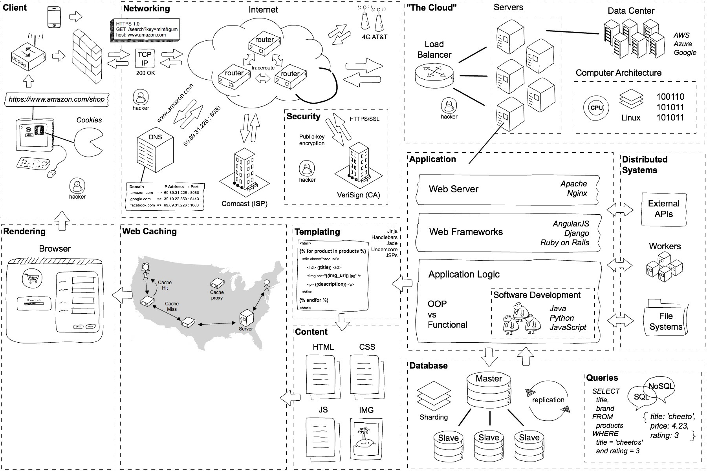

## 3.1 从输入URL到打开网页

>date: 2019-02-02

### 3.1.1 当你在浏览器中输入google.com并且按下回车之后发生了什么？

[答案](https://github.com/skyline75489/what-happens-when-zh_CN)

### 3.1.2 复习一遍计算机网络

##### 1) 识别URL

完整的`URL`是由协议：`http`，`ftp`、域名：http://www.google.com、文件路径：/htm_data/20/1510/1441477.html和
端口：`80`，四个部分组成的。

##### 2) DNS查询

(1) 检查本地`hosts`文件是否有`URL`与`IP`地址的映射，如果有返回`IP`，解析完成;

(2) 如果本地`hosts`文件没有，则查找本地`DNS`解析器缓存是否有这个`URL`的映射，如果有返回`IP`，解析完成;

(3) 如果没有，则查找填写或分配的首选`DNS`服务器，称为本地`DNS`服务器。

服务器接收到查询时，如果要查询的域名包含在本地配置区域资源中，返回解析结果，查询结束，此解析具有权威性；

如果要查询的域名不由本地`DNS`服务器区域解析，但服务器缓存了此`URL`的映射关系，返回解析结果，查询结束，此解析不具有权威性。

(5) 如果本地`DNS`服务器也失效。

如果未采用转发模式（迭代），本地`DNS`就把请求发至`13`台根`DNS`，根`DNS`服务器收到请求后，会判断这个域名（如`.com`）是谁来授权管理，并返回一个负责该顶级域名服务器的`IP`，本地`DNS`服务器收到顶级域名服务器`IP`信息后，继续向该顶级域名服务器`IP`发送请求，该服务器如果无法解析，则会找到负责这个域名的下一级`DNS`服务器（如`http://google.com`）的`IP`给本地`DNS`服务器，循环往复直至查询到映射，将解析结果返回本地`DNS`服务器，再由本地`DNS`服务器返回解析结果，查询完成；

如果采用转发模式（递归），则此`DNS`服务器就会把请求转发至上一级`DNS`服务器，如果上一级`DNS`服务器不能解析，则继续向上请求。最终将解析结果依次返回本地DNS服务器，本地`DNS`服务器再返回给客户机，查询完成。

##### 3) 客户端发送HTTP请求报文

(1) 建立[`TCP`连接](../Python高级编程/网络编程.md#133-tcp协议)，**三次握手**；

(2) 发起`http`请求，等待服务端响应。

##### 4) 服务端发送HTTP响应报文

(1) 服务端响应`HTTP`请求，返回响应的`html`文件或数据给客户端；

(2) 客户端对`html`代码进行解析并请求响应的资源与数据；

(3) 客户端将请求到的`html`代码和静态资源渲染呈现给用户；

(4) 不再需要传输数据，进行**四次挥手**。
