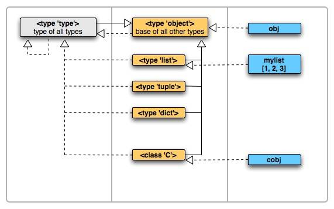

# Python 相关

## 装饰器（什么是`AOP`/面向切面编程）

```python
#-*- coding: UTF-8 -*-
import time
 
def timeit(func):
    def wrapper():
        start = time.clock()
        func()
        end =time.clock()
        print('used:', end - start)
    return wrapper
 
@timeit # foo = timeit(foo)
def foo():
    print 'in foo()'
 
foo()
```

面向切面编程(`AOP`)，主要实现的是将业务逻辑处理过程以切面为维度进行提取，它所面对的是处理过程中的某个步骤或阶段，以获得逻辑过程中各部分之间低耦合性的隔离效果。

也就是说，在不修改函数`A`的前提下，在函数`A`前后插入业务逻辑`B, C, D...`来减少代码的耦合度。

## 迭代器与生成器的区别什么

迭代器是用来帮助我们记录每次迭代访问到的位置，当我们对迭代器使用next()函数的时候，迭代器会向我们返回它所记录位置的下一个位置的数据。

迭代器协议：即对象实现了`__iter__()`和`__next__()`两个方法

可迭代对象：实现了`__iter__()`方法，无`__next__()`方法

生成器：一个包含有`yield`的函数，同时也是一个迭代器，是特殊的一种迭代器

迭代器（多迭代）：可以多次迭代；生成器（单迭代）：只能迭代一次

## `Python`代码执行原理

运行`Python`文件程序的时候，`Python`解释器将源代码转换为字节码，然后再由`Python`解释器来执行这些字节码。

词法分析 --> 语法分析 --> 生成字节码(`.pyc`文件) --> 执行

## `Python`的`int`是怎么实现的

`PyIntObject`结构体表示：

```python
typedef struct {
    PyObject_HEAD
    long ob_ival;
} PyIntObject;
```

`PyObject_HEAD`宏中定义的两个属性分别是：

```python
int ob_refcnt;        
struct _typeobject *ob_type;
```

这两个属性是所有`Python`对象固有的：

* `ob_refcnt`：对象的引用计数，与`Python`的内存管理机制有关，它实现了基于引用计数的垃圾收集机制
* `ob_type`：用于描述`Python`对象的类型信息。

`PyIntObject`就是一个对`C`语言中`long`类型的数值的扩展。

出于性能考虑,对于小整数，`Python`使用小整数对象池`small_ints`缓存了`[-5，257）`之间的整数，该范围内的整数在`Python`系统中是共享的。

而超过该范围的整数即使值相同，但对象不一定是同一个，如下所示：当`a`与`b`的值都是`10000`，但并不是同一个对象，而值为`1`的时候，`a`和`b`属于同一个对象。

```python
>>> a = 1
>>> b = 1
>>> a is b
True
>>> a = 10000
>>> b = 10000
>>> a is b
False
```

对于超出了`[-5, 257)`之间的其他整数，`Python`同样提供了专门的缓冲池，供这些所谓的大整数使用，避免每次使用的时候都要不断的`malloc`分配内存带来的效率损耗。这块内存空间就是`PyIntBlock`。

```python
struct _intblock {

    struct _intblock *next;
    PyIntObject objects[N_INTOBJECTS];
};
typedef struct _intblock PyIntBlock;

static PyIntBlock *block_list = NULL;
static PyIntObject *free_list = NULL;
```

这些内存块（`PyIntBlock`）通过一个单向链表组织在一起，表头是`block_list`，表头始终指向最新创建的`PyIntBlock`对象。

`PyIntBlock`有两个属性：`next`，`objects`。`next`指针指向下一个`PyIntBlock`对象，`objects`是一个`PyIntObject`数组（最终会转变成单向链表），它是真正用于存储被缓存的`PyIntObjet`对象的内存空间。

`free_list`单向链表是所有`PyIntBlock`内存块中空闲的内存。所有空闲内存通过一个链表组织起来的好处就是在`Python`需要新的内存来存储新的`PyIntObject`对象时，能够通过`free_list`快速获得所需的内存。

创建一个整数对象时，如果它在小整数范围内，就直接从小整数缓冲池中直接返回，如果不在该范围内，就开辟一个大整数缓冲池内存空间：

```python
[intobject.c]
PyObject* PyInt_FromLong(long ival)
{
     register PyIntObject *v; 
#if NSMALLNEGINTS + NSMALLPOSINTS > 0
     //[1] ：尝试使用小整数对象池
     if (-NSMALLNEGINTS <= ival && ival < NSMALLPOSINTS) {
        v = small_ints[ival + NSMALLNEGINTS];
        Py_INCREF(v);
        return (PyObject *) v;
    }
#endif
    //[2] ：为通用整数对象池申请新的内存空间
    if (free_list == NULL) {
        if ((free_list = fill_free_list()) == NULL)
            return NULL;
    }
    //[3] : (inline)内联PyObject_New的行为
    v = free_list;
    free_list = (PyIntObject *)v->ob_type;
    PyObject_INIT(v, &PyInt_Type);
    v->ob_ival = ival;
    return (PyObject *) v;
}
```

`fill_free_list`就是创建大整数缓冲池内存空间的逻辑，该函数返回一个`free_list`链表，当整数对象`ival`创建成功后，`free_list`表头就指向了`v->ob_type`，`ob_type`不是所有`Python`对象中表示类型信息的字段吗？怎么在这里作为一个连接指针呢？这是`Python`在性能与代码优雅之间取中庸之道，对名称的滥用，放弃了对类型安全的坚持。把它理解成指向下一个`PyIntObject`的指针即可。

```python
[intobject.c]
static PyIntObject* fill_free_list(void)
{
    PyIntObject *p, *q;
    // 申请大小为sizeof(PyIntBlock)的内存空间
    // block list始终指向最新创建的PyIntBlock
    p = (PyIntObject *) PyMem_MALLOC(sizeof(PyIntBlock));
    ((PyIntBlock *)p)->next = block_list;
    block_list = (PyIntBlock *)p;

    //：将PyIntBlock中的PyIntObject数组(objects)转变成单向链表
    p = &((PyIntBlock *)p)->objects[0];
    q = p + N_INTOBJECTS;
    while (--q > p)
        // ob_type指向下一个未被使用的PyIntObject。
        q->ob_type = (struct _typeobject *)(q-1);
    q->ob_type = NULL;
    return p + N_INTOBJECTS - 1;
}
```

不同的`PyIntBlock`里面的空闲的内存是怎样连接起来构成`free_list`的呢？这个秘密放在了整数对象垃圾回收的时候，在`PyIntObject`对象的`tp_dealloc`操作中可以看到：

```python
[intobject.c]
static void int_dealloc(PyIntObject *v)
{
    if (PyInt_CheckExact(v)) {
        v->ob_type = (struct _typeobject *)free_list;
        free_list = v;
    }
    else
        v->ob_type->tp_free((PyObject *)v);
}
```

原来`PyIntObject`对象销毁时，它所占用的内存并不会释放，而是继续被`Python`使用，进而将`free_list`表头指向了这个要被销毁的对象上。

## 解释`Python`的对象

`Python`处处皆对象，`Python`中有“名字空间”的概念，这类似于其他编程语言中的作用域。在`Python`中，名字空间底层由一个`dict`实现，变量名就是字典中的键，而变量引用的对象就是字典中键对应的值。

[深入理解python之对象系统](https://www.jianshu.com/p/1a6dd03e8d82)

`Python`中最为特殊的是，类型也是一个对象，包括`Object`在内的所有类型，都是对象实例。

类型的对象的类型叫做元类，元类默认是一个`type`类对象，或者某个继承自`type`的类对象。最后，`type`类对象的类型是`type`自身。

## 如何自己实现一个字典

```python
import collections

class MyDict(collections.UserDict):
    def __missing__(self, key):
        if isinstance(key, str):
            raise KeyError(key)
        return self[str(key)]

    def __contains__(self, key):
        return str(key) in self.data

    def __setitem__(self, key, item):
        self.data[str(key)] = item

    def __getattr__(self, key):
        return self.data[str(key)]
```

## 什么是`GIL`、为什么要加`GIL`、如何理解`Python`多线程

`GIL`的全称为`Global Interpreter Lock`，全局解释器锁。

在任意时刻只有一个线程在解释器中运行。对`Python`虚拟机访问的控制由全局解释锁`GIL`控制，正是这个锁来控制同一时刻只有一个线程能够运行。

`Python`在同一时刻只能跑一个线程，这样在跑多线程的情况下，只有当线程获取到全局解释器锁后才能运行，而全局解释器锁只有一个，因此即使在多核的情况下也只能发挥出单核的功能。

标准模块、第三方的扩展模块，在进行密集计算任务时就会释放`GIL`。

纯计算，没有`IO`操作的程序，解释器会每隔`100`次或每隔一定时间`15ms`去释放`GIL`。

在做`IO`操作时，`GIL`总是被释放。对所有面对内建的操作系统`C`代码的程序来说，`GIL`会在`IO`调用之前被释放，以允许其它的线程在等待`IO`的时候运行。

多线程环境中，python虚拟机按照以下方式执行：

设置`GIL` --> 切换到一个线程去执行 --> 运行代码(两种机制进行`GIL`释放) --> 把线程设置为睡眠状态 --> 解锁`GIL` --> 再次重复以上步骤

用`ctypes`写`Python`代码就能绕过`GIL`，`ctypes`会在调用`C`函数前释放`GIL`。

## 什么是协程

协程，即语言自己实现一个函数调度，在一个函数运行时，中断函数，并且保存函数上下文，之后在运行其他函数，之后再返回运行原函数。

## 什么是上下文管理器

上下文即程序运行的环境状态。

上下文管理器的常用于一些资源的操作，需要在资源的获取与释放相关的操作。

`Python`的上下文管理协议则是`__enter__()`和`__exit__()`

## `Python`右加（`__radd__()`）

实现反射加法操作。

正常运算时，比如：`a + b`，是以`a`为主导的，这里调用了魔法方法`__add__()`。但是如果表达式中的`a`没有`__add__()`方法时，就会调用`b`的反运算方法`__radd__()`。 

```python
>>> class Nint(int):
...     def __radd__(self, other):
...             return int.__sub__(self, other) # 剪法运算
...
>>> a = Nint(6)
>>> b = Nint(4)
>>> a + b
10
>>> 1 + b # 1 没有 __add__()方法，就调用 b 中的反运算方法 __radd__()，返回 int.__sub__(4, 1)
3
>>>
```

## 什么是闭包

>
>在计算机科学中，闭包（Closure）是词法闭包（Lexical Closure）的简称，是引用了自由变量的函数。这个被引用的自由变量将和这个函数一同存在，即使已经离开了创造它的环境也不例外。所以，有另一种说法认为闭包是由函数和与其相关的引用环境组合而成的实体。
>

```python
>>> def print_msg():
...     msg = "test" # 局部变量
...     def printer():
...         print(msg)
...     return printer
... 
>>> another = print_msg()
>>> another() # 输出 test
>>> test
```

闭包，顾名思义，就是一个封闭的包裹，里面包裹着自由变量，哪里可以访问到这个包裹，哪里就可以访问到这个自由变量。闭包使得局部变量在函数外被访问成为可能。

## `Python`中一般的类都继承`Object`，那`Object`的父类是什么

元类`type`。

在`Python`的世界中，`Object`是父子关系的顶端，所有的数据类型的父类都是它；`type`是类型实例关系的顶端，所有对象都是它的实例的。

它们两个的关系可以这样描述：`Object`是`type`的实例，`type`是`Object`的子类，因此`type`也是`type`自身的实例。



## 谈谈元类、元类的应用

定制化类及其子类的行为。

[Python学习之路41-元类](https://juejin.im/post/5b374945e51d4558882164aa)

## 用`Python`写一个单例模式

>
>单例模式，也叫单子模式，是一种常用的软件设计模式。 在应用这个模式时，单例对象的类必须保证只有一个实例存在。 许多时候整个系统只需要拥有一个的全局对象，这样有利于我们协调系统整体的行为。
>

```python
class Single(object):
    _instance = None
    def __new__(cls, *args, **kw):
        if cls._instance is None:
            cls._instance = object.__new__(cls, *args, **kw)
        return cls._instance
    def __init__(self):
        pass

single1 = Single()
single2 = Single()
print(id(single1) == id(single2))
```

## 谈谈`super()`原理

```python
def super(cls, inst):
    mro = inst.__class__.mro() # inst负责生成MRO的list
    return mro[mro.index(cls) + 1] # 定位到当前cls在MRO中的位置，然后后移一位，返回此处的类
```

## 什么是多重继承

经典类中MRO搜索采用简单的从左到右的深度优先顺序，而新式类是广度优先。

## 浅复制和深复制有什么区别

浅拷贝仅仅复制了容器中元素的地址

深拷贝，完全拷贝了一个副本，容器内部元素地址都不一样

## `MVC/MTV`介绍

`Web`架构的模式。把业务逻辑、模型数据、用户界面分离开来，让开发者将数据与表现解耦。

`MVC`：

* `Model` 代表数据存取层；

* `Views` 代表的是系统中选择显示什么和怎么显示的部分；

* `Controller` 指的是系统中根据用户输入并视需要访问模型，以决定使用哪个视图的那部分。

`MTV`：

* `Models` 数据存取层。 该层处理与数据相关的所有事务： 如何存取、如何验证有效，是一个抽象层，用来构建和操作你的web应用中的数据，模型是你的数据的唯一的、权威的信息源。它包含你所储存数据的必要字段和行为。通常，每个模型对应数据库中唯一的一张表；

* `Templates` 即表现层。 该层处理与表现相关的决定： 如何在页面或其他类型文档中进行显示。模板层提供了设计友好的语法来展示信息给用户。使用模板方法可以动态地生成HTML。模板包含所需HTML 输出的静态部分，以及一些特殊的语法，描述如何将动态内容插入；

* `Views` 业务逻辑层，该层包含存取模型及调取恰当模板的相关逻辑。用于封装负责处理用户请求及返回响应的逻辑。视图可以看作是前端与数据库的中间人，他会将前端想要的数据从数据库中读出来给前端。他也会将用户要想保存的数据写到数据库。

## 面向对象的三个特性

封装、继承、多态

## `gevent`底层实现原理，协程上下文切换实现。异步`IO`。

[谈谈Python协程技术的演进](https://segmentfault.com/a/1190000012291369#articleHeader7)

`gevent`是基于`greenlet`实现。通过栈的复制切换来实现不同协程之间的切换。

`Python`基于`yield`实现协程。

1) 事件循环 (`event loop`)。事件循环需要实现两个功能，一是顺序执行协程代码；二是完成协程的调度，即一个协程“暂停”时，决定接下来执行哪个协程。

2) 协程上下文的切换。基本上`Python` 生成器的 `yield` 已经能完成切换，`Python3`中还有特定语法支持协程切换。

## `Python` 绕过 `GIL` 加速方案